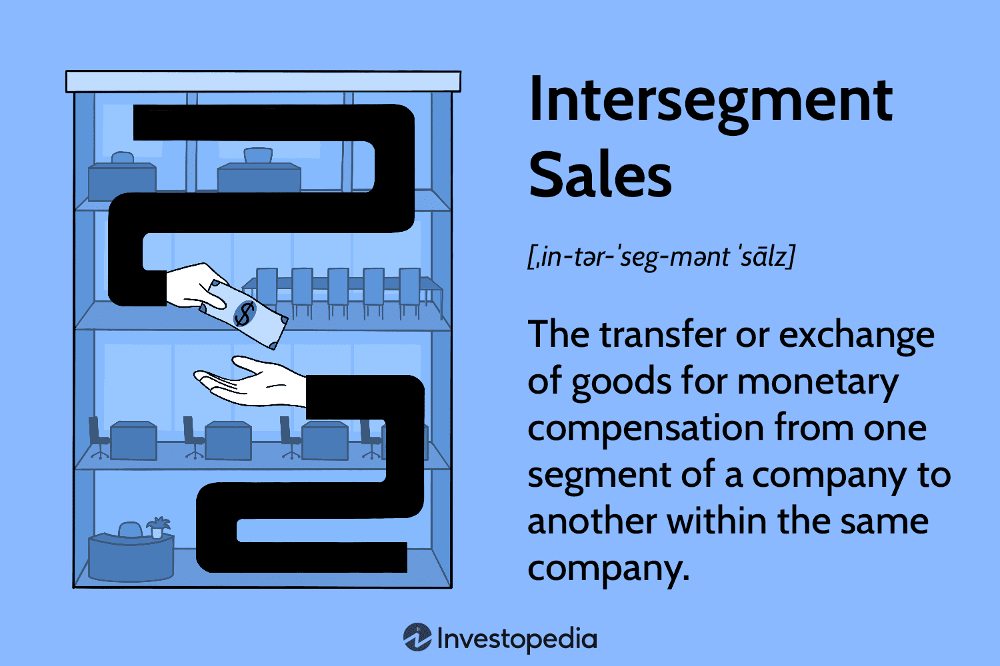

In the vast and intricate world of corporate accounting, intersegment sales and internal transactions are pivotal elements that significantly impact financial reporting and strategic decision-making. Intersegment sales refer to transactions where goods or services are exchanged between different divisions or segments within the same corporation. These transactions necessitate meticulous reporting to prevent financial statement inaccuracies that may arise from double-counting revenues or inflating profits. Proper understanding and management of intersegment sales enhance transparency and accuracy, fostering fiscal responsibility within an organization.

Alongside internal transactions, algorithmic trading has emerged as a crucial component in the optimization of corporate strategies. Algorithmic trading employs sophisticated computer algorithms to manage trading operations, facilitating rapid, data-driven decision-making in financial markets. This modern dynamic allows corporations to streamline operations and strategically position themselves for competitive edges in equal measure. Algorithmic trading's role in optimizing corporate strategies lies in its capacity to mitigate risks and capitalize on market opportunities with unparalleled speed and precision.

Therefore, an integrated approach that considers both intersegment transactions and advanced trading mechanisms like algorithmic trading offers profound insights into the modern financial landscape. Corporations that embrace these tools effectively not only enhance their operational efficiency but also position themselves advantageously within increasingly competitive markets. This comprehensive exploration aims to detail how these intertwined elements shape corporate finance, illustrating the evolving nature of strategic financial management in response to technological advancements and complex corporate needs.

## Table of Contents

## Understanding Intersegment Sales and Internal Transactions

Intersegment sales involve the transfer of goods and services between various segments or divisions within a single corporation. These transactions are significant in reflecting the operational efficiency and synergy between different parts of a business. However, careful reporting is essential to prevent double-counting, which could inflate revenues and distort the financial statements. Ensuring financial statements truly depict a company's economic standing involves eliminating these internal transactions from consolidated financial results. This practice helps maintain the integrity and transparency of a corporation's reported financial performance.

Internal transactions hold considerable importance in evaluating the performance of individual segments within a corporation. These transactions enable a corporation to assess how resources are utilized and reallocated, fostering efficiency across various divisions. Properly analyzing these transactions can highlight which segments drive profitability and which require operational improvements or strategic pivots.

The intricacies associated with intersegment sales necessitate the implementation of robust internal controls. These controls are critical in maintaining an accurate and transparent view of a corporation's fiscal health. They help in monitoring and validating the processes involved in the execution and recording of internal transactions, thereby reducing the risk of errors or fraudulent activities. Alongside internal controls, a comprehensive understanding of regulatory compliance is imperative. Companies must navigate a landscape that includes domestic and international accounting standards to ensure their financial practices align with legal requirements.

Effective management of intersegment sales and internal transactions contributes to fiscal responsibility and enhances transparency in corporate operations. Such meticulous financial oversight not only supports operational excellence but also cultivates trust among stakeholders.

## Corporate Accounting Implications

Accounting for intersegment and internal sales transactions is a fundamental aspect of corporate accounting. These transactions, which occur between different divisions within the same corporation, can significantly impact financial statements if not correctly managed. A primary consideration is the elimination of intersegment transactions from consolidated financial statements to prevent the overstating of revenue. If these transactions were reported without adjustment, they could misrepresent the company’s financial health by inflating revenue figures.

Transfer pricing is a critical component of intersegment sales accounting. This involves setting prices for transactions between segments or divisions that reflect the true economic value of those transactions. Correct transfer pricing is essential for accurately reporting segment profitability and avoiding potential tax complications. Tax authorities carefully scrutinize these transactions to ensure that they are not used to manipulate profits and avoid taxes. Therefore, establishing an internal transfer pricing mechanism that aligns with market-based pricing strategies is crucial for maintaining compliance and ensuring the integrity of financial reporting.

Adopting a fair market value approach in setting these prices is vital. This approach aligns internal transaction pricing with the prices that would be used if the transactions were between independent entities operating under competitive market conditions. By doing so, corporations can ensure that internal sales reflect actual economic value, providing more accurate financial information for decision-making processes. 

Understanding financial flows within an organization supports strategic management decisions and helps align those decisions with broader corporate goals. By managing intersegment transactions effectively, corporations can allocate resources more efficiently, optimize performance, and enhance overall operational transparency. This strategic approach allows businesses to make informed decisions that support their long-term objectives while maintaining robust fiscal governance. Maintaining transparency and accuracy in accounting practices is instrumental in reinforcing the corporation's credibility with stakeholders and regulatory bodies.

In summary, the careful management and reporting of intersegment sales and internal transactions are key to maintaining financial accuracy and compliance. This process involves eliminating intersegment revenues from consolidated financial results, implementing fair transfer pricing policies, and ensuring segment prices reflect market conditions. These practices contribute significantly to strategic planning and maintaining alignment with corporate objectives, ultimately supporting sustainable growth and fiscal responsibility.

## The Role of Algorithmic Trading in Corporate Strategy

Algorithmic trading represents a sophisticated approach to managing trading processes through the use of computer algorithms. This method significantly enhances both efficiency and decision-making within financial markets. For corporations, integrating [algorithmic trading](/wiki/algorithmic-trading) strategies into their operations can lead to streamlined processes and more informed investment decisions, thereby improving overall corporate strategy.

Algorithmic trading offers several advantages. Firstly, it enables corporations to automate and optimize their trading strategies, reducing the time and potential for human error in decision-making. By leveraging historical data and real-time market information, algorithms can identify patterns and execute trades with precision and speed that surpasses human capabilities.

Moreover, this advanced trading methodology can be leveraged to mitigate risks and exploit market opportunities swiftly and accurately. For instance, corporations can use algorithmic trading to build hedging strategies that protect against unfavorable price movements. Similarly, high-frequency trading algorithms can identify [arbitrage](/wiki/arbitrage) opportunities, executing multiple trades at lightning speed to capitalize on price discrepancies across different markets.

The growing influence of technology continues to drive the evolution of algorithmic trading. Machine learning and [artificial intelligence](/wiki/ai-artificial-intelligence), for example, are increasingly integrated into trading algorithms, allowing corporations to predict market trends and make data-driven decisions with greater accuracy. As these technologies evolve, they provide corporations with strategic advantages that are crucial for achieving financial objectives.

Furthermore, algorithmic trading enables corporations to diversify their portfolios and explore new markets. By using sophisticated algorithms, companies can analyze vast datasets to identify new investment opportunities, aligning their trading strategies with broader corporate goals.

In conclusion, the incorporation of algorithmic trading into corporate strategy yields significant benefits. As technology advances and new methodologies emerge, corporations that adeptly integrate algorithmic trading practices are poised to gain a competitive edge by enhancing operational efficiency, making more informed investment decisions, and swiftly adapting to market changes.

## Regulatory Compliance and Strategic Alignment

Compliance with financial regulations is crucial for corporations involved in intersegment sales and algorithmic trading. These activities demand adherence to stringent guidelines to maintain transparency and accuracy in financial reporting, both of which are the bedrock of stakeholder trust and corporate integrity.

International accounting standards like the International Financial Reporting Standards (IFRS) and Generally Accepted Accounting Principles (GAAP) offer a framework for corporations to ensure that their financial activities are reported transparently and consistently. These standards help in eliminating discrepancies in financial statements by providing clear guidelines on recognizing and recording internal sales and trades. For example, under IFRS, companies are required to disclose segment information, including intersegment sales, in a manner that reflects the way management reviews financial information.

A fundamental aspect of compliance is ensuring that internal transactions are priced appropriately. This is commonly managed through transfer pricing, which involves setting prices for transactions between different divisions of the same company. To avoid potential tax liabilities and misstatements in profitability, these prices must reflect fair market values. Regulatory bodies often scrutinize transfer pricing to prevent tax avoidance, making it imperative for corporations to document their pricing methods and ensure they align with local and international tax laws.

Aligning strategic objectives with regulatory compliance is vital for ethical business conduct and long-term sustainability. Ethical financial practices are not only about adhering to legal mandates but also about fostering an environment of corporate responsibility and transparency. For example, algorithmic trading must comply with market regulations to prevent manipulation or unfair trading practices, which are often monitored by financial authorities such as the U.S. Securities and Exchange Commission (SEC) or the European Securities and Markets Authority (ESMA).

Moreover, strategic alignment with compliance enhances sustainable growth by preventing financial penalties and reputational damage. Corporations must integrate compliance into their operational frameworks to ensure that all business activities, from intersegment sales to advanced trading strategies, are conducted within legal boundaries. This involves regular audits, compliance training for staff, and robust internal controls.

In conclusion, corporations must prioritize regulatory compliance as a core component of their financial and strategic operations. By aligning their internal transactions and trading practices with established legal frameworks, they mitigate risks and foster an ethical culture that supports sustainable growth and stakeholder confidence.

## Conclusion and Future Outlook

The interplay between intersegment sales, internal transactions, and algorithmic trading is significantly reshaping corporate strategies and financial management. Effective management and transparent reporting of these transactions can provide corporations with a competitive edge in the global market. As technology progresses, the integration of algorithmic trading with corporate accounting practices opens new pathways for growth and innovation. Algorithmic trading, through its ability to analyze vast datasets and execute trades at high speeds, allows companies to optimize their investment decisions and improve operational efficiency. For example, algorithms can identify market trends and predict future price movements, facilitating timely and profitable trades.

Incorporating advanced trading technologies within corporate strategies supports more informed decision-making, risk mitigation, and the exploitation of market opportunities. The growing sophistication of these technologies means that corporations must continuously innovate to maintain a competitive stance.

Moreover, companies need to stay informed and adapt to ongoing changes in regulatory and technological landscapes to ensure lasting success. Adherence to international accounting standards like IFRS (International Financial Reporting Standards) and GAAP (Generally Accepted Accounting Principles) is critical to maintaining transparency and trust among stakeholders. Failure to comply can result in severe penalties and damage to reputation, underscoring the importance of aligning internal practices with global financial regulations.

Future-focused corporations should prioritize strategic alignment with compliance while embracing technological advancements. This dual focus will enable them to sustain ethical financial practices, achieve sustainable growth, and ultimately secure their position in an ever-evolving global marketplace.

## References & Further Reading

[1]: Dutta, G., & Pande, A. (2013). ["Intersegment Transfer Pricing in Multinational Corporations."](https://link.springer.com/chapter/10.1007/978-3-642-25980-7_1) Procedia Economics and Finance, 10, 367-376.

[2]: Hull, J. C. (2017). ["Options, Futures, and Other Derivatives"](https://www.semanticscholar.org/paper/Options%2C-Futures%2C-and-Other-Derivatives-Hull/89bdee500c8623864fc9eb7a471546aa713acc44) (9th Edition). Pearson.

[3]: Lopez de Prado, M. (2018). ["Advances in Financial Machine Learning"](https://www.amazon.com/Advances-Financial-Machine-Learning-Marcos/dp/1119482089). Wiley.

[4]: Lech, C., & Morbiato, R. (2020). ["Algorithmic Finance: Theory and Implementation"](https://www.researchgate.net/publication/319432986_Algorithmic_Finance_and_Limits_to_Governmentality_On_Foucault_and_High-Frequency_Trading). Springer.

[5]: OECD. (2017). ["Transfer Pricing Guidelines for Multinational Enterprises and Tax Administrations."](https://read.oecd-ilibrary.org/taxation/oecd-transfer-pricing-guidelines-for-multinational-enterprises-and-tax-administrations-2017_tpg-2017-en) OECD Publishing.

[6]: Aronson, D. R. (2006). ["Evidence-Based Technical Analysis: Applying the Scientific Method and Statistical Inference to Trading Signals."](https://www.amazon.com/Evidence-Based-Technical-Analysis-Scientific-Statistical/dp/0470008741) Wiley.

[7]: International Financial Reporting Standards (IFRS). ["IFRS 8 Operating Segments"](https://www.ifrs.org/content/dam/ifrs/publications/pdf-standards/english/2021/issued/part-a/ifrs-8-operating-segments.pdf).

[8]: GAAP (Generally Accepted Accounting Principles). ["Segment Reporting"](https://fasb.org/Page/PageContent?PageId=/staticpages/standards.html&isstaticpage=true).

[9]: SEC (U.S. Securities and Exchange Commission). ["Algorithmic Trading"].(https://www.sec.gov/files/Algo_Trading_Report_2020.pdf).

[10]: Chan, E. (2009). ["Quantitative Trading: How to Build Your Own Algorithmic Trading Business."](https://github.com/ftvision/quant_trading_echan_book) Wiley.