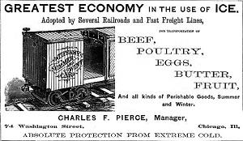

The Interstate Commerce Commission (ICC) played a crucial role in overseeing and regulating interstate transportation from its establishment in 1887 until its dissolution in 1995. As the first federal regulatory agency in the United States, the ICC was initially tasked with ensuring fair rates and practices within the railroad industry. The creation of the ICC marked a significant shift in the federal government's approach to commerce, setting a precedent for future regulatory frameworks.

Throughout its history, the ICC adapted to the evolving transportation landscape, expanding its regulatory reach to include other modes of transport such as trucking and bus lines. Its legislative authorities grew through acts like the Hepburn Act and the Mann-Elkins Act, which reinforced its regulatory prowess. Despite facing challenges in enforcement, the ICC's impact on transportation regulation was profound and lasting, prompting the development of subsequent regulatory bodies both nationally and internationally.

This article provides a comprehensive overview of the ICC's historical development, functions, and its eventual dissolution amidst a shifting economic and political environment. The discussion extends to the enduring influence of the ICC's regulatory legacy, particularly in emerging areas like algorithmic trading, underscoring the ongoing relevance of effective oversight in rapidly changing sectors.

## Table of Contents

## The Establishment of the Interstate Commerce Commission

The Interstate Commerce Commission (ICC) was established under the Interstate Commerce Act of 1887, marking a significant shift in U.S. policy by introducing federal regulation of interstate commerce. At the time, railroads were the primary means of long-distance transportation, and their dominance over the market led to monopolistic practices and widespread public discontent. The issues chiefly revolved around price discrimination, where railroads charged different rates to different customers without a justified reason, and monopolies that led to inflated prices and restricted competition.

As a response, the Interstate Commerce Act aimed to address these concerns by laying down regulations that ensured fair rates for transportation services and prohibited discriminatory practices. The Act granted the ICC authority to assess and enforce just and reasonable rate standards, ensuring that railroads operated with fairness to all customers, regardless of their economic status or bargaining power.

This approach was pioneering for its time, as it represented the first significant attempt by the federal government to regulate an industry that spanned multiple states. Prior to this, the regulation of commerce was largely left to states, which struggled to impose controls on entities with operations extending beyond their jurisdiction. The establishment of the ICC highlighted the necessity for a federal body that could oversee activities surpassing the boundaries of individual states, thus ensuring a uniform regulatory environment across the country.

In its initial phase, the ICC concentrated on collecting detailed data about railroad operations and investigating complaints laid by the public against railroad companies. Its power to regulate was an unprecedented development in U.S. governance, setting a precedent for future regulatory bodies and illustrating the need for government intervention in markets where monopolistic practices could harm public welfare.

## Expansion and Powers of the ICC

The Interstate Commerce Commission's (ICC) authority significantly expanded from its initial focus on railroads to encompass a wider array of transportation modes, including trucking and bus lines. This broadening of scope was largely facilitated by key legislative acts that enhanced the Commission's powers. 

The Hepburn Act of 1906 marked a pivotal moment in the ICC's history, granting it the authority to establish maximum railroad rates. This not only reinforced its regulatory influence over the railroads but also included pipelines in its purview. The Act allowed the ICC to scrutinize financial practices within the rail industry, thereby ensuring a level of financial oversight that was previously absent.

Further augmentation of the ICC's capabilities occurred with the Mann-Elkins Act of 1910. This legislation extended the Commission's oversight to telephone and telegraph companies while granting it the power to suspend proposed rate increases until they had been thoroughly investigated. The Act aimed to preemptively address potential abuses of power by vested interests and emphasized the importance of protecting public welfare through prudent regulation.

As a result of these legislative actions, the ICC was empowered to set rates, a significant step that allowed it to influence economic conditions in a more direct manner. Its authority extended to overseeing mergers within the transportation sector, a power that enabled it to prevent the formation of monopolies that could stifle competition. Additionally, the ICC was responsible for regulating safety standards, bringing a much-needed focus on the well-being of both passengers and workers in the transportation industry.

Despite the Commission's enhanced authority, it faced substantial challenges, particularly in the enforcement of its regulations and the assertion of its legal jurisdiction. The early years of the ICC were marked by legal battles and resistance from powerful railroad companies, which often resulted in limitations on its efficacy. The complexities of implementing new regulations across a rapidly growing and diversifying transportation landscape posed additional hurdles.

In summary, the expansion of the ICC's powers through legislative means significantly bolstered its regulatory capacity. Yet, the practical application of these powers often encountered formidable challenges, highlighting the ongoing struggle between regulatory bodies and the entities they oversee. These dynamics set important precedents for the evolution of federal oversight in the United States.

## ICC's Role in Transportation Deregulation

The late 20th century marked a pivotal shift in U.S. transportation policy, characterized by a strong move towards deregulation, significantly altering the role of the Interstate Commerce Commission (ICC). This transition began with a series of legislative acts aiming to reduce federal oversight and increase market competition.

One of the critical legislative measures was the Staggers Rail Act of 1980. This Act dramatically reduced the ICC's authority over railroad rate-setting and operations. It allowed rail carriers more freedom to negotiate contracts and set rates based on market demand rather than adhering to ICC-mandated tariffs. The Staggers Rail Act effectively introduced greater competition within the rail industry, encouraging efficiency and responsiveness to market needs. According to the Association of American Railroads, this deregulation resulted in improved service quality and lower rates for shippers, with the rail industry experiencing a resurgence after years of decline.

Similarly, the Motor Carrier Act of 1980 significantly diminished the ICC's control over the trucking industry. This Act removed entry barriers, lowered restrictions on route and rate approvals, and fostered competition by making it easier for new carriers to enter the market. As a result, the trucking industry saw increased competition, leading to lower shipping costs and more efficient services for consumers.

As these deregulatory measures took effect, the ICC's traditional powers and responsibilities gradually weakened. Key regulatory functions were transferred to other government entities, notably the Department of Transportation, reflecting a broader policy trend towards decentralization and reduced federal intervention.

By the late 1980s and 1990s, the [momentum](/wiki/momentum) for deregulation continued to grow, further diminishing the ICC's role. The agency faced mounting pressure to adapt to the evolving transportation landscape, where market forces played a more substantial role in decision-making processes than federal regulation.

This progressive reduction in the ICC's responsibilities ultimately culminated in its dissolution in 1995. The remaining essential functions were transitioned to the newly established Surface Transportation Board, marking the end of an era for one of America's first federal regulatory bodies. The deregulation movement not only reshaped the ICC's trajectory but also impacted various transportation sectors, fostering an environment of increased competition and innovation.

## The Dissolution of the ICC

The Interstate Commerce Commission (ICC) was officially disbanded in 1995 as part of a broader shift toward deregulation in the transportation sector. This dissolution was a significant event, marking the end of an era of federal oversight that had been in place since the ICC's creation in 1887. As the regulatory landscape evolved, the ICC's remaining functions were transferred to the newly established Surface Transportation Board (STB). This transition was emblematic of a larger movement away from rigid federal control towards a model that favored increased market competition.

The move towards deregulation, which gained momentum in the late 20th century, had profound implications for the ICC and the industries it regulated. The ICC had historically been a powerful entity with significant authority over various modes of transportation, including railroads, trucking, and bus lines. However, economic and political pressures, along with the broader deregulatory trends of the era, led to a reevaluation of the necessity and effectiveness of such comprehensive regulation.

Key legislative acts, such as the Staggers Rail Act of 1980 and the Motor Carrier Act of 1980, were pivotal in this transformation. These statutes aimed to reduce federal control over transportation rates and services, promoting competition and efficiency within the industries. By loosening the ICC's grip, these laws provided companies with more autonomy to set prices and adjust services in response to market demand.

As a result of these changes, the ICC's role diminished over time. The trucking and rail industries, once heavily regulated, experienced significant deregulation, facilitating more competitive and flexible market conditions. By the late 1980s and early 1990s, the ICC's authority had been significantly curtailed, with substantial regulatory duties being shifted to other government entities such as the Department of Transportation.

The culmination of these reforms was the ICC Termination Act of 1995, which formally dissolved the ICC. The Surface Transportation Board was created to assume many of the ICC's remaining functions, focusing primarily on resolving disputes and ensuring compliance with regulations still deemed necessary. This marked a decisive shift towards a regulatory framework that prioritized market-driven solutions over government control.

The impact of the ICC’s dissolution was multifaceted. By reducing regulatory constraints, industries were able to innovate and adapt more rapidly to changing market conditions. This increased competition often resulted in lower prices and improved services for consumers. However, it also sparked debates about the balance between deregulation and the need for oversight to prevent market abuses.

In summary, the dissolution of the ICC in 1995 represented a critical juncture in U.S. transportation policy, reflecting broader deregulatory trends. The transition to the Surface Transportation Board marked the end of comprehensive federal regulation overseen by the ICC, ushering in a new era characterized by increased competition and market-driven governance.

## Legacy and Influence of the ICC

The Interstate Commerce Commission (ICC), established as the first federal regulatory body in the United States, served as a crucial model for the development of later regulatory agencies both in the U.S. and internationally. Its foundational structure and regulatory approach notably influenced the formation of significant entities such as the Federal Trade Commission (FTC) and the Federal Communications Commission (FCC). These organizations adopted the regulatory principles and frameworks initially developed by the ICC to oversee sectors beyond transportation, expanding into trade practices and communications.

The ICC's structured framework—characterized by its ability to enforce fair practices, set standards, and ensure compliance through federal oversight—set vital precedents for how regulatory bodies could effectively manage commerce and various sectors. This foresight in regulatory governance has had a lasting impact, as it equipped subsequent agencies with the foundational methodologies needed to navigate the complexities of their respective industries.

The ICC's legacy extends to its pioneering role in establishing a comprehensive regulatory environment dedicated to public interest protection. Its enduring influence can be seen in how it informed regulatory policies designed to address monopolistic practices and ensure equitable market practices across different sectors. The innovative regulatory strategies originally employed by the ICC helped build a template for federal oversight that remains pertinent today, reinforcing the importance of robust frameworks in managing and evolving regulatory needs amidst changing economic landscapes. 

Overall, the ICC is predominantly remembered for initiating an era of formalized commerce regulation, providing a blueprint from which future regulatory bodies have drawn inspiration to uphold fair competition and accountability within their spheres of influence.

## The Intersection of ICC and Algorithmic Trading

The legacy of the Interstate Commerce Commission (ICC) in regulating transportation has parallels in the modern oversight of financial markets, particularly in [algorithmic trading](/wiki/algorithmic-trading). While the ICC was primarily focused on ensuring fair practices within the transportation industry, its regulatory framework has influenced approaches in financial regulation. The core objective of the ICC was to maintain fair competition among railroads by setting standardized rates and preventing discriminatory practices. Similarly, financial regulators aim to ensure transparency and fairness in algorithmic trading, where complex computer algorithms are employed to execute trades at high speeds. 

Algorithmic trading necessitates regulatory oversight to prevent market manipulation, ensure fair access to market data, and maintain financial stability. These principles echo the foundational goals of the ICC, which sought to prevent monopolistic behaviors and protect consumer interests. The history of the ICC provides a basis for understanding how regulatory frameworks have evolved to address the challenges posed by technological advancements like algorithmic trading. 

The evolution from physical infrastructure regulation to digital and high-frequency trading requires adaptive regulatory policies. Financial market regulators, such as the Securities and Exchange Commission (SEC) and the Commodity Futures Trading Commission (CFTC), serve similar roles to the ICC, establishing oversight mechanisms to prevent manipulation and fraud. For example, just as the ICC monitored railroad rates, financial regulators implement measures to ensure the integrity of trading algorithms. 

Moreover, parallels can be drawn in the regulatory challenges both sectors face. The ICC dealt with issues related to establishing jurisdiction and consistently enforcing regulations across state lines, while modern financial regulators contend with systemic risks posed by high-speed trading across global markets. Lessons from the ICC's regulatory framework serve as a valuable reference for understanding and developing efficient oversight of complex, fast-paced markets influenced by technological progress. 

Overall, the ICC’s influence extends beyond its original mandate, shaping how regulators approach the balance between innovation and regulation in various sectors, including contemporary financial markets. Understanding these historical contexts aids in crafting policies that safeguard market integrity and public interest in the rapidly evolving landscape of algorithmic trading.

## Conclusion

The Interstate Commerce Commission (ICC) was a pivotal entity, profoundly impacting the framework of interstate commerce regulation over its existence. As the first federal regulatory body, the ICC set significant precedents in governance, influencing how transportation industries operated and interacted with the federal government. Its establishment marked a response to the monopolistic practices and unchecked power of railroad companies in the late 19th century, laying the groundwork for fair business practices and consumer protection.

Throughout the 20th century, the ICC's rise and subsequent expansion highlighted prevailing economic and policy trends. Initially limited to railroads, the ICC's authority grew to encompass other transportation modes like trucking and bus lines, a reflection of the burgeoning complexity of nationwide commerce and the need for comprehensive regulatory oversight. This expansion underscored shifting attitudes toward federal intervention in the economy, emphasizing the balance between regulation and market freedom.

However, the latter part of the 20th century saw a shift towards deregulation, reducing the ICC's influence significantly. Acts such as the Staggers Rail Act and the Motor Carrier Act of 1980 signified a broader economic trend favoring market competition and efficiency over federal control. This shift culminated in the ICC's dissolution in 1995, with remaining functions transferred to the Surface Transportation Board, marking the end of a significant regulatory era.

In contemporary settings, the historical role of the ICC remains instructive, especially amid evolving industries and the advent of new technologies, such as algorithmic trading. The parallels in ensuring fairness and transparency between historical transportation regulation and modern financial oversight demonstrate the ongoing relevance of the ICC's legacy. As we navigate these complex landscapes, examining the ICC's history provides insights into forming regulatory frameworks that safeguard public interests while fostering innovation and competition.

## References & Further Reading

[1]: ["The Interstate Commerce Commission and the Railroad Industry: A History of Regulatory Policy"](https://www.amazon.com/Interstate-Commerce-Commission-Railroad-Industry/dp/0275939413) by Richard D. Stone

[2]: ["Deregulation and the Future of Intercity Transportation"](https://www.jstor.org/stable/41798243) by The RAND Corporation

[3]: ["The ICC Handbook: A Guide to the Interstate Commerce Commission's Regulatory Practices"](https://en.wikipedia.org/wiki/Interstate_Commerce_Commission) by Henry M. Rowan

[4]: ["American Transportation Policy"](https://en.wikipedia.org/wiki/Transportation_policy_of_the_United_States) by Robert J. Murray

[5]: ["Railroad Mergers and the Language of Unification"](https://www.semanticscholar.org/paper/Railroad-Mergers-and-the-Language-of-Unification-Burns/378b7f613d214420f7cc5f5c34ac3f73cec32deb) by James A. Ward, The Business History Review, Vol. 49, No. 1 (Spring, 1975), pp. 26-50

[6]: ["Algorithmic Trading: Winning Strategies and Their Rationale"](https://books.google.com/books/about/Algorithmic_Trading.html?id=WAlFDwAAQBAJ) by Ernie Chan