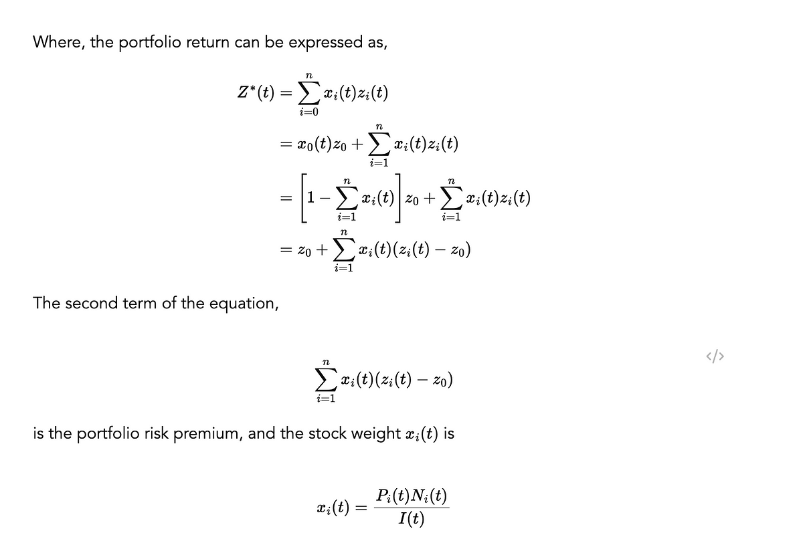

## Table of Contents

## What is the Intertemporal Capital Asset Pricing Model (ICAPM)?

The Intertemporal Capital Asset Pricing Model (ICAPM) is a financial theory that helps explain how investors make decisions about their investments over time. It builds on the basic Capital Asset Pricing Model (CAPM) by considering not just the risk and return of investments at a single point in time, but also how these change over different periods. The main idea is that investors care about how their wealth will grow in the future, so they look at the risks and potential rewards of their investments over time, not just right now.

In the ICAPM, investors are seen as trying to balance their portfolios to protect against future changes in the economy or their personal situations. This means they might choose investments that could help them manage risks like inflation or changes in interest rates. By considering these future risks, the ICAPM helps investors make smarter choices about where to put their money, aiming to get the best possible returns while managing the risks they face over time.

## How does ICAPM differ from the traditional Capital Asset Pricing Model (CAPM)?

The traditional Capital Asset Pricing Model (CAPM) looks at how risky an investment is right now and how much return you can expect from it. It says that the return on an investment depends on how much risk you're taking compared to the whole market. If an investment is riskier than the market, you should get a higher return to make up for that risk. CAPM is all about balancing risk and reward at one moment in time.

On the other hand, the Intertemporal Capital Asset Pricing Model (ICAPM) takes a longer view. It says that investors care about how their investments will do over time, not just right now. ICAPM thinks about how future changes in the economy or personal situations might affect an investor's wealth. So, it helps investors pick investments that can protect them from things like inflation or changes in interest rates over time. While CAPM focuses on the present, ICAPM is all about planning for the future.

## What are the key assumptions of the ICAPM?

The Intertemporal Capital Asset Pricing Model (ICAPM) is based on a few important ideas that help explain how it works. One big idea is that investors care about how their money will grow over time, not just right now. They want to make sure their investments can handle future changes in the economy, like inflation or interest rates going up or down. This means investors are always looking ahead and trying to pick investments that will do well no matter what happens in the future.

Another key assumption of the ICAPM is that investors can change their investments over time to manage different kinds of risks. They might move their money around to protect against things like a drop in the stock market or changes in their own lives, like retirement. This idea is different from the traditional CAPM, which only looks at how risky an investment is right now. The ICAPM assumes that investors are always thinking about the future and trying to build a portfolio that can handle whatever might come their way.

## Who developed the ICAPM and when was it introduced?

The Intertemporal Capital Asset Pricing Model, or ICAPM, was developed by Robert Merton. He introduced this model in 1973. Robert Merton is a well-known economist who has made many important contributions to financial theory.

Merton created the ICAPM to help investors think about their investments over time, not just right now. He wanted to show how investors could manage risks that might happen in the future, like changes in the economy or their own lives. This was a big step forward from the traditional Capital Asset Pricing Model, which only looked at risk and return at a single point in time.

## How does ICAPM incorporate investors' expectations about future states of the economy?

The Intertemporal Capital Asset Pricing Model, or ICAPM, helps investors think about how their investments will do over time, not just right now. It does this by considering what investors expect might happen in the future. For example, if investors think there might be a big change in the economy, like inflation going up or interest rates changing, they will want to pick investments that can handle those changes. This means they look at how their investments might grow or shrink in different future situations.

ICAPM says that investors are always trying to protect their money from future risks. They do this by choosing a mix of investments that can do well no matter what happens. For instance, if they think inflation might go up, they might pick investments that usually do well when prices rise. By thinking about these future states of the economy, investors can make smarter choices about where to put their money, aiming to get the best possible returns while managing the risks they might face over time.

## What role do state variables play in the ICAPM?

State variables in the Intertemporal Capital Asset Pricing Model, or ICAPM, are like important pieces of information that help investors understand what might happen in the future. These variables can be things like inflation rates, interest rates, or even how well the stock market is doing. They are called state variables because they describe the "state" or condition of the economy at different times. Investors use these variables to guess how their investments might grow or shrink in the future.

In the ICAPM, state variables help investors pick the right mix of investments to manage the risks they might face over time. For example, if a state variable like inflation is expected to go up, investors might choose investments that usually do well when prices rise. By paying attention to these state variables, investors can make smarter choices about where to put their money, aiming to get the best possible returns while protecting their wealth from future changes in the economy.

## Can you explain the concept of hedging demands in the context of ICAPM?

In the Intertemporal Capital Asset Pricing Model (ICAPM), hedging demands are about how investors protect their money from future risks. Imagine you're planning a picnic and you know it might rain. You'd bring an umbrella or a tent to be ready for the rain. In the same way, investors use hedging demands to be ready for changes in the economy, like inflation going up or the stock market going down. They choose investments that can help them handle these changes, so their money stays safe no matter what happens.

Hedging demands are different from the usual way investors pick investments. Normally, they might just look at how risky an investment is right now and how much money they can make from it. But with ICAPM, investors also think about the future. They want to make sure their investments can handle whatever might come their way, like a change in interest rates or their own life events, like retirement. By doing this, they can feel more secure about their money growing over time.

## How is the ICAPM used to determine the expected return on an asset?

The Intertemporal Capital Asset Pricing Model, or ICAPM, helps figure out the expected return on an asset by looking at how risky that asset is over time, not just right now. It says that the return on an asset depends on how it might do in different future situations, like if inflation goes up or the economy changes. Investors use the ICAPM to guess how well their investments will do in the future by thinking about things called state variables, which are like pieces of information about the economy. These state variables help investors pick investments that can handle future risks, so they can get a good return no matter what happens.

For example, if an investor thinks inflation might go up, they might choose an asset that usually does well when prices rise. The ICAPM helps them figure out the expected return on this asset by considering how it might perform in different future states of the economy. By doing this, investors can make smarter choices about where to put their money, aiming to get the best possible returns while protecting their wealth from future changes.

## What are the empirical challenges in testing the ICAPM?

Testing the Intertemporal Capital Asset Pricing Model, or ICAPM, is tricky because it's hard to measure all the things it talks about. The ICAPM says that investors think about the future a lot, and they use things called state variables to guess how their investments will do. But these state variables, like inflation rates or how well the stock market is doing, can be hard to predict. Also, investors' guesses about the future can be different from what actually happens, which makes it tough to check if the ICAPM is right.

Another problem is that we need a lot of good data to test the ICAPM. This data has to show how different investments did over a long time and in different situations. But getting all this data can be hard, and sometimes the data we have isn't perfect. Plus, even if we have good data, it's not easy to tell if the ICAPM is working because there are so many other things that can affect investment returns. So, while the ICAPM is a helpful way to think about investing over time, testing it in the real world has its challenges.

## How does ICAPM account for multi-period investment horizons?

The Intertemporal Capital Asset Pricing Model, or ICAPM, helps investors think about their investments over many years, not just right now. It says that investors care about how their money will grow in the future, so they pick investments that can handle changes in the economy over time. For example, if they think inflation might go up in a few years, they might choose investments that usually do well when prices rise. By doing this, investors can make sure their money keeps growing even if the economy changes.

ICAPM uses things called state variables, like inflation rates or stock market performance, to help investors guess what might happen in the future. These state variables give investors clues about different situations they might face, so they can pick the right mix of investments to protect their money. This way, ICAPM helps investors plan for the long term, making sure they can handle whatever comes their way and still get good returns on their investments.

## What are some criticisms of the ICAPM?

Some people think the ICAPM is too hard to use in real life. It talks about things called state variables, which are like clues about the future economy. But these clues are hard to predict and can be different from what actually happens. So, it's tough to know if the ICAPM is right. Also, to test if the ICAPM works, we need a lot of good data about how investments did over a long time. But getting all this data can be hard, and sometimes the data we have isn't perfect.

Another problem with the ICAPM is that it assumes investors can guess the future well. But in real life, it's really hard to predict things like inflation or the stock market. This makes it tricky for investors to pick the right investments using the ICAPM. Some people also think the ICAPM is too complicated and doesn't help investors make better choices in the real world. They say it's more useful for understanding how investors think about the future, but not so much for [picking](/wiki/asset-class-picking) actual investments.

## How have financial economists extended or modified the ICAPM to address its limitations?

Financial economists have tried to make the ICAPM better by adding new ideas and changing some of its parts. One way they've done this is by looking at more state variables, like how much money people are making or how many people have jobs. This helps them guess what might happen in the future more accurately. They've also used new math and computer models to test the ICAPM with real data, which helps them see if it works better in different situations.

Another way economists have improved the ICAPM is by thinking about how investors actually behave, not just how they should behave according to the model. They've added ideas from something called behavioral finance, which looks at how people's feelings and mistakes can affect their investment choices. By doing this, they've made the ICAPM more realistic and useful for understanding how people really invest their money over time.

## What is the understanding of Financial Models and Asset Pricing?

Financial models are essential frameworks used to evaluate and predict the potential returns of securities based on various factors. These models serve as vital tools for assessing the risks and opportunities present in financial markets. By leveraging historical data and statistical techniques, financial models help investors make informed decisions about asset allocation and risk management.

One of the most fundamental models is the Capital Asset Pricing Model (CAPM). CAPM provides a basis for understanding how investors can achieve expected returns by taking on systematic risk, which is the inherent risk associated with market factors that cannot be diversified away. The model establishes a relationship between the expected return of an asset and its beta ($\beta$), which measures the asset’s sensitivity to market movements. The CAPM formula is as follows:

$$

E(R_i) = R_f + \beta_i (E(R_m) - R_f) 
$$

where:
- $E(R_i)$ is the expected return of the asset,
- $R_f$ is the risk-free rate,
- $\beta_i$ is the beta of the asset,
- $E(R_m)$ is the expected return of the market portfolio.

Asset pricing models like CAPM are employed to evaluate the worth of various financial assets by taking into account economic conditions, potential risks, and anticipated returns. These models form the core of investment analysis and portfolio management.

The Intertemporal Capital Asset Pricing Model (ICAPM) expands on traditional models like CAPM by considering changing investment opportunities over time and the uncertainties inherent in financial markets. Developed by Robert Merton, ICAPM incorporates multiple periods into its analysis, allowing for a more comprehensive evaluation of asset returns in the context of evolving economic scenarios. It recognizes that investors adjust their portfolios dynamically to hedge against potential future risks and to capitalize on potential opportunities.

ICAPM adapts the traditional CAPM framework to include state variables that capture the changing nature of market conditions and investment opportunities. It provides a more nuanced understanding of asset pricing by integrating the time dimension and the possibility of shifts in the economic landscape, thereby offering investors a robust tool for managing long-term investment strategies. These advanced financial models are crucial in creating sophisticated trading strategies and optimizing portfolio performance in modern financial markets.

## What is the Intertemporal Capital Asset Pricing Model (ICAPM)?

The Intertemporal Capital Asset Pricing Model (ICAPM) is a sophisticated extension of the conventional Capital Asset Pricing Model (CAPM), developed by Nobel laureate Robert Merton. Unlike the CAPM, which primarily considers a single period and a static market environment, the ICAPM accommodates the dynamic nature of financial markets. It is rooted in consumption-based economic theory and incorporates both the temporal evolution of investment opportunities and the changes in investors' consumption preferences over multiple periods.

At its core, ICAPM acknowledges that investors continuously adjust their portfolios to hedge against various risk factors and market volatilities. This adaptive mechanism allows investors to not only seek returns but also manage exposure to unfavorable economic shifts over time. By doing so, ICAPM offers a more comprehensive framework that anticipates future states of the world, tailoring investment strategies accordingly.

The model's mathematical foundation involves analyzing how an investor allocates wealth across different assets and consumption over multiple periods. The ICAPM is typically expressed through a set of equations that depict the trade-off between consumption today and expected consumption in the future, considering the stochastic nature of investment returns. Investors are assumed to maximize their utility, which is a function of consumption over time, while considering the covariance between the returns of assets and changes in investment opportunities.

Mathematically, the risk premium in ICAPM can be represented as:

$$
E(R_i) - R_f = \beta_{i,M} \cdot [E(R_M) - R_f] + \sum_j \beta_{i,j} \cdot \text{Risk Premium}_j
$$

Where:
- $E(R_i)$ is the expected return on asset $i$.
- $R_f$ is the risk-free rate.
- $\beta_{i,M}$ represents the beta of asset $i$ with respect to the market portfolio.
- $\beta_{i,j}$ denotes the beta of asset $i$ with respect to various state variables $j$.
- $\text{Risk Premium}_j$ captures the extra return for bearing risk associated with changes in economic conditions.

This framework elegantly combines the insights from dynamic optimization and econometric modeling to reflect real-world financial environments better. ICAPM's adaptability to different economic states underscores its utility in the field of asset pricing and risk management, offering investors a toolkit to navigate the complex and uncertain landscape of modern financial markets.

## References & Further Reading

[1]: Bodie, Z., Kane, A., & Marcus, A. J. (2018). ["Investments"](https://www.amazon.com/Investments-Zvi-Bodie/dp/1260013839). McGraw-Hill Education. 

[2]: Merton, R. C. (1973). ["An Intertemporal Capital Asset Pricing Model."](https://www.jstor.org/stable/1913811) Econometrica, 41(5), 867–887.

[3]: Lopez de Prado, M. (2018). ["Advances in Financial Machine Learning."](https://www.amazon.com/Advances-Financial-Machine-Learning-Marcos/dp/1119482089) Wiley.

[4]: Jansen, S. (2020). ["Machine Learning for Algorithmic Trading."](https://github.com/stefan-jansen/machine-learning-for-trading) Packt Publishing.

[5]: Chan, E. P. (2013). ["Algorithmic Trading: Winning Strategies and Their Rationale."](https://github.com/ftvision/quant_trading_echan_book) Wiley Trading.