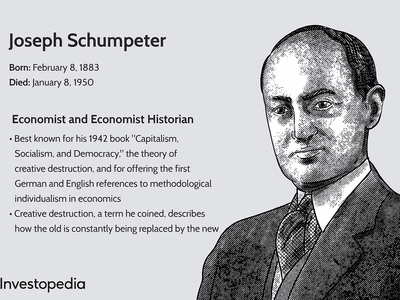

## Table of Contents

## What is intertemporal equilibrium?

Intertemporal equilibrium is a concept in economics that describes a situation where the economy is balanced over time. It means that people's plans for saving, spending, and investing today match up with their plans for the future. In this state, everyone's expectations about the future are correct, and there are no surprises that cause people to change their plans.

Think of it like a big puzzle where all the pieces fit together perfectly, not just now but also in the future. If something changes, like a new technology or a policy, people might need to adjust their plans. But once everyone has adapted and their new plans line up again, the economy returns to intertemporal equilibrium. This concept helps economists understand how decisions made today affect the economy in the future.

## How does intertemporal equilibrium differ from static equilibrium?

Intertemporal equilibrium and static equilibrium are two different ways to look at how an economy is balanced. Static equilibrium focuses on the present moment. It's like taking a snapshot of the economy and seeing if everything is in balance right now. If supply equals demand and everyone is happy with what they have, then the economy is in static equilibrium. It doesn't worry about what might happen next week or next year.

On the other hand, intertemporal equilibrium looks at the economy over time. It's like watching a movie instead of just one picture. It considers how people's plans for the future, like saving money or investing, fit together not just now but also in the future. If everyone's plans for today and tomorrow line up perfectly, then the economy is in intertemporal equilibrium. This means that people's expectations about the future are correct, and there are no surprises that make them change their plans.

## What are the key assumptions underlying intertemporal equilibrium models?

Intertemporal equilibrium models rely on a few key assumptions to work. One big assumption is that people can make good guesses about the future. This means they think about what might happen and plan their saving and spending based on these guesses. If people are good at guessing, then their plans for today will fit well with their plans for tomorrow. Another assumption is that people are patient and think about the future, not just the present. They save money now because they want to have more later, and this helps the economy stay balanced over time.

Another important assumption is that markets work well. This means that prices can change to make sure that what people want to buy matches what others want to sell, both now and in the future. If markets work well, then everyone can make deals that make them happy. Also, these models assume that there are no big surprises that mess up people's plans. If something unexpected happens, like a new law or a big storm, it can throw the economy out of intertemporal equilibrium. But if everything stays calm and predictable, then the economy can stay balanced over time.

## Can you explain the concept of intertemporal utility?

Intertemporal utility is about how happy or satisfied people are with their choices over time. It means that people think about how their decisions today will make them feel not just now, but also in the future. For example, if you decide to save money instead of spending it, you might not be as happy today, but you could be happier later when you have more money to use. Economists use the idea of intertemporal utility to understand why people make the choices they do, like saving for retirement or going to school.

When people make decisions, they weigh the happiness they get now against the happiness they expect to get later. This is called the trade-off between present and future utility. If people are patient, they might choose to be less happy now in order to be more happy later. For instance, someone might choose to study hard now to get a good job in the future. Intertemporal utility helps explain how people balance their desires for immediate happiness with their plans for long-term happiness.

## What role do interest rates play in intertemporal equilibrium?

Interest rates are super important in intertemporal equilibrium because they help people decide whether to spend money now or save it for later. When interest rates are high, people get more money if they save, so they might choose to save more and spend less now. This means they're trading a little happiness today for more happiness in the future, because they'll have more money to spend later. On the other hand, if interest rates are low, people might not see much benefit in saving, so they might spend more now and save less. This can affect the whole economy because it changes how much people are willing to borrow and lend.

Interest rates also help balance the economy over time. If lots of people want to borrow money, banks might raise interest rates to make sure they can lend to everyone who wants a loan. Higher interest rates can slow down borrowing and spending, which helps keep the economy from getting too hot and causing inflation. If fewer people want to borrow, banks might lower interest rates to encourage more borrowing and spending. This helps keep the economy moving and can prevent a slowdown. By adjusting interest rates, banks can help the economy stay in intertemporal equilibrium, where everyone's plans for today fit well with their plans for the future.

## How do expectations affect intertemporal equilibrium?

Expectations are really important for intertemporal equilibrium because they help people plan for the future. When people think about what might happen tomorrow, next month, or next year, they make choices today based on those guesses. If everyone expects the economy to do well, they might save less and spend more now, thinking they'll have more money later. But if people expect tough times ahead, they might save more and spend less today, trying to be ready for whatever might come. So, what people think will happen in the future can change how they act now, which can either help the economy stay balanced or throw it off balance.

If everyone's expectations are right, and things turn out the way people thought they would, then the economy can stay in intertemporal equilibrium. That means all the plans people made for today fit well with their plans for the future. But if something unexpected happens, like a big change in the economy or a new law, it can mess up people's plans. When that happens, people might need to change what they're doing, which can shake up the economy. So, for the economy to stay in intertemporal equilibrium, it's important that people's guesses about the future are pretty close to what actually happens.

## What are the mechanisms that drive adjustments towards intertemporal equilibrium?

When the economy is out of intertemporal equilibrium, it means people's plans for today don't match their plans for the future. To get back to equilibrium, different things start to happen. One big thing is that prices and interest rates change. If people want to borrow more money than banks want to lend, interest rates might go up. This makes borrowing more expensive, so people might decide to borrow less and save more. On the other hand, if people are saving too much and not spending enough, interest rates might go down to encourage more borrowing and spending. These changes help balance out what people want to do now with what they plan to do later.

Another way the economy moves towards intertemporal equilibrium is through people changing their expectations. If something unexpected happens, like a new technology or a big policy change, people might need to rethink their plans. They might start saving more if they think times will be tough, or they might spend more if they think the future looks bright. As people adjust their plans, the economy starts to find a new balance. If everyone's new plans fit together well, the economy can get back to intertemporal equilibrium, where what people do today lines up with what they want to do in the future.

## How is intertemporal equilibrium modeled in economics?

Intertemporal equilibrium is modeled in economics using fancy math and theories to show how people make choices over time. The main idea is to use something called "dynamic optimization," which means people try to make the best choices they can today while thinking about what will happen in the future. Economists use equations to show how people balance their happiness today with their happiness tomorrow. These equations include things like how much people earn, how much they save, and what they expect will happen in the future. The goal is to find a situation where everyone's plans for today fit perfectly with their plans for the future.

One popular way to model intertemporal equilibrium is with the "overlapping generations" model. This model imagines that there are different groups of people, like young and old, who live at the same time but have different needs and plans. The young might save money to use when they're old, while the old might spend the money they saved when they were young. By looking at how these groups interact and make choices, economists can see how the economy stays balanced over time. If something changes, like a new law or a big storm, the model helps show how people might adjust their plans to get back to a new intertemporal equilibrium.

## What are the implications of intertemporal equilibrium for economic policy?

Intertemporal equilibrium is important for economic policy because it helps policymakers understand how their decisions affect the economy over time. When making policies, like setting interest rates or creating new laws, leaders need to think about how these changes will influence what people do today and what they plan for the future. If a policy makes people feel good about the future, they might spend more now, which can help the economy grow. But if a policy makes people worried, they might save more and spend less, which can slow the economy down. So, by understanding intertemporal equilibrium, policymakers can make better choices that keep the economy balanced over time.

One big thing policymakers can do is adjust interest rates to help the economy stay in intertemporal equilibrium. If people are borrowing too much and spending too much, raising interest rates can make borrowing more expensive, which might encourage people to save more and spend less. This can help cool down an economy that's getting too hot. On the other hand, if people are saving too much and not spending enough, lowering interest rates can make borrowing cheaper, which might encourage people to borrow more and spend more. This can help get an economy moving again. By using tools like interest rates, policymakers can help guide the economy towards intertemporal equilibrium, where everyone's plans for today fit well with their plans for the future.

## How do different economic agents (consumers, firms, government) interact in an intertemporal equilibrium framework?

In an intertemporal equilibrium framework, consumers, firms, and the government all play important roles and interact in ways that keep the economy balanced over time. Consumers make choices about how much to save and spend based on what they think will happen in the future. If they expect good times ahead, they might spend more now, which can help the economy grow. But if they're worried about the future, they might save more and spend less, which can slow things down. Consumers' decisions affect firms because when people spend more, firms sell more and might hire more workers or invest in new projects. If people spend less, firms might cut back on what they're doing.

Firms, on the other hand, make plans based on what they think consumers will do. They might borrow money to invest in new factories or products, expecting that consumers will buy them in the future. If firms are right about what consumers will do, their plans fit well with what consumers want, helping the economy stay balanced. The government also plays a big part by setting policies like taxes and interest rates. If the government wants to encourage spending, it might lower taxes or interest rates. If it wants to slow things down, it might raise them. By adjusting these policies, the government can help guide the economy towards intertemporal equilibrium, where everyone's plans for today fit well with their plans for the future.

## What are some of the challenges in achieving intertemporal equilibrium in real-world economies?

Achieving intertemporal equilibrium in real-world economies can be tough because things are always changing. People's guesses about the future might be wrong, and unexpected events like new laws, natural disasters, or big changes in technology can shake up everyone's plans. If people expect the economy to do well but it doesn't, they might have saved too little and spent too much, which can cause problems. Also, different groups of people, like young and old, might want different things, making it hard to find a balance that works for everyone.

Another challenge is that economies are big and complicated, with lots of different parts that need to work together. Governments try to help by setting interest rates or making new laws, but it's hard to get it just right. If they make borrowing too cheap, people might borrow too much and spend too much, which can lead to inflation. If borrowing is too expensive, people might save too much and spend too little, which can slow down the economy. It's a tricky balance to find, and it takes a lot of work to keep the economy moving smoothly over time.

## How have advanced models like dynamic stochastic general equilibrium (DSGE) incorporated intertemporal equilibrium concepts?

Advanced models like dynamic stochastic general equilibrium (DSGE) use intertemporal equilibrium ideas to show how the economy works over time. These models imagine that people, businesses, and the government make choices today while thinking about what might happen in the future. They use math to show how people balance their happiness now with their happiness later. For example, if people expect the economy to do well, they might spend more now, which can help the economy grow. But if they think tough times are coming, they might save more and spend less, which can slow things down. DSGE models help economists see how these choices fit together to keep the economy balanced over time.

DSGE models also think about unexpected events, like new laws or big changes in the economy, and how these can mess up people's plans. If something unexpected happens, people might need to change what they're doing, which can shake up the economy. These models use something called "shocks" to show how the economy reacts to surprises. By looking at how people, businesses, and the government adjust their plans when things change, DSGE models help economists understand how the economy can get back to intertemporal equilibrium, where everyone's plans for today fit well with their plans for the future.

## What is Understanding Intertemporal Equilibrium?

Intertemporal equilibrium is a fundamental concept in economic theory that examines how economic [agents](/wiki/agents), such as households and firms, allocate resources over multiple time periods to achieve a balanced state. This equilibrium arises when the plans made by these agents concerning their consumption, production, and investment activities align, thereby ensuring that all markets clear over time. Unlike static equilibrium, which analyzes a single moment, intertemporal equilibrium considers the dynamic adjustments that occur as agents optimize their decisions with regard to both current and future periods.

In modern economics, intertemporal equilibrium has profound implications, particularly in understanding how economies function over extended horizons. By focusing on the dynamic processes, economists can better evaluate how economic systems respond to changes in policies, technologies, and preferences. This holistic approach is essential for assessing long-term economic stability and growth prospects.

The concept underscores the importance of decision-making processes that consider future consequences. Households, for example, make decisions about consumption and savings based on their expectations of future income, interest rates, and economic conditions. Similarly, firms decide on their levels of investment and production by considering potential future demand, costs, and technological advancements. These decisions are interconnected, as the choices made by households affect the labor supply and the demand for goods and services, while the actions of firms influence employment opportunities and income levels.

For a household, the decision to save today impacts the resources available for future consumption. The optimization problem a household faces can often be represented by the utility maximization problem:

$$
\max \sum_{t=0}^{T} \beta^t U(C_t)
$$

subject to the budget constraint that takes into account present income, savings, and future income. Here, $U(C_t)$ represents the utility derived from consuming at time $t$, and $\beta$ is the discount factor that reflects the time preference for present consumption over future consumption.

In the same vein, firms determine the optimal allocation of resources to maximize their future profits. The investment decisions they make today are influenced by anticipated future market conditions, technological changes, and the cost of capital.

Through these decisions, both households and firms contribute to the overall economic trajectory, influencing variables such as growth, employment, and inflation. The alignment of these decisions across time frames results in intertemporal equilibrium, which is crucial for sustaining an economy's long-term health. This concept plays a pivotal role in the development of economic policies aimed at fostering sustainable economic environments.

## How do intertemporal choices affect economic decisions?

Intertemporal choices are a fundamental aspect of economic decision-making, impacting both individual and collective future planning. This concept involves decisions where the consequences are distributed over different time periods, often requiring a trade-off between present and future benefits. The impact of intertemporal choices on future planning is significant as they determine the allocation of resources not only today but also in subsequent periods. 

For instance, individuals face choices between consuming today or saving resources to consume in the future. Decisions such as how much to save for retirement, whether to invest in education, or how to allocate assets across different financial instruments are all examples of intertemporal choices. These decisions directly influence future consumption and investment possibilities by altering the available resources and potential economic returns over time. A key consideration is the rate at which future benefits are discounted relative to current consumption, often influenced by subjective preferences for instant gratification versus long-term benefits.

Economist Irving Fisher significantly contributed to our understanding of intertemporal choices through his work on the theory of interest. Fisher introduced intertemporal choice models that illustrate how individuals allocate resources across various periods to maximize utility. One of his seminal contributions is the development of the intertemporal budget constraint, which depicts the trade-offs between present and future consumption. Fisher's model posits that individuals seek to smooth out their consumption over time, optimizing their utility based on expected income, preferences, and prevailing interest rates. 

Mathematically, the intertemporal budget constraint can be represented as:

$$
C_0 + \frac{C_1}{1+r} = Y_0 + \frac{Y_1}{1+r}
$$

where $C_0$ and $C_1$ are current and future consumption, respectively, $Y_0$ and $Y_1$ denote current and future income, and $r$ is the interest rate. The formulation underscores the importance of interest rates in equating the value of current and future consumption, thus guiding optimal decision-making over time. 

Fisher's models remain influential in contemporary economics, providing a framework for analyzing how present decisions about saving and investing can reshape economic possibilities in the future. By understanding these dynamics, individuals and policymakers can make more informed decisions, balancing immediate needs with long-term goals for economic stability and growth.

## References & Further Reading

[1]: Irving Fisher (1930). ["The Theory of Interest"](https://oll.libertyfund.org/titles/fisher-the-theory-of-interest). Macmillan.

[2]: Joseph A. Schumpeter (1942). ["Capitalism, Socialism and Democracy"](https://archive.org/details/j.-schumpeter-capitalism-socialism-and-democracy). Harper & Brothers.

[3]: Fama, E. F. (1970). ["Efficient Capital Markets: A Review of Theory and Empirical Work."](https://www.jstor.org/stable/2325486) The Journal of Finance, 25(2), 383-417.

[4]: Blanchard, O. J., & Fischer, S. (1989). ["Lectures on Macroeconomics"](http://vols.wta.org/results/publication/Documents/Blanchard%20And%20Fischer%20Lectures%20On%20Macroeconomics%20.pdf). MIT Press.

[5]: Ludwig von Mises (1949). ["Human Action: A Treatise on Economics"](https://mises.org/library/book/human-action). Yale University Press.

[6]: Hull, J. C. (2017). ["Options, Futures, and Other Derivatives"](https://www.semanticscholar.org/paper/Options%2C-Futures%2C-and-Other-Derivatives-Hull/89bdee500c8623864fc9eb7a471546aa713acc44). Pearson Education.