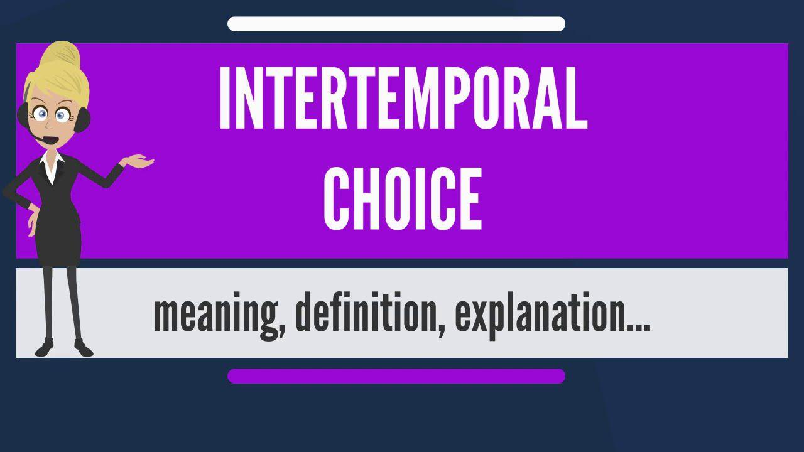

## Table of Contents

## What is intertemporal portfolio choice?

Intertemporal portfolio choice is about deciding how to invest your money over time, not just right now. It's like planning your investments for the future, considering how your needs and the economy might change. Imagine you're saving for retirement; you wouldn't put all your money in one type of investment today. Instead, you'd think about how to spread it out over the years, adjusting as you get older or as the market changes.

This kind of planning involves thinking about things like how long you'll be investing, how much risk you're willing to take, and what your financial goals are. For example, when you're young, you might be okay with riskier investments because you have time to recover from any losses. But as you get closer to needing the money, you might switch to safer investments. It's all about balancing your current needs with your future ones, and making smart choices along the way.

## Why is intertemporal portfolio choice important for investors?

Intertemporal portfolio choice is important for investors because it helps them plan their investments over time, not just for the moment. It's like making a roadmap for your money that takes into account how your life and financial needs might change in the future. For example, if you're saving for a house, you might start with investments that could grow a lot, even if they're risky. But as you get closer to buying the house, you might switch to safer investments to protect your savings.

This approach also helps investors manage risk better. By spreading out investments over time and adjusting them as needed, you can avoid putting all your eggs in one basket at the wrong time. It's about being flexible and ready to change your plan as the world changes around you. This way, you're more likely to reach your financial goals, whether it's retiring comfortably, buying a home, or funding your kids' education.

## How does time horizon affect intertemporal portfolio choice?

The time horizon, or how long you plan to invest, is super important when you're making intertemporal portfolio choices. If you have a long time horizon, like if you're saving for retirement that's 30 years away, you can take more risks with your investments. You might choose stocks or other investments that could go up a lot, even if they might also go down. That's because you have time to wait for the market to recover if things go bad.

On the other hand, if your time horizon is short, like if you're saving to buy a house in a few years, you'll want to be more careful. You might pick safer investments, like bonds, that don't go up as much but are less likely to lose value. This way, you protect the money you need soon. So, your time horizon helps you decide how much risk you can take and what kind of investments are best for you.

## What are the key differences between static and dynamic portfolio choice?

Static portfolio choice is like making a one-time decision about how to invest your money. It's when you pick your investments and then stick with them, without changing your plan over time. Imagine you're setting up a garden and you plant all your flowers in one go, hoping they'll grow well without any more work from you. This approach is simpler but it doesn't take into account that things might change, like the economy or your own needs.

Dynamic portfolio choice, on the other hand, is about adjusting your investments over time. It's like being an active gardener who keeps an eye on the garden and moves plants around, adds new ones, or takes some out as needed. This way, you can respond to changes in the market or in your life, like if you get closer to retirement or if there's a big economic shift. It's more work, but it can help you make better use of your money and reach your goals more effectively.

The main difference between the two is how they handle change. Static portfolio choice assumes everything will stay the same, while dynamic portfolio choice is ready to adapt. This makes dynamic choice better for most people because life and markets are always changing, and being able to adjust your investments can make a big difference in the long run.

## Can you explain the role of consumption in intertemporal portfolio choice?

Consumption plays a big role in intertemporal portfolio choice because it's about how you use your money now versus saving it for later. When you make investment decisions over time, you're not just thinking about how to grow your money, but also about how much of it you want to spend today. If you spend a lot now, you might have less to invest for the future. On the other hand, if you save more and spend less, you can put more money into investments that might grow over time. So, your choices about spending and saving are closely linked to your investment strategy.

For example, if you're young and just starting your career, you might choose to spend less and save more, putting that money into riskier investments because you have time to recover from any losses. As you get older and maybe have a family, your consumption needs might change. You might need more money for daily expenses, so you might shift to safer investments to protect what you have. Balancing consumption with investment is like juggling; you need to keep both balls in the air to make sure you're living well now and also setting yourself up for a good future.

## How do interest rates influence intertemporal portfolio decisions?

Interest rates play a big role in how you decide to invest your money over time. When interest rates are high, it's more attractive to put your money into things like savings accounts or bonds because you'll earn more interest. This might make you choose safer investments because they're giving you a good return without much risk. But if you're looking at long-term goals like retirement, high interest rates might also make you think twice about borrowing money, because it'll be more expensive. So, you might save more now to invest later, instead of taking out loans.

On the other hand, when interest rates are low, you might feel less excited about keeping your money in safe places like savings accounts because they're not earning much. This could push you towards riskier investments like stocks, hoping to get a better return. Low interest rates can also make borrowing cheaper, so you might decide to take out a loan to invest in something that could grow a lot over time. Your decisions about saving, spending, and investing all change based on whether interest rates are high or low, and you have to balance what you need now with what you want in the future.

## What is the impact of inflation on intertemporal portfolio choice?

Inflation affects how you plan your investments over time. When prices go up because of inflation, the money you save today will be worth less in the future. So, if you're saving for something like retirement, you need to make sure your investments grow faster than inflation. Otherwise, you might not have enough money when you need it. This means you might choose investments that have a chance to grow more, even if they're riskier, to beat the rising costs.

On the other hand, inflation can also change how much risk you're willing to take. If inflation is high, you might feel more pressure to protect your money from losing value. This could make you look for investments that can keep up with or outpace inflation, like real estate or commodities. But if inflation is low, you might feel more comfortable with safer investments because your money isn't losing value as quickly. So, inflation is something you always need to think about when planning your investments over time.

## How can risk aversion be incorporated into intertemporal portfolio models?

Risk aversion is about how much risk you're willing to take with your money. In intertemporal portfolio models, you can include this by adjusting your investments based on how comfortable you are with risk. If you're very risk-averse, meaning you don't like taking chances, you might choose safer investments like bonds, even if they grow slower. But if you're okay with more risk, you might pick stocks or other investments that could go up a lot, even though they could also go down. The model helps you figure out the right mix of investments that matches your risk level over time.

As time goes on, your risk aversion might change. When you're young and saving for a long-term goal like retirement, you might be more willing to take risks because you have time to recover from any losses. But as you get closer to needing the money, like when you're about to retire, you might become more risk-averse. The intertemporal portfolio model can help you adjust your investments to match these changes. It's like having a plan that changes with you, making sure your investments fit your comfort level with risk at every stage of your life.

## What are some common strategies used in intertemporal portfolio management?

One common strategy in intertemporal portfolio management is called lifecycle investing. This means you change your investments as you get older. When you're young, you might put more money into stocks or other risky investments because you have time to wait for them to grow. But as you get closer to needing the money, like for retirement, you switch to safer investments like bonds. This way, you can take advantage of growth when you're young and protect your money when you're older.

Another strategy is dollar-cost averaging. This is when you invest a fixed amount of money at regular times, no matter what the market is doing. By doing this, you buy more when prices are low and less when prices are high, which can help you avoid the risk of putting all your money in at the wrong time. It's a way to spread out your investments and reduce the impact of short-term market changes.

A third strategy is rebalancing. This means you check your investments from time to time and adjust them to keep the mix you want. If one type of investment grows a lot, it might become a bigger part of your portfolio than you planned. By selling some of it and buying other investments, you can get back to your original plan. Rebalancing helps you stick to your strategy and manage risk over time.

## How does the life-cycle model relate to intertemporal portfolio choice?

The life-cycle model is a big part of intertemporal portfolio choice. It's all about how you change your investments as you go through different stages of your life. When you're young and just starting out, you might be okay with taking more risks because you have a long time before you need the money. So, you might put more of your money into things like stocks that could grow a lot, even if they might also go down. This is because you have time to wait for the market to recover if things don't go well.

As you get older and closer to needing the money, like for retirement, the life-cycle model says you should switch to safer investments. This means you might move your money into bonds or other things that don't go up as much but are less likely to lose value. This way, you protect the money you've saved over the years. The life-cycle model helps you make smart choices about your investments over time, matching them to where you are in your life and what you need.

## Can you discuss the application of stochastic dynamic programming in intertemporal portfolio choice?

Stochastic dynamic programming is a way to make decisions over time when things are uncertain, like in intertemporal portfolio choice. It helps you figure out the best way to invest your money, step by step, as things change. Imagine you're playing a game where you need to decide how to move forward, but you don't know exactly what will happen next. Stochastic dynamic programming is like having a strategy that helps you make the best choice at each step, considering all the possible things that could happen and what you want to achieve in the end.

In intertemporal portfolio choice, this method lets you plan your investments while taking into account how the economy might change, how much risk you're willing to take, and your changing needs over time. It's like having a map that updates itself as you go along, helping you decide when to buy or sell investments, how much to save or spend, and how to balance your portfolio. By using stochastic dynamic programming, you can make smarter choices that help you reach your financial goals, even when the future is uncertain.

## What are the latest research findings on intertemporal portfolio choice in the context of behavioral finance?

Recent research in behavioral finance has shown that people often make intertemporal portfolio choices based on emotions and biases, rather than just logic. For example, some studies have found that investors might be too scared to invest in stocks after a big market drop, even if it's a good time to buy. This is called loss aversion, where people feel the pain of losing money more than the joy of gaining it. Another finding is that people might stick to the same investments because they feel comfortable with them, even if there are better options out there. This is known as the status quo bias.

Other research has looked at how people's time preferences affect their investment choices. Some people focus more on the short term and might choose investments that give quick returns, even if they're not the best for the long run. This is called myopic loss aversion. On the other hand, some people might be too optimistic about the future and take on too much risk, hoping for big gains. Behavioral finance helps us understand these patterns and suggests ways to make better investment plans over time, like using automatic savings plans or getting advice from financial experts to overcome these biases.

## What are the key concepts in intertemporal portfolio choice?

Intertemporal portfolio choice hinges on several key concepts that facilitate strategic investment decision-making over multiple periods. These concepts include dynamic optimization, stochastic processes, utility functions, and consumption-savings decisions, each playing a pivotal role in how investors assess and manage their financial portfolios over time.

Dynamic optimization is a crucial component in intertemporal portfolio choice, as it involves making decisions that are forward-looking, considering the evolution of wealth over time. This concept is underpinned by the notion that today’s investment and consumption choices not only affect current outcomes but also influence the financial opportunities available in future periods. It requires the use of algorithms and computational techniques to optimize decision-making processes as conditions evolve, ensuring that investment strategies remain responsive and adaptive.

Stochastic processes are used to model the random nature of investment returns and economic variables, which are inherently uncertain and evolve over time. These probabilistic systems help investors understand and predict the behavior of asset prices, interest rates, and other relevant financial indicators. The application of stochastic models enables investors to estimate the range of possible future outcomes and assess the likelihood of different scenarios, thus enhancing risk management and strategic planning.

Utility functions are employed to quantify the satisfaction or utility an investor derives from wealth or consumption over time. These functions typically incorporate the investor's level of risk aversion, reflecting the trade-off between risk and potential return. By evaluating how different investment choices impact an investor's utility, financial strategies can be tailored to align with individual risk preferences and long-term objectives. The utility function $U(W)$ might be expressed as follows for a risk-averse investor:

$$
U(W) = \frac{W^{(1-\gamma)}}{1-\gamma}
$$

where $W$ is wealth and $\gamma > 1$ represents the degree of relative risk aversion.

Consumption-savings decisions involve determining how to allocate wealth between consumption in the present and savings for future consumption. This involves a balancing act between immediate financial needs and long-term goals such as retirement planning or wealth accumulation. The decision-making process is guided by factors such as anticipated future income, investment returns, and personal financial objectives. 

Incorporating these key concepts into intertemporal portfolio choice allows investors to dynamically adjust their strategies in response to changes in economic conditions and personal circumstances. This approach provides a comprehensive framework for managing the complexities of investing across multiple periods while optimizing for both present and future financial well-being.

## What are the strategies and models being discussed?

Life-cycle investing is a strategy that adjusts an investor's portfolio according to their age and proximity to retirement. This approach is predicated on the notion that risk tolerance typically decreases as one approaches retirement, prompting a shift from riskier assets like equities to safer assets such as bonds. The strategy aligns with the principle of human capital depreciation over an individual's lifetime—young investors with a steady income stream may afford to invest heavily in growth-oriented assets, whereas retirees or those nearing retirement prioritize capital preservation.

The Stochastic Dynamic Programming Model plays a crucial role in optimizing investment portfolios over time. This model employs backward induction to maximize the expected utility of consumption over the investment horizon. The process involves solving a Bellman equation, which recursively determines the optimal policy by considering future states and decisions. The mathematical formulation can be expressed as:

$$
V_t(W_t) = \max_{c_t} \{ u(c_t) + \beta \mathbb{E}[V_{t+1}(W_{t+1}) \mid W_t] \}
$$

where $V_t(W_t)$ is the value function at time $t$, $c_t$ denotes consumption, $\beta$ is the discount factor, and $\mathbb{E}$ represents the expectation operator.

Continuous-time models leverage stochastic calculus to evaluate optimal portfolios in real-time trading scenarios. These models use tools like Ito's lemma and stochastic differential equations (SDEs) to describe the dynamic behavior of asset prices and portfolio values. An example of such a model is the Merton’s Portfolio Problem, where an investor seeks to maximize expected utility of wealth by solving:

$$
\max_{\pi} \mathbb{E} \left[ \int_0^T \exp(-\rho t) U(W_t, t) \, dt \right]
$$

subject to the wealth dynamics governed by:

$$
dW_t = (rW_t + \pi_t(\mu - r)) \, dt + \pi_t \sigma \, dZ_t
$$

Here, $\pi_t$ is the amount invested in a risky asset, $\mu$ is the expected return, $r$ the risk-free rate, $\sigma$ the [volatility](/wiki/volatility-trading-strategies), and $dZ_t$ a standard Brownian motion.

These strategies underscore the adaptability and complexity required in modern portfolio management, accommodating varying risk preferences and real-time market conditions through sophisticated mathematical frameworks.

## References & Further Reading

[1]: Merton, R. C. (1973). ["An Intertemporal Capital Asset Pricing Model."](https://www.jstor.org/stable/1913811) Econometrica, 41(5), 867-887.

[2]: Campbell, J. Y., & Viceira, L. M. (2002). ["Strategic Asset Allocation: Portfolio Choice for Long-Term Investors."](https://academic.oup.com/book/6093) Oxford University Press.

[3]: Markowitz, H. (1952). ["Portfolio Selection."](https://onlinelibrary.wiley.com/doi/abs/10.1111/j.1540-6261.1952.tb01525.x) The Journal of Finance, 7(1), 77-91.

[4]: van Binsbergen, J. H., & Brandt, M. W. (2007). ["Optimal Asset Allocation in Asset Liability Management."](https://www.nber.org/system/files/working_papers/w12970/w12970.pdf) Journal of Economic Dynamics and Control, 31(3), 347-375.

[5]: Sharpe, W. F., & Litzenberger, R. H. (1978). ["Effects of Risk on Depreciation and Investment under Interest Rate Variability."](https://www.sciencedirect.com/science/article/pii/0304405X79900126) Financial Analysts Journal, 34(1), 115-126.