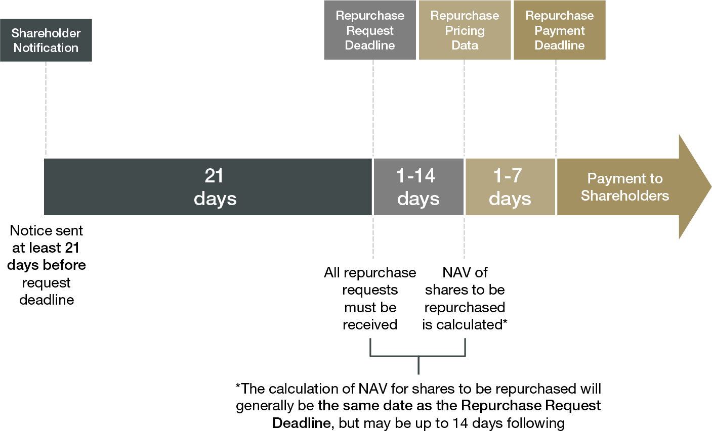

## Table of Contents

## What is an interval fund?

An interval fund is a type of investment fund that lets you buy and sell shares at certain times, not whenever you want. These times are called intervals, and they happen a few times a year. This is different from other funds where you can buy and sell shares any day the market is open.

Interval funds are good for investing in things that are hard to sell quickly, like real estate or loans. Because you can only sell your shares at set times, the fund managers have more time to find buyers for these hard-to-sell items. This can help the fund keep its value and give you a chance to earn more money over time.

## How does an interval fund differ from a mutual fund or an ETF?

An interval fund is different from a mutual fund or an ETF mainly because of when you can buy and sell shares. With a mutual fund or an ETF, you can buy and sell shares any day the market is open. But with an interval fund, you can only buy and sell shares at certain times during the year, called intervals. These intervals might happen every three, six, or twelve months. This setup helps the fund manage investments that are not easy to sell quickly, like real estate or private loans.

Another difference is in the types of investments they hold. Mutual funds and ETFs usually invest in things like stocks and bonds that can be easily bought and sold. Interval funds, on the other hand, often invest in less liquid assets. Because of this, interval funds can give you a chance to invest in things that might offer higher returns but are harder to sell. So, if you're okay with waiting to get your money out, an interval fund might be a good choice for you.

## What are the key features of interval funds?

Interval funds have a few key features that set them apart from other types of funds. One big feature is that you can only buy and sell shares at certain times during the year. These times are called intervals, and they might happen every three, six, or twelve months. This is different from mutual funds or ETFs, where you can buy and sell shares any day the market is open.

Another important feature of interval funds is that they often invest in things that are hard to sell quickly. This can include real estate, private loans, or other less liquid assets. Because you can only sell your shares at set times, the fund managers have more time to find buyers for these hard-to-sell items. This can help keep the fund's value stable and might give you a chance to earn higher returns over time, but you need to be okay with waiting to get your money out.

## How do interval funds handle liquidity?

Interval funds handle liquidity differently than other funds. They invest in things that are hard to sell quickly, like real estate or private loans. Because these investments are not easy to turn into cash, the fund can't let people buy and sell shares whenever they want. Instead, interval funds set specific times during the year when you can buy or sell your shares. These times are called intervals, and they might happen every three, six, or twelve months.

This setup helps the fund manage its liquidity better. When you want to sell your shares, the fund doesn't have to rush to sell its hard-to-sell investments. It can take its time to find the right buyers, which can help keep the value of the fund stable. This means that if you're okay with waiting to get your money out, an interval fund can be a good way to invest in things that might offer higher returns but are less liquid.

## What types of assets do interval funds typically invest in?

Interval funds often invest in things that are hard to sell quickly. These can include real estate, like buildings or land, and private loans, which are loans that are not traded on public markets. They might also put money into other less liquid assets, like certain types of bonds or shares in private companies. These investments can be harder to turn into cash compared to stocks or regular bonds.

Because interval funds invest in these hard-to-sell assets, they can offer a chance for higher returns. But, you need to be okay with waiting to get your money out. The fund sets specific times during the year when you can buy or sell your shares, which helps the fund manage its investments better and keep its value stable.

## How often can investors redeem their shares in an interval fund?

Investors in an interval fund can only redeem their shares at certain times during the year. These times are called intervals, and they might happen every three, six, or twelve months. This is different from other funds where you can sell your shares any day the market is open.

Because interval funds invest in things that are hard to sell quickly, like real estate or private loans, they need these set times to manage their investments better. When you want to sell your shares, the fund doesn't have to rush to find buyers for its hard-to-sell assets. This setup helps keep the value of the fund stable and can give you a chance to earn higher returns, but you have to be okay with waiting to get your money out.

## What are the potential benefits of investing in interval funds?

One big benefit of investing in interval funds is that they can give you a chance to earn higher returns. They do this by investing in things that are hard to sell quickly, like real estate or private loans. These types of investments might offer more money over time than regular stocks or bonds. Because you can only sell your shares at certain times during the year, the fund managers have more time to find the right buyers for these hard-to-sell items. This can help keep the value of the fund stable and might lead to better returns for you.

Another benefit is that interval funds can help you diversify your investments. By putting your money into different types of assets, like real estate or private loans, you're not putting all your eggs in one basket. This can help protect your money if one type of investment doesn't do well. Plus, since you have to wait to sell your shares, it can encourage you to think long-term and not make quick decisions based on short-term market changes.

## What are the risks associated with interval funds?

One big risk of interval funds is that you can't get your money out whenever you want. You have to wait for certain times during the year, called intervals, to sell your shares. This means if you need your money quickly because of an emergency or a change in your plans, you might not be able to get it right away. This lack of quick access to your money can be a problem if you're not ready to wait.

Another risk is that interval funds invest in things that are hard to sell quickly, like real estate or private loans. If the market for these investments goes down, the fund might lose value. Because you can't sell your shares whenever you want, you might have to wait to see if the value goes back up. This can be stressful if you see the value of your investment drop and you can't do anything about it right away.

Lastly, interval funds can be less clear about what they're investing in compared to other funds. They might not tell you as much about their investments, which can make it harder for you to know exactly what you're putting your money into. This lack of information can make it trickier to decide if an interval fund is right for you.

## How is the pricing of interval fund shares determined?

The pricing of interval fund shares is determined by the net asset value (NAV) of the fund. The NAV is calculated by taking the total value of all the investments the fund holds, subtracting any debts or fees, and then dividing that by the total number of shares. This gives you the price per share. Because interval funds invest in things that are hard to sell quickly, like real estate or private loans, the NAV might not change as often as it does in other funds that invest in stocks or bonds.

When you want to buy or sell shares in an interval fund, you do it at the NAV that is calculated at the end of the interval period. This means the price you get for your shares is based on the value of the fund's investments at that specific time. Because you can only trade shares at set times, the price might not reflect the most up-to-date market conditions, but it gives the fund managers time to find the right buyers for the hard-to-sell assets, which can help keep the fund's value stable.

## What regulatory requirements must interval funds comply with?

Interval funds have to follow rules set by the U.S. Securities and Exchange Commission (SEC). One big rule is that they have to tell investors how often they can sell their shares. This is usually every three, six, or twelve months. They also have to say how much of the fund's shares they will buy back during these times. This helps make sure that everyone knows what to expect when they invest.

Another important rule is that interval funds need to be clear about what they are investing in. They have to give investors a document called a prospectus that explains their investments, risks, and fees. This helps investors make smart choices. Also, because interval funds often invest in things that are hard to sell quickly, they have to follow special rules about how they handle these investments to make sure they can pay back investors when they want to sell their shares.

## How do interval funds manage their repurchase offers?

Interval funds manage their repurchase offers by setting specific times during the year when investors can sell their shares. These times are called intervals, and they might happen every three, six, or twelve months. During these intervals, the fund will buy back a certain percentage of its shares from investors who want to sell. This percentage is set ahead of time and can be anywhere from 5% to 25% of the fund's shares. By doing this, the fund can control how much money it needs to have ready to pay back investors.

Because interval funds invest in things that are hard to sell quickly, like real estate or private loans, they need time to find buyers for these investments. When investors want to sell their shares, the fund doesn't have to rush to sell its assets. Instead, it can take its time during the interval period to manage its investments and make sure it has enough money to buy back the shares. This helps keep the fund's value stable and makes sure that everyone who wants to sell their shares at that time can do so.

## What advanced strategies do interval funds use to optimize returns?

Interval funds often use advanced strategies to try to get the best returns for their investors. One common strategy is to invest in a mix of assets that are hard to sell quickly, like real estate or private loans, along with some easier-to-sell assets like stocks or bonds. This mix helps the fund balance the potential for high returns from the hard-to-sell investments with the stability and liquidity of the easier-to-sell ones. By carefully choosing which assets to buy and when to sell them, the fund managers can try to make the most money for their investors.

Another strategy interval funds use is to take advantage of the time between intervals to make smart investment decisions. Because investors can only sell their shares at set times, the fund managers have a window to look for good deals and manage their investments without the pressure of daily redemptions. This can help them buy assets at lower prices and sell them at higher ones, increasing the fund's overall returns. By using these intervals wisely, interval funds can optimize their performance and aim for better results over time.

## How can one balance risks and returns effectively?

Balancing the risks and returns associated with interval funds and algorithmic trading is essential for optimizing investment portfolios. Investors are encouraged to meticulously evaluate their personal risk tolerance and ensure that their investment decisions align with their broader financial objectives. This evaluation involves understanding the potential trade-offs between the higher returns that might be achieved through these sophisticated investment strategies and the inherent risks they present.

Consulting with financial advisors is a prudent step in this process. An advisor can offer personalized strategies, helping investors navigate the complexities of these investment vehicles and make well-informed decisions. Advisors may employ various tools and models to assess risk, such as the Sharpe Ratio, which is a measure of risk-adjusted return:

$$
\text{Sharpe Ratio} = \frac{\overline{R} - R_f}{\sigma}
$$

where $\overline{R}$ is the expected return of the investment, $R_f$ is the risk-free rate, and $\sigma$ is the standard deviation of the return.

By considering factors like risk-adjusted performance, liquidity preferences, and investment horizons, investors can aim to achieve a sustainable balance of risk and return. This balance is crucial for fostering long-term growth and stability in an investment portfolio. Continuous monitoring and the ability to adjust strategies in response to changing market conditions further reinforce this approach, ensuring that the achieved balance can be maintained over time.

## References & Further Reading

Christensen, M., & Syra, T. (2023). Understanding Closed-End Funds. Financial Journal. This source provides a comprehensive overview of the mechanism, advantages, and potential pitfalls of closed-end funds, a crucial resource for understanding how these investment vehicles operate within financial markets.

Lopez de Prado, M. (2018). Advances in Financial Machine Learning. Wiley. This book is an essential resource for understanding the intersection of [machine learning](/wiki/machine-learning) and financial markets, particularly in algorithmic trading. It explores advanced techniques to enhance trading strategies using data-driven insights.

Jansen, S. (2020). Machine Learning for Algorithmic Trading. Packt Publishing. This publication offers practical insights on applying machine learning models to develop and refine algorithmic trading strategies, assisting traders in optimizing trade executions and managing risks efficiently.

Investopedia articles on investment strategies, closed-end funds, and algorithmic trading. These articles provide accessible explanations and analysis of various investment strategies, with detailed insights into the workings of closed-end funds and algorithmic trading principles. They are a valuable resource for both novice and seasoned investors seeking to deepen their understanding of these topics.

