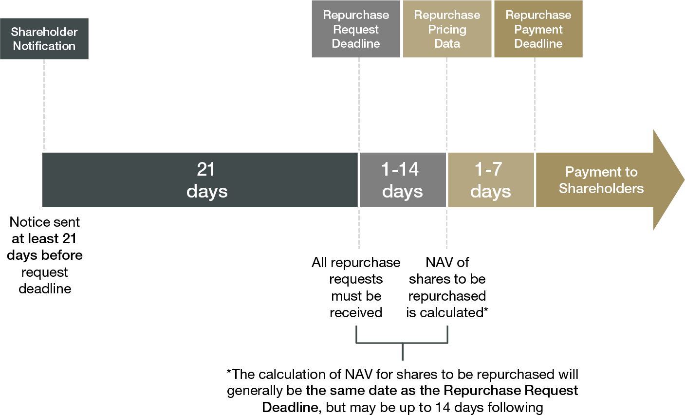

## Table of Contents

## What are interval funds and how do they differ from traditional mutual funds?

Interval funds are a type of investment fund that combines features of both mutual funds and closed-end funds. They allow investors to buy shares at any time, similar to mutual funds, but they only offer the opportunity to sell shares back to the fund at specific intervals, such as quarterly or semi-annually. This structure makes interval funds suitable for investing in less liquid assets, like real estate or private equity, because the fund managers don't have to worry about meeting daily redemption requests.

Traditional mutual funds differ from interval funds mainly in their liquidity and redemption policies. Mutual funds allow investors to buy and sell shares on any business day, providing high liquidity. This means that investors can easily convert their investments into cash whenever they want. Because of this, mutual funds usually invest in more liquid assets, like stocks and bonds, to ensure they can meet these frequent redemption requests. In contrast, the less frequent redemption opportunities in interval funds allow them to hold more illiquid investments, potentially offering different risk and return profiles compared to traditional mutual funds.

## How often can investors buy or sell shares in an interval fund?

Investors can buy shares in an interval fund at any time, just like they can with a regular mutual fund. This means you can put money into an interval fund whenever you want, without having to wait for a specific date.

However, selling shares in an interval fund is different. You can only sell your shares back to the fund at certain times, which are called intervals. These intervals might happen every three months, six months, or at another set period. So, if you need to get your money out, you have to wait until one of these intervals comes around.

## What is the repurchase offer in interval funds and how does it work?

A repurchase offer in interval funds is when the fund gives investors a chance to sell their shares back to the fund. This happens at set times, like every three or six months. When the fund makes a repurchase offer, it tells investors how many shares they can sell back. This is important because it helps the fund manage its money and investments better, especially since interval funds often invest in things that are not easy to sell quickly.

When a repurchase offer is made, investors can choose to sell some or all of their shares back to the fund at the current value of the shares. But, there's a catch: the fund might not buy back all the shares that investors want to sell. If too many people want to sell, the fund might only buy back a part of what everyone wants to sell. This is done fairly, usually by a lottery or by giving everyone a percentage of what they asked for. So, if you need your money back, you have to wait for the next repurchase offer if the fund can't buy all your shares this time.

## What types of assets do interval funds typically invest in?

Interval funds often invest in things that are not easy to buy or sell quickly. These can include real estate, private businesses, and loans that are not traded on public markets. Because these assets are harder to turn into cash, interval funds are a good fit for them. The fund managers don't have to worry about selling these assets right away when people want their money back.

Instead, interval funds can hold onto these less liquid investments for a longer time. This can help the fund grow more over time because they can invest in things that might offer higher returns but take longer to pay off. So, if you invest in an interval fund, you might be putting your money into real estate projects, private companies, or special types of loans that regular mutual funds might not touch.

## What are the potential benefits of investing in interval funds?

One big benefit of investing in interval funds is that they can give you access to investments that are hard to buy on your own. These can be things like real estate, private companies, or special loans. Because interval funds don't have to sell these investments quickly, they can hold onto them for a longer time. This can lead to higher returns because these types of investments might grow more over time than the usual stocks and bonds.

Another benefit is that interval funds can help you spread out your investments. By putting your money into different types of assets, you're not putting all your eggs in one basket. This can make your overall investment safer because if one type of investment does badly, the others might do well and balance it out. Plus, since you can only take your money out at certain times, it might stop you from making quick decisions based on short-term market changes, which can be a good thing for long-term investing.

## What are the key risks associated with interval funds?

One key risk with interval funds is that they can be hard to get your money out of. You can only sell your shares back to the fund at certain times, like every three or six months. If you need your money before then, you might be stuck waiting. Also, the fund might not buy back all the shares people want to sell. If too many people want their money back at the same time, you might only get a part of what you asked for, and you'll have to wait until the next time to try again.

Another risk is that interval funds often invest in things that are not easy to sell quickly, like real estate or private companies. If the value of these investments goes down, it can be hard for the fund to get rid of them to stop the losses. This can make your investment less safe because the fund's value might drop and stay down for a while. Plus, because these investments are less common, it can be harder to know if the fund is doing a good job or not.

## How do interval funds handle liquidity and what are the implications for investors?

Interval funds handle liquidity by allowing investors to buy shares at any time but only letting them sell shares back to the fund at certain intervals, like every three or six months. This setup helps the fund managers invest in things that are not easy to sell quickly, like real estate or private companies. Because they don't have to worry about people wanting their money back all the time, the fund can hold onto these investments longer.

For investors, this means you might not be able to get your money out when you want it. If you need your cash before the next interval, you'll have to wait. Also, if a lot of people want to sell their shares at the same time, the fund might not buy back all the shares everyone wants to sell. This can be a problem if you need your money right away. But, on the good side, this way of handling liquidity lets the fund invest in things that might grow more over time, which could mean better returns for you in the long run.

## What role do interval funds play in a diversified investment portfolio?

Interval funds can be a helpful part of a diversified investment portfolio because they let you invest in things that are hard to buy on your own, like real estate or private companies. These types of investments can grow more over time than regular stocks and bonds, which can help your whole portfolio do better. By putting some of your money into interval funds, you're spreading your investments across different types of assets. This can make your portfolio safer because if one type of investment does badly, the others might do well and balance it out.

However, interval funds also come with some risks that you need to think about. Because you can only get your money out at certain times, like every three or six months, you might have to wait if you need your cash sooner. Also, if a lot of people want to sell their shares at the same time, the fund might not buy back all the shares everyone wants to sell. This can be a problem if you need your money right away. But if you're okay with waiting and you're looking for a way to add different kinds of investments to your portfolio, interval funds can be a good choice.

## How are interval funds regulated and what are the investor protections in place?

Interval funds are regulated by the U.S. Securities and Exchange Commission (SEC) under the Investment Company Act of 1940. This means they have to follow certain rules to make sure they are run fairly and safely. For example, interval funds have to tell investors how often they can sell their shares back to the fund, and they have to stick to that schedule. They also have to be clear about what they are investing in and how much risk is involved. This helps investors make smart choices about where to put their money.

There are also protections in place for investors in interval funds. If the fund makes a repurchase offer, it has to be fair to everyone. If too many people want to sell their shares, the fund can't just buy back shares from some people and not others. They might use a lottery or give everyone a percentage of what they asked for. This makes sure everyone gets treated the same way. Plus, the SEC keeps an eye on interval funds to make sure they are following the rules and protecting investors.

## What are the tax considerations for investors in interval funds?

When you invest in interval funds, you need to think about taxes. Like other investment funds, interval funds can make money in two main ways: through dividends and capital gains. Dividends are payments the fund makes from the income it earns on its investments. Capital gains happen when the fund sells an investment for more than it paid for it. Both dividends and capital gains can be taxed, but the rates can be different depending on how long the fund held the investment and your personal tax situation.

One thing to know is that interval funds might hold onto their investments for a long time because they don't have to sell them quickly. This can mean they don't have to pay as much in taxes on short-term capital gains, which are usually taxed at a higher rate than long-term gains. But, when you do sell your shares in an interval fund, you might have to pay taxes on any profit you made. It's a good idea to talk to a tax advisor to understand how your investments in interval funds will affect your taxes, as everyone's situation is different.

## How can investors evaluate the performance of interval funds?

To evaluate the performance of interval funds, investors should look at the fund's historical returns over time. This means checking how much money the fund has made or lost in the past. You can find this information in the fund's reports or on websites that track fund performance. It's important to compare these returns to other similar funds to see if the interval fund is doing better or worse. Also, think about how much risk the fund takes to get those returns. A fund that makes a lot of money but takes big risks might not be as good as one that makes a bit less but is safer.

Another way to evaluate interval funds is by looking at the fees and costs. Interval funds can have different fees for managing the fund and other expenses. These fees can eat into your returns, so it's good to know how much you're paying. You should also check if the fund is sticking to its plan and investing in the types of assets it said it would. This helps you see if the fund is doing what it promised and if it's a good fit for your investment goals.

## What advanced strategies can be used when investing in interval funds?

When investing in interval funds, one advanced strategy is to use them as part of a broader asset allocation plan. This means figuring out how much of your money you want to put into different types of investments, like stocks, bonds, and interval funds. Because interval funds can invest in things like real estate or private companies, they can help you spread out your investments and maybe get higher returns over time. You can decide to put a certain percentage of your money into interval funds to balance out the risk and reward in your whole portfolio. This way, you're not putting all your eggs in one basket, and you can use the unique features of interval funds to help your overall investment strategy.

Another strategy is to look at the timing of your investments and withdrawals. Since interval funds only let you sell your shares back at certain times, like every three or six months, you can plan your investments around these intervals. For example, if you know you'll need some money in six months, you can invest in an interval fund that has a repurchase offer at that time. This can help you match your investment needs with the fund's schedule. Also, you can use this timing to your advantage by investing more when the market is down and less when it's up, which is called dollar-cost averaging. This can help you buy more shares when prices are low and fewer when prices are high, which might lead to better long-term returns.

## What are the key aspects of understanding financial risks in investments?

Financial risks in investments encompass a broad spectrum of uncertainties that can significantly impact both the short-term and long-term performance of an investment portfolio. These risks can be generally categorized into market risk, liquidity risk, credit risk, and operational risk.

**Market Risk**: This type of risk arises from fluctuations in market prices due to changing economic conditions, geopolitical events, or changes in interest rates. Market risk is often systemic, meaning it affects the entire market rather than a specific company or industry. For instance, an unexpected increase in interest rates can lead to a decline in bond prices across the board.

**Liquidity Risk**: Liquidity risk refers to the difficulty an investor might face in selling an asset without incurring a significant loss in value. Illiquid assets might not have enough buyers, forcing sellers to accept a lower price. Interval funds, which invest in less liquid assets, are often subject to this kind of risk, impacting how quickly investors can recoup their investments.

**Credit Risk**: Credit risk is associated with the possibility that a borrower will default on their financial obligations. This risk is particularly relevant in fixed-income investments such as bonds. Investors need to evaluate the creditworthiness of the issuer to mitigate this risk. Credit ratings provided by agencies like Moody’s or S&P can offer insights into the credit risk associated with specific instruments.

**Operational Risk**: This risk arises from failures in internal processes, systems, or external events that can disrupt business operations. For instance, technical errors in algorithmic trading systems can lead to execution delays or incorrect trades, impacting overall trading outcomes.

To effectively manage these risks, investors need to tailor their strategies in accordance with their risk appetite and investment goals. This involves distinguishing between systematic and unsystematic risks:

1. **Systematic Risk**: Also known as market risk, this affects the entire market or a large segment of it. It is inherent in market investments and cannot be eliminated through diversification. Portfolio beta, which measures a portfolio's volatility in relation to the market, is a typical method for assessing systematic risk. Investors can use derivatives like options and futures to hedge against systematic risks.

2. **Unsystematic Risk**: Also known as specific risk, this is unique to a specific company or industry. Unsystematic risk can be mitigated through diversification. By spreading investments across various companies and sectors, investors can reduce the impact of any single asset's poor performance on their overall portfolio.

Investors must constantly review and adjust their portfolios to maintain alignment with their risk tolerance and investment objectives. Tools like the Capital Asset Pricing Model (CAPM) can help assess risk and expected returns:

$$
\text{E}(R_i) = R_f + \beta_i (E(R_m) - R_f)
$$

where $\text{E}(R_i)$ is the expected return of the investment, $R_f$ is the risk-free rate, $\beta_i$ is the beta of the investment, and $E(R_m)$ is the expected market return.

Understanding and managing these financial risks is a fundamental part of strategic investment management that helps investors safeguard their portfolios amidst uncertainties.

## References & Further Reading

[1]: Lopez de Prado, M. (2018). ["Advances in Financial Machine Learning."](https://www.amazon.com/Advances-Financial-Machine-Learning-Marcos/dp/1119482089) Wiley.

[2]: Chan, E. P. (2008). ["Quantitative Trading: How to Build Your Own Algorithmic Trading Business."](https://github.com/ftvision/quant_trading_echan_book) Wiley.

[3]: Jansen, S. (2020). ["Machine Learning for Algorithmic Trading."](https://github.com/stefan-jansen/machine-learning-for-trading) Packt Publishing.

[4]: Aronson, D. R. (2007). ["Evidence-Based Technical Analysis: Applying the Scientific Method and Statistical Inference to Trading Signals."](https://www.amazon.com/Evidence-Based-Technical-Analysis-Scientific-Statistical/dp/0470008741) Wiley.

[5]: Bergstra, J., Bardenet, R., Bengio, Y., & Kégl, B. (2011). ["Algorithms for Hyper-Parameter Optimization."](https://proceedings.neurips.cc/paper/2011/file/86e8f7ab32cfd12577bc2619bc635690-Paper.pdf) Advances in Neural Information Processing Systems 24.