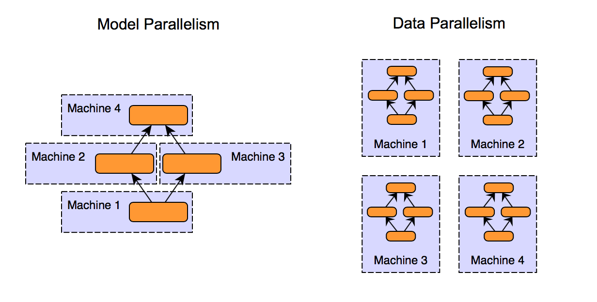

## Table of Contents

## What is Intra-Layer Parallelism in the context of machine learning?

Intra-Layer Parallelism in machine learning refers to the way computations within a single layer of a neural network can be split up and processed simultaneously. Imagine a layer in a neural network as a group of workers. Instead of having each worker finish their task one after another, intra-layer parallelism lets all workers do their tasks at the same time. This can make the overall process much faster, especially when dealing with large amounts of data or complex calculations.

This type of parallelism is especially useful in layers that have many neurons or units, like convolutional layers in Convolutional Neural Networks (CNNs). For example, in a CNN, a convolutional layer applies several filters to the input data. Each filter can be processed independently, allowing the computations to be spread across multiple processing units, like the cores in a GPU. By doing this, the time it takes to process the entire layer is significantly reduced, making the training and inference of the neural network more efficient.

## How does Intra-Layer Parallelism differ from Inter-Layer Parallelism?

Intra-Layer Parallelism and Inter-Layer Parallelism are two different ways to speed up neural network processing. Intra-Layer Parallelism focuses on splitting up the work within a single layer of a neural network. Imagine a layer as a team of workers. Instead of having each worker finish their job one at a time, intra-layer parallelism lets all the workers do their jobs at the same time. This is especially useful in layers with many units, like convolutional layers in CNNs, where each filter can be processed independently.

On the other hand, Inter-Layer Parallelism involves dividing the work between different layers of the [neural network](/wiki/neural-network). Think of the neural network as a relay race where each layer is a runner. Instead of waiting for one runner to finish before the next starts, inter-layer parallelism allows multiple runners to run their part of the race at the same time. This can be tricky because the layers depend on each other, but techniques like pipeline parallelism can help by breaking the data into smaller chunks and processing them in a way that allows multiple layers to work simultaneously.

Both types of parallelism aim to make neural networks faster and more efficient, but they do so in different ways. Intra-Layer Parallelism is about speeding up the work within a single layer, while Inter-Layer Parallelism is about speeding up the work across different layers. By using both types of parallelism together, we can significantly improve the performance of neural networks.

## What are the benefits of using Intra-Layer Parallelism in neural networks?

Using Intra-Layer Parallelism in neural networks can make them work much faster. Imagine a layer in a neural network as a team of workers. Instead of each worker finishing their job one after the other, Intra-Layer Parallelism lets all the workers do their jobs at the same time. This is like having many chefs cooking different parts of a meal simultaneously instead of one chef doing everything. When you have a lot of data or complex calculations, this can save a lot of time because the work gets done quicker.

Another big benefit is that Intra-Layer Parallelism can make better use of modern hardware, like GPUs. These devices have many cores that can work at the same time. By splitting the work within a layer across these cores, you can use the full power of the hardware. This means that not only does the neural network process faster, but it also makes the most out of the resources you have, leading to more efficient training and prediction.

## Can you explain how Tofu implements Intra-Layer Parallelism?

Tofu is a [machine learning](/wiki/machine-learning) framework that uses Intra-Layer Parallelism to speed up neural network processing. Imagine a layer in a neural network as a team of chefs cooking different parts of a meal. Instead of having one chef finish their dish before the next one starts, Tofu lets all the chefs cook their dishes at the same time. This means that within a single layer, like a convolutional layer in a CNN, Tofu splits up the work so that each filter can be processed independently. By doing this, Tofu makes the most out of the hardware's capabilities, like the many cores in a GPU, which can handle many tasks at once.

In Tofu, this is done by carefully managing how data flows through the network. When a layer receives input, Tofu breaks it down into smaller pieces and assigns each piece to different processing units. For example, if you have a convolutional layer with 64 filters, Tofu can assign each filter to a different core on the GPU. This way, all 64 filters can be processed at the same time, making the layer's work finish much faster. By using Intra-Layer Parallelism, Tofu helps neural networks process data more quickly and efficiently, which is especially important when dealing with large datasets or complex models.

## What role does GShard play in Intra-Layer Parallelism?

GShard is a machine learning framework that helps speed up neural networks by using Intra-Layer Parallelism. Imagine a layer in a neural network as a team of workers. Instead of each worker finishing their job one after the other, GShard lets all the workers do their jobs at the same time. This is like having many chefs cooking different parts of a meal simultaneously. In GShard, this is done by splitting the work within a layer into smaller pieces and processing them on different parts of the hardware, like the cores in a GPU. This way, the layer can finish its job much faster, especially when dealing with lots of data or complex calculations.

For example, in a convolutional layer of a neural network, GShard can take the input and divide it into smaller parts. Each part can then be processed by a different filter at the same time. By doing this, GShard makes the most out of the hardware's capabilities, allowing the neural network to process data more quickly and efficiently. This is particularly useful for large models and datasets, where the speed improvements from Intra-Layer Parallelism can make a big difference in training and inference times.

## How does Mesh-TensorFlow utilize Intra-Layer Parallelism?

Mesh-TensorFlow is a machine learning framework that uses Intra-Layer Parallelism to make neural networks work faster. Imagine a layer in a neural network as a team of workers. Instead of having each worker finish their job one after another, Mesh-TensorFlow lets all the workers do their jobs at the same time. This is like having many chefs cooking different parts of a meal simultaneously instead of one chef doing everything. In Mesh-TensorFlow, this is done by splitting the work within a layer into smaller pieces and processing them on different parts of the hardware, like the cores in a GPU. This way, the layer can finish its job much faster, especially when dealing with a lot of data or complex calculations.

For example, in a convolutional layer of a neural network, Mesh-TensorFlow can take the input and divide it into smaller parts. Each part can then be processed by a different filter at the same time. By doing this, Mesh-TensorFlow makes the most out of the hardware's capabilities, allowing the neural network to process data more quickly and efficiently. This is particularly useful for large models and datasets, where the speed improvements from Intra-Layer Parallelism can make a big difference in training and inference times.

## What are the challenges faced when implementing Intra-Layer Parallelism?

One of the main challenges in implementing Intra-Layer Parallelism is managing the complexity of splitting up the work within a layer. Imagine a layer as a team of workers. When you split the work, you need to make sure each worker knows exactly what to do and has the right tools. This can be tricky because the work needs to be divided evenly so no worker is left waiting for others to finish. If the split is not done right, it can lead to some parts of the layer finishing much earlier than others, causing delays and inefficiencies.

Another challenge is ensuring that the hardware can handle the parallel processing effectively. Not all hardware is the same, and some might not be able to handle a lot of tasks at once. For example, if you're using a GPU with many cores, you need to make sure it can process all the split tasks without running out of memory or slowing down. This means you have to carefully plan how you use the hardware to get the best performance without causing bottlenecks.

## How can Intra-Layer Parallelism improve the training speed of large models?

Intra-Layer Parallelism can make training large models much faster by allowing the work within each layer to be done at the same time. Imagine a layer in a neural network as a team of workers. Instead of each worker finishing their job one after another, Intra-Layer Parallelism lets all the workers do their jobs at the same time. This is like having many chefs cooking different parts of a meal simultaneously. When you have a large model with many layers and lots of data, this can save a lot of time because the work in each layer gets done quicker.

Another way Intra-Layer Parallelism helps is by making better use of modern hardware, like GPUs. These devices have many cores that can work at the same time. By splitting the work within a layer across these cores, you can use the full power of the hardware. This means that not only does the training process go faster, but it also makes the most out of the resources you have, leading to more efficient training of large models.

## What specific hardware considerations should be taken into account for Intra-Layer Parallelism?

When using Intra-Layer Parallelism, it's important to think about the hardware you're using. GPUs are great for this because they have many cores that can work on different tasks at the same time. This means that if you split up the work within a layer, each core can handle a piece of it, making the whole process faster. However, you need to make sure the GPU has enough memory to handle all the tasks at once. If it doesn't, the system might slow down or even crash, which defeats the purpose of using parallelism to speed things up.

Another thing to consider is how the work is divided among the hardware. Not all hardware is the same, so you need to match the way you split the work to what the hardware can do best. For example, if you're using a GPU with a lot of cores but limited memory, you might need to be careful about how much data each core is processing at once. This can help avoid bottlenecks and make sure that the training of your neural network goes as smoothly and quickly as possible.

## How do you measure the efficiency of Intra-Layer Parallelism in a model?

To measure the efficiency of Intra-Layer Parallelism in a model, you look at how much faster the model processes data compared to when it doesn't use parallelism. You can do this by timing how long it takes to train or run the model with and without Intra-Layer Parallelism. If the model runs much faster with parallelism, it's a sign that it's working well. You can also look at how well the hardware is being used. If all the cores in a GPU are busy and working together, it means the parallelism is efficient.

Another way to measure efficiency is by looking at the speedup ratio. This is the time it takes without parallelism divided by the time it takes with parallelism. A higher ratio means the parallelism is more efficient. For example, if training without parallelism takes 100 seconds and with parallelism it takes 25 seconds, the speedup ratio is $$ \frac{100}{25} = 4 $$. This means the model is 4 times faster with Intra-Layer Parallelism. By comparing these numbers, you can see how well the model is using Intra-Layer Parallelism to speed up its work.

## What are some advanced techniques for optimizing Intra-Layer Parallelism?

One advanced technique for optimizing Intra-Layer Parallelism is to use dynamic load balancing. Imagine a layer in a neural network as a team of workers. Instead of giving each worker the same amount of work at the start, dynamic load balancing lets the workers share tasks as they finish their own. This way, if one worker finishes early, they can help others who are still busy. This helps make sure all the work gets done as quickly as possible, without any worker sitting idle. By doing this, you can make the most out of the hardware you're using, like the cores in a GPU, and speed up the training of your neural network.

Another technique is to use data parallelism within the layer. This means you split the input data into smaller chunks and process them at the same time. For example, in a convolutional layer, you can divide the input into smaller pieces and let different cores in a GPU handle each piece. By doing this, you can make the layer work faster because all the cores are busy at the same time. This is especially useful for large models and datasets, where the speed improvements can make a big difference in how quickly you can train and use the model.

## Can you discuss any recent research or developments in Intra-Layer Parallelism?

Recent research in Intra-Layer Parallelism has focused on making neural networks even faster and more efficient. One exciting development is the use of dynamic load balancing within layers. This means that instead of giving each part of a layer the same amount of work at the start, the work can be shared as different parts finish their tasks. This helps make sure all the work gets done as quickly as possible, without any part sitting idle. By doing this, researchers have found ways to make the most out of the hardware, like the cores in a GPU, which can lead to big improvements in how quickly neural networks can be trained and used.

Another recent development is the use of data parallelism within layers. This technique involves splitting the input data into smaller chunks and processing them at the same time. For example, in a convolutional layer, the input can be divided into smaller pieces, and different cores in a GPU can handle each piece. This approach has been shown to speed up the layer's work because all the cores are busy at the same time. This is especially useful for large models and datasets, where the speed improvements can make a big difference in how quickly you can train and use the model.

## References & Further Reading

[1]: Krizhevsky, A., Sutskever, I., & Hinton, G. E. (2012). ["ImageNet Classification with Deep Convolutional Neural Networks."](https://dl.acm.org/doi/10.1145/3065386) Advances in Neural Information Processing Systems.

[2]: Shazeer, N., Mirhoseini, A., Maziarz, K., Davis, A., Le, Q. V., Hinton, G., & Dean, J. (2018). ["Outrageously Large Neural Networks: The Sparsely-Gated Mixture-of-Experts Layer."](https://arxiv.org/abs/1701.06538) arXiv preprint arXiv:1701.06538.

[3]: Zhang, J., Mitra, K., & Agarwal, S. K. (2020). ["GShard: Scaling Giant Models with Conditional Computation and Automatic Sharding."](https://arxiv.org/abs/2006.16668) arXiv preprint arXiv:2006.16668.

[4]: Shoeybi, M., Patwary, M. M. A., Puri, R., LeGresley, P., Casper, J., & Catanzaro, B. (2020). ["Megatron-LM: Training Multi-Billion Parameter Language Models Using Model Parallelism."](https://arxiv.org/abs/1909.08053) arXiv preprint arXiv:1909.08053.

[5]: Taylor, M., Castro, P. S., Moitra, S., & Tsengv, W. (2021). ["Mesh-TensorFlow: Deep Learning for Supercomputers."](https://arxiv.org/abs/1811.02084) Journal of Parallel and Distributed Computing.

[6]: Dean, J., Patterson, D., & Young, C. (2018). ["A New Golden Age in Computer Architecture: Empowering the Machine-Learning Revolution."](https://ieeexplore.ieee.org/document/8259424) Communications of the ACM.