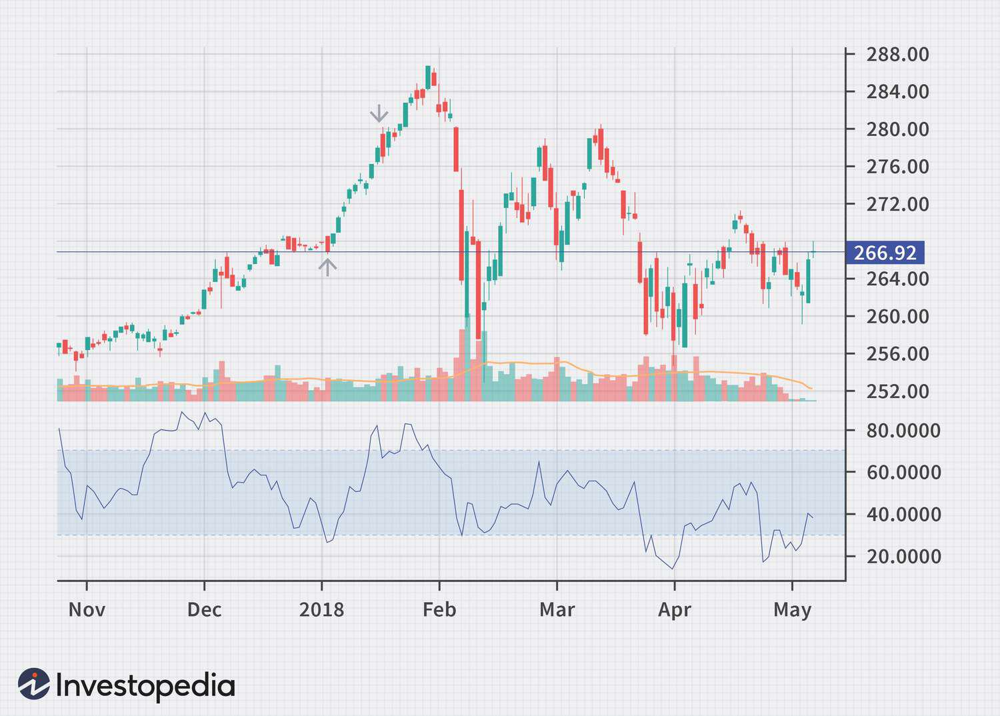

In the fast-paced world of finance, trading on indexes has become a crucial aspect for investors looking to capitalize on market trends. Financial index trading involves buying and selling stock indexes based on major market indices such as the S&P 500, Dow Jones Industrial Average, and NASDAQ Composite. These indices serve as representative samples of the broader market, reflecting the performance of selected stocks that define their respective sectors.

The concept of trading metrics plays a pivotal role in understanding the dynamics of financial index trading. These metrics provide valuable insights into factors like market liquidity, volatility, and momentum, which are essential for formulating effective trading strategies. Metrics such as average daily trading volume and relative strength index (RSI) empower traders with the tools to navigate complex market environments, offering guidance on entry and exit points for trades.



Contemporary trading strategies are increasingly influenced by methodologies like intraday intensity and algorithmic trading. Intraday intensity measures the volume of trading activity within a single trading session, disregarding overnight price changes and focusing solely on the trading day. This metric helps identify and exploit short-term trading opportunities characterized by heightened market activity.

Algorithmic trading, on the other hand, employs computer algorithms to automate the trading process, allowing for rapid execution of trades based on predefined criteria. These algorithms utilize various trading metrics to analyze market conditions and make split-second trading decisions, often outperforming human capabilities in terms of speed and efficiency.

This article aims to explore the integration of financial index trading metrics with intraday intensity and algorithmic trading strategies. By examining how these elements interact, we can better understand their impact on market dynamics and the opportunities they create for investors seeking to enhance their trading performance.

## Table of Contents

## Understanding Financial Index Trading

Financial index trading involves the buying and selling of stocks within a specified market index, such as the S&P 500, Dow Jones Industrial Average, or NASDAQ Composite. These indexes serve as critical benchmarks for evaluating the performance of stock portfolios, providing a comparative measure of market trends. For instance, investors might compare their portfolio returns against an index to assess whether their investments are outperforming or underperforming the market.

The role of indexes extends beyond performance evaluation to influence strategic investment decisions. Given their representation of market segments, indexes inform investors about prevailing economic dynamics, aiding in the identification of investment opportunities aligned with market growth or retraction. 

An array of metrics is utilized by traders to guide their decision-making processes. Volatility, a measure of the frequency and magnitude of price movements, is crucial for assessing risk. High [volatility](/wiki/volatility-trading-strategies) indicates potential for significant price swings, suggesting either higher risk or greater opportunity, depending on the trader's perspective. Market trends, reflected in metrics like moving averages, help in identifying the direction in which a market or stock index is moving, facilitating trend-following strategies. Economic indicators, such as GDP growth rates or unemployment figures, provide contextual information about the broader economic environment influencing market indices.

These metrics collectively assist traders in evaluating risk and predicting potential returns. For example, the relative strength index (RSI) is a [momentum](/wiki/momentum) oscillator that measures the speed and change of price movements. Traders use RSI to identify overbought or oversold conditions in a stock index, which may signal an impending reversal. 

Through the judicious application of these metrics, traders can make informed decisions, optimizing their strategies to align with market dynamics. As technologies evolve, the precision and application of these metrics continue to improve, enhancing the efficacy of financial index trading.

## Importance of Trading Metrics

Trading metrics are essential tools for investors and traders, offering valuable insights into the behavior of financial instruments within the index market. These metrics aid in assessing market conditions, predicting price movements, and developing efficient trading strategies, thereby enhancing overall trading performance.

Key trading metrics include average daily trading [volume](/wiki/volume-trading-strategy), moving averages, and the relative strength index (RSI). Average daily trading volume is a critical indicator of [liquidity](/wiki/liquidity-risk-premium) and market activity, reflecting the total number of shares traded over a particular period. Higher trading volumes typically indicate increased interest in the asset, often preceding significant price movements. 

Moving averages serve as valuable tools for smoothing out price data over specific intervals, thus providing a clearer view of the underlying trend. The formula for a simple moving average (SMA) is:

$$
\text{SMA} = \frac{\sum_{t=1}^{n} P_t}{n}
$$

where $P_t$ is the price at time $t$ and $n$ is the total number of time periods. Moving averages can help traders identify trends and potential reversal points, assisting in making more informed decisions.

The relative strength index (RSI) is another widely used metric, measuring the magnitude of recent price changes to evaluate overbought or oversold conditions. The RSI is calculated as follows:

$$
\text{RSI} = 100 - \frac{100}{1 + RS}
$$

where $RS$ (relative strength) is the average of $x$ days' up closes divided by the average of $x$ days' down closes. An RSI value above 70 typically indicates an overbought condition, while a value below 30 suggests an oversold condition.

By incorporating these metrics into trading analyses, traders can gain a comprehensive view of market dynamics, enabling them to devise effective trading strategies and optimize decision-making processes. These insights contribute to more predictable trading outcomes and a higher likelihood of achieving financial objectives in the index markets.

## Intraday Intensity in Index Trading

Intraday intensity involves analyzing trading activity that occurs within a single-day session, providing critical insights into the dynamics of the market. This metric primarily measures the volume of trades relative to price changes during the trading day. By focusing on intraday intensity, traders can gain an understanding of how vigorously a stock or index is being bought or sold, which in turn helps in identifying prevailing market sentiment.

The calculation of intraday intensity often involves understanding the deviations in trade volume that coincide with price movements. High intraday intensity typically signifies robust market activity, indicating strong buying or selling pressure. This scenario can precede significant market movements and potential [breakout](/wiki/breakout-trading) opportunities. Mathematically, intraday intensity can be described using the formula:

$$
\text{Intraday Intensity} = \frac{(\text{Close Price} - \text{Low Price}) - (\text{High Price} - \text{Close Price})}{\text{High Price} - \text{Low Price}} \times \text{Volume}
$$

This formula helps traders quantify how much trading volume contributes to price changes within the day's high and low range. A higher intraday intensity value suggests that the closing price is closer to the high price of the day, indicating bullish sentiment, whereas a lower value suggests bearish sentiment.

Traders utilize intraday intensity to pinpoint specific time frames where trading activity is heightened. By identifying these periods, they can better anticipate critical market movements and adjust their strategies accordingly. For instance, a trader might focus on times when the intraday intensity reaches extreme values, as these may indicate imminent price breakouts or reversals.

In practice, traders often employ real-time data analytics and sophisticated charting tools to monitor intraday intensity throughout the trading day. By doing so, they can identify patterns and trends that may not be apparent through end-of-day data, allowing for more responsive and informed trading decisions. As a result, intraday intensity serves as an invaluable tool for traders seeking to capitalize on short-term fluctuations in the financial markets.

## Algorithmic Trading Strategies

Algorithmic trading involves the use of complex computer algorithms to automate and execute trades at speeds and accuracies far surpassing human capabilities. These algorithms are designed to identify trading opportunities by analyzing a multitude of market metrics and data points at extraordinary speeds, ensuring that trades can be executed in optimal market conditions.

Algorithms in trading utilize strategies that can be adapted to capitalize on fleeting market fluctuations occurring on a minute-to-minute basis. One of the main advantages of [algorithmic trading](/wiki/algorithmic-trading) is the elimination of emotional biases that can affect human traders, as decisions are made based on predefined set rules encoded within the algorithms.

Common algorithmic trading strategies include:

1. **Trend-Following**: This strategy involves programming algorithms to identify and follow existing market trends. The basic principle is that once a trend is established, it is likely to continue. Trend-following strategies rely on technical indicators like moving averages and momentum indicators to pinpoint the direction in which a financial index is heading. Python trading libraries, such as pandas and NumPy, are often used for calculating these trends and devising automated responses.

    ```python
    import numpy as np
    import pandas as pd

    # Example: Calculate a simple moving average (SMA)
    def calculate_sma(data, window):
        return data.rolling(window=window).mean()

    # trend-following strategy
    data['SMA50'] = calculate_sma(data['close'], 50)
    data['SMA200'] = calculate_sma(data['close'], 200)
    data['Signal'] = np.where(data['SMA50'] > data['SMA200'], 1, 0)  # Buy Signal Example
    ```

2. **Arbitrage**: Arbitrage strategies take advantage of price discrepancies of identical or similar financial instruments across different markets or forms. By employing algorithms that can execute trades instantaneously, traders can profit from minor price differences before the markets correct these discrepancies. These strategies demand minimal latency for effectiveness, underscoring the critical importance of technical infrastructure in algorithmic trading.

3. **Statistical Arbitrage**: This strategy uses statistical models to identify trading opportunities based on historical price relationships. It often involves pairs trading, which exploits mean-reverting behavior between related financial instruments. Such strategies require sophisticated mathematical models and data analytics capabilities, and implementations frequently use libraries like SciPy and scikit-learn for modeling and analysis.

In summary, algorithmic trading strategies leverage advanced computational tools and methods to optimize trade execution. By programming algorithms to act upon quantifiable data and statistical models, traders can maximize their efficiency and gain a competitive edge in the fast-paced financial markets.

## Integration of Metrics with Algo Trading

In financial index trading, integrating metrics with algorithmic trading models enhances the precision and effectiveness of executing trades. This integration involves the application of quantitative metrics within algorithms, resulting in improved decision-making processes. Intraday intensity, a key metric, gauges trading volumes within intraday sessions and can be employed to optimize algorithmic strategies. By analyzing volume trends relative to intraday price changes, algorithms can identify potential trading opportunities, thus enabling timely and strategic trade executions.

Algorithmic models leverage metrics like moving averages, relative strength index (RSI), and intraday intensity to adapt to market conditions dynamically. For instance, algorithms can be designed to automatically initiate trades when specified metric thresholds are met, thereby facilitating a responsive trading strategy without human intervention. Python, a popular language for algorithmic trading, offers libraries such as Pandas and NumPy for data manipulation, and tools like TA-Lib for implementing technical indicators.

Here is a simple Python pseudo-code demonstrating the integration of a basic trading metric into an algorithmic model:

```python
import pandas as pd
import talib

# Load historical intraday data
data = pd.read_csv('historical_intraday_data.csv')

# Calculate intraday intensity
data['intraday_intensity'] = (data['close'] - data['open']) / (data['high'] - data['low'])

# Calculate a moving average as a trading metric
data['moving_average'] = talib.MA(data['close'], timeperiod=15)

# Define a basic algorithmic strategy
def trading_strategy(row):
    if row['intraday_intensity'] > 0.5 and row['close'] > row['moving_average']:
        return 'buy'
    elif row['intraday_intensity'] < -0.5 and row['close'] < row['moving_average']:
        return 'sell'
    else:
        return 'hold'

# Apply the trading strategy
data['signal'] = data.apply(trading_strategy, axis=1)

```

This integration allows for adaptable trading strategies that minimize risks and maximize returns by making informed decisions in real-time. Leveraging metrics in algorithmic models ensures that strategies are continuously calibrated to reflect changing market dynamics, ultimately improving trade performance. This adaptability is crucial for navigating the complexities and rapid changes prevalent in financial markets.

## Benefits and Challenges

The integration of trading metrics with algorithmic trading presents a myriad of benefits for market participants. One of the primary advantages is the increase in trade volume and improved liquidity in financial markets. By leveraging advanced algorithms equipped with comprehensive trading metrics, trades can be executed swiftly, thereby generating higher trade volumes and enhancing market liquidity. This is particularly beneficial in fast-moving markets where the speed of execution directly influences market impact and profitability.

Additionally, the use of algorithmic trading reduces human error and fosters consistency in trading strategies. Algorithms, guided by predefined metrics and parameters, make data-driven decisions that align with the trader's strategies, minimizing the impact of emotional biases. The systematic approach adopted through algorithmic trading ensures that tactical decisions are made consistently, which is crucial for maintaining strategic alignment with market conditions.

However, the amalgamation of trading metrics and algorithmic strategies also poses distinct challenges. One significant issue is the complexity inherent in designing and maintaining sophisticated algorithms. As trading strategies become more complex, so do the algorithms needed to implement them, demanding a high level of expertise in both financial markets and software development.

Market volatility presents another challenge, as volatile markets can lead to unexpected algorithm behavior due to rapidly changing inputs. Algorithms must be continuously refined to adapt to evolving market conditions, requiring constant oversight and modification to mitigate potential risks. Furthermore, there is the concern of over-reliance on technology, where traders may become dependent on algorithmic solutions for decision-making without fully understanding the underlying mechanisms. This dependency could lead to vulnerabilities, especially when unexpected scenarios arise that the algorithm is not programmed to handle.

Continuous monitoring and adaptation of algorithms are imperative to ensure their efficacy. Regularly updating algorithms based on new data and market trends allows for maintaining their relevance and performance. Traders must remain vigilant, combining the technical prowess of algorithms with human insight to address unforeseen challenges and maintain a competitive edge in dynamic market environments.

## Conclusion

The convergence of financial index trading metrics, intraday intensity, and algorithmic trading is significantly shaping the future landscape of trading. These elements form a robust framework that enhances the precision and efficiency of trading strategies. Accurate metrics are the cornerstone of this integration, offering traders critical insights into market dynamics that are essential for adapting to rapid changes. Metrics such as volatility, market trends, and economic indicators serve as tools that guide traders in assessing risks and anticipating returns.

Algorithmic trading models, powered by these metrics, automate the decision-making process, enabling faster execution of trades. This automation is not just about speed; it's about optimizing the timing and pricing of trades to capitalize on even the smallest market fluctuations. With the incorporation of intraday intensity, these algorithms can refine their strategies to focus on periods of heightened trading activity, thereby maximizing potential gains.

Traders who master the interplay between trading metrics and algorithmic strategies are better equipped to navigate the complexities of modern financial markets. They can streamline their trading processes, reduce human error, and improve the consistency of their outcomes. However, the integration also presents challenges, including the complexity of algorithms and the risks associated with market volatility. Continuous monitoring and refinement of these algorithms are necessary to maintain their effectiveness.

As technology continues to advance, so too will the tools and methods used to analyze and trade financial indices. Innovations in data analytics and [machine learning](/wiki/machine-learning) will likely enhance the capabilities of algorithmic models, offering traders new opportunities to refine their strategies further. The future of trading will be defined by the ability to seamlessly integrate technological advancements with traditional trading knowledge to achieve financial success.

## References & Further Reading

[1]: Bergstra, J., Bardenet, R., Bengio, Y., & Kégl, B. (2011). ["Algorithms for Hyper-Parameter Optimization."](https://dl.acm.org/doi/10.5555/2986459.2986743) Advances in Neural Information Processing Systems 24.

[2]: ["Advances in Financial Machine Learning"](https://www.amazon.com/Advances-Financial-Machine-Learning-Marcos/dp/1119482089) by Marcos Lopez de Prado

[3]: ["Evidence-Based Technical Analysis: Applying the Scientific Method and Statistical Inference to Trading Signals"](https://www.amazon.com/Evidence-Based-Technical-Analysis-Scientific-Statistical/dp/0470008741) by David Aronson

[4]: ["Machine Learning for Algorithmic Trading"](https://github.com/stefan-jansen/machine-learning-for-trading) by Stefan Jansen

[5]: ["Quantitative Trading: How to Build Your Own Algorithmic Trading Business"](https://www.amazon.com/Quantitative-Trading-Build-Algorithmic-Business/dp/1119800064) by Ernest P. Chan