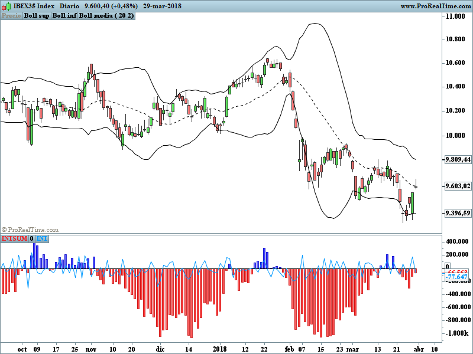

## Table of Contents

## What is the Intraday Intensity Index?

The Intraday Intensity Index is a tool used by traders to understand the strength of a stock's price movement during the trading day. It helps them see if the buying or selling pressure is strong or weak. The index is calculated by taking the difference between the stock's closing price and its opening price, then multiplying that by the day's trading volume. If the result is positive, it means there was more buying pressure, and if it's negative, there was more selling pressure.

Traders use the Intraday Intensity Index to make decisions about buying or selling stocks. For example, if the index shows strong buying pressure over several days, a trader might decide to buy the stock, expecting the price to go up. On the other hand, if the index shows strong selling pressure, the trader might sell the stock or avoid buying it, expecting the price to go down. This tool helps traders make more informed choices based on the day's trading activity.

## How is the Intraday Intensity Index calculated?

The Intraday Intensity Index is figured out by looking at how a stock's price changes during the day and how many shares are traded. You start by finding the difference between the stock's closing price and its opening price. If the stock closes higher than it opened, the difference is positive, showing more buying interest. If it closes lower, the difference is negative, showing more selling interest. Next, you multiply this difference by the total number of shares traded that day. This gives you the Intraday Intensity Index for that day.

Traders use this index to see if there's strong buying or selling pressure on a stock. If the index is positive and getting bigger over time, it means there's strong buying interest, which might make the stock's price go up. If the index is negative and getting smaller, it shows strong selling interest, which might make the stock's price go down. By watching the Intraday Intensity Index, traders can make better choices about when to buy or sell a stock.

## What data is needed to compute the Intraday Intensity Index?

To calculate the Intraday Intensity Index, you need three pieces of information: the stock's opening price, the stock's closing price, and the total number of shares traded during the day. The opening price is the price at which the stock starts trading when the market opens. The closing price is the price at which the stock finishes trading when the market closes. The total number of shares traded is how many shares changed hands throughout the entire trading day.

Once you have these three pieces of data, you can figure out the Intraday Intensity Index. First, you find the difference between the closing price and the opening price. If the closing price is higher than the opening price, the difference is positive, showing more buying interest. If the closing price is lower than the opening price, the difference is negative, showing more selling interest. Then, you multiply this difference by the total number of shares traded. The result is the Intraday Intensity Index for that day, which helps traders understand the strength of buying or selling pressure on the stock.

## What does the Intraday Intensity Index tell us about market trends?

The Intraday Intensity Index helps us understand market trends by showing the strength of buying or selling pressure on a stock during the trading day. If the index is positive and getting bigger over several days, it means there's strong buying interest. This can be a sign that the stock's price might keep going up because more people want to buy it than sell it. On the other hand, if the index is negative and getting smaller over time, it shows strong selling interest. This could mean the stock's price might keep going down because more people want to sell it than buy it.

By looking at the Intraday Intensity Index, traders can spot trends in the market. For example, if the index is positive for a few days in a row, it might be a good time to buy the stock because it's likely to keep going up. If the index is negative for several days, it might be a good time to sell the stock or avoid buying it because it's likely to keep going down. This tool helps traders make better decisions by showing them the overall direction of buying and selling pressure on a stock.

## How can beginners use the Intraday Intensity Index in their trading?

Beginners can use the Intraday Intensity Index to understand if people are buying or selling a stock more during the day. If the index is positive and keeps getting bigger over a few days, it means more people are buying the stock than selling it. This could be a good sign for beginners to think about buying the stock because the price might keep going up. On the other hand, if the index is negative and keeps getting smaller, it means more people are selling the stock than buying it. This might be a sign for beginners to sell the stock or not buy it because the price might keep going down.

To use the Intraday Intensity Index, beginners need to look at the stock's opening price, closing price, and the total number of shares traded each day. They can then calculate the index by finding the difference between the closing and opening price and multiplying it by the total shares traded. By watching this index over time, beginners can get a better idea of the stock's trend and make more informed decisions about when to buy or sell. It's a simple tool that can help them understand market movements and improve their trading strategies.

## What are the common misconceptions about the Intraday Intensity Index?

A common misconception about the Intraday Intensity Index is that it can predict future stock prices with certainty. While the index can show whether there's more buying or selling pressure on a stock, it doesn't guarantee what will happen next. The stock market is influenced by many factors, and the Intraday Intensity Index is just one tool among many that traders use to make decisions. Beginners might think they can rely on it alone to make profitable trades, but it's important to use it along with other indicators and market analysis.

Another misconception is that the Intraday Intensity Index is hard to understand and use. In reality, it's quite simple to calculate and interpret. You just need the stock's opening price, closing price, and the number of shares traded during the day. By subtracting the opening price from the closing price and multiplying the result by the trading volume, you get the index. It's a straightforward tool that helps you see if there's more buying or selling interest in a stock, making it useful for beginners who want to understand market trends better.

## How does the Intraday Intensity Index compare to other market indicators?

The Intraday Intensity Index is different from other market indicators because it focuses on the strength of buying or selling pressure during the trading day. It uses the stock's opening price, closing price, and trading volume to show if more people are buying or selling the stock. Other indicators, like the Moving Average, look at the stock's price over a longer time to see if it's going up or down. The Relative Strength Index (RSI) measures how fast the stock's price is changing to see if it's overbought or oversold. The Intraday Intensity Index is unique because it gives a quick snapshot of the day's trading activity, while other indicators might look at longer trends or different aspects of the stock's price movement.

Even though the Intraday Intensity Index is useful, it's not the only tool traders use. It's best to use it with other indicators to get a full picture of the market. For example, if the Intraday Intensity Index shows strong buying pressure, but the RSI says the stock is overbought, a trader might be more cautious about buying. Using different indicators together helps traders make better decisions because they can see the market from different angles. The Intraday Intensity Index is a simple tool that beginners can use to understand daily market trends, but it works best when combined with other tools for a more complete analysis.

## Can the Intraday Intensity Index be used for different time frames?

The Intraday Intensity Index is usually used to look at what happens to a stock's price during one trading day. It helps traders see if there's more buying or selling going on that day. But, some traders might want to use it for different time frames, like a week or a month. To do this, they would need to change how they calculate the index. Instead of using just one day's opening and closing prices and volume, they would use the opening and closing prices and total volume for the whole time frame they're looking at.

Using the Intraday Intensity Index for different time frames can give traders a bigger picture of buying and selling pressure over time. For example, if the index is positive and getting bigger over a week, it might mean there's strong buying interest in the stock for that whole time. But, it's important to remember that the index was made for daily use, so using it for longer times might not be as accurate. Traders should use other tools along with the Intraday Intensity Index to get the best understanding of market trends over different time frames.

## What are the limitations of the Intraday Intensity Index?

The Intraday Intensity Index is a helpful tool, but it has some limitations. One big problem is that it only looks at what happens in one trading day. It doesn't show what's been happening over a longer time, like a week or a month. This means it might not give you the whole picture of a stock's trend. If you only use this index, you might miss important information about how the stock has been doing over time.

Another limitation is that the Intraday Intensity Index can be affected by big changes in the stock's price or trading volume during the day. If there's a sudden big jump or drop in the stock's price, the index might show a strong buying or selling pressure that isn't really there. It's also not good at predicting what will happen to the stock's price in the future. Because of these limitations, it's best to use the Intraday Intensity Index along with other tools to get a better understanding of the market.

## How can the Intraday Intensity Index be integrated into an algorithmic trading strategy?

The Intraday Intensity Index can be used in an [algorithmic trading](/wiki/algorithmic-trading) strategy to help decide when to buy or sell a stock. The algorithm can be set up to look at the index every day and see if it's positive or negative. If the index is positive and getting bigger over a few days, the algorithm might decide to buy the stock because it thinks the price will keep going up. If the index is negative and getting smaller, the algorithm might decide to sell the stock or not buy it because it thinks the price will keep going down. This way, the algorithm uses the Intraday Intensity Index to make quick decisions based on the day's trading activity.

However, the Intraday Intensity Index should not be the only tool used in an algorithmic trading strategy. It's important to combine it with other indicators, like moving averages or the Relative Strength Index, to get a fuller picture of the market. The algorithm can be programmed to check these other indicators along with the Intraday Intensity Index to make better trading decisions. By using multiple tools, the algorithm can reduce the risk of making bad trades based on just one piece of information. This helps the algorithm make smarter choices and improve its chances of making money in the stock market.

## What advanced techniques can be used to refine the Intraday Intensity Index?

One advanced technique to refine the Intraday Intensity Index is to use it along with other technical indicators. For example, you can combine the Intraday Intensity Index with moving averages to get a better idea of the stock's long-term trend. If the Intraday Intensity Index shows strong buying pressure and the moving average is going up, it might be a good time to buy the stock. Another way to refine the index is to use it with the Relative Strength Index (RSI). If the Intraday Intensity Index is positive but the RSI shows the stock is overbought, you might want to be careful about buying it right away. Using the Intraday Intensity Index with other tools helps you see the market from different angles and make better trading decisions.

Another technique is to apply statistical filters to the Intraday Intensity Index. You can use moving averages of the index itself to smooth out the daily fluctuations and see the overall trend more clearly. For example, a 5-day moving average of the Intraday Intensity Index can help you see if the buying or selling pressure is getting stronger or weaker over time. You can also use standard deviation to find out if the index is showing unusually strong buying or selling pressure. If the index is more than two standard deviations away from its average, it might be a sign that the market is about to change direction. These statistical methods can help you refine the Intraday Intensity Index and make it a more reliable tool for your trading strategy.

## How have historical market events affected the reliability of the Intraday Intensity Index?

Historical market events can change how well the Intraday Intensity Index works. During big events like the 2008 financial crisis or the 2020 market crash because of the COVID-19 pandemic, the stock market can be very unpredictable. These events can cause big jumps or drops in stock prices and trading volume, which can make the Intraday Intensity Index less reliable. For example, if a stock's price suddenly goes up a lot in one day because of good news, the index might show strong buying pressure that isn't really there. This can trick traders into thinking the stock will keep going up when it might not.

On the other hand, during more stable times, the Intraday Intensity Index can be more helpful. When the market is calm and stock prices move in a more normal way, the index can give a better picture of buying and selling pressure. But traders need to remember that even in calm times, other things like company news or economic reports can still affect the index. So, it's always important to use the Intraday Intensity Index along with other tools to get a full understanding of the market and make the best trading decisions.

## What is the importance of trading metrics?

Trading metrics are essential tools for investors and traders, offering valuable insights into the behavior of financial instruments within the index market. These metrics aid in assessing market conditions, predicting price movements, and developing efficient trading strategies, thereby enhancing overall trading performance.

Key trading metrics include average daily trading [volume](/wiki/volume-trading-strategy), moving averages, and the relative strength index (RSI). Average daily trading volume is a critical indicator of [liquidity](/wiki/liquidity-risk-premium) and market activity, reflecting the total number of shares traded over a particular period. Higher trading volumes typically indicate increased interest in the asset, often preceding significant price movements. 

Moving averages serve as valuable tools for smoothing out price data over specific intervals, thus providing a clearer view of the underlying trend. The formula for a simple moving average (SMA) is:

$$
\text{SMA} = \frac{\sum_{t=1}^{n} P_t}{n}
$$

where $P_t$ is the price at time $t$ and $n$ is the total number of time periods. Moving averages can help traders identify trends and potential reversal points, assisting in making more informed decisions.

The relative strength index (RSI) is another widely used metric, measuring the magnitude of recent price changes to evaluate overbought or oversold conditions. The RSI is calculated as follows:

$$
\text{RSI} = 100 - \frac{100}{1 + RS}
$$

where $RS$ (relative strength) is the average of $x$ days' up closes divided by the average of $x$ days' down closes. An RSI value above 70 typically indicates an overbought condition, while a value below 30 suggests an oversold condition.

By incorporating these metrics into trading analyses, traders can gain a comprehensive view of market dynamics, enabling them to devise effective trading strategies and optimize decision-making processes. These insights contribute to more predictable trading outcomes and a higher likelihood of achieving financial objectives in the index markets.

## What is the intraday intensity in index trading?

Intraday intensity involves analyzing trading activity that occurs within a single-day session, providing critical insights into the dynamics of the market. This metric primarily measures the volume of trades relative to price changes during the trading day. By focusing on intraday intensity, traders can gain an understanding of how vigorously a stock or index is being bought or sold, which in turn helps in identifying prevailing market sentiment.

The calculation of intraday intensity often involves understanding the deviations in trade volume that coincide with price movements. High intraday intensity typically signifies robust market activity, indicating strong buying or selling pressure. This scenario can precede significant market movements and potential [breakout](/wiki/breakout-trading) opportunities. Mathematically, intraday intensity can be described using the formula:

$$
\text{Intraday Intensity} = \frac{(\text{Close Price} - \text{Low Price}) - (\text{High Price} - \text{Close Price})}{\text{High Price} - \text{Low Price}} \times \text{Volume}
$$

This formula helps traders quantify how much trading volume contributes to price changes within the day's high and low range. A higher intraday intensity value suggests that the closing price is closer to the high price of the day, indicating bullish sentiment, whereas a lower value suggests bearish sentiment.

Traders utilize intraday intensity to pinpoint specific time frames where trading activity is heightened. By identifying these periods, they can better anticipate critical market movements and adjust their strategies accordingly. For instance, a trader might focus on times when the intraday intensity reaches extreme values, as these may indicate imminent price breakouts or reversals.

In practice, traders often employ real-time data analytics and sophisticated charting tools to monitor intraday intensity throughout the trading day. By doing so, they can identify patterns and trends that may not be apparent through end-of-day data, allowing for more responsive and informed trading decisions. As a result, intraday intensity serves as an invaluable tool for traders seeking to capitalize on short-term fluctuations in the financial markets.

## References & Further Reading

[1]: Bergstra, J., Bardenet, R., Bengio, Y., & Kégl, B. (2011). ["Algorithms for Hyper-Parameter Optimization."](https://dl.acm.org/doi/10.5555/2986459.2986743) Advances in Neural Information Processing Systems 24.

[2]: ["Advances in Financial Machine Learning"](https://www.amazon.com/Advances-Financial-Machine-Learning-Marcos/dp/1119482089) by Marcos Lopez de Prado

[3]: ["Evidence-Based Technical Analysis: Applying the Scientific Method and Statistical Inference to Trading Signals"](https://www.amazon.com/Evidence-Based-Technical-Analysis-Scientific-Statistical/dp/0470008741) by David Aronson

[4]: ["Machine Learning for Algorithmic Trading"](https://github.com/stefan-jansen/machine-learning-for-trading) by Stefan Jansen

[5]: ["Quantitative Trading: How to Build Your Own Algorithmic Trading Business"](https://www.amazon.com/Quantitative-Trading-Build-Algorithmic-Business/dp/1119800064) by Ernest P. Chan