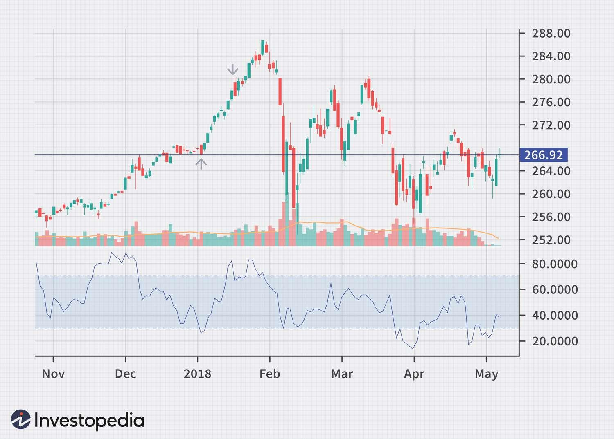

## Table of Contents

## What is the Intraday Momentum Index (IMI)?

The Intraday Momentum Index (IMI) is a technical analysis tool used by traders to measure the momentum of a stock or asset within a single trading day. It helps traders understand whether the buying or selling pressure is stronger during the day. The IMI is calculated using the stock's high, low, and closing prices, and it ranges from 0 to 100. A reading above 70 suggests that the stock might be overbought, meaning it could be a good time to sell. On the other hand, a reading below 30 indicates that the stock might be oversold, suggesting it might be a good time to buy.

Traders use the IMI to make quick decisions during the trading day. For example, if the IMI shows a stock is overbought, a trader might decide to sell it before the price drops. Conversely, if the IMI indicates a stock is oversold, a trader might see it as a buying opportunity, expecting the price to rise soon. The IMI is particularly useful for day traders who need to make fast and informed decisions based on intraday price movements.

## How is the Intraday Momentum Index calculated?

The Intraday Momentum Index (IMI) is calculated using the stock's high, low, and closing prices from a single trading day. To start, you find the difference between the closing price and the opening price. If the closing price is higher than the opening price, you use the high price of the day minus the opening price. If the closing price is lower than the opening price, you use the opening price minus the low price of the day. This difference is then divided by the range of the day, which is the high price minus the low price.

Next, you take this result and multiply it by 100 to get a percentage. This percentage is then smoothed over a period, usually 14 days, using a moving average to create the IMI. The formula looks like this: IMI = (Sum of (100 * ((Close - Open) / (High - Low))) over 14 days) / 14. The final value of the IMI ranges from 0 to 100, helping traders see if the stock is overbought or oversold during the day.

## What are the key components used in the IMI formula?

The Intraday Momentum Index (IMI) uses three main pieces of information from a stock's price during a single trading day: the opening price, the closing price, and the highest and lowest prices reached during the day. To calculate the IMI, you first find out if the stock closed higher or lower than it opened. If it closed higher, you take the highest price of the day and subtract the opening price. If it closed lower, you take the opening price and subtract the lowest price of the day.

Once you have this difference, you divide it by the range of the day, which is the highest price minus the lowest price. Then, you multiply the result by 100 to turn it into a percentage. This percentage is calculated every day and then averaged over 14 days to smooth out the results. The final number, the IMI, helps traders see if the stock is overbought or oversold during the trading day.

## What does the IMI tell us about market trends?

The Intraday Momentum Index (IMI) helps traders understand short-term market trends by showing if a stock is overbought or oversold during the trading day. If the IMI is above 70, it means the stock might be overbought, which could be a sign that the price might soon go down. Traders might see this as a good time to sell the stock. On the other hand, if the IMI is below 30, it means the stock might be oversold, suggesting that the price could go up soon. Traders might see this as a good time to buy the stock.

The IMI is useful because it gives traders quick information about what's happening with a stock during the day. By looking at the IMI, traders can get a sense of the buying and selling pressure on a stock. If the IMI stays high for a while, it might mean there's a strong upward trend. If it stays low, it might mean there's a strong downward trend. This helps traders make fast decisions about when to buy or sell, based on how the stock is moving during the day.

## How can beginners use the IMI to identify buying and selling opportunities?

Beginners can use the Intraday Momentum Index (IMI) to find good times to buy or sell a stock during the trading day. The IMI shows numbers from 0 to 100. If the number is over 70, it means the stock might be overbought, which could mean the price will go down soon. This might be a good time for beginners to sell the stock. On the other hand, if the IMI number is below 30, it means the stock might be oversold, and the price could go up soon. This might be a good time for beginners to buy the stock.

To use the IMI, beginners should watch the numbers throughout the day. If the IMI stays high for a while, it might mean there's a strong upward trend, so it might be a good time to hold onto the stock or buy more. If the IMI stays low for a while, it might mean there's a strong downward trend, so it might be a good time to sell the stock or wait for a better buying opportunity. By paying attention to these signals, beginners can make smarter decisions about when to buy and sell, based on how the stock is moving during the day.

## What are the typical time frames used for the IMI in trading?

The Intraday Momentum Index (IMI) is usually used for short periods of time, like during one trading day. Traders look at the IMI throughout the day to see if a stock is overbought or oversold. This helps them decide when to buy or sell the stock quickly. The most common time frame for the IMI is a 14-day period, which means the IMI value is calculated and then averaged over the last 14 trading days.

For beginners, using the IMI over a 14-day period can help them understand how the stock is moving in the short term. They can see if the stock's price is likely to go up or down soon by watching the IMI numbers. If the IMI is over 70, it might be a good time to sell because the stock could be overbought. If it's below 30, it might be a good time to buy because the stock could be oversold. By keeping an eye on these numbers every day, beginners can learn to spot good buying and selling opportunities during the trading day.

## How does the IMI differ from other momentum indicators like the RSI?

The Intraday Momentum Index (IMI) and the Relative Strength Index (RSI) are both used to measure momentum in trading, but they do this in different ways. The IMI looks at how a stock moves during one trading day. It uses the opening, closing, high, and low prices of the day to figure out if the stock is overbought or oversold. The IMI is usually calculated over a 14-day period, but it focuses on what happens within each day. This makes it really useful for day traders who need to make quick decisions.

On the other hand, the RSI looks at the average gains and losses of a stock over a longer period, usually 14 days too, but it doesn't focus on what happens within each day. The RSI compares the size of recent gains to recent losses to see if a stock is overbought or oversold. Because the RSI looks at longer trends, it's often used by traders who are not just trading within one day. So, while both the IMI and RSI help traders see if a stock is overbought or oversold, the IMI is better for short-term, intraday trading, and the RSI is better for understanding longer-term trends.

## What are the common settings for the IMI and how can they be adjusted for different trading strategies?

The common setting for the Intraday Momentum Index (IMI) is a 14-day period. This means the IMI value is calculated every day and then averaged over the last 14 trading days. This setting helps traders see if a stock is overbought or oversold during the trading day. If the IMI number is over 70, the stock might be overbought, and if it's below 30, it might be oversold. This can guide traders on when to buy or sell a stock quickly during the day.

Traders can adjust the IMI settings to fit different trading strategies. For example, if a trader wants to be more sensitive to short-term changes, they might use a shorter period like 7 days. This would make the IMI react faster to price changes, which is good for very active [day trading](/wiki/day-trading-spy). On the other hand, if a trader wants to see longer trends, they might use a longer period like 21 days. This would smooth out the IMI numbers and help traders see bigger trends over time. By changing the period, traders can make the IMI work better for their own trading style.

## Can the IMI be used effectively in different market conditions, such as trending or ranging markets?

The Intraday Momentum Index (IMI) can be used in different market conditions, like when the market is trending up or down, or when it's just moving sideways without a clear direction. In a trending market, where prices are going up or down strongly, the IMI can help traders see if a stock is overbought or oversold during the day. If the IMI shows a stock is overbought in an uptrend, it might be a good time to sell before the price drops. If it shows a stock is oversold in a downtrend, it might be a good time to buy before the price goes up again. This way, traders can use the IMI to make quick decisions based on the day's momentum.

In a ranging market, where prices are moving back and forth without a clear trend, the IMI can also be helpful. It can show traders when a stock might be reaching the top or bottom of its range. If the IMI goes above 70, it could mean the stock is at the top of its range and might soon go down. If it goes below 30, it could mean the stock is at the bottom of its range and might soon go up. By watching the IMI, traders can find good times to buy low and sell high, even when the market isn't clearly trending.

## How can advanced traders combine the IMI with other technical indicators for improved trading decisions?

Advanced traders can combine the Intraday Momentum Index (IMI) with other technical indicators to make better trading decisions. One common way is to use the IMI with the Relative Strength Index (RSI). The IMI looks at how a stock moves during one trading day, while the RSI looks at longer trends. By using both, traders can see if a stock is overbought or oversold in both the short and long term. If the IMI shows a stock is overbought and the RSI also shows it's overbought, it might be a strong signal to sell. If both indicators show the stock is oversold, it might be a good time to buy.

Another way to use the IMI is with moving averages. Traders can use a short-term moving average, like a 5-day moving average, to see the stock's recent trend, and then look at the IMI to see if the stock is overbought or oversold within that trend. If the stock price is above the moving average and the IMI is over 70, it might mean the stock is overbought and could soon drop. If the price is below the moving average and the IMI is below 30, it might mean the stock is oversold and could soon rise. By combining these indicators, traders can get a fuller picture of the stock's momentum and make more informed trading decisions.

## What are the potential pitfalls or limitations of using the IMI in trading?

Using the Intraday Momentum Index (IMI) in trading can have some pitfalls. One big problem is that the IMI can give false signals. This means it might show a stock is overbought or oversold when it's not. If traders rely only on the IMI, they might make bad decisions and lose money. Another issue is that the IMI is better for short-term trading. If someone is trying to understand longer trends, the IMI might not be very helpful because it focuses on what happens within one day.

Another limitation of the IMI is that it doesn't work the same in all market conditions. In a market that's moving a lot, the IMI can be useful, but in a market that's not moving much, it might not give clear signals. Traders also need to remember that the IMI is just one tool. Using it alone without other indicators or information can lead to mistakes. It's important to use the IMI along with other tools to get a better understanding of the market.

## How can the IMI be integrated into an algorithmic trading strategy?

The Intraday Momentum Index (IMI) can be integrated into an [algorithmic trading](/wiki/algorithmic-trading) strategy by setting up rules based on its readings. For example, an algorithm can be programmed to buy a stock when the IMI falls below 30, indicating the stock is oversold, and to sell when the IMI rises above 70, showing the stock is overbought. The algorithm can use these thresholds to make quick trading decisions throughout the day, helping to take advantage of short-term price movements.

To make the strategy more effective, the IMI can be combined with other indicators in the algorithm. For instance, the algorithm might also use the Relative Strength Index (RSI) to confirm the IMI's signals. If both the IMI and RSI suggest a stock is overbought or oversold, the algorithm could execute a trade with more confidence. Additionally, the algorithm can use moving averages to understand the stock's trend and adjust the IMI's sensitivity by changing the period over which it's calculated, like using a shorter period for more responsive signals or a longer period for smoother trends.

## What is the Intraday Momentum Index (IMI)?

The Intraday Momentum Index (IMI) is a specialized technical indicator specifically designed to assess overbought or oversold market conditions within a single trading day. Unlike traditional indicators that might span several days or weeks, the IMI focuses intently on a daily timeframe. This makes it particularly valuable for intraday traders looking to make quick, informed decisions.

The IMI was developed by Tushar Chande, who combined elements of the Relative Strength Index (RSI) with candlestick analysis to create a tool that can analyze the nuances of daily price movements. The core principle revolves around the relationship between a security's opening and closing prices, which is critical in assessing daily momentum shifts.

Mathematically, the IMI is similar to the RSI in that it evaluates the sum of gains over a period relative to all price movements during that same period. However, the distinct feature of the IMI is its concentration on intraday data. The calculation process involves assessing each day's price changes, which are classified as either 'gains' or 'losses':

$$
\text{IMI} = 100 \times \frac{\text{Sum of gains on up days}}{\text{Sum of all price movements}} 
$$

Typically, the IMI is calculated over a 14-day period. An IMI value above 70 generally signals overbought conditions, suggesting that a price correction may be imminent. Conversely, a value below 30 indicates oversold conditions, hinting at a potential price increase.

This focus on open-to-close price dynamics, partnered with RSI’s foundational framework, enables the IMI to offer traders actionable short-term signals, helping them to time their trades more effectively within the confines of a single trading day. By interpreting these signals, traders can potentially capitalize on rapid price movements, whether in stocks, commodities, or other asset classes.

## How does the Intraday Momentum Index work?

The Intraday Momentum Index (IMI) operates with a methodology paralleling that of the Relative Strength Index (RSI), yet it narrows its analysis to intraday price movements, thereby refining its ability to detect overbought or oversold conditions within a single trading day. The IMI computation involves evaluating the sum of gains on days where the closing price exceeds the opening price (up days) against the aggregate of all price movements in a defined period, commonly set at 14 days. This can be expressed mathematically as follows:

$$
\text{IMI} = \frac{\text{Sum of Gains on Up Days}}{\text{Sum of All Price Movements}} \times 100
$$

In practice, on days categorized as up days, the gains are the positive differences between the opening and closing prices. Conversely, for down days, the daily change would contribute to the overall price movement without being part of the gain. The IMI's calculations yield a percentage that quantifies the [momentum](/wiki/momentum) of intraday movements: a reading above 70 is interpreted as indicating overbought conditions, which suggests the possibility of impending price corrections or drops. On the other hand, a reading below 30 signals oversold conditions, often predicting a potential price rebound or increase.

Here is a simple Python function to calculate IMI over a data set of daily price movements:

```python
def calculate_imi(open_prices, close_prices, period=14):
    gains, losses = [], []

    for open_price, close_price in zip(open_prices, close_prices):
        change = close_price - open_price
        if change > 0:
            gains.append(change)
        else:
            losses.append(abs(change))

    total_gains = sum(gains)
    total_movements = sum(gains) + sum(losses)

    imi = (total_gains / total_movements) * 100
    return imi

# Usage example:
# open_prices and close_prices should be lists or arrays containing daily open and close prices of a security.
open_prices = [100, 102, 99, 101, 98]
close_prices = [102, 100, 101, 98, 100]
period = 14

imi_value = calculate_imi(open_prices, close_prices, period)
```

This approach effectively captures the daily momentum shifts, assisting traders in making strategic decisions based on intraday market sentiment.

## What is the Comparative Analysis of IMI versus Other Momentum Indicators?

The Intraday Momentum Index (IMI) offers nuanced insights for traders focusing exclusively on intraday sessions, distinguishing it from widely-used momentum indicators like the Relative Strength Index (RSI) and the Stochastic Oscillator. While the RSI and the Stochastic Oscillator are effective tools for evaluating momentum over extended periods, IMI emphasizes the short-term price dynamics occurring within a single trading day.

The Relative Strength Index (RSI) operates on a broader timescale, typically over a 14-day period, providing a measure of price changes to identify potential reversal points. It calculates the average gains and losses over this period and represents these as a value between 0 and 100. While this long-term focus is beneficial for trend-following strategies, it may not capture the rapid price swings crucial for intraday trading. The formula for RSI is:

$$
\text{RSI} = 100 - \left( \frac{100}{1 + \frac{\text{Average Gain}}{\text{Average Loss}}} \right)
$$

Similarly, the Stochastic Oscillator examines price levels over time to predict closing trends relative to the asset's price range within a specified timeframe, often 14 periods. It calculates both "%K," which shows the current closing rate in relation to the range, and "%D," a moving average of "%K." Though adept at highlighting overbought and oversold levels in trending markets, it may produce delayed signals for intraday movements.

In contrast, the IMI assesses fluctuations between the opening and closing prices exclusively within individual trading days, providing actionable data for day traders. Its calculations involve comparing up-moves to overall price changes in a chosen period, often 14 days, similar to the RSI but condensed into one day. This sharp focus on intraday fluctuations makes it a potent tool for capturing swift market shifts and determining precise entry and [exit](/wiki/exit-strategy) points.

The comparative advantage of the IMI is its immediate application for traders who require instant feedback regarding intraday market shifts. This distinction allows market participants to tailor their strategies, selecting the best mix of indicators to align with their trading approach. By understanding these differences, traders can optimize their toolset, integrating the IMI for immediate insights and other indicators like RSI and Stochastic Oscillator for broader trend analysis.

## References & Further Reading

[1]: ["Enhancing Trader Performance: Proven Strategies From the Cutting Edge of Trading Psychology"](https://www.amazon.com/Enhancing-Trader-Performance-Strategies-Psychology/dp/0470038667) by Brett N. Steenbarger

[2]: Chande, T. (1997). ["Beyond Technical Analysis: How to Develop and Implement a Winning Trading System"](https://cdn.preterhuman.net/texts/finance_and_marketing/stock_market/Chande,%20Tushar%20-%20Technical%20Analysis%20-%20How%20To%20Develop%20And%20Imp.pdf). John Wiley & Sons.

[3]: Wilder, J. W. (1978). ["New Concepts in Technical Trading Systems"](https://archive.org/details/newconceptsintec00wild). Trend Research.

[4]: Murphy, J. J. (1999). ["Technical Analysis of the Financial Markets: A Comprehensive Guide to Trading Methods and Applications"](https://archive.org/details/technicalanalysi0000murp). New York Institute of Finance.

[5]: Connors, L. & Alvarez, C. (2009). ["Short Term Trading Strategies That Work"](https://www.amazon.com/Short-Term-Trading-Strategies-That/dp/0981923909). TradingMarkets Publishing.