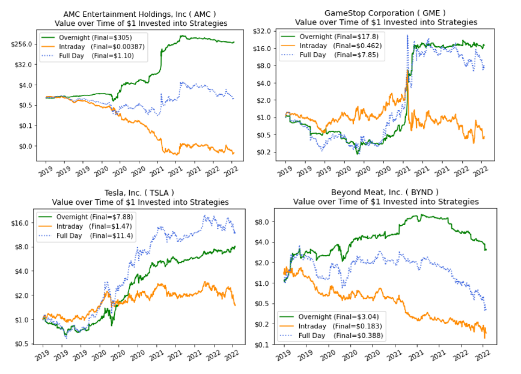

## Table of Contents

## What is intraday return?

Intraday return is the profit or loss you make from buying and selling a stock within the same trading day. It's calculated by taking the difference between the selling price and the buying price of the stock, then dividing that by the buying price. This gives you a percentage that shows how much you've gained or lost in that day.

Understanding intraday returns is important for day traders, who aim to make quick profits from short-term price movements. These returns can be influenced by many things, like news events, market trends, or even the overall mood of the market. Because intraday trading involves a lot of risk, it's crucial for traders to keep a close eye on their returns and adjust their strategies accordingly.

## How is intraday return calculated?

Intraday return is how much money you make or lose from buying and selling a stock in the same day. To find it, you take the price you sold the stock for and subtract the price you bought it for. Then, you divide that number by the price you bought it for. Finally, you multiply by 100 to get a percentage. This percentage tells you your intraday return.

For example, if you bought a stock for $50 and sold it for $55, you would subtract $50 from $55 to get $5. Then, you divide $5 by $50 to get 0.1. Multiply 0.1 by 100, and you find your intraday return is 10%. This means you made a 10% profit from trading that stock in one day.

## Why is intraday return important for traders?

Intraday return is really important for traders because it shows them how much money they are making or losing in a single day. Traders who buy and sell stocks within the same day, called day traders, need to know their intraday return to see if their trading strategies are working. If they see they are making good returns, they might keep doing what they're doing. But if they're losing money, they might need to change their approach.

Knowing the intraday return also helps traders manage their risks. The stock market can be unpredictable, and prices can go up and down a lot in one day. By keeping an eye on their intraday returns, traders can decide when to sell a stock to avoid bigger losses or when to buy more to make bigger gains. This helps them make quick decisions and adjust their trading plans to do better in the fast-paced world of [day trading](/wiki/day-trading-spy).

## What are the key factors that influence intraday returns?

Intraday returns can be affected by many things. One big [factor](/wiki/factor-investing) is news and events. If there's big news about a company or the economy, it can make stock prices go up or down quickly. For example, if a company announces good earnings, its stock price might go up, which could lead to a good intraday return for traders who bought the stock before the news came out. On the other hand, bad news like a company losing a big lawsuit can make the stock price drop, leading to a loss for traders.

Another factor is market trends. If the overall market is going up, it's more likely that individual stocks will also go up, which can help traders make money. But if the market is going down, it can be harder to make a profit. Traders need to watch these trends and decide if they should buy or sell based on what the market is doing. Sometimes, even the mood of the market, like if people are feeling hopeful or worried, can affect intraday returns.

Lastly, trading [volume](/wiki/volume-trading-strategy) and [liquidity](/wiki/liquidity-risk-premium) also play a role. If a stock is traded a lot and is easy to buy and sell, it's easier for traders to get in and out of their positions quickly. This can help them take advantage of small price changes and make a profit. But if a stock doesn't trade much, it can be harder to sell it at a good price, which might lead to lower intraday returns or even losses.

## Can you explain the difference between intraday return and daily return?

Intraday return is the profit or loss you make from buying and selling a stock within the same trading day. It shows how much money you made or lost just in that one day of trading. For example, if you bought a stock at 10 AM and sold it at 3 PM on the same day, the difference between the selling price and the buying price, expressed as a percentage, is your intraday return. This is important for day traders who want to make quick profits from short-term price movements.

Daily return, on the other hand, is the change in the value of a stock from the close of one trading day to the close of the next trading day. It includes any gains or losses that happened overnight or after the market closed. For example, if you bought a stock at the end of one day and sold it at the end of the next day, the percentage change in the stock's price over those two days is your daily return. This is more relevant for investors who hold onto their stocks for longer periods and are less concerned with intraday fluctuations.

## How does market volatility affect intraday returns?

Market [volatility](/wiki/volatility-trading-strategies) can really shake up intraday returns. When the market is volatile, stock prices can swing a lot in a single day. This means that traders might see bigger gains if they buy at the right time and sell when the price goes up. But it's also riskier because prices can drop just as quickly. If a trader is not careful, they could end up losing money if they buy at a peak and the price falls before they can sell.

Because of this, traders need to be on their toes when the market is volatile. They have to watch the market closely and be ready to make quick decisions. Sometimes, high volatility can lead to good intraday returns if traders can catch the right moments to trade. But it's not easy, and it can be stressful because the market can change direction without much warning. So, while volatility can offer chances to make money, it also increases the chances of losing money if things don't go as planned.

## What are some common strategies used to maximize intraday returns?

One common strategy to maximize intraday returns is called [scalping](/wiki/gamma-scalping). Scalpers make lots of small trades throughout the day, trying to catch tiny price changes. They might buy a stock and sell it just a few minutes later if the price goes up a little bit. This strategy works best in a busy market where there's a lot of trading going on. Scalpers need to be quick and pay close attention to the market all the time.

Another strategy is called [momentum](/wiki/momentum) trading. Momentum traders look for stocks that are already moving in a certain direction and try to ride that wave. If a stock's price is going up fast, they might buy it and hope to sell it at an even higher price later in the day. This strategy can be risky because if the trend changes, they could lose money. But if they get it right, they can make good intraday returns.

A third strategy is using technical analysis. Traders who use this method look at charts and patterns to guess where a stock's price might go next. They might use things like moving averages or support and resistance levels to decide when to buy or sell. This can help them make better decisions and hopefully get higher intraday returns. But it's not always easy to predict the market, so they need to be careful and keep learning.

## How do high-frequency trading algorithms impact intraday returns?

High-frequency trading ([HFT](/wiki/high-frequency-trading-strategies)) algorithms can have a big impact on intraday returns. These algorithms are designed to buy and sell stocks very quickly, often in fractions of a second. They use powerful computers to look for small price differences and trade on them before other traders can react. This can make the market move faster and prices change more often during the day. For day traders, this means they might see more chances to make money, but it also makes the market more unpredictable and harder to predict.

Because HFT algorithms can trade so fast, they can affect the prices of stocks in ways that regular traders can't. If a lot of these algorithms are trading at the same time, they can cause big swings in stock prices. This can lead to higher intraday returns if traders can catch the right moments to buy and sell. But it also increases the risk because the market can change direction very quickly. So, while HFT can create opportunities for big gains, it also makes trading more challenging and risky for those trying to maximize their intraday returns.

## What role do economic announcements play in intraday return fluctuations?

Economic announcements can really shake up intraday returns. When news about the economy comes out, like jobs reports or [interest rate](/wiki/interest-rate-trading-strategies) changes, it can make stock prices move a lot in a single day. Traders watch these announcements closely because they can change how people feel about the market. If the news is good, like more people getting jobs, stock prices might go up fast, giving traders a chance to make money. But if the news is bad, like higher unemployment, prices might drop, and traders could lose money if they're not careful.

Because these announcements can make the market move so much, traders need to be ready to act quickly. They might buy or sell stocks right after the news comes out to try to make a profit from the price changes. But it's not easy because everyone is trying to do the same thing at the same time. This can make the market even more unpredictable. So, while economic announcements can offer big chances for intraday returns, they also add a lot of risk and require traders to be very alert and fast.

## How can one use technical analysis to predict intraday returns?

Technical analysis can help traders guess what might happen to stock prices during the day. They look at charts and patterns to see how the stock has been moving. For example, they might use something called a moving average, which is a line on the chart that shows the average price of the stock over a certain time. If the stock price goes above this line, it might mean the price will keep going up, so traders might buy the stock hoping to sell it later for a profit. They also look at support and resistance levels, which are prices where the stock often stops going down or up. If the price hits a support level and bounces back up, traders might think it's a good time to buy.

Another way traders use technical analysis is by looking at patterns like head and shoulders or double tops and bottoms. These patterns can show if the stock might change direction soon. For example, if a trader sees a head and shoulders pattern, it might mean the stock price will go down, so they might sell the stock before it drops. But technical analysis isn't perfect. It's just a tool to help traders make better guesses. They need to keep learning and watching the market closely because things can change quickly, and what worked before might not work the next time.

## What are the risks associated with focusing on intraday returns?

Focusing on intraday returns can be risky because the stock market can change a lot in just one day. When you try to make money by buying and selling stocks quickly, you might make a profit, but you could also lose money if the stock price goes down instead of up. This kind of trading can be stressful because you have to watch the market all the time and make fast decisions. If you're not careful or if you make a mistake, you could end up losing more money than you planned.

Another risk is that intraday trading can be influenced by things you can't control, like sudden news or market trends. If there's bad news about a company or the economy, the stock price might drop fast, and you might not have time to sell before you lose money. Also, because intraday trading often involves a lot of buying and selling, you might have to pay more in fees and taxes, which can eat into your profits. So, while intraday trading can be exciting and offer chances to make money, it's important to understand these risks and be ready for them.

## How do regulatory changes impact the mechanisms of intraday returns?

Regulatory changes can really change how intraday returns work. When the rules about trading change, it can affect how easy or hard it is to buy and sell stocks quickly. For example, if new rules make it harder to use high-frequency trading algorithms, traders might not be able to make as many quick trades. This could mean fewer chances to make money from small price changes during the day. Also, if there are new rules about how much traders can borrow to buy stocks, it might limit how much they can trade, which can affect their intraday returns.

These changes can also make the market more or less predictable. If new rules make the market more stable, it might be easier for traders to guess where stock prices are going and make better decisions. But if the rules make the market more unpredictable, it can be harder to make money from intraday trading. Traders need to keep up with these changes and adjust their strategies to stay successful.

## References & Further Reading

[1]: Bergstra, J., Bardenet, R., Bengio, Y., & Kégl, B. (2011). ["Algorithms for Hyper-Parameter Optimization."](https://papers.nips.cc/paper/4443-algorithms-for-hyper-parameter-optimization) Advances in Neural Information Processing Systems 24.

[2]: ["Advances in Financial Machine Learning"](https://www.amazon.com/Advances-Financial-Machine-Learning-Marcos/dp/1119482089) by Marcos Lopez de Prado

[3]: ["Evidence-Based Technical Analysis: Applying the Scientific Method and Statistical Inference to Trading Signals"](https://www.amazon.com/Evidence-Based-Technical-Analysis-Scientific-Statistical/dp/0470008741) by David Aronson

[4]: ["Machine Learning for Algorithmic Trading"](https://github.com/stefan-jansen/machine-learning-for-trading) by Stefan Jansen

[5]: ["Quantitative Trading: How to Build Your Own Algorithmic Trading Business"](https://www.amazon.com/Quantitative-Trading-Build-Algorithmic-Business/dp/1119800064) by Ernest P. Chan