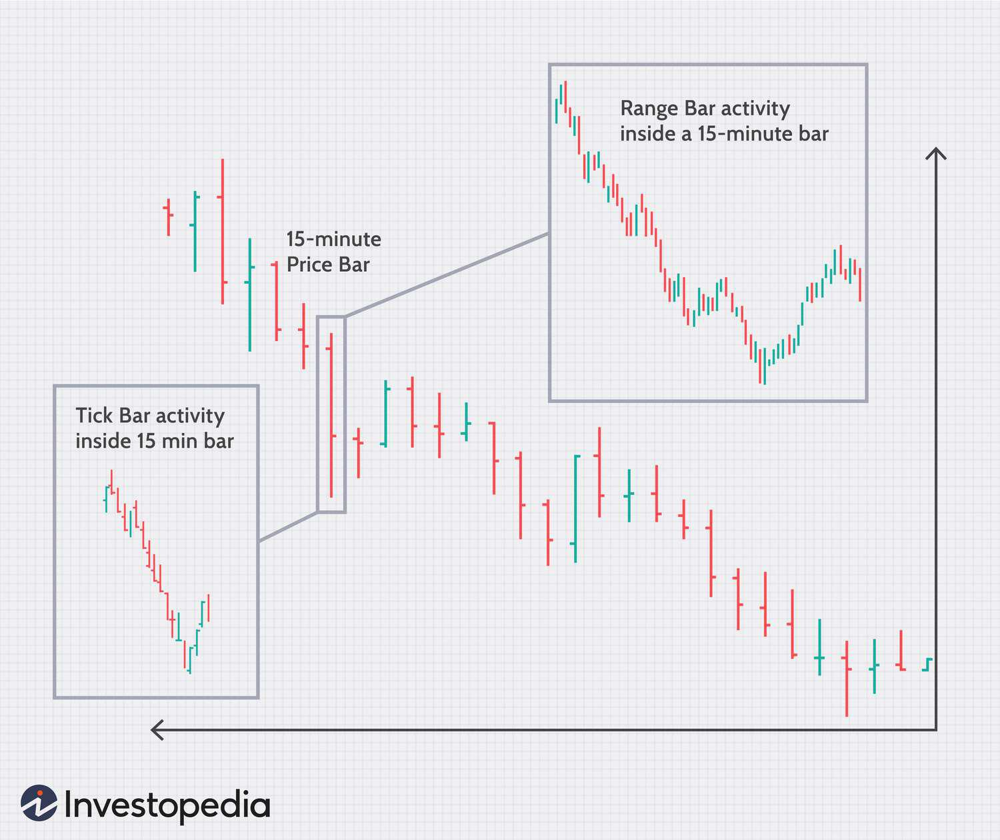

Day trading refers to the practice of purchasing and selling financial securities within a single trading day. Unlike long-term investing, where assets are typically held for months or years, day traders aim to capitalize on small price movements that occur within a short timeframe. This method demands constant attention and quick decision-making to exploit market volatility. Intraday trading is akin to day trading, focusing on the execution and completion of trades within the same day, but it places a stronger emphasis on tracking and analyzing real-time market data to inform swift trading actions. Both practices are vital in the stock market as they contribute to liquidity and efficient price discovery, thus facilitating smoother functioning of markets.

As modern technology infiltrates financial markets, algorithmic trading, often termed algo trading, has become increasingly influential. Algorithmic trading utilizes computer programs to execute a large batch of orders at speeds impossible for a human trader. These algorithms can be designed to identify favorable market patterns, optimize trading strategy performance, and reduce the impact of market inefficiencies. The growing influence of algorithmic trading offers traders improved accuracy, efficiency, and the ability to handle complex trading strategies effortlessly.



Strategies in day and intraday trading are critical for success. They serve as frameworks within which traders operate, providing clear guidelines for entry, exit, and risk management. Effective strategies help traders manage emotions and avoid impulsive decisions, thereby enhancing profitability over time. This article aims to explore various effective strategies for stock market trading, particularly focusing on how algorithmic trading can enhance the efficacy of these strategies.

The intended audience for this article includes both new and experienced investors. Novice traders will find foundational insights into the mechanics and strategies of trading, while experienced investors can benefit from advanced discussions on the integration of algorithmic trading into their existing practices. By elucidating the components of successful trading strategies and the role of technology, the article aims to equip traders with the knowledge needed to navigate the complexities of the stock market confidently.

## Table of Contents

## Understanding Day Trading and Intraday Trading

Day trading involves buying and selling financial instruments such as stocks, bonds, or derivatives within the same trading day, ensuring all positions are closed by the end of the day. This approach contrasts sharply with long-term investing, where securities are held for months or even years to capitalize on gradual growth. Long-term investors typically focus on fundamentals like company performance and economic indicators, aiming for slow and steady wealth accumulation. In contrast, day traders seek to exploit short-term market fluctuations to achieve quick profits.

Intraday trading, a subset of day trading, specifically focuses on trading strategies executed and closed within a single trading day. The practice involves taking advantage of small price movements, which can be caused by minute-to-minute market dynamics. This requires traders to frequently buy and sell securities throughout the day, aiming to benefit from even fractional price differences.

The primary motivator for day traders is quick profit-taking. They typically engage in numerous trades within a specific timeframe to accumulate gains from minute price changes. Day traders prioritize high [liquidity](/wiki/liquidity-risk-premium) stocks to ensure quick entry and [exit](/wiki/exit-strategy) from positions. This fast-paced trading style demands decisive action and can result in substantial profits. However, it also carries significant risk, as markets can swiftly move against open positions.

Successful day traders employ a variety of tools and resources to make informed decisions. These include real-time data feeds, advanced charting software, and technical indicators such as moving averages or oscillators. Many day traders also utilize platforms that offer automated trading features and fast execution speeds to optimize their strategies.

Day trading and intraday trading inherently involve considerable risks and challenges. Market [volatility](/wiki/volatility-trading-strategies) can lead to rapid and unpredictable price movements, potentially causing losses. Additionally, the [high frequency](/wiki/high-frequency-trading) of trades can result in elevated transaction costs, further impacting profitability. The requirement to make quick decisions in a constantly changing environment can lead to errors and emotional trading, two factors detrimental to [day trading](/wiki/day-trading-spy) success. Moreover, high leverage often used in day trading can amplify both gains and losses, further increasing risk. To mitigate these challenges, a robust trading plan and disciplined execution are essential.

## Key Stock Market Strategies for Day Traders

Day trading requires the implementation of several strategies, each designed to exploit specific market conditions and stock behaviors. This section highlights key strategies that day traders employ to capitalize on short-term price movements and market volatility.

### Momentum Trading

Momentum trading involves identifying stocks that are moving significantly in one direction with high [volume](/wiki/volume-trading-strategy) and entering trades in the direction of the [momentum](/wiki/momentum). The premise of momentum trading is that stocks showing strong price trends will continue to move in the same direction for some time. Traders capitalize on this momentum by buying stocks that are going up or selling short stocks that are going down. A crucial aspect of momentum trading is the use of indicators such as the Relative Strength Index (RSI) and Moving Average Convergence Divergence (MACD) to assess the strength of a trend.

### Scalping

Scalping is a strategy that aims to profit from small price changes over short time frames. Scalpers open and close positions within minutes or even seconds to accumulate small gains that, over numerous trades, lead to substantial profits. This strategy requires precise timing and is heavily reliant on real-time data and advanced trading platforms to execute trades rapidly. Scalping necessitates a disciplined approach to avoid the enticement of holding positions longer than planned, which can negate small gains.

### Range Trading

Range trading involves identifying stocks trading within a stable range, defined by consistent support (bottom price level) and resistance (top price level) levels. Traders employ this strategy by buying at the support level and selling at the resistance level, anticipating that the stock price will oscillate within these bounds. This method can be effective in markets that are not trending in any particular direction, allowing traders to exploit predictable price shifts.

### Breakout Strategy

Breakout trading focuses on stocks that are poised to break out of established support or resistance levels. When a stock price moves above its resistance level or below its support level, significant price action often follows due to an influx of market participants entering new positions. Traders can capture substantial profits by entering trades at the point of the [breakout](/wiki/breakout-trading). Technical indicators such as Bollinger Bands and volume can assist traders in identifying potential breakouts.

### Additional Strategies

Beyond these primary strategies, day traders might also use reversal trading, where the aim is to identify points where a stock will change direction and reverse its trend. Effective reversal trading requires identifying exhaustion in the current trend often signaled by candlestick patterns or divergence in technical indicators.

News-based trading is another strategy where traders capitalize on the volatility and directional moves instigated by news releases, economic reports, or company announcements. Rapid response to news events can yield significant opportunities for profit, necessitating traders to stay highly informed and responsive.

In summary, successful day trading requires a deep understanding of various strategies and the flexibility to apply the appropriate method according to the current market conditions. Each strategy offers unique opportunities and risks, and traders often employ a combination of these strategies to optimize their potential for success.

## The Role of Algo Trading in Day Trading Strategies

Algorithmic trading, commonly referred to as algo trading, involves the use of computer algorithms to automate trading decisions in the stock market. These algorithms, which are sets of predefined instructions or rules, can execute trades at speeds and frequencies that a human trader cannot match. The basic functioning of algo trading encompasses inputting specific criteria such as timing, price, quantity, or any mathematical model into the algorithm, which then makes data-driven decisions to buy or sell securities at optimal times.

Algo trading enhances decision-making and execution speed by relying on computational power to process vast amounts of market data quickly. This capability allows algorithms to identify trading opportunities and execute trades in fractions of a second. Rapid execution reduces the likelihood of price slippage and enables traders to capitalize on short-lived market inefficiencies.

One of the primary benefits of using [algorithmic trading](/wiki/algorithmic-trading) is the reduction of human error and the minimization of emotion-driven decisions. By removing human emotions such as fear and greed from the trading equation, algorithms ensure that trading strategies are executed systematically and consistently. 

Examples of algorithmic strategies used by day traders include statistical [arbitrage](/wiki/arbitrage) and [trend following](/wiki/trend-following). Statistical arbitrage exploits pricing inefficiencies between related securities by using statistical and econometric techniques to forecast market behavior. For instance, if two stocks historically move together and suddenly diverge, an algorithm might detect the anomaly and simultaneously execute a long position on the undervalued stock and a short position on the overvalued stock. Trend following strategies, on the other hand, seek to capitalize on momentum by identifying and following the direction of trends over a specific period. This could involve simple moving averages or more complex indicators like the Moving Average Convergence Divergence (MACD).

Implementing algo trading requires a solid technological setup and sophisticated skills. A robust trading platform with direct market access is crucial for deploying algorithms effectively. Additionally, traders need proficiency in programming languages such as Python or C++, which are commonly used to develop trading algorithms. Developing and testing algorithms necessitates strong analytical skills and an understanding of market structures and financial data. The ability to backtest strategies on historical data is essential to ensure their viability and potential profitability before live deployment in the stock market.

Algorithmic trading is a complex yet powerful approach to enhancing day trading strategies, providing significant advantages in speed, precision, and consistency. As technology continues to evolve, the role of algorithmic trading in financial markets is expected to grow, fostering greater efficiency and innovation.

## Developing a Robust Trading Plan

A well-defined trading plan is crucial for achieving consistent success in day trading and intraday trading. A structured plan provides the framework needed to navigate the complexities of the stock market, manage risk effectively, and make informed decisions.

### Goal Setting and Risk Management

The first step in developing a personal trading plan is setting clear, achievable goals. These goals might include target profit levels, acceptable risk thresholds, and specific trading hours. Goals should be Specific, Measurable, Achievable, Relevant, and Time-bound (SMART).

Risk management is equally essential. Traders need to determine how much capital they are willing to risk on a single trade while considering the overall risk for their portfolio. A commonly used method in risk management is the 1% rule, which suggests that no more than 1% of the total account balance should be risked on any single trade. This can be calculated as follows:

$$
\text{Risk per trade} = \text{Account Balance} \times 0.01
$$

### Backtesting Strategies

Backtesting involves testing a trading strategy using historical data to evaluate its viability. This process helps traders understand how a strategy might perform under different market conditions and identify any potential weaknesses. Programs such as Python can be used for [backtesting](/wiki/backtesting) with libraries like `pandas` and `numpy` to manipulate and analyze historical data. Here is a simple Python snippet illustrating how one might begin backtesting a strategy:

```python
import pandas as pd

# Load historical data
data = pd.read_csv('historical_data.csv')

# Implement the strategy
data['Signal'] = 0
data.loc[data['Close'] > data['Close'].shift(1), 'Signal'] = 1
data.loc[data['Close'] < data['Close'].shift(1), 'Signal'] = -1

# Calculate returns
data['Returns'] = data['Signal'].shift(1) * (data['Close'].pct_change())

# Calculate cumulative returns
cumulative_returns = (1 + data['Returns']).cumprod()
```

### Continuous Monitoring and Adaptation

A trading plan is not static; it requires regular monitoring and adaptation to respond to market changes. Traders should periodically review their strategies to ensure they remain effective, using performance metrics and market analysis to guide any necessary adjustments. This adaptive approach helps traders stay resilient in changing market environments.

### Discipline and Emotional Control

Executing a trading plan with discipline and emotional control is arguably one of the most challenging aspects of day trading. Emotional reactions, such as fear or greed, can lead to impulsive decisions that deviate from the established plan. Traders must remain committed to their strategies, adhering strictly to their risk management rules and trade setups to maintain consistency and reduce errors. Techniques such as maintaining a trading journal and employing mindfulness practices can help traders stay focused and disciplined.

By incorporating these elements into a robust trading plan, traders can better navigate the volatile environment of day trading and increase their chances of long-term success.

## Tools and Resources for Day and Algo Trading

Essential trading platforms and software play a critical role in the execution of day trading and algorithmic trading activities. Key platforms include MetaTrader, Thinkorswim, and [Interactive Brokers](/wiki/interactive-brokers-api), among others, which provide comprehensive tools for market analysis, order execution, and portfolio management. These platforms often offer advanced charting capabilities, customizable indicators, and the ability to automate trading strategies through algorithms or scripts. For instance, MetaTrader supports algorithmic trading via its MetaQuotes Language (MQL), allowing traders to develop custom trading robots and scripts.

Data resources and APIs are vital for market analysis and the development of trading algorithms. Providers such as Bloomberg, Thomson Reuters, and Quandl offer extensive market data feeds covering equities, derivatives, foreign exchange, and more. These datasets are essential for traders looking to backtest strategies or perform quantitative analysis. APIs, such as Alpha Vantage and IEX Cloud, facilitate access to real-time and historical market data, enabling the integration of this information into custom trading software or platforms.

Educational resources and communities significantly aid traders in learning and enhancing their strategies. Websites like Investopedia and platforms such as Coursera and Udemy offer courses and tutorials on financial markets, trading strategies, and algorithm development. Online forums and communities, including those on Reddit and StockTwits, allow traders to share insights, strategies, and experiences, helping both novice and experienced traders improve their skills and knowledge.

Financial advisors and professional networks also play a crucial role in supporting day and algo traders. Advisors can offer personalized guidance on portfolio management and risk assessment, while professional networks, such as LinkedIn and trading-focused groups, can connect traders with industry experts, mentors, and potential collaborators. These connections help traders stay informed about new strategies, technologies, and market developments.

Staying updated with market trends and technological advancements is essential for success in day and algorithmic trading. Traders should follow financial news outlets like CNBC or Bloomberg News for timely information on market movements and economic events. Subscribing to industry journals and attending webinars and conferences can also provide valuable insights into emerging trends and innovative trading technologies.

In summary, effectively utilizing a combination of robust trading platforms, comprehensive data resources, educational tools, and professional networks can significantly enhance the effectiveness of day and algorithmic trading strategies. By staying informed and continuously engaging with new information and technologies, traders can maintain a competitive edge in the ever-evolving financial markets.

## Risks and Challenges in Day and Algo Trading

Day trading and algorithmic trading, while offering substantial profit opportunities, come with inherent risks and challenges that traders must diligently manage. Understanding these risks is crucial for anyone involved in these trading activities.

### Common Risks in Day Trading and Algo Trading

Day trading and algorithmic trading are subject to a variety of risks, including market volatility, which can lead to significant price swings within short periods. This volatility can result in substantial gains or losses, often magnified by the use of leverage. Additionally, unexpected financial events such as geopolitical developments or economic news can trigger abrupt market reactions, making it crucial for traders to monitor global events closely.

### Technical Failures and Algorithm Flaws

Both day traders and algorithmic traders are reliant on technology. Technical failures, such as platform outages or connectivity issues, can impede trade execution, leading to missed opportunities or unintended losses. Algorithm flaws present another layer of risk. Algorithms must be rigorously tested and validated to ensure they perform as expected under various market conditions. An incorrectly coded algorithm could execute trades based on erroneous signals, potentially leading to severe financial losses.

### Regulatory Considerations and Compliance Issues

Algorithmic trading, in particular, is subject to stringent regulatory scrutiny. Traders must ensure compliance with market regulations, such as those enforced by the Securities and Exchange Commission (SEC) in the United States or the European Securities and Markets Authority (ESMA) in the European Union. Non-compliance can result in significant penalties, impacting both reputation and financial standing.

### Risk Mitigation and Capital Preservation Strategies

Effective risk management is essential to success in both day trading and algo trading. Traders should employ robust risk management strategies, such as setting stop-loss orders to limit potential losses. Diversification across different asset classes can also help mitigate risk. Regular backtesting of algorithms against historical data is imperative to ensure their robustness in various market conditions. Additionally, maintaining a reserve of capital and trading within one's financial limits can aid in capital preservation.

In conclusion, while day and algorithmic trading present opportunities for profit, they also involve significant risks that must be mitigated through careful planning, adherence to regulatory standards, and continuous risk management.

## Conclusion

In summarizing the key insights from the exploration of strategies and algorithmic trading in stock market trading, it is evident that a structured approach to day and intraday trading can yield significant advantages. The strategic application of techniques such as momentum trading, [scalping](/wiki/gamma-scalping), range trading, and breakout strategies can aid traders in capitalizing on market opportunities. The integration of algorithmic trading further amplifies these efforts by enhancing decision-making processes, increasing execution speed, and reducing susceptibility to human errors and emotional biases.

Appropriately strategized day trading and intraday trading offer the potential for substantial returns, ensuring traders can maximize their outcomes in a volatile market environment. The dynamic nature of these trading forms necessitates that traders persistently educate themselves and adapt their strategies to align with evolving market conditions. Continuous learning remains pivotal as it enables traders to refine their approaches and stay competitive.

Risk management is an indispensable element of successful trading. It is crucial for traders to manage expectations realistically and maintain a disciplined approach to risk mitigation. This involves setting clear goals, implementing robust risk management strategies, and ensuring disciplined adherence to one's trading plan.

For those engaged in trading, there exists a wealth of resources and supportive communities aimed at enhancing trading knowledge and strategy execution. Encouraging exploration and engagement with these resources can empower traders to optimize their approaches and potentially achieve better outcomes. By staying informed about market trends and leveraging technological tools, traders position themselves for ongoing success in their trading journey.

## References & Further Reading

[1]: Bergstra, J., Bardenet, R., Bengio, Y., & Kégl, B. (2011). ["Algorithms for Hyper-Parameter Optimization."](https://papers.nips.cc/paper/4443-algorithms-for-hyper-parameter-optimization) Advances in Neural Information Processing Systems 24.

[2]: ["Advances in Financial Machine Learning"](https://www.amazon.com/Advances-Financial-Machine-Learning-Marcos/dp/1119482089) by Marcos Lopez de Prado

[3]: ["Evidence-Based Technical Analysis: Applying the Scientific Method and Statistical Inference to Trading Signals"](https://www.amazon.com/Evidence-Based-Technical-Analysis-Scientific-Statistical/dp/0470008741) by David Aronson

[4]: ["Machine Learning for Algorithmic Trading"](https://github.com/stefan-jansen/machine-learning-for-trading) by Stefan Jansen

[5]: ["Quantitative Trading: How to Build Your Own Algorithmic Trading Business"](https://www.amazon.com/Quantitative-Trading-Build-Algorithmic-Business/dp/1119800064) by Ernest P. Chan