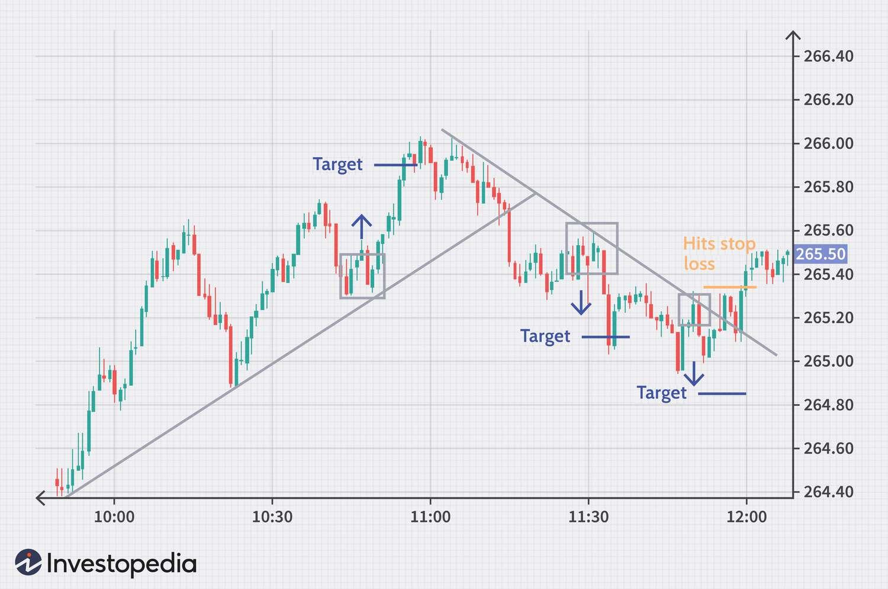

## Table of Contents

## What is intraday trading and how does it differ from other types of trading?

Intraday trading, also known as day trading, is when people buy and sell stocks or other financial products within the same day. They try to make money from small changes in the price of these items. Intraday traders usually do not keep their investments overnight because they want to avoid risks that can happen when the market is closed.

Intraday trading is different from other types of trading like swing trading and long-term investing. Swing trading involves holding onto stocks for a few days or weeks to take advantage of expected upward or downward movements in their prices. Long-term investing, on the other hand, means buying and holding stocks for months or years, focusing on the company's growth over time rather than short-term price changes. Intraday trading requires more attention and quick decisions compared to these other methods, which can be less stressful and time-consuming.

## What are the basic requirements to start intraday trading?

To start intraday trading, you need a few basic things. First, you need a trading account with a brokerage firm. This account lets you buy and sell stocks quickly during the day. You also need enough money in your account to trade. Most brokers have a minimum amount you need to start trading, so make sure you have that. A good computer or smartphone with a reliable internet connection is also important because you need to watch the market and make quick decisions.

Another important thing is to learn about the stock market. You should understand how stocks move and what can affect their prices. Many people use special software or apps to help them trade. These tools can show you charts and other information that can help you decide when to buy or sell. It's also a good idea to practice with a demo account before you start using real money. This way, you can get used to how trading works without risking your money.

## How can beginners identify the best times of the day to trade intraday?

Beginners can find the best times to trade intraday by looking at when the market is most active. Usually, the first hour after the market opens is very busy. This is because many people are buying and selling stocks at the start of the day. This time is good for trading because prices can change a lot, giving you chances to make money. Another good time is the last hour before the market closes. During this time, traders try to finish their trades for the day, which can also cause big price changes.

It's also helpful to watch the market during the middle of the day, but it's usually quieter. If there's big news or an important event, the market can get busy even during these times. Beginners should keep an eye on the news and economic reports because these can affect when the market is most active. By paying attention to these times and events, you can find the best moments to trade and increase your chances of making good trades.

## What are some common intraday trading strategies for beginners?

One common intraday trading strategy for beginners is called the "Breakout Strategy." This means you watch a stock's price and wait for it to move past a certain point, like a high or low it reached before. When the price breaks out of this range, you buy or sell the stock quickly, hoping to make money from the big move. It's important to set a stop-loss order, which is like a safety net that automatically sells your stock if the price goes down too much. This helps you not lose too much money if the trade doesn't go your way.

Another strategy beginners can try is the "Momentum Trading" strategy. This is when you look for stocks that are already moving up or down quickly. You jump in and trade in the same direction as the stock's movement, hoping to ride the wave and make money before the [momentum](/wiki/momentum) stops. Like with the [breakout](/wiki/breakout-trading) strategy, setting a stop-loss order is a good idea to protect your money. Both of these strategies need you to watch the market closely and act fast, but they can be good ways for beginners to start intraday trading.

## How can one manage risk effectively in intraday trading?

Managing risk in intraday trading is very important. One way to do this is by using stop-loss orders. A stop-loss order is like a safety net that automatically sells your stock if the price drops too much. This helps you limit how much money you can lose on a single trade. Another way to manage risk is by not putting all your money into one trade. It's better to spread your money across different trades so that if one trade goes bad, you won't lose everything.

Another important part of managing risk is to always have a plan. Before you start trading, decide how much money you are willing to risk and stick to that amount. Don't let emotions like fear or greed make you change your plan. It's also a good idea to keep learning about the market and improving your skills. The more you know, the better you can predict what might happen and make smarter trades. By following these simple steps, you can manage risk better and have a safer intraday trading experience.

## What technical analysis tools are essential for intraday trading?

For intraday trading, some important technical analysis tools are moving averages, which help you see the average price of a stock over a certain time. There are two types: simple moving averages (SMA) and exponential moving averages (EMA). SMAs give you a basic idea of the trend, while EMAs put more weight on recent prices, making them more sensitive to new changes. Another useful tool is the Relative Strength Index (RSI), which tells you if a stock is overbought or oversold. If the RSI is above 70, the stock might be overbought and could go down soon. If it's below 30, the stock might be oversold and could go up.

Another essential tool is the Bollinger Bands, which are lines drawn above and below the moving average of a stock's price. These bands help you see how much the price is moving around. When the price touches the upper band, it might be a good time to sell, and when it touches the lower band, it might be a good time to buy. Lastly, candlestick charts are very helpful because they show you the open, high, low, and close prices of a stock in one picture. By looking at these charts, you can spot patterns that can tell you when to buy or sell. Using these tools together can help you make better decisions when trading during the day.

## How do market trends and news impact intraday trading decisions?

Market trends and news can have a big effect on intraday trading. When there's important news, like a company announcing good or bad earnings, the stock price can change a lot in a short time. Traders need to watch the news closely because it can create chances to make money or cause big losses. For example, if a company says it did better than expected, its stock price might go up quickly. Traders who see this news fast can buy the stock and sell it later for a profit. On the other hand, bad news can make the stock price drop, and traders might sell their stocks to avoid losing money.

Trends in the market also matter a lot. If the market is going up, traders might want to buy stocks because they think prices will keep going up. If the market is going down, they might sell their stocks to avoid losing money. Trends can be affected by things like the economy, interest rates, or big events happening in the world. By watching these trends and understanding how they work, traders can make better decisions about when to buy or sell. Keeping an eye on both news and market trends helps intraday traders make smart moves and manage their risks better.

## What are advanced intraday trading strategies used by experienced traders?

Experienced traders often use a strategy called "Scalping" for intraday trading. Scalping means making lots of small trades throughout the day to make small profits from tiny price changes. These traders watch the market very closely and use tools like Level II quotes, which show them more details about what's happening with stock prices. They also use time and sales data to see how many stocks are being bought and sold. By doing this, they can quickly buy and sell stocks, making a little money each time. It's a fast-paced way of trading that needs a lot of focus and quick thinking.

Another advanced strategy is "Range Trading." This is when traders find stocks that move up and down within a certain price range during the day. They buy the stock when it's at the low end of the range and sell it when it's at the high end. To do this well, traders need to be good at spotting these ranges and knowing when the stock is likely to hit the top or bottom of the range. They use tools like Bollinger Bands and support and resistance levels to help them. Range trading can be less stressful than [scalping](/wiki/gamma-scalping) because it doesn't need as many quick decisions, but it still needs a good understanding of how the market works.

## How can traders use algorithmic trading in intraday strategies?

Algorithmic trading can help intraday traders by using computer programs to buy and sell stocks automatically. These programs follow a set of rules that traders create based on things like price changes, market trends, and other data. For example, a trader might set up an algorithm to buy a stock when its price goes above a certain level and sell it when it goes below another level. This can help traders make quick decisions without having to watch the market all the time. It's like having a robot that trades for you, following the plan you made.

Using algorithms can also help traders manage risk better. They can set up the program to use stop-loss orders, which automatically sell a stock if its price drops too much. This way, traders can limit their losses without having to watch the market every second. Algorithms can also trade many stocks at the same time, which can be hard for a person to do. By using these tools, experienced traders can make their intraday trading more efficient and possibly make more money.

## What psychological factors should traders consider during intraday trading?

One important psychological [factor](/wiki/factor-investing) in intraday trading is managing emotions. Trading can be stressful because prices can change quickly, and it's easy to feel scared or excited. These feelings can make traders do things they didn't plan, like selling a stock too soon because they're afraid of losing money, or holding onto a stock too long because they hope it will go up more. Good traders learn to control their emotions and stick to their trading plan, even when the market is moving fast.

Another factor is having the right mindset. Successful intraday traders need to be patient and disciplined. They understand that not every trade will make money, and they don't get upset about losses. Instead, they learn from their mistakes and keep improving their skills. Being confident but not overconfident is also important. Traders should trust their plans but also be ready to change them if the market does something unexpected. By keeping a clear head and staying focused, traders can make better decisions and do well in intraday trading.

## How can one evaluate the performance of their intraday trading strategies?

To evaluate the performance of intraday trading strategies, traders need to look at how much money they are making or losing. They should keep track of every trade they make, writing down the price they bought and sold at, and how much profit or loss they made. This helps them see if their strategy is working over time. They can also use a tool called a "profit and loss statement" to see their overall performance. By comparing their results to what they expected, traders can tell if their strategy is good or if they need to change it.

Another way to evaluate performance is by looking at how well they are managing risk. Traders should check if they are sticking to their stop-loss orders and not risking too much money on one trade. They can also see if they are making more money than they are losing, which is called having a positive risk-reward ratio. By reviewing these things regularly, traders can learn from their mistakes and make their strategies better. This helps them become more successful in intraday trading.

## What are the latest trends and technologies influencing intraday trading?

One of the latest trends in intraday trading is the use of [artificial intelligence](/wiki/ai-artificial-intelligence) (AI) and [machine learning](/wiki/machine-learning). These technologies help traders make better decisions by analyzing a lot of data very quickly. AI can look at past trading patterns and market trends to predict what might happen next. This can help traders buy and sell stocks at the right time. Many trading platforms now use AI to give traders suggestions and even make trades automatically. This makes intraday trading easier and can help traders make more money.

Another trend is the rise of mobile trading apps. These apps let traders buy and sell stocks from their phones, no matter where they are. This is really helpful for intraday trading because the market moves fast, and traders need to act quickly. The apps often have tools like real-time charts and news updates, which help traders make smart decisions. Also, more traders are using social trading platforms, where they can see what other successful traders are doing and copy their trades. This can be a good way for beginners to learn and improve their trading skills.

## References & Further Reading

[1]: Bergstra, J., Bardenet, R., Bengio, Y., & Kégl, B. (2011). ["Algorithms for Hyper-Parameter Optimization."](https://papers.nips.cc/paper/4443-algorithms-for-hyper-parameter-optimization) Advances in Neural Information Processing Systems 24.

[2]: ["Advances in Financial Machine Learning"](https://www.amazon.com/Advances-Financial-Machine-Learning-Marcos/dp/1119482089) by Marcos Lopez de Prado

[3]: ["Evidence-Based Technical Analysis: Applying the Scientific Method and Statistical Inference to Trading Signals"](https://www.amazon.com/Evidence-Based-Technical-Analysis-Scientific-Statistical/dp/0470008741) by David Aronson

[4]: ["Machine Learning for Algorithmic Trading"](https://github.com/PacktPublishing/Machine-Learning-for-Algorithmic-Trading-Second-Edition) by Stefan Jansen

[5]: ["Quantitative Trading: How to Build Your Own Algorithmic Trading Business"](https://books.google.com/books/about/Quantitative_Trading.html?id=j70yEAAAQBAJ) by Ernest P. Chan