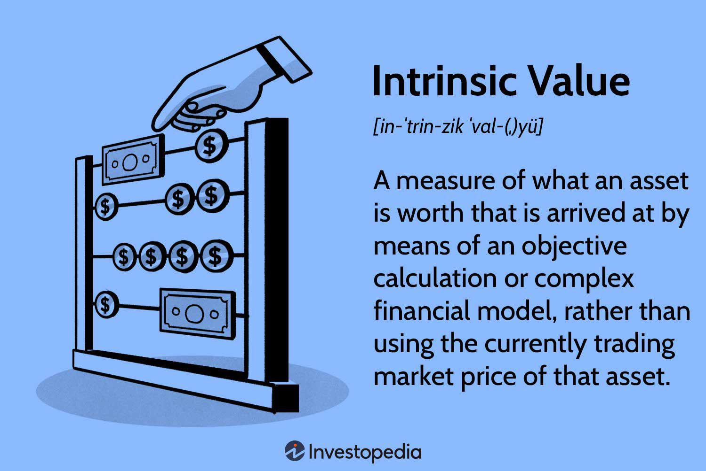

Understanding the intricacies of investing is vital for anyone looking to maximize their wealth. Within this complex landscape, business valuation, intrinsic value calculation, and algorithmic trading stand out as key elements that enable investors to make informed decisions. Business valuation is the process by which the economic value of a business or company is determined, offering insights into its potential profitability and market position. Intrinsic value, on the other hand, refers to the actual worth of an asset or company based on fundamental analysis, independent of its current market price. This concept aids investors in distinguishing between undervalued and overvalued assets, allowing for strategic investment decisions.

Algorithmic trading, an innovative facet of modern finance, involves using computer programs to execute trades based on pre-defined criteria, taking advantage of speed and precision unattainable by human traders. By integrating algorithmic trading with traditional valuation techniques, investors can enhance the precision and efficiency of their analyses and trading strategies. Algorithms can be programmed to monitor intrinsic value indicators and execute trades automatically when certain conditions are met, thus minimizing human error and emotional biases. For instance, a basic Python script could be used to evaluate moving averages, identify potential buy or sell signals, and automate trading orders based on those signals.



This article will explore how business valuation and intrinsic value assessments are integral to making informed investment decisions in today's dynamic trading environment. Moreover, it will discuss how the rise of algorithmic trading has revolutionized investment strategies by fostering more precise and efficient market participation. By understanding and harnessing these tools and techniques, investors can not only improve their decision-making abilities but also adapt to the fast-paced evolution of financial markets, elevating their potential for wealth maximization.

## Table of Contents

## Understanding Intrinsic Value

Intrinsic value is a fundamental concept in investment that refers to the perceived or calculated true worth of an asset, investment, or company, rather than its current market price. This analytical approach is crucial for investors who seek to evaluate whether an asset is undervalued or overvalued, thereby guiding their buy, hold, or sell decisions.

Investors use intrinsic value to uncover the real value of an asset, focusing on its inherent worth based on fundamentals rather than market fluctuations. One of the primary methodologies employed in intrinsic value calculations is the discounted cash flow (DCF) analysis. This approach involves estimating the future cash flows of an asset and discounting them back to their present value using a required rate of return or discount rate. The formula for DCF is:

$$
\text{Intrinsic Value} = \sum \frac{CF_t}{(1 + r)^t}
$$

Where:
- $CF_t$ = cash flow at time $t$
- $r$ = discount rate
- $t$ = time period

The DCF analysis is detailed and requires careful estimation of future cash flows, growth rates, and the selection of an appropriate discount rate, which reflects the risk profile of the investment. The thoroughness of this method aids investors in understanding the core value of an asset, independent of market noise.

Aside from DCF, other methodologies such as dividend discount models (DDM) for companies that pay dividends, and earnings valuation models like the price-to-earnings (P/E) ratio, can also be used. Each model caters to different types of investments and scenarios, allowing investors to tailor their analyses based on specific asset characteristics.

By focusing on the intrinsic value, investors can make informed and strategic decisions, often contrarian to market sentiment. For example, if the intrinsic value of a stock is greater than its current market price, it could be considered undervalued, presenting a potential investment opportunity. Conversely, if the intrinsic value is lower than the market price, the stock might be overvalued, suggesting selling might be prudent.

Mitigating the effects of market [volatility](/wiki/volatility-trading-strategies) is another significant advantage of intrinsic value calculation. While markets can be swayed by sentiment and speculative trading, intrinsic valuation grounds investors in the objective assessment of asset worth based on tangible metrics and future performance. Consequently, this approach helps investors to avoid reactionary decisions driven by short-term market dynamics.

In summary, understanding and applying intrinsic value assessments is pivotal for investors aiming to focus on the fundamental quality of their investment choices. Through methodologies like DCF, they can evaluate asset worth authentically, leading to more confident and potentially rewarding investment strategies.

## Valuation Techniques in Investment Analysis

Valuation techniques are critical tools in investment analysis, assisting investors in determining the intrinsic value of assets or businesses. Understanding these methods allows investors to make informed decisions by assessing the true worth of their investments relative to their market prices.

### Intrinsic Valuation

Intrinsic valuation, often achieved through the discounted cash flow (DCF) method, focuses on estimating the present value of future cash flows generated by an asset. This technique requires projecting future free cash flows and discounting them back to their present value using a discount rate that reflects the riskiness of those cash flows. The formula used in a simple DCF model can be expressed as:

$$

\text{Intrinsic Value} = \sum_{t=1}^{n} \frac{FCF_t}{(1 + r)^t}
$$

where $FCF_t$ is the free cash flow at time $t$, $r$ is the discount rate, and $n$ is the number of forecasted periods.

The principal advantage of intrinsic valuation is its focus on the fundamental drivers of value, largely independent of market conditions. However, its effectiveness is contingent upon accurate cash flow projections and appropriate discount rate selection, both of which introduce subjective judgment and potential forecasting errors.

### Relative Valuation

Relative valuation compares the asset in question with similar assets, typically using valuation multiples such as price-to-earnings (P/E) ratio, enterprise value-to-EBITDA (EV/EBITDA), or price-to-book (P/B) ratio. By examining the multiples of comparable companies within the industry, investors can ascertain whether an asset is valued appropriately relative to its peers.

The benefit of relative valuation is its simplicity and the ability to provide contextual insights within markets. However, it is limited by the assumption that the comparable assets are fairly valued and the difficulty in identifying truly comparable peers. Market sentiment and short-term anomalies can also skew relative valuations, making them less reliable during periods of high volatility.

### Market Valuation

Market valuation is based directly on market information and is typically used in public markets where frequent data updates occur. One approach is the market capitalization method, where the value of a firm equals its outstanding shares multiplied by the current share price.

$$

\text{Market Value} = \text{Share Price} \times \text{Total Shares Outstanding}
$$

This method is straightforward and reflects real-time trading information. However, market prices can fluctuate due to factors unrelated to an asset's fundamental value, such as market mood, speculation, or macroeconomic shifts, which can lead to mispricing.

### Multi-Method Approaches

Using a combination of these valuation techniques ensures a more comprehensive and balanced analysis. Each method provides a different perspective, allowing investors to cross-verify the results and mitigate the limitations inherent in any single approach. By synthesizing intrinsic, relative, and market evaluations, investors can attain a more robust framework for assessing asset worth, leading to more informed and strategic investment decisions.

In conclusion, mastering these valuation techniques provides investors with vital tools to evaluate and capitalize on investment opportunities, ensuring a well-rounded and strategic approach to investment analysis.

## Algorithmic Trading: Revolutionizing Investment Strategies

Algorithmic trading has fundamentally transformed investment strategies by automating trading decisions through predefined criteria, enhancing both the speed and efficiency of trade execution. At its core, [algorithmic trading](/wiki/algorithmic-trading) involves the use of advanced algorithms to analyze market data and make trading decisions independently, thereby reducing the influence of human emotions, which often lead to suboptimal investment choices. This automation allows for the execution of a large number of trades at high speeds, which is particularly beneficial in high-frequency trading ([HFT](/wiki/high-frequency-trading-strategies)) environments where rapid market fluctuations can be leveraged for profit.

High-frequency trading, a subset of algorithmic trading, employs sophisticated algorithms to make swift decisions and execute trades almost instantaneously. This speed provides significant advantages, such as capitalizing on minute price discrepancies that might exist only for fractions of a second. By eliminating emotional biases, algorithms ensure that trading decisions are made based on data-driven insights and statistical analyses, rather than on human psychology.

Despite its advantages, algorithmic trading is not without risks. The reliance on technology introduces potential challenges, such as system outages, latency issues, and technical failures that can lead to substantial financial losses. Furthermore, these systems require rigorous [backtesting](/wiki/backtesting) and constant monitoring to ensure that they perform correctly under changing market conditions. There are also ethical and regulatory considerations, as algorithmic trading can lead to market manipulation concerns, making compliance with financial regulations crucial.

Understanding the applications and limitations of algorithmic trading is essential for modern investors. Mastery of algorithmic trading concepts can significantly enhance trading strategies by allowing investors to exploit technology-driven market opportunities efficiently while ensuring robust risk management practices. Integrating these systems requires comprehensive knowledge of both the technological infrastructure and the market dynamics to achieve a competitive edge and ensure sustainable trading success.

## Integrating Intrinsic Value Valuation with Algorithmic Trading

The integration of intrinsic value valuation with algorithmic trading represents a notable advancement in investment strategies, providing investors with a significant competitive advantage. This synergy allows for the automation of decision-making processes by incorporating intrinsic value metrics into trading algorithms. Such integrations are particularly useful in executing trades with high precision and timing, thereby enhancing overall profitability.

Intrinsic value offers a comprehensive assessment of an asset’s true worth, often computed using methodologies like discounted cash flow (DCF) analysis. By embedding these valuations into algorithms, investors can create trading systems that trigger buy or sell orders when certain intrinsic value thresholds are met. This process is akin to coupling [fundamental analysis](/wiki/fundamental-analysis) with modern computing power to create an automated trading strategy.

For example, consider an algorithm that continuously calculates the intrinsic value of a stock based on forecasted cash flows and compares it with the current market price. When the market price falls below a predefined percentage of the calculated intrinsic value, a buy signal is generated. Conversely, if the market price exceeds the intrinsic value by a certain margin, a sell signal is emitted. Here’s a simplified Python implementation of such a logic:

```python
def calculate_intrinsic_value(future_cash_flows, discount_rate):
    return sum(cash_flow / (1 + discount_rate) ** year for year, cash_flow in enumerate(future_cash_flows, 1))

def trading_decision(market_price, intrinsic_value, buy_threshold, sell_threshold):
    if market_price < intrinsic_value * (1 - buy_threshold):
        return "Buy"
    elif market_price > intrinsic_value * (1 + sell_threshold):
        return "Sell"
    else:
        return "Hold"

# Example usage
future_cash_flows = [100, 110, 120]  # Example projected cash flows
discount_rate = 0.1  # Assumed discount rate
market_price = 95
buy_threshold = 0.1  # 10% below intrinsic value
sell_threshold = 0.15  # 15% above intrinsic value

intrinsic_value = calculate_intrinsic_value(future_cash_flows, discount_rate)
decision = trading_decision(market_price, intrinsic_value, buy_threshold, sell_threshold)
print(f"Intrinsic Value: {intrinsic_value}, Trading Decision: {decision}")
```

Successful real-world integrations highlight the value of aligning trading algorithms with intrinsic valuation methods. Hedge funds and institutional investors often utilize these systems to optimize their portfolios by ensuring trades are made at advantageous times, based on intrinsic value assessments. This process minimizes emotional biases and capitalizes on market inefficiencies, which are less observable through traditional trading methods.

Moreover, this synergy requires investors to have a clear understanding of both the fundamental aspects of intrinsic valuation and the technical nuances of algorithmic trading. Mastery in combining these fields ensures that strategies are not only comprehensive but also efficient in execution. As financial markets become increasingly complex, the ability to seamlessly integrate intrinsic valuation with algorithmic processes will remain essential for achieving sustainable investment success.

## Risks and Ethical Considerations

Intricate investment strategies such as intrinsic valuation and algorithmic trading are not devoid of risks and ethical considerations. Investors must understand these challenges to navigate the complex landscape effectively.

Market volatility poses significant risks to intrinsic value estimations. Intrinsic value relies heavily on predicting future cash flows and discount rates, as seen in techniques like discounted cash flow (DCF) analysis. However, unexpected market fluctuations can lead to inaccurate forecasts, affecting the reliability of intrinsic value assessments. To mitigate this, investors must incorporate a margin of safety in their calculations, acknowledging the potential for variable market conditions.

Algorithmic trading, while efficient, introduces its own set of technological and ethical challenges. The primary concerns include unintended consequences of algorithmic decisions, market manipulation, and technical failures. Algorithms executing large volumes of trades at high speeds can inadvertently cause market disruptions, as seen in events like the Flash Crash of 2010. This underscores the need for robust testing and monitoring systems to ensure algorithms perform as intended without destabilizing market conditions.

Investors must also be vigilant about potential market manipulation, a concern exacerbated by high-frequency trading. Algorithms designed to exploit subtle market inefficiencies may, if left unchecked, contribute to unfair trading practices and market imbalances. Regulatory frameworks, such as the U.S. Securities and Exchange Commission's (SEC) guidelines, aim to curtail such practices. Compliance with these regulations is essential for maintaining market integrity and investor trust.

Ethical trading practices and risk management strategies are crucial for responsible investing. Investors should prioritize transparency and fairness by adhering to established ethical standards and ensuring their trading activities align with regulatory requirements. This involves regular audits and updates of algorithms and valuation models to address evolving market scenarios and ethical norms.

Equipped with an understanding of these risks and ethical considerations, investors can engage in trading activities that prioritize responsibility and compliance with legal frameworks. This approach not only safeguards their capital but also contributes to the overall stability and fairness of financial markets.

## Conclusion

The investment landscape is constantly advancing as new valuation techniques and trading strategies emerge. Intrinsic value estimation allows investors to focus on an asset's fundamental worth, transcending market hype and short-term fluctuations. By accurately determining whether an asset is undervalued or overvalued, investors can make informed decisions and strategically allocate resources to optimize returns.

Simultaneously, algorithmic trading has revolutionized the execution of trading strategies by automating decision-making processes and executing trades with precision and speed beyond human capability. This automation helps investors eliminate emotional biases that often impede rational decision-making in financial markets. High-frequency trading, a byproduct of algorithmic strategies, showcases the ability to process large volumes of trades at lightning speed, allowing for the capitalization on minute market inefficiencies.

Despite these advancements, navigating the complexities and inherent risks of modern investment demands continuous learning and adaptability. Proactive investors who remain informed about technological innovations and evolving market dynamics can better position themselves in a competitive financial environment. Combining intrinsic valuation insights with algorithmic execution provides a dual advantage: identifying true asset value and executing trades optimally. 

This strategic combination promises not only profitability but also a comprehensive approach to investment strategy, ensuring that investors maximize their potential gains while mitigating associated risks. As the financial markets continue to change, embracing these advancements will be vital for successful and sustainable investment performance.

## References & Further Reading

- **Valuation: Measuring and Managing the Value of Companies by McKinsey & Company Inc.**: This book provides a comprehensive guide to valuation, delving into various methodologies and frameworks for measuring and managing the value of companies. It is a must-read for investors looking to deepen their understanding of corporate valuation. The text is structured to help professionals apply these concepts to real-world scenarios, emphasizing best practices and common pitfalls in the valuation process.

- **Algorithmic Trading: Winning Strategies and Their Rationale by Ernest P. Chan**: Ernest P. Chan's book is an essential resource for those interested in algorithmic trading. It covers strategies and their underlying logic, providing readers with insights into developing and implementing successful trading algorithms. Chan equips readers with the knowledge needed to create automated trading strategies, combining quantitative techniques with practical advice.

- **Security Analysis by Benjamin Graham and David Dodd**: A classic in the investment literature, this book introduces fundamental and intrinsic valuation principles. Graham and Dodd focus on in-depth financial statement analysis, which aids in understanding the intrinsic value of securities. It remains a foundational text for understanding security analysis and a key reference for value investors.

- **High-Frequency Trading: A Practical Guide by Irene Aldridge**: Irene Aldridge's book provides a practical guide to high-frequency trading (HFT), covering its methods, technologies, and risk management practices. The book is particularly useful for those exploring the intricacies of executing trades at high speeds, discussing the infrastructure and strategies that HFT firms employ in today's markets.

- **Trading and Exchanges: Market Microstructure for Practitioners by Larry Harris**: This comprehensive text examines the market microstructure, focusing on how trading occurs within financial markets. Larry Harris discusses the roles of different market participants, the formation of prices, and the implications of trading rules and regulations, making it a valuable resource for anyone interested in understanding the mechanics of trading execution.