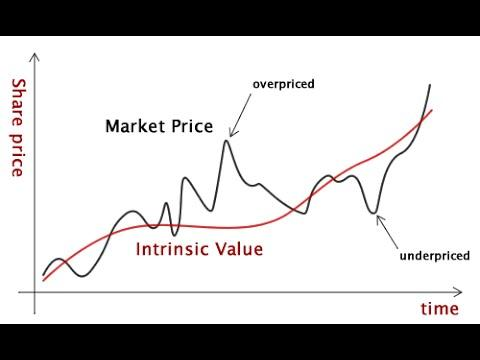

The landscape of investment analysis has transformed dramatically with the advent of advanced methodologies and sophisticated tools. Investment analysis now goes beyond mere intuition, employing systematic techniques that enhance decision-making processes. This article focuses on four key components central to contemporary finance: intrinsic value, market value, investment analysis, and algorithmic trading.

Intrinsic value is the perceived true worth of an asset, derived from fundamental analysis and independent of its current market price. This concept empowers investors to see beyond short-term market trends, allowing for decisions grounded in a comprehensive understanding of financial health and growth potential.



Market value, in contrast, is the price at which assets trade in the open market, influenced by investor sentiment and other external factors. These two values, while intrinsically related, often diverge, creating opportunities for strategic investments.

Investment analysis has evolved from traditional valuation approaches to embrace a wide array of methodologies driven by quantitative data. Modern investors rely on a mix of both historical data and projections to assess the viability and potential of an asset or portfolio.

Algorithmic trading represents a significant breakthrough in the way trades are executed. Utilizing algorithms allows for the automation of buying and selling decisions based on predefined criteria, often including elements of intrinsic value analysis. The use of algorithms not only increases the efficiency of trade executions but also minimizes human error and emotional biases.

The confluence of these elements underscores a significant shift in financial strategies, enabling investors to harness both tried-and-true methodologies and cutting-edge technology. By integrating intrinsic value assessments with algorithmic trading, investors can optimize their investment strategies to align with market dynamics and technological advancements. Mastery of these concepts is vital for investors seeking to make informed decisions and achieve success in the financial markets.

## Table of Contents

## Understanding Intrinsic Value

Intrinsic value is a fundamental concept in investment analysis, referring to the estimated true worth of an asset. Unlike market value, which reflects current trading prices heavily influenced by market conditions, intrinsic value provides a more stable foundation for valuation based on an asset's inherent characteristics. This fundamental worth is critical for investors seeking to make informed decisions that extend beyond short-term market fluctuations.

One of the core methodologies used to calculate intrinsic value is the discounted cash flow (DCF) analysis. This approach involves estimating the future cash flows an asset is expected to generate and discounting them to present value using an appropriate discount rate. The formula for DCF is:

$$

\text{Intrinsic Value} = \sum \frac{CF_t}{(1 + r)^t} 
$$

where $CF_t$ represents the cash flow in year $t$, and $r$ is the discount rate. This method relies on projecting accurate future cash flows and selecting a suitable discount rate reflecting the investment's risk.

Investors often employ intrinsic value to identify mispriced assets in the marketplace. If an asset's intrinsic value exceeds its market price, it may indicate a buying opportunity, suggesting the asset is undervalued. Conversely, if the intrinsic value is lower than the market price, it might suggest that the asset is overvalued or a potential candidate for sale.

Beyond quantitative measures such as cash flow projections and discount rates, intrinsic value assessments can also incorporate qualitative factors. These include evaluating the company's management quality, competitive advantages, market position, and growth prospects. While these factors are more subjective, they provide a holistic view of an asset's potential to generate long-term value.

Precise calculation of intrinsic value requires a comprehensive approach, combining both quantitative and qualitative analyses. This dual approach ensures that the valuation accounts for the myriad factors influencing an asset's ability to create shareholder value. Understanding these methodologies better equips investors to navigate the complexities of financial markets and make strategic investment decisions.

## Deciphering Market Value

Market value is the observable price at which an asset changes hands in the trading environment, a figure influenced largely by supply and demand dynamics. Unlike intrinsic value—considered a fundamental estimate of an asset's true worth based on inherent characteristics—market value fluctuates frequently and is subject to shifts in investor sentiment and market conditions. These fluctuations are often driven by short-term factors, thus making market value a less stable indicator compared to intrinsic value.

One of the primary determinants of market value is the economic context. Factors such as interest rates, inflation, and economic growth forecasts can heavily sway asset prices. For instance, a decrease in interest rates generally makes borrowing cheaper, potentially leading to increased investment in equities and thus higher market values. Conversely, rising inflation may erode purchasing power and cause a decline in investment attractiveness, affecting market prices negatively.

Investor sentiment also plays a critical role. This psychological aspect can lead to asset prices being driven more by collective beliefs or emotions than by financial fundamentals. For example, news events, geopolitical tensions, or corporate announcements may lead to significant shifts in market sentiment, causing rapid changes in market value. Behavioral finance theories suggest that herd behavior, where investors mimic the trades of others, can further accentuate these fluctuations.

Understanding market value is paramount for traders who engage in buying and selling based on these real-time price movements. Traders frequently exploit mispricings in the market, searching for [arbitrage](/wiki/arbitrage) opportunities between an asset's market value and what they believe its intrinsic value should be. This practice hinges on the notion that while market value is prone to [volatility](/wiki/volatility-trading-strategies) and may diverge from intrinsic value, over time, these values often converge as the market corrects itself.

The distinction between intrinsic and market value is pivotal for making informed trading decisions. Consider a situation where a stock's intrinsic value is evaluated at $50, yet its market value is currently trading at $40. Such a scenario indicates a potential buying opportunity, as the market may have undervalued the asset. Conversely, if the market value were $60, an investor might interpret this as overvaluation, possibly signalling a selling opportunity.

Analyzing these two distinct yet interconnected concepts not only helps in identifying investment opportunities but also aids in understanding market behaviors and trends. For further insight into how market value is derived and its implications on trading strategies, readers can explore resources such as 'Valuation: Measuring and Managing the Value of Companies' by McKinsey & Company Inc. and behavioral finance studies.

## Comparing Intrinsic Value and Market Value

A strategic approach to investment involves the analysis and comparison of intrinsic value with market value. This comparison offers valuable insights, particularly for value investors who aim to identify assets that are undervalued by the market. The strategy is rooted in the premise that intrinsic value, derived from [fundamental analysis](/wiki/fundamental-analysis), represents an asset's genuine worth, while market value reflects its current trading price, influenced by supply and demand dynamics, investor sentiment, and wider economic factors.

Value investing capitalizes on discrepancies between intrinsic and market values. When the market value of an asset is lower than its intrinsic value, it suggests that the asset is undervalued. This presents a buying opportunity, assuming that the market will eventually correct the perceived underpricing. Conversely, if the market value is higher than the intrinsic value, the asset may be overvalued, signaling a potential selling opportunity.

Investors use various tools and methodologies to identify and exploit these discrepancies. One common approach is the discounted cash flow (DCF) analysis, which involves estimating the present value of expected future cash flows. By comparing this estimation with the asset's current market price, investors can discern potential investment opportunities.

To illustrate how the alignment of market value and intrinsic value occurs over time, historical case studies provide useful context. A notable example is the technology sector during the late 1990s and early 2000s dot-com bubble. During this period, many technology stocks were trading at prices significantly higher than their intrinsic values due to speculative buying and excessive market optimism. As the bubble burst, market corrections brought the prices of these stocks closer to their intrinsic worth, aligning valuations with fundamental factors.

Another example can be seen in the financial crisis of 2008. Amidst the crisis, numerous financial assets were perceived as overvalued, resulting in dramatic price corrections. Those investors who had previously engaged in thorough intrinsic value assessments were better positioned to recognize and act on valuable buying opportunities during the recovery, as assets became undervalued according to intrinsic evaluations.

The process of exploiting discrepancies between intrinsic and market values requires not only robust analytical skills but also a sound understanding of market psychology and timing. This strategy underscores the importance of patience and discipline in investment decision-making, as markets can remain irrational longer than an investor can remain solvent.

In summary, comparing intrinsic value with market value is a cornerstone of strategic investment analysis, particularly in value investing. By identifying and acting on discrepancies between these values, investors can achieve substantial gains, although the approach necessitates a profound comprehension of financial analysis, patience, and the ability to act counter to prevailing market sentiments.

## Algorithmic Trading: Revolutionizing Investment Strategies

Algorithmic trading employs sophisticated computer algorithms to execute trades based on a set of predefined metrics. This strategic approach has revolutionized investment strategies by enabling traders to process vast amounts of data at speeds impossible for human traders. Algorithms can analyze market conditions, monitor price fluctuations, and execute trades in fractions of a second, significantly enhancing efficiency in financial markets.

A crucial advantage of [algorithmic trading](/wiki/algorithmic-trading) is its ability to integrate intrinsic value assessments, thereby improving trading strategy effectiveness. By embedding intrinsic valuation models within trading algorithms, traders can systematically identify and capitalize on discrepancies between market prices and an asset’s fundamental worth. This integration allows for precision in evaluating potential investment opportunities, providing a data-driven basis for trade execution.

High-frequency trading ([HFT](/wiki/high-frequency-trading-strategies)), a subset of algorithmic trading, has particularly transformed the investment landscape through its focus on achieving speed and precision. HFT systems execute thousands of trades per second, capitalizing on minute price differentials across different markets or financial instruments. The success of HFT depends on advanced technology infrastructure and sophisticated algorithms capable of managing high transaction volumes with minimal latency.

Functionality in algorithmic trading systems includes techniques like [statistical arbitrage](/wiki/statistical-arbitrage) and market-making. Statistical arbitrage strategies use mathematical models to identify price inefficiencies across related securities, executing a series of trades to exploit these temporary inconsistencies. Market-making algorithms, on the other hand, provide [liquidity](/wiki/liquidity-risk-premium) to markets by continually offering buy and sell quotes, generating profit on the bid-ask spread.

The advantages of algorithmic trading extend beyond speed and efficiency. It minimizes the emotional aspect of trading, which can often lead to impulsive decision-making. By adhering to a predefined set of rules, algorithms maintain consistency and discipline in trade execution, aligning with the strategic objectives set by investors. Furthermore, automated systems reduce transaction costs by optimizing trade timing and [volume](/wiki/volume-trading-strategy), enabling better execution prices and enhancing overall portfolio returns.

To illustrate, consider a simple Python script that simulates a moving average crossover strategy—a common algorithmic trading strategy. This strategy involves buying when a short-term moving average crosses above a long-term moving average and selling when the opposite occurs:

```python
import numpy as np
import pandas as pd

# Sample price data
price_data = pd.DataFrame({'Price': [100, 102, 104, 103, 105, 107, 108, 109, 107, 105]})

# Calculate moving averages
price_data['Short_MA'] = price_data['Price'].rolling(window=3, min_periods=1).mean()
price_data['Long_MA'] = price_data['Price'].rolling(window=5, min_periods=1).mean()

# Generate trading signals
def generate_signals(data):
    data['Signal'] = 0
    data['Signal'][data['Short_MA'] > data['Long_MA']] = 1
    data['Signal'][data['Short_MA'] < data['Long_MA']] = -1
    return data

signals = generate_signals(price_data)
print(signals[['Price', 'Short_MA', 'Long_MA', 'Signal']])
```

The script calculates short-term and long-term moving averages on a sample dataset and generates buy/sell signals based on their crossover. While this is a simplified example, it underscores how algorithmic trading can automate complex decision-making processes that incorporate various quantitative metrics.

Algorithmic trading continues to evolve, with emerging technologies like [machine learning](/wiki/machine-learning) and [artificial intelligence](/wiki/ai-artificial-intelligence) further augmenting its capabilities. These innovations hold the potential to enhance predictive accuracy and adaptiveness of trading strategies, representing the ongoing transformation in modern finance.

## Integrating Intrinsic Value Valuation with Algorithmic Trading

Combining intrinsic valuation methodologies with algorithmic trading forms a powerful decision-making framework that enhances investment efficiency and accuracy. By automating the identification of value discrepancies between intrinsic estimates and market prices, traders can execute precise and timely transactions. This synergy leverages advanced computational tools to analyze large volumes of financial data, identifying opportunities for arbitrage based on intrinsic value assessments.

Python, a popular programming language for financial modeling, facilitates the integration of intrinsic value analysis with algorithmic trading. For instance, automated trading algorithms can incorporate Discounted Cash Flow (DCF) models to estimate the intrinsic value of stocks. Below is a simplified example of how one might implement such a strategy in Python:

```python
import numpy as np
import pandas as pd

def calculate_intrinsic_value(cash_flows, discount_rate):
    """
    Calculate intrinsic value using discounted cash flow (DCF) analysis.

    Parameters:
    cash_flows: list, projected future cash flows.
    discount_rate: float, discount rate for DCF.

    Returns:
    float: intrinsic value of the asset.
    """
    intrinsic_value = np.sum([cf / (1 + discount_rate)**i for i, cf in enumerate(cash_flows)])
    return intrinsic_value

# Example of using the DCF model
future_cash_flows = [10000, 10500, 11000, 12000]  # hypothetical cash flows
discount_rate = 0.08  # 8% discount rate
intrinsic_value = calculate_intrinsic_value(future_cash_flows, discount_rate)

print(f"The estimated intrinsic value is: ${intrinsic_value:,.2f}")
```

Incorporating such calculations, algorithms can automatically compare the intrinsic value with real-time market prices, identifying undervalued or overvalued securities. This automation necessitates sophisticated models capable of processing dynamic market data, which often involves machine learning techniques or advanced statistical models.

Handling dynamic market conditions requires adaptive algorithms that can recalibrate their parameters in response to volatile market environments. This adaptability may involve updating assumptions in intrinsic value models as new data becomes available, or dynamically adjusting trading rules based on the speed and [momentum](/wiki/momentum) of market movements.

The integration of intrinsic value calculations with algorithmic trading also involves addressing risks and challenges. Key concerns include the robustness of the valuation models, which must be continuously tested and refined to reflect changes in economic and financial conditions. Additionally, ensuring the reliability of data inputs and maintaining the security of algorithmic trading systems are critical to minimizing systemic errors and avoiding market manipulation.

Given these complexities, investors must consistently monitor and update their valuation models. They must also evaluate the algorithms' performance to ensure alignment with investment objectives and compliance with regulatory standards. Overall, integrating intrinsic value with algorithmic trading offers significant advantages, enabling investors to capitalize on market inefficiencies with precision and speed.

## Risks and Ethical Considerations

Investment strategies today are a fusion of both intrinsic valuation and algorithmic trading techniques. However, these approaches are not devoid of risks and ethical considerations that necessitate careful management. 

Firstly, intrinsic valuation, which relies on estimating an asset's true worth, can be afflicted by market volatility. This unpredictability can lead to significant discrepancies between calculated intrinsic values and actual market prices, potentially resulting in misguided investment decisions. Additionally, the assumptions and models used in intrinsic valuation [carry](/wiki/carry-trading) the risk of systemic errors. For instance, inaccuracies in cash flow projections or discount rate assumptions can lead to erroneous valuations. Hence, it is imperative for investors to continually test and validate their valuation models to mitigate these risks.

Algorithmic trading, on the other hand, operates on automated systems designed to execute trades based on pre-set criteria. While this offers advantages in speed and precision, it also opens the door to ethical issues. One major concern is market manipulation, where algorithms could be intentionally or unintentionally programmed to exploit minor price fluctuations, contributing to market instability. High-frequency trading (HFT), a subset of algorithmic trading, has been particularly contentious due to its potential to create unfair advantages and disrupt fair market practices.

To counteract these risks, the regulatory environment plays a crucial role. Regulations are established to enforce compliance and ensure transparency within the trading landscape. Regulating bodies aim to prevent market abuse by requiring traders to adhere to ethical trading practices and transparency in algorithmic operations. For example, regulations may mandate the disclosure of algorithmic trading strategies or the implementation of circuit breakers to prevent flash crashes.

Managing the risks associated with both intrinsic valuation and algorithmic trading necessitates robust testing and validation processes. Ensuring the accuracy and reliability of valuation models is critical, which can be accomplished through scenario analysis and stress testing. Similarly, algorithmic trading systems should undergo regular audits and performance checks to identify potential systemic errors or biases in trading algorithms. Additionally, developing and adhering to ethical guidelines is essential. This might include incorporating safeguards to prevent algorithms from engaging in manipulative tactics and ensuring that trading behavior aligns with fair market practices.

Effective risk management strategies also emphasize regulatory adherence. Compliance with existing laws and anticipating upcoming regulatory changes can shield investors from legal repercussions and maintain market integrity. Continuous monitoring of regulatory developments and seeking guidance from compliance experts can facilitate adherence and mitigate the legal risks associated with trading activities.

In conclusion, while intrinsic valuation and algorithmic trading offer substantial benefits, they are accompanied by risks and ethical challenges. Balancing these elements requires a commitment to comprehensive risk management practices, ethical awareness, and strict regulatory compliance.

## Conclusion

Investment analysis is significantly enhanced by integrating intrinsic valuation with algorithmic trading platforms. This combination provides a comprehensive framework for navigating financial markets and optimizing investment strategies. By blending an understanding of the true worth of assets with the precision and speed offered by algorithmic trading, investors can make more informed decisions that strategically position them for success.

The complexities involved in these processes should not be underestimated. However, when applied with a thorough understanding, these techniques present numerous competitive advantages. Algorithmic trading systems, particularly those that incorporate intrinsic value assessments, enable investors to act swiftly on value discrepancies, potentially yielding returns that outperform traditional trading methods. This integration allows for automated, objective decision-making, reducing the influence of human emotions and biases.

Continuously learning and adapting to new technologies and market conditions are essential for leveraging these advanced techniques. Financial markets are dynamic and inherently risky, underscoring the importance of ethical considerations. Adopting a robust ethical framework and complying with regulatory requirements are critical to maintaining market integrity and investor trust.

Investors who master these tools can effectively align their strategies with evolving technological advancements and market dynamics. Such alignment not only facilitates better risk management but also enhances the capacity to capture opportunities across diverse market scenarios. As the landscape of finance continues to evolve, the synergy between intrinsic valuation and algorithmic trading will likely play an increasingly pivotal role in defining investment success.

## References & Further Reading

1. **'Valuation: Measuring and Managing the Value of Companies, 7th Edition' by McKinsey & Company Inc.**  
   This book is a seminal work on corporate valuation, providing a comprehensive framework for assessing company worth. It covers methodologies like discounted cash flow (DCF) analysis, which is essential for calculating intrinsic value, along with practical approaches for value measurement and management.

2. **'Algorithmic Trading: Winning Strategies and Their Rationale' by Ernest P. Chan**  
   Ernest P. Chan provides insights into algorithmic trading strategies, focusing on statistical analysis and quantitative models. The book is valuable for understanding the integration of algorithmic systems into investment strategies, providing a solid foundation in creating robust trading algorithms.

3. **'Security Analysis: Sixth Edition, Foreword by Warren Buffett' by Benjamin Graham and David Dodd**  
   This classic text is foundational for understanding intrinsic value analysis. It explores security evaluation methods and investment principles that remain relevant, despite being first published over eight decades ago. The foreword by Warren Buffett underscores its significance to investors worldwide.

4. **'The Science of Algorithmic Trading and Portfolio Management' by Robert Kissell**  
   Robert Kissell's work highlights the technical and analytical aspects of algorithmic trading. It investigates into the algorithms underpinning automated trading systems and portfolio management, illustrating the fusion of finance and technology in modern trading strategies.

5. **Exploring further readings on financial methodologies and trading innovations**  
   It is advisable to continue exploring contemporary literature and research articles that cover emerging trends and technological advancements in financial methodologies and trading strategies. Journals, academic papers, and industry case studies provide ongoing insights into new innovations and practical applications.

