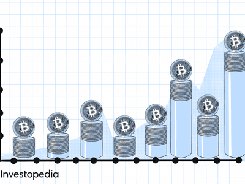

Bitcoin, the first and most well-known cryptocurrency, has experienced a meteoric rise since its inception in 2009. Its creation by the pseudonymous Satoshi Nakamoto marked the beginning of a new era in digital finance. Bitcoin rapidly gained popularity as an alternative to traditional currencies, due to its decentralized nature and the promise of financial sovereignty for users. The initial surge in interest and value led to heated discussions about Bitcoin's intrinsic value, an aspect that has remained controversial among economists, investors, and policymakers.

Cryptocurrencies are digital or virtual currencies that utilize cryptography for security, making them resistant to counterfeiting. Unlike traditional currencies issued by central banks, cryptocurrencies operate on a technology called blockchain, a decentralized ledger that records all transactions across a network of computers. This decentralization is a key feature that enhances security and transparency while eliminating the need for a central authority.

Simultaneously, algorithmic trading has become a significant component of the financial markets, including cryptocurrency trading. Algorithmic trading involves using computer algorithms to execute trades at speeds and frequencies that are impossible for human traders. These algorithms can analyze numerous factors, from market volatility to historical data, to make informed trading decisions in milliseconds. In the volatile world of cryptocurrencies, algorithmic trading is particularly prevalent, often contributing to rapid price fluctuations.

This article aims to explore the concept of Bitcoin's intrinsic value and its significance within the framework of algorithmic trading. By evaluating Bitcoin's potential to have intrinsic value, the article will analyze how perceptions of this value influence trading strategies that rely on complex algorithms. Understanding these dynamics is essential for both investors and traders navigating the volatile cryptocurrency markets, where rapid technological advancements and speculation coexist.

## Table of Contents

## Understanding Intrinsic Value in Cryptocurrencies

Intrinsic value in financial analysis traditionally refers to the worth of an asset based on fundamental analysis, considering tangible and intangible factors. For traditional assets, intrinsic value is commonly calculated through discounted cash flows (DCF), asset valuation, or analyzing company earnings. These methods provide a basis for determining the 'true' value of an asset, often compared against its market price to guide investment decisions.

When addressing cryptocurrencies like Bitcoin, several challenges arise in applying the concept of intrinsic value. Unlike stocks or bonds, cryptocurrencies do not produce cash flows or dividends, nor do they have a balance sheet or business operations to evaluate using standard financial metrics. This absence of a traditional framework complicates the assessment of Bitcoin's intrinsic value.

There are varied perspectives on whether Bitcoin possesses intrinsic value. Some argue that Bitcoin, much like fiat currencies, derives value solely from collective trust and consensus rather than any intrinsic measure. Others, however, propose that certain features inherent to Bitcoin contribute to its intrinsic value. These include its decentralized nature, security, scarcity due to the capped supply of 21 million coins, and the growing adoption and integration within financial systems.

The debate is further enriched by contrasting viewpoints. On one hand, Bitcoin is sometimes likened to a digital version of gold, valued for its scarcity and role as a potential hedge against inflation. Proponents argue that the decentralized trust model, the robustness of blockchain technology, and its ability to facilitate borderless transactions confer intrinsic value. Conversely, skeptics contend that Bitcoin lacks the intrinsic value of physical commodities or fiat currencies backed by governments. They emphasize Bitcoin's [volatility](/wiki/volatility-trading-strategies) and reliance on continuous belief in its value, drawing parallels to speculative bubbles.

This dichotomy underscores the complexity of applying intrinsic value paradigms to Bitcoin. While traditional financial analysis tools may fall short, the evolving understanding of digital assets necessitates developing new frameworks and methodologies to assess their value within the financial landscape.

## Arguments Supporting Bitcoin’s Intrinsic Value

Bitcoin, a decentralized digital currency, is often likened to gold as a store of value due to several distinctive characteristics. One of the primary arguments supporting Bitcoin’s intrinsic value is its scarcity. Bitcoin is capped at a maximum supply of 21 million coins, a limit coded into its underlying protocol. This finite supply mirrors gold’s limited availability, and according to economic principles, scarcity combined with persistent demand can lead to increased value. The predictable supply and halving events every four years—where the number of new bitcoins mined is reduced by half—contribute to this scarcity dynamic. As demand for Bitcoin continues to grow, this fixed supply exerts upward pressure on its value, supported by the laws of supply and demand.

Network effects further enhance Bitcoin’s potential value. As more individuals and businesses adopt Bitcoin, its utility and appeal grow. This growing acceptance reinforces Bitcoin's value proposition, as wider usage increases [liquidity](/wiki/liquidity-risk-premium) and acceptance, which in turn fuels additional adoption. This positive feedback loop can be likened to other technologies that benefit from network effects, such as social media platforms and telecommunications systems.

The marginal cost of production is another [factor](/wiki/factor-investing) that can be considered when evaluating Bitcoin's value. Bitcoin mining involves solving complex mathematical problems to validate transactions and secure the network, a process that requires significant computational power and energy. The cost of electricity and hardware contributes to the overall expense associated with mining a single bitcoin. Consequently, the price of Bitcoin often gravitates towards the marginal cost of production. As energy and hardware costs vary, they influence the profitability of mining operations, and by extension, the price of Bitcoin. This relationship can be examined using simple cost functions:

$$
C_{\text{mining}} = E_{\text{cost}} \times H_{\text{cost}}
$$

where $C_{\text{mining}}$ is the total cost of mining one Bitcoin, $E_{\text{cost}}$ is the energy cost per unit, and $H_{\text{cost}}$ is the hardware cost per unit. Understanding these dynamics provides insight into how production costs underpin Bitcoin's perceived intrinsic value. 

In summary, Bitcoin’s perceived intrinsic value is supported by its scarcity, network effects, and correlating production costs, drawing parallels to how traditional commodities like gold are valued.

## Arguments Against Bitcoin's Intrinsic Value

Bitcoin's position as a convertible currency has been central to debates surrounding its intrinsic value. Critics argue that Bitcoin lacks fundamental value because, unlike traditional currencies or commodities, it does not entail physical substance or tangible assets. The idea of Bitcoin as a currency without intrinsic value is rooted in its inability to generate any cash flow or provide any inherent utility that would otherwise underpin its value. This absence challenges the traditional financial analysis used to determine intrinsic value.

From the perspective of the subjective theory of value, Bitcoin's worth is dictated by the perceived value placed upon it by individuals. This theory posits that value is not objective or inherent but rather determined by personal preferences and the importance individuals assign to an asset. In Bitcoin's case, its value is highly volatile and contingent upon what participants in the market are willing to pay for it at any given time. These fluctuations illuminate the problems of associating any intrinsic value with Bitcoin, as its valuation is intrinsically tethered to market sentiment and psychological factors rather than tangible elements.

Moreover, the notion that Bitcoin's potential collapse would not have a substantial impact on economies is supported by the relatively isolated nature of its market. An economic downturn resulting solely from Bitcoin's devaluation would likely be contained within its ecosystem, as cryptocurrencies still largely operate outside mainstream financial systems. While Bitcoin's total market capitalization has grown significantly, it remains a fraction of global financial markets. Therefore, any adverse effects of a Bitcoin collapse might primarily affect those deeply invested in cryptocurrencies, with broader economic repercussions remaining minimal. This perceived detachment further bolsters the argument against Bitcoin's intrinsic value, as its potential failure is not considered a systematic risk to economies globally.

These arguments suggest that Bitcoin’s valuation may currently be driven more by speculation than fundamental economic principles, hence questioning its classification as an asset with intrinsic value. Understanding these perspectives is essential for investors when assessing the risks and potentials within Bitcoin and the broader [cryptocurrency](/wiki/cryptocurrency) landscape.

## The Role of Algorithmic Trading in Bitcoin Market

Algorithmic trading involves the use of computer algorithms to automate and optimize the trading of financial instruments. In cryptocurrency markets, [algorithmic trading](/wiki/algorithmic-trading) has gained rapid popularity due to its ability to execute trades at speeds and volumes impossible for human traders. This form of trading is particularly well-suited to the 24/7 nature of cryptocurrency markets like Bitcoin, where price movements can be highly volatile. 

Algorithmic trading influences Bitcoin's price volatility in several ways. First, high-frequency trading algorithms, which execute a large number of trades in short periods, can contribute to rapid price swings. These algorithms react to market conditions at a speed that far surpasses human capabilities, often capitalizing on price discrepancies and market inefficiencies. Secondly, as algorithmic strategies rely on predefined rules based on mathematical and statistical models, their synchronized actions can amplify price movements. For instance, a sudden downturn in Bitcoin's price might trigger a cascade of algorithmic sell orders, leading to a larger drop than a purely manual system might experience.

The impact of algorithmic trading on price discovery is significant. Price discovery refers to the process through which the price of an asset is determined by the interactions of buyers and sellers in the market. By efficiently processing vast amounts of information, algorithmic trading can enhance this process, quickly integrating new information about Bitcoin's demand and supply into its price. However, this efficiency also raises concerns regarding its influence on the perceived intrinsic value of Bitcoin. While the technology improves market liquidity and efficiency, it can also lead to situations where price movements are driven more by trading strategies and algorithms than by fundamental value considerations.

This interaction between algorithmic trading and perceived intrinsic value is complex. Algorithmic trading systems do not measure intrinsic value but instead make decisions based on patterns and trends identified from historical data. Consequently, they may react to short-term signals that deviate from long-term fundamentals. This contrast can lead to a divergence between Bitcoin's market price and its intrinsic value, as understood under traditional valuation methods. In essence, while algorithmic trading enhances market dynamics, it can also obscure the signals typically used to evaluate Bitcoin's fundamental value, leading to a nuanced relationship between technology-driven market movements and intrinsic valuation principles.

## Connecting Intrinsic Value and Algorithmic Trading

Perceptions of intrinsic value significantly impact algorithmic trading strategies in the Bitcoin market. Intrinsic value, a debated concept for Bitcoin, affects the algorithms by shaping how they evaluate and respond to the market. These strategies typically rely on historical data, price patterns, and market sentiments, integrating them into their models to forecast future trends.

Trading algorithms play a crucial role in addressing market inefficiencies, especially those arising from debates on intrinsic value. Algorithms can leverage discrepancies in perceived value by executing trades based on statistical [arbitrage](/wiki/arbitrage) techniques or mean-reversion strategies. For instance, if the market deems Bitcoin undervalued due to a perceived intrinsic value not currently reflected in its price, algorithms can make buy orders to exploit this inefficiency. Similarly, overvaluation arguments may prompt sell orders. These automatic responses enable traders to efficiently capture value anomalies.

The volatile nature of Bitcoin markets presents both opportunities and risks for algorithmic trading. On the opportunity side, high volatility can lead to frequent arbitrage opportunities, allowing algorithms to profit from rapid price movements. However, this same volatility also increases risk, as unexpected events or wrong intrinsic value assessments can lead to significant financial losses. Algorithms must be robust, adaptive, and include risk management strategies, such as setting stop-loss limits or employing hedging techniques, to navigate these conditions effectively.

In conclusion, the intricate relationship between intrinsic value perceptions and algorithmic trading is critical in volatile markets like Bitcoin. As debates on Bitcoin's intrinsic value persist, trading algorithms must evolve, incorporating advanced data analytics and [machine learning](/wiki/machine-learning) models to optimize performance and mitigate risks. The continued refinement of these strategies will be essential for traders seeking to capitalize on Bitcoin's dynamic market environment.

## Conclusion

The debate surrounding Bitcoin's intrinsic value remains one of the most contentious topics in contemporary finance. Proponents argue that Bitcoin's scarcity, decentralized nature, and increasing adoption contribute to its standing as a valuable asset. Conversely, critics claim that Bitcoin's value is merely speculative, lacking the tangible backing associated with traditional currencies or assets. This discourse has significant implications for market dynamics, particularly in the volatile cryptocurrency domain.

For investors and traders, understanding the nuances of Bitcoin's intrinsic value and market implications is crucial. This knowledge aids in making informed decisions, balances risk and opportunity, and enhances trading strategies, particularly in a market characterized by rapid price fluctuations. Furthermore, the intersection of algorithmic trading and perceptions of intrinsic value adds complexity and sophistication to market behavior. Algorithmic trading, utilizing pre-programmed instructions, can respond to perceived market inefficiencies and is influenced by the ongoing debates about Bitcoin’s true value.

Given the rapidly evolving landscape of cryptocurrencies, continuous research and adaptation are essential. Investors and traders must remain vigilant, embracing new information and analytic techniques to navigate the complexities of digital asset markets effectively. By doing so, they can better position themselves to leverage opportunities while mitigating the inherent risks in this dynamic environment.

## References & Further Reading

[1]: Nakamoto, S. (2008). [Bitcoin: A Peer-to-Peer Electronic Cash System.](https://nakamotoinstitute.org/library/bitcoin/) 

[2]: Biais, B., Bisiere, C., Bouvard, M., & Casamatta, C. (2019). ["The Blockchain Folk Theorem."](https://academic.oup.com/rfs/article/32/5/1662/5427771) Review of Financial Studies, 32(5), 1662–1715.

[3]: Antonopoulos, A. M. (2017). ["Mastering Bitcoin: Unlocking Digital Cryptocurrencies."](https://books.google.com/books/about/Mastering_Bitcoin.html?id=IXmrBQAAQBAJ) O'Reilly Media.

[4]: Narayanan, A., Bonneau, J., Felten, E., Miller, A., & Goldfeder, S. (2016). ["Bitcoin and Cryptocurrency Technologies."](https://press.princeton.edu/books/hardcover/9780691171692/bitcoin-and-cryptocurrency-technologies) Princeton University Press.

[5]: Chuen, D. L. K. (Ed.). (2015). ["Handbook of Digital Currency: Bitcoin, Innovation, Financial Instruments, and Big Data."](https://www.sciencedirect.com/book/9780128021170/handbook-of-digital-currency) Academic Press.