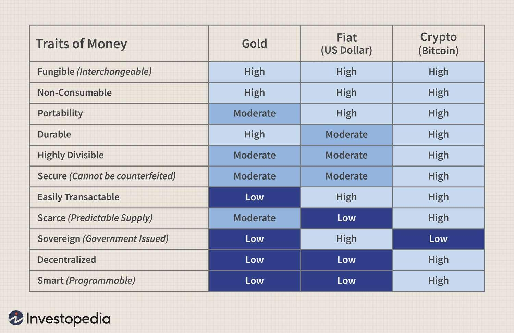

## Table of Contents

## What is intrinsic value?

Intrinsic value is the true worth of something, like a company or an item, based on its own qualities and not just what people are willing to pay for it. It's like the real value hidden inside, which might be different from the price you see in the market. For example, a company's intrinsic value could be calculated by looking at its earnings, assets, and growth potential, rather than just its current stock price.

Understanding intrinsic value can help investors make better decisions. If a stock's market price is lower than its intrinsic value, it might be a good buy because it's undervalued. On the other hand, if the market price is higher than the intrinsic value, the stock might be overvalued, and it could be a good time to sell. This concept is important in value investing, where the goal is to find and buy things that are worth more than they cost.

## How is the concept of intrinsic value applied to traditional assets like stocks or commodities?

When it comes to stocks, intrinsic value is like trying to figure out how much a company is really worth, not just what the stock market says it's worth. Investors look at things like how much money the company makes, how much it owns, and how fast it's growing. They use these numbers to come up with an intrinsic value. If the stock's price in the market is lower than this intrinsic value, it might be a good time to buy because the stock is undervalued. But if the stock's price is higher than the intrinsic value, it might be overvalued, and it could be a good time to sell.

For commodities like gold or oil, intrinsic value is a bit trickier because these things don't have earnings or growth like a company does. Instead, the intrinsic value of a commodity might be based on how useful it is, how rare it is, and how much people need it. For example, gold's intrinsic value could be influenced by its use in jewelry and electronics, as well as how much is available in the world. If the market price of a commodity is way off from its intrinsic value, it might signal a good time to buy or sell, just like with stocks.

## What is Bitcoin and how does it differ from traditional assets?

Bitcoin is a type of digital money that you can use to buy things online. It's different from traditional money like dollars or euros because it's not controlled by any government or bank. Instead, Bitcoin uses something called blockchain, which is like a big online record book that keeps track of all the transactions. People can send and receive Bitcoins directly, without needing a bank in the middle. This makes it faster and cheaper to move money around the world.

Unlike traditional assets like stocks or commodities, Bitcoin doesn't have a physical form you can touch. Its value comes from what people are willing to pay for it, rather than from earnings or the usefulness of a physical item. While stocks represent a part of a company and commodities like gold have real-world uses, Bitcoin's value is more about trust and belief in the system. It's seen by some as a new kind of investment, but it can be very up and down in price, making it riskier than traditional assets.

## Can Bitcoin have intrinsic value, and if so, how is it determined?

Bitcoin can have intrinsic value, but it's different from how we think about the intrinsic value of stocks or commodities. For Bitcoin, intrinsic value isn't about earnings or physical uses. Instead, it's more about what people believe Bitcoin is worth. Some people think Bitcoin has value because it's a new way to send money around the world without banks. Others believe in it because there's only a limited amount of Bitcoin that will ever exist, making it rare like gold.

Determining Bitcoin's intrinsic value is tricky because it's based on what people think and feel about it. Some might say Bitcoin's value comes from its usefulness as a way to store value or as a way to buy things online. Others might look at how hard it is to mine new Bitcoins and how secure the blockchain is. Because these things can change over time, Bitcoin's intrinsic value can be hard to pin down and can change a lot.

## What are the arguments for Bitcoin having intrinsic value?

Some people believe Bitcoin has intrinsic value because it's useful as a way to send money around the world quickly and cheaply. Unlike traditional money that needs banks to move it, Bitcoin lets people send money directly to each other. This can be really helpful for people who don't have easy access to banks or who need to send money to other countries. Also, Bitcoin can be used to buy things online, making it a kind of digital cash.

Another reason some think Bitcoin has intrinsic value is because it's limited. There will only ever be 21 million Bitcoins, and this limit makes it like gold, which is also rare. This scarcity can make people want Bitcoin more, driving up its value. Plus, the way Bitcoin is made, called mining, is hard and takes a lot of work, which adds to its value. Because it's secure and hard to fake, people trust it more, which can also make it valuable.

In the end, Bitcoin's intrinsic value comes from what people believe about it. If more people think it's useful and valuable, its intrinsic value goes up. But if people start to doubt it, the value can go down. So, Bitcoin's intrinsic value is all about trust and belief in the system.

## What are the arguments against Bitcoin having intrinsic value?

Some people say Bitcoin doesn't have intrinsic value because it doesn't produce anything like a company does. Stocks have intrinsic value because they represent a part of a company that makes money. But Bitcoin doesn't make money or have earnings. It's just a digital thing that people trade. If people stop believing in it, its value can drop to zero.

Another reason is that Bitcoin doesn't have a real-world use like commodities. Gold can be used in jewelry and electronics, but Bitcoin can't be used for anything other than buying things or storing value. Its value comes from what people are willing to pay for it, not from anything it can do. This makes its value very shaky because it depends on what people think and feel, not on something solid like earnings or usefulness.

## How does Bitcoin's scarcity influence its intrinsic value?

Bitcoin's scarcity is a big reason some people think it has intrinsic value. There will only ever be 21 million Bitcoins, and this limit makes it like gold, which is also rare. When something is scarce, people often want it more, which can drive up its value. The fact that it's hard to make new Bitcoins through mining also adds to its value. Mining takes a lot of work and energy, so people see Bitcoin as something valuable because it's not easy to get.

But, some people say that Bitcoin's scarcity doesn't really give it intrinsic value. They think that just because something is rare doesn't mean it's valuable on its own. Bitcoin doesn't produce anything or have a real-world use like gold does. Its value comes from what people are willing to pay for it, not from anything it can do. So, while scarcity might make people want Bitcoin more, it doesn't give it a solid, intrinsic value like the earnings of a company or the usefulness of a commodity.

## What role does Bitcoin's utility as a medium of exchange play in its intrinsic value?

Bitcoin's utility as a medium of exchange can make some people think it has intrinsic value. When people use Bitcoin to buy things online or send money to others without needing a bank, it shows that Bitcoin is useful. This usefulness can make people trust Bitcoin more and see it as valuable. If more people start using Bitcoin for everyday purchases, its value might go up because more people believe in it and want to use it.

But some people say that just being a medium of exchange doesn't give Bitcoin real intrinsic value. They think that for something to have intrinsic value, it needs to produce something or have a real-world use like gold does. Bitcoin doesn't make anything or have a use outside of being traded. Its value comes from what people are willing to pay for it, not from anything it can do. So, while being a medium of exchange might make Bitcoin valuable to some, it doesn't give it the same kind of solid, intrinsic value as other traditional assets.

## How does the energy consumption involved in Bitcoin mining affect its intrinsic value?

The energy used to mine Bitcoin can make some people think it has more intrinsic value. Mining Bitcoin takes a lot of work and electricity, kind of like how gold mining takes a lot of effort. Because it's hard to mine new Bitcoins, people might see them as more valuable, just like how hard-to-get things are often seen as worth more. This effort and energy can make people trust Bitcoin more and think it's worth something because it's not easy to create.

On the other hand, some people say that the energy used in mining doesn't really give Bitcoin intrinsic value. They think that just because something takes a lot of energy to make doesn't mean it's valuable on its own. Bitcoin doesn't produce anything or have a real-world use like gold does. Its value comes from what people are willing to pay for it, not from the energy used to mine it. So, while the energy used in mining might make Bitcoin seem valuable to some, it doesn't give it the same kind of solid, intrinsic value as other traditional assets.

## What impact does regulatory environment and acceptance have on Bitcoin's intrinsic value?

The rules and laws about Bitcoin can change how people see its value. If more countries say Bitcoin is okay to use, more people might start using it and trusting it. This can make its value go up because more people believe in it. But if countries start making strict rules or even banning Bitcoin, people might get scared and not want to use it as much. This can make its value go down because people trust it less.

Also, if big companies and stores start accepting Bitcoin for payments, it can make people think it's more useful and valuable. When big names like Tesla or PayPal say they will use Bitcoin, it can make more people want to use it too. This can push up its value because more people see it as a good way to buy things. But if big companies stop accepting Bitcoin, people might think it's not as useful, and its value can drop because it's seen as less important.

## How do network effects and the size of Bitcoin's user base contribute to its intrinsic value?

Network effects and the size of Bitcoin's user base can make people think it's more valuable. When more people use Bitcoin, it becomes easier and more useful for everyone. Imagine if only a few people used Bitcoin; it wouldn't be very helpful for buying things or sending money. But as more people join, Bitcoin becomes a better way to do these things. This can make more people want to use it, and when more people want something, its value can go up. So, the bigger Bitcoin's user base gets, the more valuable people might think it is.

But, some people say that even with a big user base, Bitcoin doesn't have real intrinsic value. They think that just because a lot of people use Bitcoin doesn't mean it's worth something on its own. Bitcoin doesn't make anything or have a use like gold does. Its value comes from what people are willing to pay for it, not from the number of users. So, while a big user base might make Bitcoin seem more valuable to some, it doesn't give it the same kind of solid, intrinsic value as other traditional assets.

## What advanced economic models are used to assess the intrinsic value of Bitcoin?

Some smart people use fancy math and models to try to figure out how much Bitcoin is really worth. One popular model is called the "Stock-to-Flow" model. It looks at how much Bitcoin there is and how fast new Bitcoins are made. The idea is that because Bitcoin is rare and hard to make, it should be worth more. Another model is the "Metcalfe's Law" model, which says that the value of a network like Bitcoin goes up a lot as more people use it. Both models try to use numbers and patterns to guess Bitcoin's value, but they can be tricky because they're based on what people think and do, not on something solid like earnings.

Another model people use is called the "Discounted Cash Flow" model, but it's changed a bit for Bitcoin. This model usually looks at how much money a company will make in the future and figures out what that's worth now. For Bitcoin, people might look at how much people might use it in the future and how much they'll pay for it. But this is hard because Bitcoin doesn't make money like a company does. So, these models are just guesses and can be wrong because Bitcoin's value can change a lot based on what people think and feel.

## What are the arguments supporting Bitcoin's intrinsic value?

Bitcoin, a decentralized digital currency, is often likened to gold as a store of value due to several distinctive characteristics. One of the primary arguments supporting Bitcoin’s intrinsic value is its scarcity. Bitcoin is capped at a maximum supply of 21 million coins, a limit coded into its underlying protocol. This finite supply mirrors gold’s limited availability, and according to economic principles, scarcity combined with persistent demand can lead to increased value. The predictable supply and halving events every four years—where the number of new bitcoins mined is reduced by half—contribute to this scarcity dynamic. As demand for Bitcoin continues to grow, this fixed supply exerts upward pressure on its value, supported by the laws of supply and demand.

Network effects further enhance Bitcoin’s potential value. As more individuals and businesses adopt Bitcoin, its utility and appeal grow. This growing acceptance reinforces Bitcoin's value proposition, as wider usage increases [liquidity](/wiki/liquidity-risk-premium) and acceptance, which in turn fuels additional adoption. This positive feedback loop can be likened to other technologies that benefit from network effects, such as social media platforms and telecommunications systems.

The marginal cost of production is another [factor](/wiki/factor-investing) that can be considered when evaluating Bitcoin's value. Bitcoin mining involves solving complex mathematical problems to validate transactions and secure the network, a process that requires significant computational power and energy. The cost of electricity and hardware contributes to the overall expense associated with mining a single bitcoin. Consequently, the price of Bitcoin often gravitates towards the marginal cost of production. As energy and hardware costs vary, they influence the profitability of mining operations, and by extension, the price of Bitcoin. This relationship can be examined using simple cost functions:

$$
C_{\text{mining}} = E_{\text{cost}} \times H_{\text{cost}}
$$

where $C_{\text{mining}}$ is the total cost of mining one Bitcoin, $E_{\text{cost}}$ is the energy cost per unit, and $H_{\text{cost}}$ is the hardware cost per unit. Understanding these dynamics provides insight into how production costs underpin Bitcoin's perceived intrinsic value. 

In summary, Bitcoin’s perceived intrinsic value is supported by its scarcity, network effects, and correlating production costs, drawing parallels to how traditional commodities like gold are valued.

## References & Further Reading

[1]: Nakamoto, S. (2008). [Bitcoin: A Peer-to-Peer Electronic Cash System.](https://nakamotoinstitute.org/library/bitcoin/) 

[2]: Biais, B., Bisiere, C., Bouvard, M., & Casamatta, C. (2019). ["The Blockchain Folk Theorem."](https://academic.oup.com/rfs/article/32/5/1662/5427771) Review of Financial Studies, 32(5), 1662–1715.

[3]: Antonopoulos, A. M. (2017). ["Mastering Bitcoin: Unlocking Digital Cryptocurrencies."](https://books.google.com/books/about/Mastering_Bitcoin.html?id=IXmrBQAAQBAJ) O'Reilly Media.

[4]: Narayanan, A., Bonneau, J., Felten, E., Miller, A., & Goldfeder, S. (2016). ["Bitcoin and Cryptocurrency Technologies."](https://press.princeton.edu/books/hardcover/9780691171692/bitcoin-and-cryptocurrency-technologies) Princeton University Press.

[5]: Chuen, D. L. K. (Ed.). (2015). ["Handbook of Digital Currency: Bitcoin, Innovation, Financial Instruments, and Big Data."](https://www.sciencedirect.com/book/9780128021170/handbook-of-digital-currency) Academic Press.