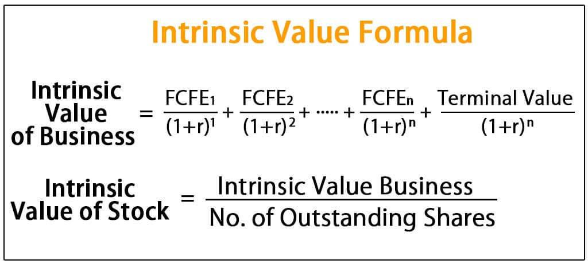

In the contemporary financial landscape, investors and traders are integrating advanced analytical tools and methodologies to enhance their decision-making processes. This article investigates two fundamental concepts in investment analysis: intrinsic value valuation and algorithmic trading. These tools are pivotal for gaining a competitive edge in the market.

Intrinsic value valuation is a foundational concept in investment analysis, offering insights into the true worth of an asset independent of its current market price. This process involves estimating future cash flows and discounting them to their present value, often using methods such as the discounted cash flow (DCF) analysis. By accurately determining intrinsic value, investors can identify assets that are undervalued or overvalued, enabling them to make strategic investment choices that capitalize on discrepancies between intrinsic value and market price.

In parallel, algorithmic trading has revolutionized modern investment strategies by using computer algorithms to execute trades at optimal times based on predefined criteria. These systems enhance trading efficiency by executing high-frequency trades that capitalize on fleeting market opportunities, which would be impossible to capture manually. With algorithmic trading, investors can remove human emotion from trading decisions, leading to more consistent and disciplined execution of strategies.

Understanding the methodologies behind intrinsic value estimation and the operational mechanics of algorithmic trading platforms can significantly enhance investment strategies. Investors equipped with these tools can not only identify undervalued opportunities but also optimize their trading efficiencies through precise and timely trade execution.

Our discussion will cover the fundamentals of valuation, delve into computational models involved in intrinsic valuation, and elucidate the application of automated systems in trading. Whether you are a novice investor or an experienced trader, comprehending these concepts can strengthen your financial strategies and provide the acumen to navigate the complexities of fluctuating markets effectively.

## Table of Contents

## Understanding Intrinsic Value

Intrinsic value refers to the fundamental worth of an asset, as distinct from its current market valuation. This concept is crucial in investment analysis because it allows investors to identify whether an asset is undervalued or overvalued. Calculating intrinsic value involves various methodologies, with discounted cash flow (DCF) analysis being one of the most prevalent. The DCF model projects an asset's future cash flows and discounts them back to their present value using an appropriate discount rate. This rate typically reflects the risk-adjusted required return expected by investors.

$$

\text{DCF} = \sum_{t=1}^{n} \frac{CF_t}{(1 + r)^t} 
$$

Where $CF_t$ represents the cash flow in period $t$, $n$ is the total number of periods, and $r$ is the discount rate.

Investors utilize intrinsic value as a metric to assess the future potential of an asset, guiding their strategic decisions. By comparing the intrinsic value with the current market price, they can determine whether to buy, sell, or hold a security. If the intrinsic value surpasses the market price, the asset is considered undervalued, suggesting a buying opportunity. Conversely, an intrinsic value lower than the market price may indicate that the asset is overvalued, potentially signaling a sell decision.

Intrinsic valuation is not limited to stocks but is also applicable to options and other financial instruments. For options, the intrinsic value is the difference between the asset's current price and the option's strike price, provided it is advantageous to the holder. This calculation helps investors assess the real worth of options in light of current market conditions.

By focusing on intrinsic valuation, investors can make informed decisions based on an asset's true value, rather than being swayed by market fluctuations. This approach underpins a disciplined investment strategy aimed at maximizing returns while mitigating risks.

## Valuation Techniques in Investment Analysis

Effective investment analysis hinges on the precise application of valuation techniques, each tailored to specific asset characteristics. While intrinsic valuation focuses on estimating the true inherent value of an asset through methodologies like discounted cash flow (DCF) analysis, alternative approaches offer unique insights catering to different analysis needs.

One commonly employed technique is relative valuation, which involves comparing a company's market metrics with peers or industry benchmarks. This method utilizes financial ratios such as the price-to-earnings (P/E) ratio, price-to-book (P/B) ratio, and enterprise value-to-EBITDA (EV/EBITDA) ratio. These metrics help investors assess whether a stock is undervalued or overvalued relative to similar companies. Relative valuation's chief advantage lies in its simplicity and reliance on readily available data. However, it can be less reliable when peers are themselves mispriced or in industries with significant structural changes.

Market valuation, another important approach, relies on current market prices to determine asset values. This technique is predominant in the real estate and commodities sectors, where market demand and supply dynamics directly influence valuation. The method's strength is its reflection of real-time market sentiments but it can be volatile and subject to short-term market fluctuations.

These valuation methodologies inform crucial investment decisions, guiding whether to buy, sell, or hold a security. For example, intrinsic and relative valuations might indicate that a stock is undervalued, prompting a buying decision. Conversely, market valuation signaling a high commodity price could suggest selling to lock in profits.

The advantages and disadvantages of these techniques contribute to their integration into a comprehensive investment analysis framework. Intrinsic valuation offers a deep, fundamental view but can be complex and sensitive to assumptions about future cash flows. Relative valuation is easy to implement but might miss broader economic factors. Market valuation is grounded in real-time data but can be overly influenced by transient market sentiments.

In designing an investment strategy, it's essential to consider these methods' strengths and limitations. Adopting a multifaceted approach that combines intrinsic, relative, and market valuations can provide a balanced perspective, enhancing decision-making robustness in varied market conditions.

## Algorithmic Trading: Revolutionizing Investment Strategies

Algorithmic trading is fundamentally transforming investment strategies by utilizing sophisticated computer algorithms to execute trades based on a multitude of predefined conditions and market signals. At its core, [algorithmic trading](/wiki/algorithmic-trading) leverages the power of data and technology to enhance trading accuracy and efficiency.

High-frequency trading ([HFT](/wiki/high-frequency-trading-strategies)), a subset of algorithmic trading, enables the execution of trades in fractions of a second, providing a significant advantage in markets where speed is crucial. These high-speed transactions capitalize on minimal price discrepancies that can occur within short temporal windows, allowing traders to potentially achieve significant profits due to the high [volume](/wiki/volume-trading-strategy) of transactions.

One of the primary benefits of algorithmic trading is its ability to eliminate human emotion from the trading process. Human traders can suffer from biases and emotional responses that may lead to inconsistent decision-making. Algorithms, in contrast, follow set rules and parameters, ensuring that trades are executed with precision and consistency. This disciplined approach helps in maintaining a stable performance across varying market conditions.

Automated trading systems excel at capturing fleeting market opportunities that are too brief or complex for manual trading. These systems can monitor and analyze vast datasets, recognizing and acting on patterns that would otherwise go unnoticed. For instance, algorithms can execute [arbitrage](/wiki/arbitrage) strategies that exploit price differences of the same asset in different markets simultaneously. 

Despite the advantages, algorithmic trading also presents several challenges. These include the risk of systemic errors, such as those caused by flaws in the algorithm design or coding. Moreover, the reliance on technology makes the system vulnerable to technical failures and cyber threats. It is crucial to have robust testing, validation, and risk management processes in place to mitigate these risks.

The regulatory landscape is another crucial aspect to consider when engaging in algorithmic trading. Regulatory bodies, such as the U.S. Securities and Exchange Commission (SEC) and the European Securities and Markets Authority (ESMA), have established frameworks to ensure market integrity and prevent manipulation. Traders employing algorithmic strategies must comply with these regulations to maintain fairness and transparency in the financial markets.

In summary, algorithmic trading revolutionizes investment strategies by providing high-speed execution, eliminating emotional biases, and enabling automated engagement with complex market environments. However, its successful implementation requires careful consideration of technical, regulatory, and ethical challenges to fully leverage its potential in modern financial markets.

## Integrating Intrinsic Value Valuation with Algorithmic Trading

Merging intrinsic value analysis with algorithmic trading can significantly enhance investment decision-making frameworks by synergizing the assessment of an asset's true worth with the precision and speed of automated trade execution. Intrinsic valuation provides critical insights into the fundamental value of financial instruments, allowing investors to identify mispriced assets that present potential profit opportunities. Conversely, algorithmic trading enables transactions based on predefined strategies, responding swiftly to market signals and executing trades with high efficiency.

One of the key benefits of integrating intrinsic value analysis with algorithmic trading is the ability to automate decision-making processes based on robust, data-driven insights. By incorporating intrinsic value metrics into algorithms, investors can automate the identification of valuation discrepancies in real-time. For example, a program could trigger buy or sell orders when a stock's market price deviates significantly from its calculated intrinsic value, thereby optimizing the timing and accuracy of trades.

To illustrate this integration, consider a scenario where a company, based on a discounted cash flow (DCF) analysis, has an intrinsic value of $50 per share. An investor could set up an algorithm to monitor the market price of the stock continuously. If the market price falls to $45, indicating undervaluation, the algorithm could automatically execute a purchase order, capitalizing on the undervalued opportunity. Conversely, if the price rises to $55, surpassing the intrinsic value, the algorithm could trigger a sell order to realize gains.

Case studies have demonstrated the effectiveness of such integrations in improving returns and enhancing risk management. For instance, hedge funds and proprietary trading firms often use intrinsic valuation metrics, in conjunction with algorithmic models, to actively manage portfolios and hedge against market [volatility](/wiki/volatility-trading-strategies). These firms have reported significant improvements in return profiles and risk-adjusted performance metrics, highlighting the approach's viability.

Furthermore, algorithmic frameworks can be customized to respond to various degrees of valuation disparities. Investors can program algorithms to execute trades only when specific thresholds of mispricing are met, thereby filtering out minor fluctuations and focusing on substantial value opportunities. This tailored approach allows for refined strategy execution, optimizing profitability while managing risk.

Implementing this integration requires a sophisticated understanding of both valuation techniques and algorithmic programming. Investors must ensure that their valuation models are accurate and reliable, as erroneous intrinsic value assessments could lead to inappropriate trading signals. Additionally, the algorithms must be robust and capable of adapting to dynamic market environments to maintain effectiveness over time.

In summary, the integration of intrinsic value analysis with algorithmic trading offers a powerful investment framework that leverages the comprehensive assessment of an asset's worth alongside swift trade execution capabilities. By doing so, investors can systematically exploit valuation disparities, enhance profitability, and achieve greater risk management efficiencies in fluctuating financial markets.

## Risks and Ethical Considerations

Both intrinsic valuation and algorithmic trading present certain risks that investors must carefully consider. One of the primary risks associated with these strategies is market volatility. Intrinsic value estimation relies on assumptions that can be significantly affected by sudden market changes. For example, shifts in interest rates or unexpected economic events can alter the projected cash flows or discount rates used in discounted cash flow (DCF) analysis, leading to inaccurate valuations. Systemic errors in algorithmic trading, such as code bugs or hardware failures, can result in significant financial losses. These errors are not rare and can cause erroneous trades, sometimes referred to as "flash crashes," where assets are traded at incorrect prices due to algorithmic anomalies.

Ethical considerations are also paramount, especially in algorithmic trading. Market manipulation concerns arise from practices such as spoofing or placing large orders with no intention of execution, merely to influence asset prices. High-frequency trading (HFT) adds another ethical dimension, as it can create a level playing field perception problem, where institutions with advanced algorithms might gain an unfair advantage over traditional traders.

Understanding the regulatory environment is essential for investors engaging in these strategies. Regulators such as the U.S. Securities and Exchange Commission (SEC) and the Commodity Futures Trading Commission (CFTC) continuously update rules to address potential market abuse and protect investors. Compliance with regulations not only helps avoid legal penalties but also fosters trust with clients and partners.

Risk management is crucial in mitigating the downsides associated with these strategies. Investors can use stop-loss orders to automatically sell an asset when its price falls to a predetermined level, limiting potential losses. A well-diversified portfolio can reduce the impact of any single investment's poor performance on the overall portfolio. Diversification spreads risk across various asset classes, industries, or geographical regions, thereby enhancing financial resilience.

Ethical trading practices warrant emphasis as they ensure not only compliance with legal standards but also protect the reputation of financial institutions and individuals. Transparent trading strategies, clear communication with clients, and adherence to fair trading practices are key components of ethical trading. Maintaining high standards of integrity is not just a regulatory requirement but a foundation of trust that underpins successful financial market operations.

## Conclusion

Investment analysis is continually evolving with advancements in valuation techniques and algorithmic trading. The dynamic nature of financial markets necessitates that investors adopt sophisticated tools to maintain a competitive edge. By understanding intrinsic value principles and harnessing automation through algorithmic systems, investors can refine their decision-making processes, leading to more strategic investment outcomes.

The deployment of algorithmic trading platforms facilitates the execution of complex trading strategies with precision and speed, offering an advantage over traditional trading methods. These platforms mitigate emotional biases, enabling investors to rely on quantitative metrics and pre-defined criteria. As a result, algorithmic trading not only enhances efficiency but also allows market participants to exploit transient opportunities that human traders may overlook.

Despite the inherent complexities and risks associated with these advanced techniques—such as market volatility and potential algorithmic errors—the judicious application of these tools can provide substantial competitive advantages. Informed investors who continuously engage with these evolving methodologies are better equipped to navigate financial markets, leveraging opportunities and mitigating risks effectively.

Continuous learning and adaptation are imperative as the investment environment advances with new technologies and strategies. Keeping abreast of financial innovations and understanding regulatory changes can safeguard investors from potential pitfalls. Moreover, the integration of ethical considerations into trading strategies ensures not only regulatory compliance but also enhances reputational integrity in the financial industry.

Investors who successfully integrate the analytical precision of intrinsic valuation with the operational efficiency of algorithmic trading into their strategies position themselves for success. By aligning technical insights with strategic execution, these investors are well-prepared to navigate the complexities and fluctuations of modern financial markets, ensuring both resilience and profitability in their investment pursuits.

## References & Further Reading

[1]: ["Valuation: Measuring and Managing the Value of Companies, 7th Edition"](https://books.google.com/books/about/Valuation.html?id=fGXjDwAAQBAJ) by McKinsey & Company Inc.

[2]: ["Algorithmic Trading: Winning Strategies and Their Rationale"](https://books.google.com/books/about/Algorithmic_Trading.html?id=WAlFDwAAQBAJ) by Ernest P. Chan

[3]: ["Security Analysis: Sixth Edition, Foreword by Warren Buffett"](https://www.amazon.com/Security-Analysis-Foreword-Buffett-Editions/dp/0071592539) by Benjamin Graham and David Dodd

[4]: ["High-Frequency Trading: A Practical Guide to Algorithmic Strategies and Trading Systems"](https://www.wiley.com/en-us/High+Frequency+Trading%3A+A+Practical+Guide+to+Algorithmic+Strategies+and+Trading+Systems-p-9780470579770) by Irene Aldridge

[5]: ["Trading and Exchanges: Market Microstructure for Practitioners"](https://books.google.com/books/about/Trading_and_Exchanges.html?id=xNfnCwAAQBAJ) by Larry Harris