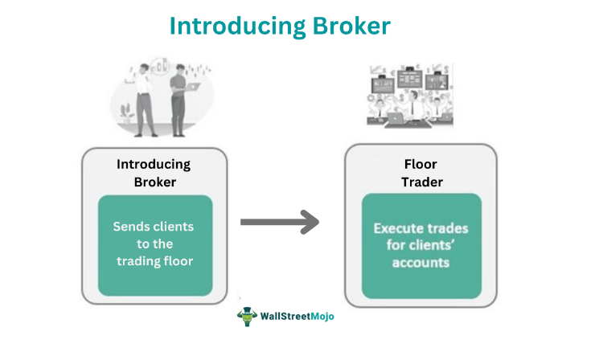

## Table of Contents

## What is an Introducing Broker (IB)?

An Introducing Broker (IB) is a person or firm that introduces new clients to a broker-dealer or futures commission merchant. They act as a middleman between the client and the larger financial institution, helping to bring in new business. IBs typically do not handle the actual trading or manage the client's account directly; instead, they focus on finding and referring potential customers.

In return for their services, Introducing Brokers usually earn a commission or a portion of the revenue generated from the clients they bring in. This arrangement can be beneficial for both the IB and the broker-dealer, as it allows the larger firm to expand its client base without having to invest heavily in marketing and client acquisition. For clients, working with an IB can provide a more personalized service and easier access to trading platforms and financial products.

## What are the primary roles and responsibilities of an Introducing Broker?

An Introducing Broker's main job is to find new clients and connect them with a bigger broker-dealer or futures commission merchant. They act like a bridge, helping people who want to trade or invest find the right place to do it. IBs don't usually handle the actual trading or manage the accounts themselves. Instead, they focus on bringing in new customers and making sure those customers get started with the broker-dealer.

In return for their work, Introducing Brokers earn money through commissions or a share of the profits from the clients they bring in. This setup helps the bigger broker-dealer grow their business without spending a lot on finding new customers themselves. For the clients, working with an IB can mean getting more personal help and easier access to trading tools and financial products.

## How does an Introducing Broker differ from a Futures Commission Merchant (FCM)?

An Introducing Broker (IB) and a Futures Commission Merchant (FCM) have different roles in the world of trading. An IB is someone who finds new clients and introduces them to a bigger broker or an FCM. They help people get started with trading but don't handle the actual trading or manage the accounts. IBs earn money by getting a commission or a share of the profits from the clients they bring in.

On the other hand, a Futures Commission Merchant (FCM) is a firm that actually handles the trading and manages the accounts. They are the ones who execute trades, hold the funds, and manage the risks for their clients. FCMs have to follow strict rules and regulations to make sure they are doing everything right. So, while an IB helps bring in new clients, an FCM is the one that does the heavy lifting of trading and account management.

## What are the benefits of working with an Introducing Broker for traders?

Working with an Introducing Broker can make things easier for traders. IBs help new traders find a good place to start trading without having to search a lot on their own. They introduce traders to bigger broker-dealers or futures commission merchants, which can be a big help, especially if you're new to trading. IBs often give personal help and advice, making the whole process less confusing and more friendly.

Another benefit is that IBs can offer access to special deals or better trading conditions. Because they work closely with the bigger firms, they might be able to get you lower fees or better rates than you could find on your own. This can save you money and make your trading more profitable. Plus, since IBs are focused on bringing in new clients, they have a good reason to make sure you're happy and successful with your trading.

## What are the steps to become a registered Introducing Broker?

Becoming a registered Introducing Broker starts with understanding the rules and getting the right licenses. You need to learn about the regulations from the financial authority in your country, like the National Futures Association (NFA) in the U.S. or the Financial Conduct Authority (FCA) in the U.K. Once you know the rules, you'll need to pass some exams to show you understand trading and finance. For example, in the U.S., you might need to pass the Series 3 exam to trade futures or the Series 7 exam for securities. After passing these exams, you can apply for your license with the right financial authority.

Once you have your license, the next step is to find a Futures Commission Merchant (FCM) or a broker-dealer to work with. You'll need to set up a Guarantee Agreement with an FCM, which means they agree to take responsibility for your clients' trading activities. This is important because it helps protect clients and makes sure everything is done legally. After you have this agreement, you can start bringing in new clients and helping them with their trading. Remember, you'll need to keep up with continuing education and follow all the rules to keep your license active.

## What are the regulatory requirements for an Introducing Broker in the United States?

To become an Introducing Broker in the United States, you need to follow the rules set by the National Futures Association (NFA) and the Commodity Futures Trading Commission (CFTC). First, you have to pass the Series 3 exam, which shows you know about futures and options trading. After passing the exam, you can apply for your license with the NFA. They will check your background to make sure you are honest and have no criminal history that could harm your clients.

Once you have your license, you need to find a Futures Commission Merchant (FCM) to work with. You will need to sign a Guarantee Agreement with the FCM. This agreement means the FCM will take responsibility for your clients' trading activities, which helps protect your clients and makes sure everything is done legally. After setting up this agreement, you can start bringing in new clients and helping them with their trading. Remember, you must keep up with continuing education and follow all the rules to keep your license active.

## How do Introducing Brokers earn revenue?

Introducing Brokers earn money by bringing new clients to bigger broker-dealers or futures commission merchants. They get paid a commission or a part of the profits from the trades their clients make. This means the more clients they bring in and the more those clients trade, the more money the Introducing Broker can make.

It's a good deal for both the Introducing Broker and the bigger firm. The Introducing Broker doesn't have to worry about handling the actual trading or managing the accounts, which can be a lot of work. The bigger firm gets new clients without having to spend a lot of money on finding them. This way, everyone can focus on what they do best, and the Introducing Broker can earn a steady income by helping people start trading.

## What kind of support and services can traders expect from an Introducing Broker?

Traders can expect a lot of help from an Introducing Broker. IBs are there to guide new traders through the process of getting started. They help you find a good broker-dealer or futures commission merchant to work with. They also give you personal advice and support, making it easier to understand how trading works. If you have questions or need help with your account, the IB is there to assist you.

IBs can also offer special deals and better trading conditions. Because they work closely with bigger firms, they might be able to get you lower fees or better rates than you could find on your own. This can save you money and make your trading more profitable. Plus, since IBs are focused on bringing in new clients, they have a good reason to make sure you're happy and successful with your trading.

## Can an Introducing Broker operate internationally, and what are the challenges?

An Introducing Broker can operate internationally, but it can be tricky. Each country has its own rules and laws about trading and finance. So, if an IB wants to work in different countries, they need to know and follow all these different rules. They might need to get special licenses or pass exams in each country where they want to work. This can be a lot of work and can make things complicated.

The challenges of working internationally are big. Language barriers can make it hard to talk to clients and understand the rules. Also, different time zones mean that an IB might have to work at odd hours to help clients in other parts of the world. Plus, dealing with different currencies can make things even more complicated. Despite these challenges, some IBs find ways to work around them and help traders from all over the world.

## What are some common challenges faced by Introducing Brokers in managing client relationships?

Introducing Brokers often find it tough to keep their clients happy and build good relationships with them. One big challenge is that clients can have different needs and expectations. Some might want a lot of help and advice, while others just want to be left alone to trade. It can be hard for an IB to balance all these different needs and make sure everyone feels taken care of. Plus, if a client loses money, they might blame the IB, even if the IB didn't do anything wrong. This can make the relationship strained and hard to fix.

Another challenge is staying in touch with clients. IBs need to keep talking to their clients regularly to help them and make sure they're happy. But sometimes, clients can be hard to reach or might not respond to messages. This can make it tough for the IB to give the help and support they want to provide. On top of that, IBs need to keep up with all the rules and regulations, which can change a lot. If they miss something, it could cause problems with their clients and even get them in trouble with the authorities.

## How has technology impacted the role of Introducing Brokers in recent years?

Technology has changed a lot for Introducing Brokers in recent years. Now, they can use the internet and special software to reach more people and help them start trading. They can use websites, emails, and social media to talk to clients from all over the world. This makes it easier for IBs to find new clients and keep in touch with them. Also, technology helps IBs use special tools to keep track of their clients' trading and give them better advice.

But technology also brings new challenges. IBs need to learn how to use all these new tools and stay safe from hackers and other online dangers. They also have to keep up with new rules about using technology in trading. Even though technology can help IBs do their job better, it can also make things more complicated and harder to manage.

## Can you provide examples of successful Introducing Brokers and what makes them stand out?

One example of a successful Introducing Broker is Al Brooks. He is known for his work in the futures market and his educational materials on price action trading. What makes Al Brooks stand out is his focus on teaching traders how to understand market movements without relying on complex indicators. He offers detailed [books](/wiki/algo-trading-books) and courses that help traders of all levels improve their skills. His success as an IB comes from his ability to provide valuable, easy-to-understand education that helps his clients make better trading decisions.

Another successful Introducing Broker is John Carter of Simpler Trading. John is well-known for his straightforward approach to trading and his ability to connect with traders through online platforms. What sets John Carter apart is his use of technology to reach a wide audience. He uses webinars, live trading sessions, and social media to teach and support his clients. His focus on community and real-time interaction helps traders feel supported and more confident in their trading. Both Al Brooks and John Carter show that being a successful IB involves not just bringing in clients, but also providing them with the tools and knowledge they need to succeed.

## References & Further Reading

[1]: Lehalle, C. A., & Laruelle, S. (2013). ["Market Microstructure in Practice."](http://helper.ipam.ucla.edu/publications/fmws2/fmws2_12928.pdf) World Scientific Publishing.

[2]: Harris, L. (2003). ["Trading and Exchanges: Market Microstructure for Practitioners."](https://www.amazon.com/Trading-Exchanges-Market-Microstructure-Practitioners/dp/0195144708) Oxford University Press.

[3]: ["Algorithmic Trading & DMA: An introduction to direct access trading strategies"](https://archive.org/details/algorithmictradi0000john) by Barry Johnson

[4]: ["Non-Linear Trading Laws"](https://www.financialpipeline.com/expert/types-of-derivatives/) by Paul Wilmott and David R. Roux

[5]: CFTC. (n.d.). ["Role of CFTC."](https://ndlawreview.org/2024/12/the-cftc-mqd-and-climate-change/)

[6]: NFA. (n.d.). ["Introducing Brokers."](https://www.nfa.futures.org/registration-membership/who-has-to-register/ib.html) National Futures Association.