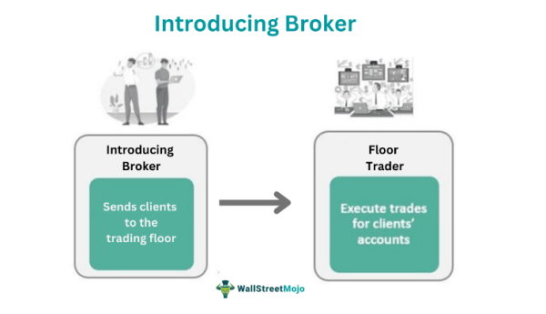

## Table of Contents

## What is an Introducing Broker (IB)?

An Introducing Broker (IB) is a person or firm that introduces new clients to a broker or a brokerage firm. They act as a middleman between the client and the broker, helping to connect people who want to trade with the firms that can help them do so. IBs usually don't handle the actual trading or manage the client's account directly. Instead, they focus on finding and referring clients to the broker, who then takes over the trading activities.

IBs earn money through commissions or fees based on the trading activity of the clients they introduce. This means that the more clients they bring in and the more those clients trade, the more money the IB can make. It's a way for people or small firms to participate in the financial markets without needing to set up their own trading platforms or deal with the regulatory requirements that come with being a full-service broker.

## How does an Introducing Broker differ from a regular broker?

An Introducing Broker (IB) and a regular broker have different roles in the trading world. An IB is like a connector. They find people who want to trade and introduce them to a brokerage firm. The IB doesn't handle the actual trading or manage the accounts. Their main job is to bring in new clients. They earn money from commissions or fees based on how much their clients trade.

A regular broker, on the other hand, does more than just introduce clients. They manage the whole trading process. This includes handling trades, managing accounts, and sometimes even giving advice on what to buy or sell. Regular brokers have to follow strict rules and often need special licenses to do their job. They take on more responsibility and have a more direct relationship with their clients than an IB does.

In simple terms, an IB is like a matchmaker who brings traders and brokers together, while a regular broker is the one who actually does the trading and manages everything related to it. The IB focuses on finding clients, while the regular broker focuses on serving them.

## What are the primary functions of an Introducing Broker?

The main job of an Introducing Broker (IB) is to find new people who want to trade and connect them with a brokerage firm. They act like a bridge between people who want to start trading and the companies that can help them do it. IBs don't actually handle the trading or manage the accounts themselves. Their focus is on bringing in new clients and making sure they get started with the right broker.

Once an IB introduces a client to a broker, their job is mostly done. They earn money through commissions or fees based on how much their clients trade. This means the more active their clients are, the more money the IB can make. IBs help make trading easier for people by finding them a good broker, but they don't get involved in the day-to-[day trading](/wiki/day-trading-spy) activities.

## What are the benefits of using an Introducing Broker for clients?

Using an Introducing Broker (IB) can make things easier for people who want to start trading. An IB helps find a good broker that fits what the client needs. They know a lot about different brokers and can match clients with the right one. This saves time and effort because clients don't have to search for a broker on their own. Plus, IBs often have good relationships with brokers, which can lead to better deals or services for the client.

Another benefit is that IBs can offer support and guidance. Even though they don't handle the actual trading, they can help clients understand how things work and answer questions. This can be really helpful for people who are new to trading. IBs also keep in touch with clients to make sure they're happy with the broker they've been introduced to. This ongoing support can make the whole trading experience smoother and more enjoyable.

## How can someone become an Introducing Broker?

To become an Introducing Broker, you first need to find a brokerage firm that is willing to work with you. This means you have to do some research to find a firm that offers an IB program. Once you find a good firm, you'll need to apply to their program. The application process can be different for each firm, but usually, you'll need to fill out some forms and maybe have an interview. Some firms might also ask for a background check to make sure you're trustworthy.

After you get accepted into an IB program, you'll need to learn about the firm's products and services. This is important because you'll be introducing clients to this firm, so you need to know what you're talking about. You'll also need to start finding people who want to trade and connect them with the brokerage firm. The more clients you bring in, the more money you can make from commissions or fees based on their trading activity. It's a good idea to keep learning and staying updated on the trading world to be a successful Introducing Broker.

## What are the typical commission structures for Introducing Brokers?

Introducing Brokers usually earn money through commissions or fees based on the trading activity of the clients they bring in. A common way they get paid is by getting a percentage of the commissions that the brokerage firm makes from the client's trades. For example, if a client makes a trade and the broker charges a $10 commission, the IB might get a cut of that $10, like $2 or $3. This means the more their clients trade, the more money the IB can make.

Sometimes, IBs get paid in other ways too. They might get a flat fee for each new client they introduce, or they might earn a bonus if their clients reach a certain level of trading activity. The exact way an IB gets paid can depend on the agreement they have with the brokerage firm. It's important for IBs to understand these details so they know how they'll be making money.

## What regulatory requirements must an Introducing Broker comply with?

An Introducing Broker (IB) has to follow certain rules to make sure they're doing things the right way. These rules can be different depending on where they work, but usually, they need to register with a financial authority. In the United States, for example, IBs might need to register with the Financial Industry Regulatory Authority (FINRA) or the National Futures Association (NFA). This helps make sure that IBs are honest and follow the law when they introduce clients to brokers.

Besides registering, IBs also need to follow rules about how they handle client information and money. They can't just share a client's private details with anyone, and they need to be careful not to mix up their own money with the money of their clients. IBs also have to keep good records of everything they do, so if there's ever a problem, they can show what happened. Following these rules helps keep everything fair and safe for everyone involved.

## How do Introducing Brokers build and maintain their client base?

Introducing Brokers build their client base by networking and reaching out to people who might want to start trading. They use their knowledge of the trading world to find people who are interested and help them get started with a good broker. IBs often use social media, attend events, and talk to friends and family to find new clients. They explain how trading works and why it's a good idea to use the broker they work with. By being helpful and friendly, IBs can convince people to give trading a try.

Once they have clients, IBs work hard to keep them happy. They stay in touch with their clients to make sure they're doing well with the broker. If a client has a problem or a question, the IB is there to help. They might also send out newsletters or updates about the trading world to keep their clients informed. By being supportive and keeping good relationships, IBs can make sure their clients keep trading and maybe even tell their friends about the IB's services. This helps the IB keep their client base strong and growing.

## What are the challenges faced by Introducing Brokers in the market?

Introducing Brokers face a lot of challenges in the market. One big challenge is finding new clients. It can be hard to find people who want to start trading, especially when there are so many other brokers and IBs out there trying to do the same thing. IBs have to work hard to stand out and show people why they should choose them. They need to be good at networking and talking to people to keep bringing in new clients.

Another challenge is keeping clients happy. Once an IB introduces a client to a broker, they need to make sure the client stays happy and keeps trading. This means staying in touch and helping with any problems that come up. If clients aren't happy, they might stop trading or go to another IB, which means less money for the IB. It's a lot of work to keep clients satisfied and coming back for more.

Regulations can also be a challenge. IBs have to follow a lot of rules to make sure they're doing things the right way. This can be hard to keep up with, especially if the rules change. IBs need to stay informed and make sure they're always following the law. If they don't, they could get in trouble and lose their ability to work as an IB.

## How do technology and digital platforms impact the role of Introducing Brokers?

Technology and digital platforms have changed the way Introducing Brokers work. They can now use the internet to find new clients more easily. Social media, websites, and online events help IBs reach more people and explain what they do. They can also use special software to keep track of their clients and see how much they're trading. This makes it easier for IBs to know how much money they're making and to stay in touch with their clients.

But technology also brings new challenges. There are more IBs and brokers online, so it's harder to stand out. IBs need to be good at using digital tools to get noticed. They also have to be careful about keeping client information safe online. If they don't, they could lose clients or get in trouble. So, while technology helps IBs do their job better, it also means they have to work harder to keep up and stay safe.

## What advanced strategies can Introducing Brokers use to enhance client services?

Introducing Brokers can use advanced strategies to make their clients happier and more successful. One way is by using special software to keep track of how their clients are doing. This software can show them how much their clients are trading and help them see if there are any problems. IBs can then reach out to their clients with helpful tips or advice based on what they see. They can also use this information to find new ways to help their clients make more money, like suggesting different trading strategies or connecting them with experts who can give them more advice.

Another strategy is to use technology to stay in touch with clients better. IBs can set up online groups or use apps to talk to their clients easily. This way, they can answer questions quickly and keep their clients updated on new things happening in the trading world. By being there for their clients and making it easy for them to get help, IBs can make sure their clients feel supported and are more likely to keep trading. This also helps IBs build strong relationships with their clients, which is important for keeping them happy and loyal.

## How do global economic trends affect the operations of Introducing Brokers?

Global economic trends can have a big impact on how Introducing Brokers do their job. When the economy is doing well, more people might want to start trading because they feel confident about making money. This means more clients for IBs, which is good for their business. But if the economy is not doing well, people might be scared to trade because they're worried about losing money. This can make it harder for IBs to find new clients and keep the ones they have happy. IBs need to keep an eye on what's happening in the economy so they can adjust how they work and help their clients make smart choices.

Economic trends can also change what kinds of trades people want to make. For example, if interest rates go up, people might want to trade in different ways than when rates are low. IBs need to understand these changes and be ready to explain them to their clients. This way, they can help their clients make the best trading decisions no matter what's happening in the economy. By staying informed and being good at explaining things, IBs can keep their clients happy and successful even when the economy is changing.

## References & Further Reading

[1]: Bergstra, J., Bardenet, R., Bengio, Y., & Kégl, B. (2011). ["Algorithms for Hyper-Parameter Optimization."](https://dl.acm.org/doi/10.5555/2986459.2986743) Advances in Neural Information Processing Systems 24.

[2]: ["Advances in Financial Machine Learning"](https://www.amazon.com/Advances-Financial-Machine-Learning-Marcos/dp/1119482089) by Marcos Lopez de Prado

[3]: ["Evidence-Based Technical Analysis: Applying the Scientific Method and Statistical Inference to Trading Signals"](https://www.amazon.com/Evidence-Based-Technical-Analysis-Scientific-Statistical/dp/0470008741) by David Aronson

[4]: ["Machine Learning for Algorithmic Trading"](https://github.com/stefan-jansen/machine-learning-for-trading) by Stefan Jansen

[5]: ["Quantitative Trading: How to Build Your Own Algorithmic Trading Business"](https://www.amazon.com/Quantitative-Trading-Build-Algorithmic-Business/dp/1119800064) by Ernest P. Chan