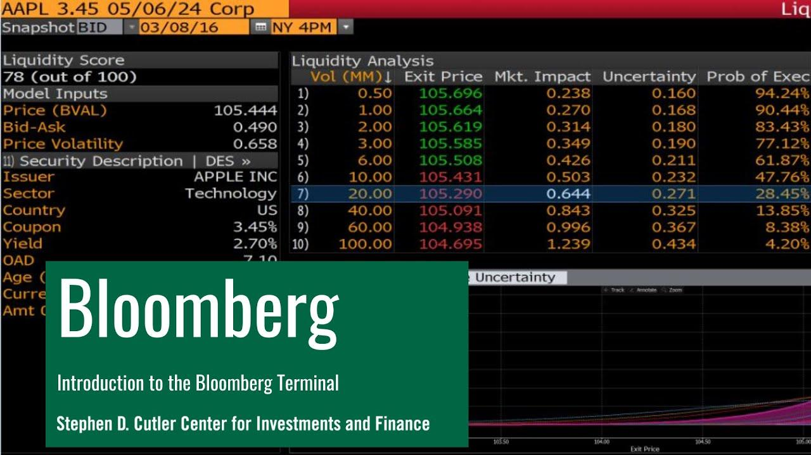

In today's fast-paced financial world, staying ahead requires leveraging the best tools available for investment analysis and trading. The Bloomberg Terminal stands out as a prominent financial software and a vital tool for professionals committed to mastering the complexities of modern markets. Since its introduction, Bloomberg Terminal has revolutionized the way financial information is accessed and analyzed, providing real-time data, cutting-edge analytic tools, and comprehensive news coverage, all crucial for informed decision-making.

The significance of the Bloomberg Terminal in the financial landscape cannot be overstated. It offers unmatched insights into market trends, enabling traders to execute strategies with precision and confidence. This article will explore how, particularly in algorithmic trading, Bloomberg Terminal empowers financial professionals to craft and execute sophisticated investment strategies effectively.



Incorporating Bloomberg Terminal into one's financial toolkit allows for integration of extensive data sets with advanced analytical techniques, fostering a deeper understanding of market dynamics. From tracking securities to assessing economic indicators, Bloomberg Terminal provides the necessary resources to navigate and take advantage of the evolving market conditions.

For both seasoned traders and financial enthusiasts, understanding the Bloomberg Terminal is essential for optimizing investment strategies. By recognizing the capabilities of this powerful platform, users can significantly enhance their ability to operate in today's competitive financial environment.

## Table of Contents

## What is the Bloomberg Terminal?

The Bloomberg Terminal is a technologically advanced data and information system that has been integral to the financial industry since its inception in 1982. Created by Michael Bloomberg, the system transformed how financial data is accessed and analyzed, providing professionals with a comprehensive digital platform for market insights. Initially manifesting as standalone terminals, the Bloomberg Terminal has evolved into a sophisticated software application, accessible from personal computers and mobile devices, reflecting advancement in technology and user needs.

At the heart of this platform is its extensive database, which offers users access to a plethora of financial data, including securities pricing, economic [statistics](/wiki/bayesian-statistics), and news from global markets. The Terminal serves as an invaluable resource for financial professionals, providing real-time data alongside an array of analytic tools designed for thorough market analysis. Users can evaluate macroeconomic indicators, access financial statements, perform bond analysis, and even customize charts to track historical data and identify trends.

The Terminal's key features include Bloomberg Tickers, which are unique identifiers for securities, enabling seamless data retrieval and analysis. Coupled with its advanced news service, Bloomberg Terminal users gain a competitive edge by staying updated with instantaneous global news impacting financial markets. Additionally, professional-grade charting and analytical tools empower users to conduct both fundamental and technical analyses, crucial for informed investment decisions.

The Bloomberg Terminal has revolutionized financial markets by bringing precision and speed to data analysis. Despite its steep cost, often thousands of dollars per user annually, the Terminal remains a preferred choice among financial professionals. Its unparalleled access to data, coupled with sophisticated analytic capabilities, underscores its lasting impact on the finance world. Thus, the Bloomberg Terminal represents a convergence of technology and finance, offering users a powerful tool for navigating the complexities of global markets.

## Navigating the Bloomberg Terminal

Navigating the Bloomberg Terminal can initially be challenging due to its unique interface and specialized keyboard, but these challenges are mitigated with familiarity and practice. At the core of navigating the Bloomberg Terminal lies understanding its specialized keyboard, which is integral to its operation. The keyboard is equipped with color-coded keys that facilitate efficient workflow through the terminal's vast functionalities. 

The Bloomberg Terminal's keyboard includes keys like 'Market', 'News', 'Function', and a scroll key, each color-coded to enhance usability. For example, the 'Market' button, often green, provides instant access to market data, while the 'News' button, frequently red, directs the user to real-time news aggregates. The yellow keys are reserved for the command functions that allow users to execute specific tasks or access analytical tools quickly. Mastery of these keys is fundamental to unlocking the terminal’s full potential.

A cornerstone of Bloomberg Terminal navigation is the use of shortcuts and command functions. Shortcuts like pressing <F3> for 'Top News' and <F8> for 'Monitor List' allow the user to seamlessly transition between different data types and analyses, ensuring swift and efficient information retrieval. The terminal also supports custom setups, enabling users to configure their workspace for optimal productivity based on personal preferences or specific investment analysis needs.

Bloomberg Terminal users should also become adept at using 'Launchpad', a feature that allows customization of the interface. By dragging and dropping preferred modules into their workspace, traders can create a personalized dashboard that displays real-time data, charts, and news feeds in one consolidated view. Learning to navigate through Launchpad not only saves time but also provides comprehensive insight into market conditions.

To enhance usability, users are encouraged to take advantage of Bloomberg's training resources. These resources, including webinars and tutorials, provide detailed guidance on efficiently using the terminal's navigation tools. With these skills, financial professionals can access the extensive data and analytic tools the Bloomberg Terminal offers, empowering them to make well-informed trading decisions.

In summary, understanding and mastering the navigation of the Bloomberg Terminal involves familiarizing oneself with its color-coded keyboard, utilizing shortcuts and command functions, customizing the Launchpad, and leveraging available training resources. Once these navigation tools are mastered, users can unlock the terminal’s full potential, gaining a significant advantage in the complex world of financial markets.

## Bloomberg Tools for Investment Analysis

The Bloomberg Terminal is an indispensable tool for investment analysis, offering a suite of powerful analytic features that cater to the needs of modern investors. These tools assist users in analyzing securities, currencies, and economic indicators, which are crucial components for developing robust investment strategies.

A central feature of the Bloomberg Terminal is its ability to provide comprehensive data on a wide range of financial instruments. Investors can access detailed information on securities, including equities, fixed income, commodities, and derivatives. The Bloomberg Terminal's data capabilities are enhanced by real-time updates that offer a continuous stream of information, empowering investors to make timely decisions. 

Bloomberg Tickers, an integral part of the terminal, facilitate quick access to data by providing a unique identifier for each security. Through these tickers, users can instantaneously retrieve current and historical price data, financial statements, and market trends. This feature supports both fundamental and technical analysis, enabling investors to perform in-depth evaluations of investment opportunities.

The terminal's news feature aggregates financial news from a multitude of sources, offering investors the latest developments in global markets. By keeping abreast of news events, investors can assess potential impacts on their investments and adjust their portfolios accordingly. Additionally, Bloomberg's market monitors provide overviews of various market segments, highlighting significant movements and trends that may influence investment decisions.

Charting and data analysis tools are another cornerstone of the Bloomberg Terminal's offerings. These tools allow investors to visualize market trends and perform complex data analyses. Advanced charting capabilities enable the examination of price patterns, [volatility](/wiki/volatility-trading-strategies), and correlations. Users can overlay technical indicators, such as moving averages and Bollinger Bands, to identify potential entry and [exit](/wiki/exit-strategy) points in the market.

For portfolio management, the Bloomberg Terminal offers tools that facilitate the construction and optimization of investment portfolios. Real-time data integration allows for dynamic portfolio tracking, ensuring that investors can respond swiftly to market changes. The terminal's robust analytic capabilities support risk assessment and performance evaluation, aiding investors in aligning their portfolios with their investment objectives.

In summary, the Bloomberg Terminal equips investors with an unparalleled set of tools for performing both fundamental and technical analysis. By leveraging features such as Bloomberg Tickers, market news, and comprehensive data analytics, investors are better positioned to make informed decisions and enhance their investment performance.

## Algorithmic Trading with Bloomberg

Algorithmic trading, which involves using computer programs to execute trade orders automatically, has gained prominence in financial markets due to its speed and efficiency. The Bloomberg Terminal is instrumental in this domain, providing essential tools that enhance [algorithmic trading](/wiki/algorithmic-trading) capabilities.

Bloomberg Terminal supports algorithmic trading through its advanced data analytics and real-time information features. These features are critical, as algorithmic trading heavily relies on accessing and analyzing vast amounts of data quickly. The terminal offers real-time market data, enabling traders to act promptly in highly dynamic trading environments. Moreover, the ability to integrate comprehensive analytics — covering securities, indices, and economic indicators — empowers traders to develop and refine trading algorithms.

In addition to data analytics, Bloomberg Terminal offers powerful scripting tools that allow users to craft custom trading algorithms. Bloomberg's API, known as Bloomberg API (BLPAPI), facilitates the development of bespoke trading strategies by enabling programmatic access to the terminal's extensive datasets. Traders and developers can script in languages such as Python to automate complex trading decisions. For example, a simple moving average crossover strategy could be implemented using Python's `pandas` library for data handling and BLPAPI for data retrieval:

```python
import blpapi

# Fetch data using Bloomberg API
# Please replace this with actual Bloomberg API code

# Example: Calculating moving averages
import pandas as pd

# Sample data
data = pd.DataFrame({'price': [120, 121, 119, 122, 123, 124]})

# Calculate moving averages
short_window = 2
long_window = 3

data['short_mavg'] = data['price'].rolling(window=short_window).mean()
data['long_mavg'] = data['price'].rolling(window=long_window).mean()

# Determine buy/sell signals
data['signal'] = 0
data.loc[data['short_mavg'] > data['long_mavg'], 'signal'] = 1
data.loc[data['short_mavg'] < data['long_mavg'], 'signal'] = -1

print(data)
```

The comprehensive data feeds of the Bloomberg Terminal significantly enhance the accuracy and speed of executing algorithmic trading strategies. Instant access to global financial markets ensures that any updates, such as economic news or corporate earnings announcements, are assimilated into trading algorithms without delay.

Case studies illustrate the effectiveness of Bloomberg Terminal in algorithmic trading. For instance, many hedge funds and investment banks utilize its services to develop proprietary trading algorithms that optimize trade execution and reduce transaction costs. These firms leverage Bloomberg's seamless integration of data and trading platforms to conduct back-testing, scenario analysis, and performance evaluations.

In summary, Bloomberg Terminal provides unmatched resources for algorithmic trading through advanced data analytics, real-time information, and robust scripting tools. These capabilities enable financial firms to design sophisticated trading strategies, thereby gaining a competitive advantage in increasingly automated markets.

## Case Studies and Real-world Applications

In examining the practical applications of the Bloomberg Terminal, we turn our attention to several case studies that illustrate its effectiveness and versatility across various sectors of the financial industry.

### Equities

One notable example is the use of Bloomberg Terminal in equity trading. Hedge funds and asset managers harness the terminal's advanced analytics to monitor market conditions and execute informed trading strategies. By integrating features like Bloomberg's market monitors and tickers, institutions can track price movements and [volume](/wiki/volume-trading-strategy) patterns, providing a comprehensive view of potential investment opportunities. For instance, a fund manager might utilize real-time data analytics to identify undervalued stocks, using historical data comparisons and predictive modelling tools offered by Bloomberg to optimize portfolio performance.

### Fixed Income

In the fixed income market, Bloomberg Terminal stands out for its capacity to handle intricate data involving bonds and interest rates. Financial institutions such as investment banks leverage its powerful tools to navigate the complex landscape of bond trading. By accessing specific bond data, yields, and ratings through the terminal, traders can devise strategies to minimize risk and maximize returns. The terminal also facilitates the evaluation of [interest rate](/wiki/interest-rate-trading-strategies) trends through its economic indicators and fixed income monitors, providing a critical edge in decision-making for portfolio managers focused on bonds.

### Foreign Exchange

The foreign exchange (Forex) market benefits significantly from Bloomberg Terminal's capabilities. Forex traders depend on its real-time data feeds, which offer up-to-the-second exchange rates and currency futures. This instantaneous access enables traders to capitalize on currency fluctuations swiftly. An example of this is a currency [hedge fund](/wiki/hedge-fund-trading-strategies) employing Bloomberg's analytics to manage its exposure to currency risks. By using statistical tools and comparative analysis of historical data, these traders can anticipate market shifts and adjust their holdings accordingly.

### Derivative Markets

The derivative markets, comprising options, futures, and swaps, require precise and sophisticated risk management strategies. Bloomberg Terminal supports this by providing comprehensive options analysis tools and derivatives pricing models. A practical case study involves derivatives traders using the terminal's analytics to price complex option combinations and assess potential outcomes under different market scenarios. These capabilities enable traders to structure products that align with investor risk appetites and strategies, underscoring the terminal's role in enhancing performance in derivatives trading.

In conclusion, the Bloomberg Terminal serves as an invaluable asset across a wide range of financial markets. By facilitating advanced data analysis and offering diverse market-specific tools, it empowers financial professionals to refine their trading strategies and optimize their investment performances. Whether in equities, fixed income, foreign exchange, or derivatives, Bloomberg Terminal remains an essential tool for navigating today's financial markets.

## Conclusion

The Bloomberg Terminal remains an unmatched resource for financial professionals, offering a comprehensive suite of tools essential for modern market analysis and trading. It stands out with its robust analytic capabilities, ensuring that users have access to real-time data and sophisticated charting options necessary for informed decision-making. Furthermore, the terminal supports algorithmic trading, an area that increasingly dominates financial markets. With its advanced data analytics and scripting abilities, Bloomberg enables the development and execution of complex trading strategies swiftly and effectively.

However, the Terminal's extensive capabilities come at a significant cost, often making it inaccessible for individual investors. Despite this, many universities, public libraries, and some financial institutions provide access to Bloomberg Terminals, offering an entry point for those who might not otherwise afford it. This accessibility ensures broader learning and growth opportunities for emerging financial professionals and students.

As the financial landscape continues to evolve, characterized by increasing complexity and competition, the necessity of utilizing advanced systems like the Bloomberg Terminal is ever more pressing. Financial professionals who integrate such technology into their workflows are better equipped to navigate the dynamic market environment. By embracing these technological advancements, traders and investors gain a competitive edge, positioning themselves for success in an industry that is constantly striving to innovate and optimize.

## References & Further Reading

[1]: Bloomberg L.P. (2023). ["Bloomberg Professional."](https://www.bloomberg.com/company/press/bloomberg-publishes-2023-impact-report/) 

[2]: Fabozzi, F. J., & James, B. (2016). ["The Bloomberg Way: A Guide for Reporters and Editors."](https://books.google.com/books/about/Bond_Markets_Analysis_and_Strategies_ten.html?id=bQpNEAAAQBAJ) Wiley Finance.

[3]: Rishi Narang (2013). ["Inside the Black Box: A Simple Guide to Quantitative and High Frequency Trading."](https://onlinelibrary.wiley.com/doi/book/10.1002/9781118662717) Wiley.

[4]: Murphy, J. J. (1999). ["Technical Analysis of the Financial Markets."](https://www.amazon.com/Technical-Analysis-Financial-Markets-Comprehensive/dp/0735200661) New York Institute of Finance.

[5]: Hasbrouck, J. (2007). ["Empirical Market Microstructure: The Institutions, Economics, and Econometrics of Securities Trading."](https://academic.oup.com/book/52241) Oxford University Press.

[6]: Hull, J. C. (2018). ["Options, Futures, and Other Derivatives."](https://www.semanticscholar.org/paper/Options%2C-Futures%2C-and-Other-Derivatives-Hull/89bdee500c8623864fc9eb7a471546aa713acc44) Pearson.