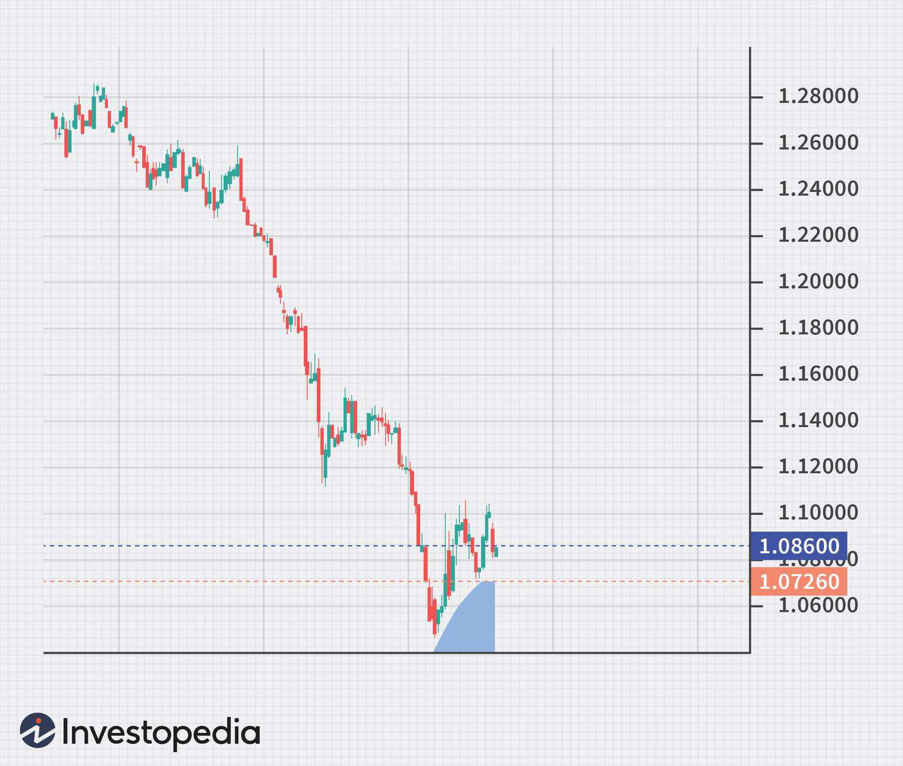

The evolving landscape of trading has opened new avenues for investors, among which forex trading stands out due to its dynamic nature. The forex market, characterized by its high liquidity and continuous operation, offers a unique opportunity for individuals to trade currencies globally. This beginner's guide aims to unravel the complexities of forex trading and introduce the concepts of algorithmic trading, a method increasingly adopted by traders seeking efficiency and precision.

Understanding the basics of currency exchange is crucial for anyone looking to venture into forex trading—whether or not they choose to utilize algorithms. At its core, forex trading involves the buying and selling of currencies to capitalize on fluctuations in exchange rates. This process necessitates a firm grasp of forex-specific terminologies, such as pips, currency pairs, leverage, and lots, to effectively engage in trading activities.



In this comprehensive guide, we will explore the fundamental aspects of forex trading and delve into the workings of algorithmic trading. Algorithmic trading employs complex algorithms to automate trading processes, offering advantages such as increased transaction speed and reduced emotional bias.

For those who prefer a more hands-on approach, understanding traditional trading practices will provide a solid foundation in market analysis and decision-making. Conversely, those interested in the technological side of trading will find insights into how coding and algorithms can play a vital role in executing trades efficiently. Whether you are interested in manual trading or wish to harness the power of algorithmic trading to enhance your strategies, this guide will serve as a foundational resource to get you started on your forex trading journey.

## Table of Contents

## Understanding Forex Trading

Forex trading, also known as foreign exchange trading, is the process of exchanging one currency for another in order to profit from variations in their exchange rates. This global market operates as a decentralized system, where traders can buy and sell currency pairs over-the-counter, rather than through a centralized exchange. The forex market is renowned for its high liquidity, extensive operational hours—remaining open 24 hours a day for five days a week—and the leveraging opportunities it offers to traders. These features make forex trading an attractive prospect for many investors.

Familiarity with basic forex terminologies is essential to engage effectively in forex trading. Currency pairs, the fundamental building blocks of forex trading, consist of a base currency and a quote currency, for example, EUR/USD. A 'pip' (percentage in point) represents the smallest price movement that can be observed in the exchange rate for a given currency pair, typically the fourth decimal place in most pairs. The term 'lot' refers to the size of the trade, with a standard lot typically comprising 100,000 units of the base currency. Understanding these concepts is crucial for calculating profits, losses, and potential market positions.

Forex trading serves various purposes beyond mere speculation. It can be utilized for hedging, where traders aim to offset potential losses in another asset by taking an opposite position in the [forex](/wiki/forex-system) market. Diversification is another strategy, where investors spread their portfolio risk by holding a variety of currency pairs. Each purpose entails specific strategies and risk management practices, which are essential to safeguard investments against adverse market movements.

Before venturing into automated forex systems, beginners are advised to gain a solid understanding of manual trading practices. This foundational knowledge is critical in developing the analytical skills necessary to assess market conditions effectively. Manual trading involves using market data, news updates, and technical analysis to make informed trading decisions. Building expertise in manual trading lays the groundwork for successful [algorithmic trading](/wiki/algorithmic-trading) and ensures a deeper understanding of the market's intricacies.

 to Algorithmic Trading

Algorithmic trading transforms the execution of trades by utilizing automated algorithms designed to adhere to predetermined strategies based on real-time market data. This approach significantly enhances the trading process by increasing speed, ensuring consistent efficiency, and minimizing emotional interference during trade execution. 

To effectively engage in algorithmic trading, familiarity with certain programming languages and platforms is essential. Python, for instance, is a popular choice due to its extensive libraries and ease of use. MQL4, a language specific to the MetaTrader platform, and various proprietary software solutions also feature prominently in the algorithmic trading landscape. These tools enable traders to construct intricate algorithms for automating trading strategies.

Developing an algorithmic trading strategy generally involves several key steps. The formulation of a strategy is the first phase, where traders define their trading criteria and rules. Following this, [backtesting](/wiki/backtesting) allows for the assessment of these strategies using historical data, providing insights into potential performance without the risk of financial loss. An example of a simple moving average crossover strategy in Python might look like this:

```python
# Import necessary libraries
import pandas as pd

# Load historical market data
data = pd.read_csv('market_data.csv')

# Calculate moving averages
data['SMA50'] = data['Close'].rolling(window=50).mean()
data['SMA200'] = data['Close'].rolling(window=200).mean()

# Define buy and sell signals
data['Signal'] = 0
data['Signal'][50:] = np.where(data['SMA50'][50:] > data['SMA200'][50:], 1, 0)

# Generate trading strategy
data['Position'] = data['Signal'].diff()
```

The above code performs a backtest of a moving average crossover strategy, a fundamental algorithmic trading method that involves buying when a short-term moving average crosses above a long-term moving average and selling when it does the opposite.

Establishing automated execution systems with forex brokers is another crucial aspect of algorithmic trading. These systems remain operational during trading hours, executing trades as market conditions align with predefined parameters. For beginners, gaining competence in coding and developing an understanding of how algorithms function within the forex market context is crucial for adopting and succeeding with this trading style. 

Overall, algorithmic trading offers profound opportunities through its systematic approach, provided traders equip themselves with the requisite technical and analytical skills.

## Setting Up for Success in Forex Trading

To begin forex trading, selecting a reliable broker is paramount. A broker with a user-friendly platform, ideally supporting algorithmic trading, ensures a smoother trading experience. Such platforms should offer robust features like advanced charting tools, technical indicators, and access to real-time market data, which are essential for both manual and automated trading strategies.

The initial step in forex trading should be to operate with a demo account. This allows aspiring traders to practice and refine their trading strategies in a risk-free environment. Demo accounts simulate real market conditions without the financial risk, providing invaluable insight into trading mechanics and strategy effectiveness.

Once a trader gains confidence, transitioning to a live account is the logical next step. However, in live trading, employing effective risk management techniques is crucial to safeguard investments. This involves setting stop-loss orders, diversifying currency pairs, and adhering to a solid risk-reward ratio that aligns with the trader's financial goals and risk appetite.

A fundamental pillar of successful forex trading is grasping market analysis, both technical and fundamental. Technical analysis involves evaluating statistical trends from trading activities, such as price movement and [volume](/wiki/volume-trading-strategy), using historical data and tools like moving averages or the Relative Strength Index (RSI). On the other hand, [fundamental analysis](/wiki/fundamental-analysis) focuses on economic factors and indicators—such as interest rates, employment data, and geopolitical events—that affect currency values.

Continuous education and strategy adaptation are vital for enduring success in forex trading. The forex market is dynamic, influenced by an array of factors. Thus, staying informed about market developments and adjusting strategies accordingly is necessary. Traders should engage with educational resources, webinars, and trading communities to keep abreast of industry trends and innovations.

In conclusion, a methodical approach combining practical experience, disciplined risk management, comprehensive market analysis, and ongoing learning forms the backbone of a successful forex trading endeavor.

## Choosing the Right Platform for Algo Trading

Selecting the right trading platform is crucial for implementing successful algorithmic trading strategies. A comprehensive platform should offer robust backtesting capabilities, enabling traders to simulate their algorithms against extensive historical data to evaluate performance and reliability. This testing process is instrumental in identifying potential weaknesses and optimizing strategies before deploying them in a live environment. Platforms like MetaTrader 4 (MT4) and MetaTrader 5 (MT5) provide extensive backtesting tools and are widely used in the industry for their reliability and comprehensive features.

Additionally, the presence of a wide range of technical indicators is essential, as these tools can aid in devising more nuanced and effective trading strategies. Indicators such as moving averages, Bollinger Bands, and relative strength index (RSI) are commonly integrated into trading strategies to provide valuable insights. Many advanced platforms allow users to customize and build their indicators, thus enhancing the analytical procedures available to the trader.

The integration with brokers is another critical aspect of choosing a trading platform. Seamless integration ensures that the transition from testing to live trading is smooth, with minimal risks of technical disruptions. This feature typically involves ensuring that the platform can execute orders swiftly, adhering to the precise criteria outlined by the algorithm without re-quotes or execution delays. It is advisable to verify that the selected platform supports a variety of brokers to provide flexible options as per the trader's requirements.

Flexibility in supporting multiple programming languages is paramount, particularly for traders who wish to design custom algorithms. Python, known for its comprehensive libraries and ease of use, is often favored for developing algorithmic strategies due to its strong data processing capabilities and compatibility with various trading platforms. Platforms like QuantConnect and NinjaTrader offer support for multiple languages, including C# and Python, allowing traders to develop sophisticated models tailored to their specific needs.

Security features and real-time data processing capabilities are also crucial factors when evaluating a trading platform. A robust platform should ensure data protection through encryption and secure APIs, alongside maintaining high-speed data processing to facilitate real-time decision-making. This capability is vital in fast-paced environments where delays or security breaches can lead to significant financial losses.

Lastly, assess the platform’s support system and community engagement opportunities. A responsive customer support team, along with an active community of traders and developers, can greatly aid in resolving queries, troubleshooting issues, and fostering knowledge exchange. Forums, webinars, and user groups can be invaluable resources for traders, offering insights, strategy discussions, and collaborative problem-solving.

In summary, when choosing a trading platform for algorithmic strategies, prioritize comprehensive backtesting tools, a rich library of technical indicators, seamless broker integration, multi-language support, robust security, and an engaged community for support and collaboration. These features collectively enhance the reliability and effectiveness of algorithmic trading endeavors, paving the way for a more informed and strategic trading approach.

## Developing and Backtesting a Trading Strategy

Developing a trading strategy is a methodical process involving the identification of market opportunities and the implementation of a systematic approach to capitalize on those opportunities. A successful trading strategy should be clear, well-defined, and tested against historical data to ensure its efficacy. This section provides a comprehensive guide to developing and backtesting a trading strategy, emphasizing the importance of aligning it with personal financial goals and market dynamics.

Algorithm developers should integrate both technical and fundamental analyses to construct versatile trading strategies. Technical analysis involves examining past market data, such as price movement and volume, to forecast future price changes. Common technical indicators include moving averages, Relative Strength Index (RSI), and Bollinger Bands. For example, using a simple Python script, one can calculate moving averages to identify potential buy or sell signals:

```python
import pandas as pd

# Load historical price data
data = pd.read_csv('forex_data.csv')
# Calculate simple moving averages
data['SMA_20'] = data['Close'].rolling(window=20).mean()
data['SMA_50'] = data['Close'].rolling(window=50).mean()

# Identify trading signals
data['Signal'] = 0
data['Signal'][data['SMA_20'] > data['SMA_50']] = 1
data['Signal'][data['SMA_20'] < data['SMA_50']] = -1
```

Fundamental analysis, on the other hand, involves assessing economic indicators, news events, and financial statements to comprehend currency valuations and future market conditions. Both analyses provide invaluable insights, enabling traders to create multifaceted strategies.

Backtesting is crucial in evaluating the performance of a trading strategy using historical data. This process allows traders to validate their strategies without financial risk. Backtesting involves simulating trades based on a predefined strategy and analyzing the results to assess profitability and risk metrics. It’s important to account for transaction costs and slippage to achieve realistic backtest results.

Aligning the strategy with financial goals, risk tolerance, and available resources is critical. For instance, a high-risk, high-return strategy may not align with an individual's conservative risk appetite. Traders must evaluate the strategy's expected return against its potential drawdown and ensure it aligns with personal financial objectives.

Iterative testing and optimization form part of the strategy refinement process. Traders should continuously test different variations of their strategy and optimize parameters based on backtest results. Market dynamics are fluid, necessitating periodic adjustments to strategies. Optimization might involve tweaking indicator settings or modifying entry and [exit](/wiki/exit-strategy) rules to better suit current market conditions. Caution is advised, however, to avoid overfitting—a situation where the strategy performs well on historical data but poorly in live markets due to being excessively tailored to past conditions.

In summary, developing and backtesting a trading strategy involves a systematic blend of technical and fundamental analyses, rigorous backtesting, and alignment with personal financial goals. Continuous evaluation and adaptation are necessary for maintaining a strategy's effectiveness in the dynamic forex market.

## Challenges and Considerations in Forex Algorithmic Trading

Algorithmic trading in the forex market, while advantageous, is not without its hurdles. A primary concern is the risk of over-optimization during backtesting. Over-optimization, also known as "curve fitting," occurs when a trading algorithm is tweaked to perform exceptionally well on historical data but fails in live markets. This usually happens because the algorithm becomes too tailored to past data, capturing noise rather than genuine patterns. To mitigate this, traders should test algorithms on out-of-sample data and employ techniques such as walk-forward analysis to ensure robustness.

Traders are frequently tasked with overcoming the intricacies of programming and resolving technical issues within their algorithms. Programming errors can lead to significant financial losses, and the complexities can range from syntax mistakes to logical flaws in the algorithm’s logic. To alleviate these challenges, traders should have a strong grasp of programming principles and consider using debugging tools and version control systems to manage and resolve issues effectively.

Rapid changes in market conditions present another challenge, potentially impacting automated systems that are not regularly updated or monitored. Algorithms predicated on stable market conditions can falter under [volatility](/wiki/volatility-trading-strategies) or shifts in market dynamics. Regular revisions and real-time monitoring of algorithmic performance are essential to accommodate such changes. Traders should implement adaptive algorithms capable of responding to evolving market conditions to enhance resilience.

Ensuring the reliability of data feeds and the stability of internet connections is critical to avoid system failures. Inaccurate or delayed data feeds can lead to incorrect trading decisions and financial losses. Establishing redundant data sources and using high-speed internet connections are strategies to enhance reliability. Moreover, platforms should be equipped to handle data feed interruptions smoothly, switching to backups as necessary.

Finally, maintaining realistic expectations regarding returns is vital. The allure of forex algorithmic trading often stems from anticipated high-leverage gains. However, high leverage can magnify losses as well as profits, posing a significant risk. Traders need to implement rigorous risk management strategies and set achievable profit targets, ensuring that their trading approach remains sustainable over time. Understanding these challenges and preparing adequately can significantly improve the chances of success in forex algorithmic trading.

## Conclusion and Next Steps

Forex trading presents a plethora of opportunities for both novice and experienced traders. Whether opting for traditional trading methods or venturing into algorithmic strategies, the prospects are vast and varied. For those just beginning their journey, establishing a solid educational foundation is imperative. Understanding fundamental concepts, market dynamics, and trading strategies is essential before engaging in actual trading. Gradually immersing oneself in the trading environment allows a deeper comprehension of market mechanics and can help mitigate potential risks associated with trading.

Engagement with trading communities provides numerous benefits. These platforms offer a space for exchanging ideas, gaining insights from experienced traders, and staying informed about the latest news and trends in the forex market. This communal exchange of knowledge can significantly bolster one's trading acumen and help keep pace with the ever-changing market conditions.

Having established a foundational understanding of forex trading principles, one must adopt a proactive approach toward refining trading strategies and exploring innovative technologies. Algorithmic trading, for example, offers enhanced efficiency and precision by automating strategies based on quantitative analysis and market algorithms. By staying attuned to technological advancements and continuously refining trading methodologies, traders can sharpen their competitive edge.

Persistence and patience are integral traits that contribute to the success of a forex trader. The forex market is dynamic, often requiring traders to adapt to new challenges and opportunities promptly. Continuous learning and adaptability are crucial to navigating this fluid landscape effectively. Being well-versed in both traditional and algorithmic trading tactics can facilitate sustained success, allowing traders to make informed decisions and capitalize on emerging market trends.

In conclusion, the journey to becoming a proficient forex trader is multifaceted, necessitating a commitment to education, community engagement, and the continuous enhancement of skills and strategies. By embracing these elements, traders can be better positioned to thrive in the fast-paced and ever-evolving forex market.

## References & Further Reading

[1]: Bergstra, J., Bardenet, R., Bengio, Y., & Kégl, B. (2011). ["Algorithms for Hyper-Parameter Optimization."](https://papers.nips.cc/paper/4443-algorithms-for-hyper-parameter-optimization) Advances in Neural Information Processing Systems 24.

[2]: ["Advances in Financial Machine Learning"](https://www.amazon.com/Advances-Financial-Machine-Learning-Marcos/dp/1119482089) by Marcos Lopez de Prado

[3]: ["Evidence-Based Technical Analysis: Applying the Scientific Method and Statistical Inference to Trading Signals"](https://www.amazon.com/Evidence-Based-Technical-Analysis-Scientific-Statistical/dp/0470008741) by David Aronson

[4]: ["Machine Learning for Algorithmic Trading"](https://github.com/PacktPublishing/Machine-Learning-for-Algorithmic-Trading-Second-Edition) by Stefan Jansen

[5]: ["Quantitative Trading: How to Build Your Own Algorithmic Trading Business"](https://books.google.com/books/about/Quantitative_Trading.html?id=j70yEAAAQBAJ) by Ernest P. Chan