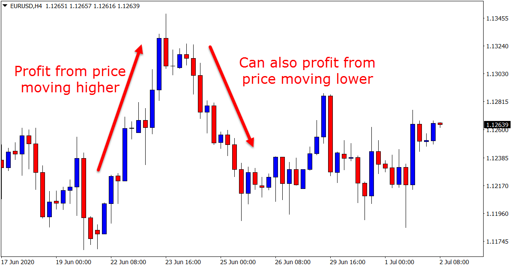

## Table of Contents

## What is Forex trading and why is it important?

Forex trading, also known as foreign exchange trading, is the buying and selling of different currencies on the global market. It's like a big marketplace where people trade money from one country for money from another country. The goal is to make a profit from the changes in the value of one currency compared to another. For example, if you think the US dollar will get stronger compared to the Euro, you might buy dollars with Euros, and then sell the dollars later for more Euros if the value goes up.

Forex trading is important for several reasons. First, it helps businesses and travelers exchange money when they need to buy things in different countries. Without Forex trading, it would be hard for a company in Japan to pay for goods from the United States. Second, it helps countries manage their economies. Governments and central banks use Forex markets to keep their currency stable and to control inflation. Lastly, Forex trading is a big part of the global financial system, and it affects how money moves around the world, which can impact everyone's daily life.

## How does the Forex market work?

The Forex market is where people and organizations trade different currencies. It's open 24 hours a day, from Monday to Friday, and it's the biggest financial market in the world. When you trade on the Forex market, you're basically guessing if one currency will become more valuable than another. For example, if you think the US dollar will get stronger compared to the Euro, you might buy dollars with Euros. If the dollar does get stronger, you can sell it back for more Euros than you started with, and you make a profit.

The Forex market doesn't have a single location. Instead, it's a network of banks, brokers, and traders all over the world, connected by computers and phones. These traders use something called a "currency pair" to trade. A currency pair is just two currencies, like the US dollar and the Euro, written as USD/EUR. The first currency in the pair is the one you're buying, and the second is the one you're selling. The price of the currency pair changes all the time, based on things like how well a country's economy is doing, what the government is doing, and even big news events. Traders watch these changes closely to decide when to buy and sell.

## What are the major currency pairs in Forex trading?

In Forex trading, the major currency pairs are the ones that are traded the most. These pairs involve the world's biggest economies and are considered the most liquid, meaning they are easy to buy and sell. The most common major currency pairs are the US dollar (USD) paired with other major currencies. For example, you have the Euro and US dollar pair (EUR/USD), the US dollar and Japanese yen pair (USD/JPY), and the British pound and US dollar pair (GBP/USD). These pairs are popular because a lot of people and businesses need to trade these currencies.

There are also other important major pairs that don't include the US dollar. These include the Euro and British pound pair (EUR/GBP), the Euro and Japanese yen pair (EUR/JPY), and the British pound and Japanese yen pair (GBP/JPY). Even though they don't involve the US dollar, they are still very important because they represent big economies and are traded a lot. Traders watch these pairs closely because changes in their values can affect a lot of people and businesses around the world.

## What are the basic terms and concepts beginners should know in Forex trading?

When you start Forex trading, there are some basic terms and concepts you should know. First, there's the "currency pair," which is just two currencies you trade against each other, like USD/EUR. The first currency is called the "base currency," and the second is the "quote currency." The "exchange rate" is how much of the quote currency you need to buy one unit of the base currency. "Pips" are the smallest change in the exchange rate, and they're important because they show how much money you can make or lose. "Leverage" lets you trade more money than you actually have, but it's risky because you can lose more money too.

Another important concept is "bid and ask prices." The "bid price" is what someone is willing to pay for the base currency, and the "ask price" is what someone is willing to sell it for. The difference between these two prices is called the "spread," and it's how brokers make money. "Long" means you expect the base currency to go up in value, so you buy it, and "short" means you expect it to go down, so you sell it. "Stop-loss" and "take-profit" orders help you manage risk by automatically closing your trade when it reaches a certain loss or profit level. Understanding these terms will help you navigate the Forex market better and make smarter trading decisions.

## How can someone start trading Forex?

To start trading Forex, you first need to choose a reliable broker. A broker is like a middleman who helps you buy and sell currencies. Look for a broker that is regulated by a financial authority, has good reviews, and offers a user-friendly trading platform. Once you've picked a broker, you'll need to open an account with them. This usually involves filling out some forms with your personal information and maybe sending some documents to prove who you are. After your account is set up, you'll need to deposit some money into it. This is called your trading capital, and it's what you'll use to make trades.

Once you have your account set up and funded, you can start trading. Most brokers offer a demo account where you can practice trading without using real money. This is a great way to learn how the platform works and to try out different trading strategies. When you're ready to trade for real, you'll choose a currency pair and decide if you want to buy or sell based on whether you think the base currency will go up or down in value. You can set stop-loss and take-profit orders to manage your risk. Remember, Forex trading can be risky, so it's important to learn as much as you can and start with small amounts of money until you feel more confident.

## What are the different types of Forex trading strategies?

There are several types of Forex trading strategies that traders use to try to make money. One common strategy is called "[day trading](/wiki/day-trading-spy)," where traders buy and sell currencies within the same day, trying to take advantage of small changes in the exchange rate. Another strategy is "swing trading," where traders hold onto their trades for a few days or weeks, hoping to catch bigger price movements. "Scalping" is another strategy where traders make lots of small trades throughout the day, aiming to make small profits from each one that add up over time. 

"Position trading" is a longer-term strategy where traders might hold onto their trades for months or even years, trying to benefit from big trends in the market. "Trend following" is a strategy where traders look for patterns in the market and try to trade in the same direction as the trend. "Breakout trading" involves watching for when the price of a currency pair moves outside of its usual range, and then trading in the direction of that move. Each of these strategies has its own risks and rewards, and the best one for you depends on your goals, how much time you can spend trading, and how much risk you're willing to take.

## What are the risks involved in Forex trading and how can they be managed?

Forex trading can be risky because the market can change quickly and unexpectedly. One big risk is losing money. If the exchange rate moves against you, you could lose more than you put in, especially if you use leverage, which lets you trade with more money than you actually have. Another risk is that the market can be affected by things you can't control, like news events or government decisions. Also, there's the risk of choosing a bad broker who might not be honest or might go out of business.

To manage these risks, you can start by only trading with money you can afford to lose. It's also a good idea to use stop-loss orders, which automatically close your trade if it starts losing too much money. This can help limit your losses. Another way to manage risk is to not put all your money into one trade. Instead, spread it out over different trades, which is called diversification. Finally, always do your research and choose a reliable broker who is regulated by a financial authority. Learning as much as you can about the market and practicing with a demo account before using real money can also help you make better trading decisions and manage your risks better.

## How does leverage work in Forex trading and what are its implications?

Leverage in Forex trading is like borrowing money from your broker to trade with more than you actually have. For example, if you have $1,000 and your broker offers 100:1 leverage, you can trade with $100,000. This means you can control a much bigger position in the market with a small amount of your own money. Leverage is measured as a ratio, like 50:1 or 100:1, which shows how much more you can trade compared to your own money. It's a powerful tool because it can help you make bigger profits if the market moves in your favor.

However, leverage also makes trading riskier. If the market moves against you, your losses can be much bigger than what you put in. With the same example, if you lose just 1% of your $100,000 position, that's $1,000, which is all the money you started with. This is why using leverage can lead to big losses quickly. It's important to use leverage carefully and understand that while it can increase your potential profits, it also increases your potential losses. Always think about how much risk you're willing to take before using leverage in your trades.

## What are the key technical analysis tools used in Forex trading?

Technical analysis in Forex trading involves looking at past price movements and other market data to predict future price changes. One of the most common tools is the "moving average," which smooths out price data to show trends over time. Traders often use two moving averages, a short-term one and a long-term one, to see when they cross each other. This can signal when it might be a good time to buy or sell. Another important tool is the "Relative Strength Index" (RSI), which measures how fast and how much a currency pair's price has changed. If the RSI is over 70, it might mean the currency is overbought and could go down soon. If it's under 30, it might be oversold and could go up.

Charts are also a big part of technical analysis. "Candlestick charts" show the open, high, low, and close prices for a currency pair over a certain time. Traders look for patterns in these candlesticks, like "doji" or "hammer," to guess where the price might go next. "Support and resistance levels" are other key tools. Support is a price level where the currency pair tends to stop falling, and resistance is where it tends to stop rising. Traders use these levels to decide when to enter or [exit](/wiki/exit-strategy) trades. By combining these tools, traders can make more informed decisions about when to buy and sell currencies.

## How important is fundamental analysis in Forex trading?

Fundamental analysis is very important in Forex trading because it helps traders understand why a currency's value might change. This type of analysis looks at things like a country's economy, interest rates, political events, and even natural disasters. For example, if a country's economy is doing well, its currency might get stronger because more people want to invest there. On the other hand, if a country is having political problems, its currency might get weaker because people might want to take their money out. By keeping an eye on these factors, traders can make better guesses about where the exchange rate might go.

While technical analysis focuses on past price movements and patterns, [fundamental analysis](/wiki/fundamental-analysis) gives traders a bigger picture of what might affect the currency's value in the future. It's like looking at the health of a country's economy instead of just its recent performance. Both types of analysis are useful, but fundamental analysis is especially important for traders who hold onto their trades for a longer time. By understanding the big things that can move the market, traders can make more informed decisions and maybe even find good opportunities that others might miss.

## What are the common mistakes beginners make in Forex trading and how to avoid them?

One common mistake beginners make in Forex trading is not having a clear plan. They might jump into trades without thinking about why they're doing it or what they hope to achieve. This can lead to making decisions based on emotions instead of logic. To avoid this, beginners should take time to learn about the market, set clear goals, and make a trading plan. This plan should include when to enter and exit trades, how much money to risk, and what strategies to use. Sticking to the plan can help keep emotions in check and make trading more disciplined.

Another mistake is using too much leverage. Leverage can make your profits bigger, but it can also make your losses bigger. Beginners might get tempted by the idea of making a lot of money quickly, but they don't always understand the risks. To avoid this, start with low leverage and only use what you're comfortable with. It's also a good idea to practice with a demo account first, so you can see how leverage works without risking real money. Remember, it's better to grow slowly and steadily than to risk losing everything in one big trade.

Lastly, beginners often don't manage their risk well. They might put all their money into one trade or not use stop-loss orders to limit their losses. This can lead to big losses if the market moves against them. To avoid this, always use stop-loss orders to protect your money. Also, don't put all your money into one trade; spread it out over different trades to reduce the risk. Learning about risk management and using it in your trading can help you stay in the game longer and increase your chances of success.

## How can one continue to learn and improve as a Forex trader?

To keep learning and getting better at Forex trading, it's a good idea to always be reading and learning. There are lots of [books](/wiki/algo-trading-books), websites, and online courses that can teach you new things about the market. Joining a trading community or finding a mentor can also help a lot. These people can share their experiences and give you tips that you might not find in books. It's also smart to keep a trading journal where you write down what you did, why you did it, and what happened. This can help you see what works and what doesn't, so you can improve your strategies over time.

Another important way to improve is by practicing a lot. Using a demo account to trade without real money can help you try out new strategies and see how they work without risking anything. As you get more confident, you can start trading with small amounts of real money. It's also important to keep up with the news and economic reports because they can affect the market. By staying informed and practicing regularly, you can get better at understanding the market and making good trading decisions. Remember, becoming a good Forex trader takes time and patience, so keep learning and don't get discouraged if things don't go perfectly right away.

## References & Further Reading

[1]: Bergstra, J., Bardenet, R., Bengio, Y., & Kégl, B. (2011). ["Algorithms for Hyper-Parameter Optimization."](https://papers.nips.cc/paper/4443-algorithms-for-hyper-parameter-optimization) Advances in Neural Information Processing Systems 24.

[2]: ["Advances in Financial Machine Learning"](https://www.amazon.com/Advances-Financial-Machine-Learning-Marcos/dp/1119482089) by Marcos Lopez de Prado

[3]: ["Evidence-Based Technical Analysis: Applying the Scientific Method and Statistical Inference to Trading Signals"](https://www.amazon.com/Evidence-Based-Technical-Analysis-Scientific-Statistical/dp/0470008741) by David Aronson

[4]: ["Machine Learning for Algorithmic Trading"](https://github.com/PacktPublishing/Machine-Learning-for-Algorithmic-Trading-Second-Edition) by Stefan Jansen

[5]: ["Quantitative Trading: How to Build Your Own Algorithmic Trading Business"](https://books.google.com/books/about/Quantitative_Trading.html?id=j70yEAAAQBAJ) by Ernest P. Chan