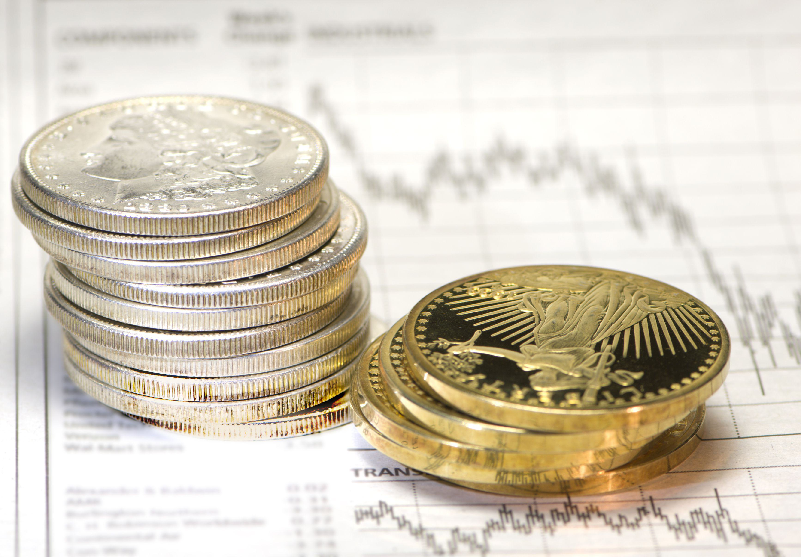

## Table of Contents

## What are precious metals and why are they considered valuable?

Precious metals are rare metals that people think are very valuable. Some common precious metals are gold, silver, and platinum. These metals are often shiny and don't rust or tarnish easily, which makes them special. They are used to make jewelry, coins, and other things that people want to keep for a long time.

People consider precious metals valuable for a few reasons. First, they are rare, which means there isn't a lot of them in the world. When something is rare, it usually costs more because not everyone can have it. Second, many cultures have used these metals for a long time, so they have a history of being important. People trust them as a way to store wealth because they keep their value over time.

## What are the different types of precious metals one can invest in?

When you want to invest in precious metals, you have a few choices. The most popular ones are gold, silver, and platinum. Gold is often seen as a safe investment because it has been valuable for thousands of years. People like to buy gold coins, bars, or even jewelry. Silver is another good choice. It's not as expensive as gold, but it's still valuable and used in many things like electronics and coins. Platinum is less common than gold and silver, but it's very strong and used in things like car parts and jewelry.

There are also other precious metals you can invest in, like palladium and rhodium. Palladium is used a lot in car parts, especially in catalytic converters, which help clean the air. It's not as well-known as gold or silver, but it can be a good investment. Rhodium is even rarer than palladium and is used to coat other metals to make them last longer. It's very expensive, so it's not as common for people to invest in it, but it can be a good choice if you want something different.

In the end, each of these metals has its own reasons for being valuable. Some are more common and easier to buy, while others are rarer and might be riskier. It's important to learn about each one before you decide to invest your money in them.

## How does investing in precious metals differ from other types of investments?

Investing in precious metals is different from other types of investments because they are physical items you can touch and hold, unlike stocks or bonds which are just numbers on a screen. Precious metals like gold, silver, and platinum are often seen as safe investments because they keep their value over time. They can be a good way to protect your money if the economy is doing badly because people still want them even when things are tough.

Another way investing in precious metals is different is that they don't give you income like dividends from stocks or interest from bonds. When you buy stocks, you might get paid a little bit of money every year, but with precious metals, you only make money if you sell them for more than you paid. This means you need to be careful about when you buy and sell them to make a profit. Precious metals can also be harder to sell quickly compared to selling stocks or bonds, so you need to think about how easy it will be to turn them back into cash if you need to.

## What are the benefits of including precious metals in an investment portfolio?

Including precious metals in an investment portfolio can help spread out your risk. When you have different types of investments, like stocks, bonds, and precious metals, it's less likely that all of them will lose value at the same time. Precious metals like gold and silver often go up in value when the economy is doing badly, so they can protect your money when other investments are going down. This is called diversification, and it's a smart way to keep your money safe.

Another benefit is that precious metals can keep their value over a long time. Unlike money, which can lose value because of inflation, gold and silver have been valuable for thousands of years. This means they can be a good way to save your wealth for the future. If you're worried about the economy or want to make sure your money is safe, having some precious metals in your portfolio can give you peace of mind.

## What are the risks associated with investing in precious metals?

Investing in precious metals like gold, silver, and platinum can be risky because their prices can go up and down a lot. Sometimes, the price might go way up, but other times it might go way down. This can happen because of things like the economy, wars, or even just what people think about the metal at the time. If you need to sell your precious metals quickly and the price is low, you might lose money.

Another risk is that precious metals don't give you any income while you own them. Unlike stocks or bonds, which might pay you dividends or interest, you only make money from precious metals if you sell them for more than you paid. This means you need to be patient and wait for the right time to sell. If you keep them for a long time and the price doesn't go up, you won't earn anything from them.

Lastly, it can be hard to sell precious metals quickly. If you need to turn them into cash fast, you might have to sell them for less than they're worth. This is different from selling stocks or bonds, which you can usually do quickly online. Also, you need to be careful about where you store your precious metals because they can be stolen or damaged if you don't keep them safe.

## How can a beginner start investing in precious metals?

If you want to start investing in precious metals, the first thing to do is learn about them. Gold, silver, and platinum are the most common ones people invest in. You can read [books](/wiki/algo-trading-books), watch videos, or even talk to people who know about precious metals. Once you know more, decide how much money you want to spend. It's a good idea to only use money you can afford to lose, just in case the price goes down.

Next, you need to decide how you want to buy the precious metals. You can buy coins, bars, or even jewelry. If you want coins or bars, you can go to a coin shop, a bank, or buy them online. Make sure to buy from a place you trust so you don't get fake metals. If you choose jewelry, remember that it might not be as easy to sell later. After you buy them, you need to keep them safe. You can keep them at home in a safe, or you can pay to store them in a safe place like a bank vault.

Remember, investing in precious metals can be risky. Their prices can go up and down a lot, so you need to be ready for that. It's also a good idea to talk to a financial advisor before you start. They can help you figure out if investing in precious metals is right for you and how it can fit into your overall plan for your money.

## What are the various ways to invest in precious metals (e.g., physical bullion, ETFs, mining stocks)?

There are several ways to invest in precious metals, and one of the most straightforward methods is buying physical bullion. This means buying gold, silver, or platinum in the form of coins, bars, or even jewelry. You can buy these from coin shops, banks, or online dealers. It's important to make sure you're buying from a trusted source to avoid fakes. Once you have the physical metal, you need to store it safely, either at home in a secure safe or in a bank vault where you might have to pay for storage.

Another way to invest in precious metals is through Exchange-Traded Funds (ETFs). ETFs are like funds that you can buy and sell on the stock market, and they track the price of the metal they represent. For example, a gold [ETF](/wiki/etf-trading-strategies) will go up and down in price based on the price of gold. This is a good option if you don't want to deal with storing physical metal. It's easier to buy and sell ETFs because you can do it online through a brokerage account, just like buying stocks.

You can also invest in precious metals by buying stocks in mining companies. These are companies that mine gold, silver, or other precious metals. The price of their stock can go up if the price of the metal they mine goes up, but it can also be affected by how well the company is doing. This can be riskier than buying physical metal or ETFs because the company's performance can impact the stock price, but it can also offer higher returns if the company does well.

## How do market conditions and economic factors affect the price of precious metals?

Market conditions and economic factors can really change the price of precious metals like gold, silver, and platinum. When the economy is doing badly, people often buy more precious metals because they think it's a safe place to put their money. This can make the price go up. On the other hand, if the economy is doing well, people might not want to buy as much gold or silver, and the price might go down. Things like inflation, which is when the money loses value over time, can also make people buy more precious metals because they want to keep their wealth safe.

Another thing that affects the price of precious metals is what's happening around the world. If there's a war or a big political problem, people might buy more precious metals because they're worried about what's going to happen. This can push the price up. Also, if there's a change in how much of the metal is being made or found, that can change the price too. If it's harder to find gold, the price might go up because there's less of it. So, many different things can make the price of precious metals go up and down.

## What are the tax implications of investing in precious metals?

When you invest in precious metals, you need to know about taxes. If you buy and sell gold, silver, or platinum for a profit, you have to pay capital gains tax. This tax is on the money you make from selling the metal for more than you paid for it. If you hold the metal for less than a year before selling, you pay a short-term capital gains tax, which is the same as your regular income tax. If you hold it for more than a year, you pay a long-term capital gains tax, which is usually lower. 

There are also some special rules for certain types of precious metals. For example, if you invest in gold or silver coins and they are considered collectibles by the IRS, you might have to pay a higher tax rate on them. Also, if you keep your precious metals in an IRA, the tax rules can be different. With a traditional IRA, you don't pay taxes on the money you put in until you take it out, but with a Roth IRA, you pay taxes upfront and then your earnings can be tax-free if you follow the rules. It's a good idea to talk to a tax advisor to understand all the tax rules that might apply to your investments in precious metals.

## How should one store and secure physical precious metals?

When you have physical precious metals like gold or silver, you need to keep them safe. One way to do this is by using a home safe. Make sure the safe is strong and hard to break into. You can put it in a hidden place in your home, like behind a picture or in a closet. It's also a good idea to not tell a lot of people about your safe or what's inside it. This way, you can keep your precious metals secure and close to you.

Another way to store your precious metals is by using a bank's safe deposit box. This is a special box at the bank where you can keep your valuables. You have to pay a fee for this, but it's very safe because the bank has good security. You can visit the bank to check on your metals whenever you need to. This is a good choice if you don't want to worry about keeping them safe at home.

## What strategies can be used to maximize returns from precious metals investments?

To maximize returns from investing in precious metals, you need to buy them at the right time and sell them when the price is high. One good strategy is to watch the market and buy when the price is low. This often happens when the economy is doing well, and people are not as worried about keeping their money safe. You can also look for special deals or discounts from trusted sellers. Once you have your metals, wait for the right time to sell. This could be when the economy is doing badly, and people want to buy more gold or silver to protect their money. Being patient and waiting for the right moment can help you make more money.

Another strategy is to diversify your investments. Instead of putting all your money into one type of precious metal, like gold, you can also invest in silver, platinum, or even palladium. This way, if the price of one metal goes down, you might still make money from the others. You can also mix precious metals with other types of investments, like stocks or bonds. This can help spread out your risk and give you a better chance of making more money over time.

## How can an investor stay updated on trends and developments in the precious metals market?

To stay updated on trends and developments in the precious metals market, an investor should read financial news websites and watch business news channels. Websites like Bloomberg, Reuters, and Kitco often have articles and reports about what's happening with gold, silver, and other precious metals. These sites can tell you about changes in prices, new mining discoveries, and what experts think will happen next. Watching shows on channels like CNBC or Fox Business can also help, as they often talk about the economy and how it affects precious metals.

Another good way to stay informed is by joining online forums and social media groups where people talk about precious metals. Websites like Reddit and specialized forums can be great places to learn from other investors. You can ask questions, share your own thoughts, and see what others are doing. It's also a good idea to sign up for newsletters from precious metals dealers or investment companies. They often send out regular updates and reports that can help you understand the market better and make smarter decisions about when to buy or sell.

## References & Further Reading

[1]: Bergstra, J., Bardenet, R., Bengio, Y., & Kégl, B. (2011). ["Algorithms for Hyper-Parameter Optimization."](https://papers.nips.cc/paper/4443-algorithms-for-hyper-parameter-optimization) Advances in Neural Information Processing Systems 24.

[2]: ["Advances in Financial Machine Learning"](https://www.amazon.com/Advances-Financial-Machine-Learning-Marcos/dp/1119482089) by Marcos Lopez de Prado

[3]: ["Evidence-Based Technical Analysis: Applying the Scientific Method and Statistical Inference to Trading Signals"](https://books.google.com/books/about/Evidence_Based_Technical_Analysis.html?id=jbD47VkOHAEC) by David Aronson

[4]: ["Machine Learning for Algorithmic Trading"](https://github.com/stefan-jansen/machine-learning-for-trading) by Stefan Jansen

[5]: ["Quantitative Trading: How to Build Your Own Algorithmic Trading Business"](https://github.com/LucindaYa/quant-resources/blob/master/Quantitative%20Trading%20How%20to%20Build%20Your%20Own%20Algorithmic%20Trading%20Business.pdf) by Ernest P. Chan