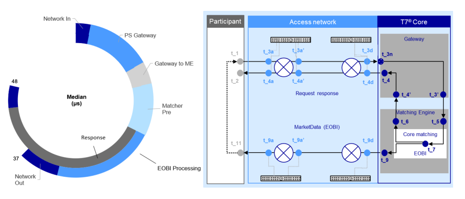

## Table of Contents

## What is a matching engine?

A matching engine is a computer system that helps buy and sell orders meet in financial markets. It works like a matchmaker, trying to find the best possible matches between buyers and sellers. When someone wants to buy a stock, the matching engine looks for someone who wants to sell that same stock at a price that both can agree on. This process happens very quickly, often in milliseconds, to make sure trades happen smoothly and fairly.

In stock exchanges, the matching engine is crucial because it makes sure that trading is efficient and transparent. It follows strict rules to decide which orders get filled first, usually based on price and time. For example, if two people want to buy the same stock, the one who offered a higher price or placed the order first will get it. This helps keep the market fair for everyone involved.

## What are the basic components of a matching engine?

A matching engine has a few main parts that work together to make trading happen. The first part is the order book, which keeps track of all the buy and sell orders that people want to make. It's like a list that shows what everyone wants to do, including how much they want to buy or sell and at what price. The second part is the matching algorithm, which is like a smart rulebook that decides how to match buyers and sellers. It looks at the order book and figures out which orders can be matched based on price and time.

Another important part is the trade execution system, which actually makes the trades happen once the matching algorithm finds a match. This system makes sure that when a buyer and seller agree on a price, the trade goes through quickly and correctly. There's also a price-time priority system, which helps decide the order of trades when there are many orders at the same price. It makes sure that the oldest order gets filled first, which keeps things fair. All these parts work together to make sure that trading in financial markets is smooth and fair for everyone.

## How does a matching engine work in simple terms?

A matching engine is like a smart computer that helps people buy and sell things in a market. Imagine you want to buy a toy, and someone else wants to sell that same toy. The matching engine looks at all the people who want to buy and sell toys and tries to find a match. It checks the price you're willing to pay and the price the seller wants. If they match or are close enough, the matching engine makes the trade happen.

The matching engine keeps a list called an [order book](/wiki/order-book-trading-strategies), which shows all the buy and sell orders. It uses special rules to decide which orders get filled first. Usually, it looks at the price and the time the order was made. If two people want to buy the same toy, the one who offered more money or asked first will get it. This way, the matching engine makes sure that trading is fair and quick for everyone.

## What are the common applications of matching engines?

Matching engines are used a lot in stock markets. They help people buy and sell stocks quickly and fairly. When someone wants to buy a stock, the matching engine looks at all the people who want to sell that stock and finds the best match based on price and time. This makes sure that trading happens smoothly and everyone gets a fair chance.

Another common place where matching engines are used is in [cryptocurrency](/wiki/cryptocurrency) exchanges. Just like in stock markets, they help match buyers and sellers of different cryptocurrencies. They make sure that trades happen fast and that the prices are fair. This is important because the crypto market can be very busy and prices can change quickly.

Matching engines are also used in other types of markets, like commodity markets where people trade things like oil or gold. They work the same way, matching buyers and sellers to make sure trades happen smoothly. This helps keep the market organized and efficient, no matter what is being traded.

## What are the key performance metrics for evaluating a matching engine?

When people want to see how well a matching engine is doing, they look at a few important things. One big thing is how fast it can match buyers and sellers. In busy markets, trades need to happen very quickly, so the matching engine needs to be fast. Another thing they look at is how many trades it can handle at the same time. If a lot of people are trying to buy and sell at the same time, the matching engine needs to be able to keep up without slowing down or making mistakes.

Another important thing is how fair the matching engine is. It should follow the rules to make sure everyone gets a fair chance to buy or sell. This means it should match orders based on price and time in the right way. People also look at how often the matching engine makes mistakes or has problems. A good matching engine should work smoothly and not have many errors. All these things help people decide if a matching engine is doing a good job.

## How do order types affect the operation of a matching engine?

Order types are like different ways people can tell the matching engine what they want to do. There are simple orders, like market orders, where people just want to buy or sell something right away at the best price available. Then there are limit orders, where people say they only want to buy or sell at a certain price or better. These different types of orders can change how the matching engine works because it has to follow different rules for each type. For example, with a market order, the matching engine will quickly find the best match and make the trade happen. But with a limit order, it has to wait until the price is right before it can match the order.

These different order types can make the matching engine's job more complicated. It has to keep track of all the different orders and follow the rules for each one. For instance, if there are a lot of limit orders waiting for the right price, the matching engine might have to hold onto them until the market changes. This can slow things down a bit, but it also helps people get the price they want. So, the matching engine has to balance speed with making sure it follows all the rules for the different types of orders it gets.

## What are the differences between various matching algorithms?

Matching algorithms are like different ways a matching engine can find the best match between buyers and sellers. One common type is the price-time priority algorithm. This one looks at the price first and then the time the order was made. If two people want to buy something at the same price, the one who asked first gets it. This makes sure things are fair and helps keep the market organized. Another type is the pro-rata algorithm, which shares trades among orders at the same price based on their size. If there's a big order and a small order at the same price, the big order might get a bigger piece of the trade, but both will get some.

There's also the FIFO (First In, First Out) algorithm, which is a bit like price-time priority but focuses more on the time the order was made. If two orders are at the same price, the one that came in first gets filled first. This can be simpler and faster but might not be as fair if one person keeps placing orders just before others. Lastly, some markets use a hybrid algorithm, which mixes different methods to try and get the best of both worlds. For example, it might use price-time priority most of the time but switch to pro-rata for very big trades. Each type of algorithm has its own way of making sure trades happen smoothly and fairly, depending on what the market needs.

## How do matching engines handle high-frequency trading?

Matching engines have to work really hard when it comes to high-frequency trading. High-frequency trading is when people use computers to buy and sell things very quickly, often in just a few milliseconds. The matching engine needs to be super fast to keep up with all these quick trades. It has to look at a lot of orders at the same time and match them as fast as possible. If it's too slow, it might miss trades or make mistakes, which can be a big problem in a busy market.

To handle high-frequency trading, matching engines use special technology. They have powerful computers and smart software that can process a lot of information very quickly. They also use special rules, like the ones in the matching algorithms, to make sure the trades happen in the right order and at the right price. This helps keep everything fair and smooth, even when the market is moving really fast. So, matching engines are really important for making sure high-frequency trading works well and doesn't cause problems.

## What are the challenges in scaling a matching engine for large volumes?

Scaling a matching engine to handle large volumes of trades can be really tough. When there are a lot of people trying to buy and sell at the same time, the matching engine has to work super fast to keep up. It needs to match all these orders quickly and make sure it doesn't make any mistakes. If it's too slow, trades might not happen on time, and people could lose money. Also, the matching engine has to use a lot of computer power to handle all this data, which can be expensive and hard to manage.

Another challenge is keeping everything fair when there are so many orders. The matching engine has to follow strict rules to make sure everyone gets a fair chance to buy or sell. This can be hard when there are thousands of orders coming in every second. The matching engine also has to deal with different types of orders, like market orders and limit orders, which can make things even more complicated. So, scaling a matching engine means making sure it can handle a lot of trades quickly, fairly, and without messing up.

## How do matching engines ensure fairness and transparency in trading?

Matching engines help keep trading fair and clear by using strict rules to match buyers and sellers. They use a special list called an order book to keep track of all the buy and sell orders. The matching engine looks at this list and follows rules like price and time to decide which orders get filled first. For example, if two people want to buy the same thing at the same price, the one who asked first will get it. This makes sure that everyone has a fair chance to trade, no matter how big or small their order is.

Another way matching engines make trading clear is by showing all the orders and trades to everyone. This means that people can see what prices others are buying and selling at, which helps them make better decisions. The matching engine also makes sure that all trades happen quickly and correctly, so no one can sneak in and change things unfairly. By doing all this, matching engines help keep the market honest and open for everyone.

## What advanced technologies are used to enhance the performance of matching engines?

Matching engines use some really cool technology to make them work better and faster. One big thing they use is super fast computers called high-performance servers. These servers can handle a lot of information at once, which helps the matching engine match buyers and sellers quickly, even when the market is really busy. Another important technology is special software that can process data very quickly. This software helps the matching engine look at all the orders and find the best matches without slowing down.

Another technology that helps is called in-memory computing. This means the matching engine keeps all the important data in the computer's memory instead of on a hard drive. This makes it much faster to look at and match orders because the computer doesn't have to wait to get the data from a slower storage place. Also, some matching engines use something called parallel processing, where the computer works on different parts of the matching job at the same time. This can make the matching engine even faster and better at handling a lot of trades.

## What future trends are expected to influence the development of matching engines?

In the future, matching engines are expected to get even faster and smarter thanks to new technology. One big trend is the use of [artificial intelligence](/wiki/ai-artificial-intelligence) (AI) and [machine learning](/wiki/machine-learning). These technologies can help matching engines learn from past trades and make better decisions about how to match buyers and sellers. This could make trading even fairer and more efficient. Another trend is the growth of blockchain technology, which could change how matching engines work by making them more secure and transparent. Blockchain could help keep track of all trades in a way that everyone can trust, which is really important in busy markets.

Another important trend is the move towards more real-time trading. People want to buy and sell things faster than ever, so matching engines will need to keep up with this demand. This means they'll need to use even more powerful computers and smart software to handle all the orders quickly. Also, as more markets around the world connect with each other, matching engines will need to work well across different countries and time zones. This will make trading easier and more global, but it will also make the job of the matching engine more complicated.

## References & Further Reading

[1]: Ralf Stöcker, Guido Gondorf, & Christopher Schmitz (2019). ["Matching mechanisms in financial markets."](https://academic.oup.com/restud/article/87/3/1399/5610540) Annals of Operations Research 272, 207–240.

[2]: Esposito, M. (2020). ["High Frequency Trading: A Practical Guide to Algorithmic Strategies and Trading."](https://www.wiley.com/en-us/High+Frequency+Trading%3A+A+Practical+Guide+to+Algorithmic+Strategies+and+Trading+Systems-p-9780470579770) Wiley.

[3]: Lam, R. (2015). ["High Frequency Trading and the New Market Makers."](https://www.sciencedirect.com/science/article/pii/S1386418113000281) Business Expert Press.

[4]: Aldridge, I. (2013). ["High-Frequency Trading: A Practical Guide to Algorithmic Strategies and Trading Systems."](https://www.wiley.com/en-us/High+Frequency+Trading%3A+A+Practical+Guide+to+Algorithmic+Strategies+and+Trading+Systems-p-9780470579770) Wiley.

[5]: Hasbrouck, J. (2018). ["High Frequency Quoting, Trading, and the Efficiency of Prices."](https://www.jstor.org/stable/pdf/26591921.pdf) The Journal of Finance, 73(2), 913-957.