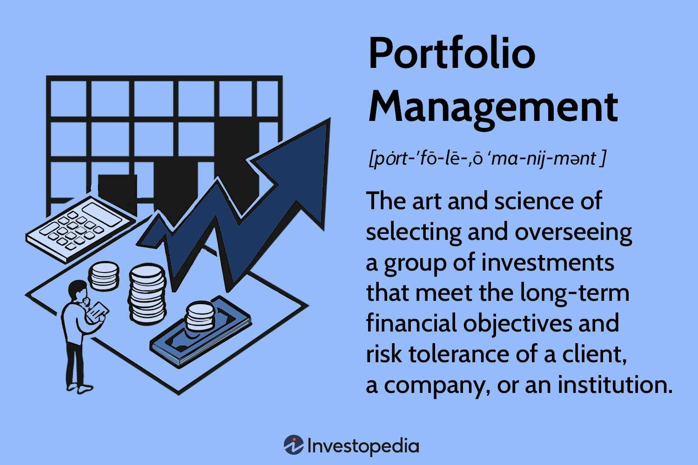

Algorithmic trading, or algo trading, is a sophisticated method of executing financial transactions using pre-programmed instructions that consider various factors such as timing, price, and volume. These algorithms are designed to act as intermediaries between traders and markets, automating processes that traditionally required human intervention and judgment. Within this streamlined trading approach, portfolio management emerges as a critical element, aimed at achieving specific investment objectives through the systematic handling of a collection of financial instruments.

Portfolio management in the context of algorithmic trading is fundamentally about balancing risk and return. As markets evolve, becoming increasingly liquid and efficient, the ability to manage and optimize a portfolio effectively becomes vital for maximizing investment returns while simultaneously controlling exposure to risk. This balance is achieved through an intricate interaction of statistical analysis, mathematical models, and automated systems, allowing for the dynamic adjustment of a portfolio's composition in response to market conditions.



The modernization of financial markets, driven by technology and data analytics, has greatly enhanced the efficiency with which trades are executed. Consequently, it is essential for investment strategies to incorporate robust portfolio management practices that leverage these advancements. By employing algorithms that can quickly analyze and respond to data, traders are better positioned to optimize asset allocation and execute trades across an array of financial instruments with precision.

In summary, algorithmic trading transforms how portfolios are managed by incorporating automated processes that enhance decision-making. As technology continues to advance, the importance of effective portfolio management within the framework of algorithmic trading becomes increasingly pronounced, representing an integral component in the pursuit of profitable and risk-managed investment strategies.

## Table of Contents

## What is Portfolio Management in Algo Trading?

Portfolio management in algorithmic trading involves the systematic administration of a collection of financial assets to achieve defined investment objectives. This sophisticated method of management employs quantitative techniques designed to efficiently handle risks and returns. Algorithms play a significant role in this process, providing a data-driven, disciplined framework for decision-making that can adjust to real-time market dynamics and conditions.

The core aim of an algorithmic portfolio management approach is to optimize the balance between risk and return. This requires a meticulous analysis of potential returns against associated risks, ensuring that the portfolio aligns with the investor's risk appetite and strategic goals. Beyond risk and return, effective portfolio management also considers transaction costs, liquidity, and the prevailing market conditions that influence asset prices.

Algorithms use sets of predefined rules—derived from financial theories and past market data—to guide investment decisions. These rules often rely on models such as the Capital Asset Pricing Model (CAPM) to assess expected returns or the Black-Scholes model for option pricing. An essential component of algorithmic portfolio management is the use of mean-variance optimization, which employs mathematical techniques to choose the portfolio composition that minimizes risk for a given level of expected return, often visualized via the efficient frontier:

$$
\min \sigma_p^2 = \mathbf{w}^T \mathbf{\Sigma} \mathbf{w}
$$

subject to:

$$
E(R_p) = \mathbf{w}^T \mathbf{\mu}
$$

$$
\sum w_i = 1
$$

Where:
- $\sigma_p^2$ is the portfolio variance,
- $\mathbf{w}$ is the vector of asset weights in the portfolio,
- $\mathbf{\Sigma}$ represents the covariance matrix of asset returns,
- $E(R_p)$ is the expected return of the portfolio,
- $\mathbf{\mu}$ is the vector of expected returns for the assets.

Additionally, algorithms in portfolio management leverage current technological advancements such as [machine learning](/wiki/machine-learning) and data analytics. These technologies enhance the capability to predict asset movements, optimize asset allocation, and execute trades efficiently, adapting strategies to evolving market trends and minimizing potential human biases.

Portfolio management in [algorithmic trading](/wiki/algorithmic-trading) is not merely about asset selection; it is about constructing a resilient portfolio through automated processes that are not only efficient but also adaptable to the prevailing market environment. Quantitative methods, advanced analytics, and real-time decision-making are the linchpins of successful portfolio management in algorithmic trading, yielding a robust framework that aligns with the overarching goals of maximizing returns and controlling risks.

## Key Components of Portfolio Management

Effective portfolio management in algorithmic trading encompasses a strategic framework designed to achieve a balance between risk and return. At its core, it involves four key components: asset selection, diversification, risk assessment, and performance measurement.

**Asset Selection**: Asset selection is the process of identifying the most suitable financial instruments to include in a portfolio. In algorithmic trading, this selection is guided by quantitative methods that involve screening assets based on specific criteria such as past performance, volatility, liquidity, and market trends. Algorithms assess historical data and may employ machine learning techniques to predict future asset performance, thereby optimizing the selection process. A common approach is to use factor models, which evaluate assets based on factors like value, momentum, and size.

**Diversification**: Diversification is a risk management strategy that involves spreading investments across various assets to reduce exposure to any single asset or risk. In algorithmic trading, diversification is not just about different asset classes but can also extend to different strategies and markets. Algorithms analyze correlations between asset returns to construct a diversified portfolio that minimizes unsystematic risk. The goal is to achieve a portfolio with a risk-return profile that suits the investor's objective, often visualized through the efficient frontier, as proposed by Harry Markowitz in his Modern Portfolio Theory (MPT).

**Risk Assessment**: This component involves identifying, quantifying, and managing the risks associated with a portfolio. Algorithms calculate risk metrics such as Value at Risk (VaR), Conditional Value at Risk (CVaR), and Sharpe Ratio to gauge potential losses and returns adjusted for risk. For instance, the Sharpe Ratio is calculated as:

$$
\text{Sharpe Ratio} = \frac{\bar{R} - R_f}{\sigma}
$$

where $\bar{R}$ is the expected return of the portfolio, $R_f$ is the risk-free rate, and $\sigma$ is the standard deviation of the portfolio's excess return. Higher values indicate better risk-adjusted returns. Algorithms continuously reassess these metrics to promptly respond to changes in market conditions.

**Performance Measurement**: This aspect involves evaluating the effectiveness of a portfolio management strategy. Performance measurement is done through backtesting, where historical data is used to simulate how a portfolio would have performed. Key metrics include the total return, alpha, and beta, which indicate the portfolio's return relative to a benchmark, market risk, and volatility, respectively. Another essential metric is the Sortino Ratio, which improves upon the Sharpe Ratio by only accounting for downside risk.

Portfolio managers use these measures to refine strategies and ensure alignment with investment objectives. The integration of these components through sophisticated algorithms allows for the efficient management of portfolios, ensuring that investors can achieve their desired financial outcomes with a robust approach to risk and return.

## Techniques and Approaches in Portfolio Management

Portfolio management in algorithmic trading employs several key techniques and approaches, each designed to optimize asset allocation and maximize returns while managing risks. One common technique is value investing, which involves selecting stocks or other securities perceived to be undervalued by the market. In an algorithmic setting, value investing can be automated by using algorithms to screen and rank securities based on various financial metrics like the price-to-earnings ratio or the discounted cash flow model.

Mean-variance optimization, another crucial technique, aims at constructing an asset portfolio that minimizes risk for a given level of expected return, or equivalently, maximizes expected return for a given level of risk. This method relies on the mathematical framework introduced by Harry Markowitz in 1952. The essence of mean-variance optimization is encapsulated in the following equation, representing the optimization problem:

$$
\min \frac{1}{2} \mathbf{w}^T \Sigma \mathbf{w} - \lambda \mathbf{w}^T \mathbf{\mu}
$$

Where:
- $\mathbf{w}$ is the vector of asset weights,
- $\Sigma$ is the covariance matrix of asset returns,
- $\mathbf{\mu}$ is the vector of expected asset returns,
- $\lambda$ is the risk aversion coefficient.

Risk parity is another strategy focused on risk management by allocating portfolio capital based on risk contribution rather than traditional measures such as capital weighting. The goal is to balance the risk across various assets or asset classes, ensuring that each component contributes equally to the total portfolio risk. In practice, risk parity portfolios can be implemented using Python programming to adjust and monitor the weights based on risk calculations continuously.

```python
import numpy as np

# Example Python code for calculating risk parity weights
def risk_parity_weights(returns):
    cov_matrix = np.cov(returns.T)
    inv_vol = 1 / np.diag(cov_matrix)**0.5
    weights = inv_vol / np.sum(inv_vol)
    return weights

# Sample returns data
returns = np.random.randn(1000, 4)

# Calculate risk parity weights
weights = risk_parity_weights(returns)
print("Risk Parity Weights:", weights)
```

In the context of algorithmic trading, these techniques are implemented through automated systems that continuously monitor and adjust portfolios based on predefined rules and evolving market conditions. These systems employ sophisticated algorithms that take into account factors such as transaction costs and [liquidity](/wiki/liquidity-risk-premium) constraints, ensuring that decision making is both data-driven and efficient.

## Risk Management Strategies

Risk management is an essential component of portfolio management in algorithmic trading, focusing on the identification and mitigation of potential risks that may affect investment returns. In algorithmic trading, where decisions are made at high speed and often involve significant capital, managing risk effectively is critical.

One primary strategy is diversification, which involves spreading investments across various asset classes, sectors, or geographic regions to minimize the impact of a loss in any single investment. The underlying principle is that a diversified portfolio can reduce the risk associated with individual asset [volatility](/wiki/volatility-trading-strategies), as the negative performance of some assets may be offset by the positive performance of others. Mathematically, diversification can be expressed through the reduction of the standard deviation of the portfolio, which is often less than the weighted sum of the individual assets' standard deviations.

Another vital risk management method is the use of hedging instruments. Hedging involves taking positions in financial instruments, such as options, futures, or swaps, designed to offset potential losses in the portfolio. For instance, an algorithm could automatically purchase put options to protect a stock position from a decline in price, effectively setting a floor on the minimum value of the portfolio.

Constant monitoring of risk metrics is also crucial for effective risk management in algorithmic trading. Key metrics, such as Value-at-Risk (VaR), expected shortfall, and beta, provide insights into the potential risk exposure of the portfolio. VaR, for example, estimates the maximum loss expected over a specific timeframe at a given confidence level. In Python, calculating VaR might involve historical simulation, variance-covariance methods, or Monte Carlo simulation, each providing a different approach to estimate portfolio risk.

Here's a simple Python example using historical data to compute VaR:

```python
import numpy as np
import pandas as pd

# Assume 'returns' is a DataFrame containing historical returns of the portfolio
confidence_level = 0.95
loss_threshold = 1 - confidence_level

# Calculate the historical VaR
VaR = np.percentile(returns, loss_threshold * 100)

print(f"Value-at-Risk (VaR) at {confidence_level*100}% confidence level: {VaR:.2f}")
```

Effective risk management strategies are indispensable in algorithmic trading, ensuring that trading activities align with the investor's risk tolerance and return objectives. By employing diversification, utilizing hedging instruments, and continuously monitoring risk metrics, algorithmic trading systems can better navigate market uncertainties and protect capital against adverse movements.

## Tools and Technologies used in Algorithmic Portfolio Management

Algorithmic portfolio management leverages cutting-edge technologies to enhance decision-making and execution efficacy in financial markets. Central to this approach are machine learning, [artificial intelligence](/wiki/ai-artificial-intelligence) (AI), and big data analytics, each offering unique capabilities that contribute toward optimizing trading strategies and effectively managing portfolios.

Machine learning, a subset of AI, is instrumental in building predictive models that forecast price movements and asset behaviors. By training algorithms on historical market data, machine learning models can discern patterns and correlations that may not be immediately apparent to human analysts. For instance, supervised learning techniques like regression and classification can be employed to predict future asset prices, while unsupervised learning methods are useful for identifying clusters or trends in large datasets.

Artificial intelligence extends beyond conventional statistical methods by enabling more nuanced and dynamic interpretations of complex data sets. AI systems can adapt to market changes and improve over time, making them particularly valuable in volatile markets. For example, [reinforcement learning](/wiki/reinforcement-learning) algorithms can optimize trading strategies by continuously adjusting to feedback received through market interactions.

Big data analytics is another critical component, facilitating the handling of vast and diverse data sources. In today's data-rich environment, financial markets generate enormous volumes of information including transaction records, social media sentiment, economic indicators, and more. Big data technologies allow for the aggregation, processing, and analysis of this data, providing insights that drive better investment decisions.

A typical implementation might involve using Python, a popular programming language in financial data science. Python libraries such as scikit-learn, TensorFlow, and pandas are commonly used to create and execute machine learning models for market prediction and portfolio analysis. For instance, a simple linear regression model can be developed using scikit-learn as shown below:

```python
from sklearn.model_selection import train_test_split
from sklearn.linear_model import LinearRegression
import numpy as np

# Sample features and target
X = np.array([[1, 2], [2, 3], [3, 4], [4, 5]])  # Example features
y = np.array([3, 4, 5, 6])  # Example target variable

# Splitting dataset into training and testing sets
X_train, X_test, y_train, y_test = train_test_split(X, y, test_size=0.2, random_state=0)

# Create and train the model
model = LinearRegression()
model.fit(X_train, y_train)

# Predicting and evaluating the model
predictions = model.predict(X_test)
print("Predictions:", predictions)
```

In this example, linear regression is employed to model and predict simple numerical relationships between input features and target outcomes, which is a foundational technique that can be scaled and adapted for more complex datasets in portfolio management.

As technology progresses, the integration of real-time data analytics and more sophisticated AI models is expected to further enhance algorithmic portfolio management. This ongoing evolution underscores the dynamic nature of financial markets and the increasing importance of technological tools in achieving investment success.

## Conclusion

Portfolio management plays a crucial role in algorithmic trading by providing an essential framework for optimizing returns while effectively managing risk. The integration of advanced algorithms allows traders to construct and adjust portfolios systematically, improving decision-making processes through data-driven insights. The ability to handle vast amounts of data, which is typical of financial markets, ensures that trades are executed with precision and efficiency, thereby enhancing overall performance.

As technology continues to advance, the landscape of portfolio management in algorithmic trading is evolving with greater complexity and capability. Emerging technologies, such as artificial intelligence and machine learning, are increasingly being incorporated into trading algorithms to enable more accurate predictions and responsive strategies. These technologies leverage big data analytics to decipher patterns and trends that were previously inaccessible, facilitating more informed investment decisions.

Moreover, the adoption of these technologies allows for the continuous monitoring and real-time adjustment of portfolios, aligning them more closely with market dynamics. This adaptability is vital in mitigating risks associated with volatile market conditions and optimizing asset allocation. By using sophisticated predictive models, traders can anticipate potential market movements and adjust their portfolios proactively, thereby improving the potential for favorable outcomes.

In summary, the evolution of tools and methods in algorithmic portfolio management marks a significant progression towards more sophisticated and efficient trading practices. As these technologies continue to mature, they offer promising avenues for traders to not only achieve their investment objectives but also navigate the complexities of modern financial markets with increased confidence and precision.

## References & Further Reading

[1]: Bergstra, J., Bardenet, R., Bengio, Y., & Kégl, B. (2011). ["Algorithms for Hyper-Parameter Optimization."](https://papers.nips.cc/paper/4443-algorithms-for-hyper-parameter-optimization) Advances in Neural Information Processing Systems 24.

[2]: ["Advances in Financial Machine Learning"](https://www.amazon.com/Advances-Financial-Machine-Learning-Marcos/dp/1119482089) by Marcos Lopez de Prado

[3]: ["Evidence-Based Technical Analysis: Applying the Scientific Method and Statistical Inference to Trading Signals"](https://www.amazon.com/Evidence-Based-Technical-Analysis-Scientific-Statistical/dp/0470008741) by David Aronson

[4]: ["Machine Learning for Algorithmic Trading"](https://github.com/stefan-jansen/machine-learning-for-trading) by Stefan Jansen

[5]: ["Quantitative Trading: How to Build Your Own Algorithmic Trading Business"](https://books.google.com/books/about/Quantitative_Trading.html?id=j70yEAAAQBAJ) by Ernest P. Chan