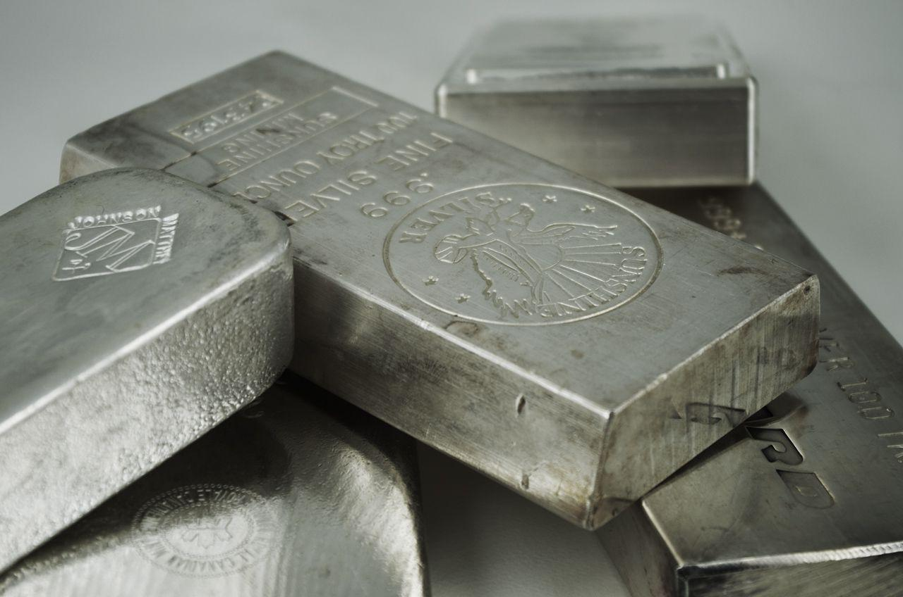

## Table of Contents

## What are silver futures?

Silver futures are contracts that let people buy or sell silver at a set price on a future date. They are traded on special markets called futures exchanges. People use silver futures to guess if the price of silver will go up or down. If they think the price will go up, they buy the futures. If they think it will go down, they sell the futures.

These contracts are useful for people who work with silver, like miners or jewelers. They can use futures to protect themselves from big changes in silver prices. For example, a jeweler might buy a silver future to make sure they can buy silver at today's price, even if the price goes up later. This helps them plan their costs better.

## How do silver futures differ from physical silver?

Silver futures and physical silver are different in a few key ways. Silver futures are contracts that promise to buy or sell silver at a certain price in the future. They are not actual silver; they are just agreements traded on a futures exchange. People who trade silver futures are betting on what the price of silver will be later. They don't get the silver itself unless they choose to take delivery, which is rare.

Physical silver, on the other hand, is the actual metal. You can hold it, store it, and use it for things like jewelry or electronics. When you buy physical silver, you own the metal right away. It's tangible and has value because of its rarity and uses. Unlike futures, physical silver doesn't involve any contracts or future dates; it's a direct purchase of the metal itself.

## What are the basic steps to start trading silver futures?

To start trading silver futures, you first need to open an account with a futures broker. This broker will help you buy and sell futures contracts. You'll need to fill out some forms and provide some personal information, like your name and address. Once your account is set up, you'll need to put some money into it. This money is called margin, and it's like a deposit that you use to trade futures.

After your account is ready and funded, you can start trading. You'll use a trading platform, which is like a special website or app, to see the prices of silver futures and make your trades. You can choose to buy a futures contract if you think the price of silver will go up, or sell one if you think it will go down. Remember, trading futures can be risky, so it's a good idea to learn as much as you can and maybe even practice with a demo account before you start trading with real money.

## What are the key factors that influence silver futures prices?

The price of silver futures is influenced by many things. One big [factor](/wiki/factor-investing) is the supply and demand for silver. If more people want to buy silver than there is available, the price goes up. If there's too much silver and not enough people want it, the price goes down. Another factor is the value of the US dollar. Since silver is priced in dollars, if the dollar gets weaker, silver becomes cheaper for people using other currencies, which can increase demand and push up the price.

Another important thing that affects silver futures prices is what's happening in the economy. When the economy is doing well, people might invest more in silver because they feel confident. But if the economy is not doing well, people might sell their silver to get cash, which can make the price go down. Also, big events like wars or natural disasters can make people want to buy silver as a safe place to keep their money, which can push the price up.

## How can one analyze the silver futures market?

To analyze the silver futures market, you need to look at different things that can affect the price of silver. One way is to watch the supply and demand for silver. If there's a lot of silver but not many people want to buy it, the price might go down. But if there's not enough silver and a lot of people want it, the price can go up. You can also look at the value of the US dollar. Since silver is priced in dollars, if the dollar gets weaker, silver might become cheaper for people using other currencies, which can make more people want to buy it and push the price up.

Another way to analyze the silver futures market is to pay attention to what's happening in the economy. If the economy is doing well, people might feel more confident and invest more in silver, which can make the price go up. But if the economy is not doing well, people might sell their silver to get cash, which can make the price go down. Big events like wars or natural disasters can also make people want to buy silver as a safe place to keep their money, which can push the price up. By keeping an eye on these things, you can get a better idea of where the price of silver futures might be headed.

## What are the common trading strategies for silver futures?

One common strategy for trading silver futures is called [trend following](/wiki/trend-following). This means you watch the price of silver to see if it's going up or down over time. If the price is going up, you buy silver futures because you think it will keep going up. If the price is going down, you sell silver futures because you think it will keep going down. This strategy works well if the price keeps moving in the same direction for a while.

Another strategy is called range trading. With this strategy, you look for times when the price of silver stays between a high and a low price for a while. If the price gets close to the high, you might sell silver futures because you think it will go back down to the low. If the price gets close to the low, you might buy silver futures because you think it will go back up to the high. This strategy works well when the price of silver doesn't change a lot.

A third strategy is called hedging. This is often used by people who work with silver, like miners or jewelers. If they think the price of silver might go up, they buy silver futures to make sure they can buy silver at today's price later. If they think the price might go down, they sell silver futures to make sure they can sell their silver at today's price later. This strategy helps them protect their business from big changes in silver prices.

## What are the risks associated with trading silver futures?

Trading silver futures can be risky because the price of silver can change a lot. If you buy a silver future and the price goes down, you can lose money. Sometimes, the price can change very quickly, and you might not have time to sell your future before you lose a lot of money. This is called market risk. Also, when you trade futures, you use something called margin, which is like borrowing money to trade. If the price moves against you, you might have to put more money into your account to keep your trade open. This is called margin risk.

Another risk is called [liquidity](/wiki/liquidity-risk-premium) risk. Sometimes, it can be hard to find someone to buy or sell your silver future, especially if the market is not busy. If you need to get out of your trade quickly, you might have to sell your future for less money than you wanted. There's also something called counterparty risk. This means that the person or company you're trading with might not be able to pay you if something goes wrong. All these risks mean that trading silver futures can be tricky and you might lose money, so it's important to understand them before you start trading.

## How does leverage work in silver futures trading?

Leverage in silver futures trading means you can control a big amount of silver with just a little bit of money. When you trade futures, you don't have to pay the full price of the silver right away. Instead, you put down a smaller amount called margin. This margin acts like a deposit, and it lets you trade a lot more silver than you could if you had to pay the full price. For example, if the price of silver is $20 per ounce and you want to trade 5,000 ounces, you might only need to put down a margin of $5,000 instead of the full $100,000.

But using leverage can be risky. If the price of silver goes up, you can make a lot of money because you're controlling a big amount of silver with just a little bit of your own money. But if the price goes down, you can lose a lot of money very quickly. If the price moves against you, you might have to put more money into your account to keep your trade open. This is called a margin call. So, while leverage can help you make big profits, it can also lead to big losses if you're not careful.

## What are the margin requirements for trading silver futures?

When you trade silver futures, you don't have to pay the full price of the silver right away. Instead, you need to put down a smaller amount of money called margin. This margin acts like a deposit that lets you trade a lot more silver than you could if you had to pay the full price. The exact amount of margin you need can change depending on the futures exchange you use and the rules they have. Usually, the margin for silver futures is around 5% to 10% of the total value of the contract. So, if a silver futures contract is worth $50,000, you might need to put down $2,500 to $5,000 as margin.

But the margin requirement can go up or down based on how much the price of silver is moving around. If the price is changing a lot, the exchange might ask for more margin to make sure traders can cover their losses. This is called a margin call. If you get a margin call, you have to put more money into your account quickly, or the exchange might close your trade to limit their risk. So, it's important to keep an eye on your account and be ready to add more money if the price of silver moves against you.

## How do geopolitical events impact silver futures?

Geopolitical events can have a big impact on silver futures prices. When there's a lot of uncertainty or trouble in the world, like wars or political disagreements, people might want to buy silver because they see it as a safe place to keep their money. Silver is seen as a safe investment during times when other investments might be risky. So, if there's a big event that makes people worried, the demand for silver can go up, which can push the price of silver futures higher.

On the other hand, if a geopolitical event causes the economy to slow down, it can also affect silver futures. For example, if countries stop trading with each other because of a conflict, it can make it harder to get silver, which can make the price go up. But if the event makes people less confident about spending money, they might not want to buy silver, which can make the price go down. So, geopolitical events can change the price of silver futures in different ways, depending on how they affect the supply and demand for silver.

## What are the tax implications of trading silver futures?

When you trade silver futures, you need to think about taxes. In the United States, if you make money from trading silver futures, you have to pay taxes on those profits. The money you make is usually considered capital gains. If you hold the futures for less than a year before you sell them, the gains are short-term capital gains, and you pay your regular income tax rate on them. If you hold them for more than a year, the gains are long-term capital gains, and you pay a lower tax rate, usually between 0% and 20%, depending on your income.

But it's not just about the money you make. If you lose money trading silver futures, you can use those losses to lower your taxes. You can subtract your losses from your gains to figure out your net capital gain or loss. If your losses are more than your gains, you can use up to $3,000 of those losses to lower your regular income. If you have more losses than that, you can [carry](/wiki/carry-trading) them over to the next year and use them to lower your taxes then. It's a good idea to talk to a tax professional to make sure you're doing everything right and taking advantage of all the tax rules that apply to you.

## How can one use silver futures for hedging purposes?

People who work with silver, like miners or jewelers, can use silver futures to protect themselves from big changes in silver prices. This is called hedging. If a jeweler knows they will need to buy a lot of silver in the future, they can buy a silver future now. This lets them lock in today's price, so even if the price of silver goes up later, they can still buy it at the lower price they agreed on. This helps them plan their costs better and avoid losing money if the price goes up.

On the other hand, if a silver miner thinks the price of silver might go down, they can sell a silver future. This way, they can lock in today's higher price for the silver they will sell in the future. If the price does go down, they can still sell their silver at the higher price they agreed on. By using silver futures for hedging, these businesses can protect themselves from price changes and make sure they can still make money, no matter what happens to the price of silver.

## References & Further Reading

[1]: ["Advances in Financial Machine Learning"](https://www.amazon.com/Advances-Financial-Machine-Learning-Marcos/dp/1119482089) by Marcos Lopez de Prado

[2]: ["Evidence-Based Technical Analysis: Applying the Scientific Method and Statistical Inference to Trading Signals"](https://www.amazon.com/Evidence-Based-Technical-Analysis-Scientific-Statistical/dp/0470008741) by David Aronson

[3]: ["Machine Learning for Algorithmic Trading"](https://github.com/stefan-jansen/machine-learning-for-trading) by Stefan Jansen

[4]: ["Quantitative Trading: How to Build Your Own Algorithmic Trading Business"](https://www.amazon.com/Quantitative-Trading-Build-Algorithmic-Business/dp/1119800064) by Ernest P. Chan

[5]: Silver, N. (2012). ["The Signal and the Noise: Why So Many Predictions Fail – But Some Don't"](https://archive.org/details/signalnoisewhymo00silv) by Nate Silver

[6]: LeBaron, B. (2006). ["Agent-based computational finance."](https://www.researchgate.net/publication/222831632_Agent-Based_Computational_Finance) Journal of Economic Dynamics and Control, 30(6), 884-911.

[7]: Malkiel, B. G. (2003). ["The Efficient Market Hypothesis and Its Critics."](https://www.princeton.edu/~ceps/workingpapers/91malkiel.pdf) Journal of Economic Perspectives, 17(1), 59-82.