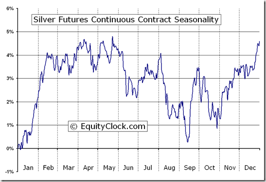

In the fast-paced world of financial trading, commodities play a crucial role, offering investors opportunities to diversify their portfolios and hedge against inflation. Commodities are tangible goods such as metals, agriculture products, and energy sources that undergo cyclic fluctuations in their prices based on market dynamics. Among these commodities, silver futures stand out due to their historic value and volatility, making them an attractive option for traders. Silver has been valued for centuries as a precious metal and used in various industrial applications, contributing to its price volatility and investment appeal.

With the advancement of technology, algorithmic trading has revolutionized how silver futures are traded, providing efficiency and potential profit opportunities. Algorithmic trading, or algo trading, refers to the use of computer algorithms to execute trades automatically based on pre-defined criteria. This technology has transformed trading by making it faster, more precise, and less susceptible to human error, opening up new avenues for both individual and institutional traders. Algorithms can analyze vast amounts of data swiftly, implementing complex trading strategies that leverage market movements more effectively than traditional manual trading.



This article explores the intricacies of trading in the commodities market, specifically focusing on silver futures and the role of algo trading. The exploration will encompass understanding the fundamental principles of the commodities market, the unique characteristics of silver futures, and how algorithmic trading is reshaping the trading landscape. Whether you're a seasoned trader looking to refine your strategy or a curious beginner seeking to grasp the concepts of commodities and algorithmic trading, gaining a comprehensive understanding of these topics can significantly impact your trading strategy, potentially leading to more informed and successful trading decisions. Through an in-depth understanding, traders can navigate the volatile markets with greater confidence and precision.

## Table of Contents

## Understanding the Commodities Market

The commodities market is a crucial component of the global financial system, facilitating the exchange of raw or primary products. This market is divided into two main categories: hard commodities and soft commodities. Hard commodities are natural resources that are typically mined or extracted—examples include precious metals such as gold and silver, and industrial commodities like oil. These resources are vital to industrial activities and global trade, often serving as a hedge against inflation due to their intrinsic value and widespread use.

On the other hand, soft commodities encompass agricultural products like coffee, wheat, and corn. These are generally cultivated and harvested, and their market dynamics can be significantly influenced by seasonal variations and climatic conditions. Both categories form the backbone of the commodities market, each having unique attributes and market conditions.

The trading of commodities is influenced by several key factors. Supply and demand dynamics are fundamental, as they dictate price fluctuations based on availability and consumer need. Geopolitical stability plays a significant role, especially for commodities linked to specific regions or countries where political unrest or policy shifts can disrupt supply chains. Additionally, macroeconomic trends also have substantial impacts; these include global economic growth rates, inflation levels, and currency fluctuations which can alter the purchasing power in commodity trading.

This complex interplay of factors makes the commodities market a continuously evolving space where careful analysis and strategic trading are essential for navigating its challenges and opportunities.

 to Silver Futures

Silver futures represent standardized contracts for the purchase or sale of a specified quantity of silver at a predetermined price on a set future date. These contracts are commonly traded on futures exchanges, acting as vital instruments for hedging against fluctuations in the spot market prices of silver. Traders engaged in silver futures do not need to make the full payment upfront. Instead, they partake in margin trading, which necessitates only a portion of the overall contract value as an initial investment. This feature allows for leveraging positions while mitigating the need for significant capital.

When entering into a silver futures contract, traders must be keenly aware of unique attributes such as margin requirements, which dictate the upfront deposit needed to initiate a position, and expiry dates, marking the contract's termination point. A well-versed understanding of these components is critical to successful trading in this market segment.

Investors often turn to silver futures to enrich their portfolios through diversification, capitalizing on the opportunity to profit from price movements in silver without necessitating the physical ownership of the metal. This allows investors to speculate on price directions effectively or protect against adverse shifts in market prices. The ability to engage in silver futures trading provides a strategic avenue for those looking to balance their investment risks and returns in the broader commodities market.

## The Role of Algorithmic Trading in Silver Futures

Algorithmic trading involves using computer algorithms to execute trades based on pre-defined criteria, significantly enhancing the speed and efficiency of trading operations. In the context of silver futures, [algorithmic trading](/wiki/algorithmic-trading) presents numerous advantages, such as trend identification, price optimization, and risk management.

The rapid execution capabilities of algorithmic trading enable traders to capitalize on even minute price discrepancies in silver futures. By analyzing market data in real-time, these systems can efficiently execute trades at optimal prices, often outperforming traditional trading methods in terms of speed and accuracy. Moreover, algorithmic trading can efficiently manage risk by employing complex mathematical models that forecast potential market movements and adjust trading strategies accordingly.

Popular approaches in algorithmic trading include high-frequency trading ([HFT](/wiki/high-frequency-trading-strategies)), [scalping](/wiki/gamma-scalping), and market-making. High-frequency trading involves executing a large number of orders at extremely high speeds, which is especially effective in capturing small price changes in the silver futures market. Scalping focuses on exploiting small price gaps created by order flows or spreads, while market-making involves simultaneously buying and selling on different markets to earn the spread.

One of the significant advantages of algorithmic trading is its capacity to minimize human errors and reduce the emotional biases that often affect manual trading decisions. Algorithms rely heavily on historical data and advanced forecasting models, making decisions purely based on quantitative analysis rather than emotional intuition. This results in a more disciplined and consistent trading approach, which can lead to improved profitability and reduced risk.

The integration of [artificial intelligence](/wiki/ai-artificial-intelligence) (AI) and [machine learning](/wiki/machine-learning) (ML) has further advanced the capabilities of algorithmic trading systems. These technologies allow trading algorithms to learn from historical trading patterns and continually adapt to changing market conditions, improving their accuracy and effectiveness over time. For example, Python libraries such as NumPy and SciPy can be used to perform complex mathematical calculations, while machine learning frameworks like TensorFlow or PyTorch can help build models that predict silver price movements based on historical data.

In summary, algorithmic trading in silver futures offers substantial benefits by enhancing trading speed, precision, and risk management capabilities. The continuous evolution of AI and machine learning technologies promises to further augment these systems, allowing traders to adapt swiftly to the dynamic nature of financial markets.

## Strategies for Successful Silver Futures Algo Trading

Successful algo trading in silver futures requires a comprehensive approach that aligns with the ever-changing dynamics of financial markets. A well-defined strategy, mindful of market conditions and individual risk tolerance, can make the difference between profit and loss.

**Trend Following**  
One cornerstone strategy is [trend following](/wiki/trend-following), where algorithms are programmed to initiate trades based on the direction of prevailing market trends. This can be implemented using moving averages, [momentum](/wiki/momentum) indicators, or other technical tools. A common method is the use of moving average crossovers, where a short-term moving average crossing above a long-term moving average signals a buy, and the inverse signals a sell.

**Python Example: Trend Following with Moving Averages**
```python
import pandas as pd

# Assuming df is a DataFrame with a 'price' column
df['short_mavg'] = df['price'].rolling(window=50).mean()
df['long_mavg'] = df['price'].rolling(window=200).mean()

df['signal'] = 0  # Default value
df['signal'][50:] = np.where(df['short_mavg'][50:] > df['long_mavg'][50:], 1, 0)
df['positions'] = df['signal'].diff()  # Buy = 1, Sell = -1
```

**Mean Reversion**  
This strategy capitalizes on the idea that prices will revert to their historical mean over time. Algorithms identify when the silver futures price deviates significantly from its historical average, then take positions anticipating a return to the mean. This requires robust statistical analysis and [backtesting](/wiki/backtesting) to determine the effectiveness of the reversion levels.

**Arbitrage**  
Arbitrage takes advantage of price discrepancies in different markets or forms of the same asset, potentially offering risk-free profits. For example, if silver futures are priced differently on two exchanges, an algorithm can buy low on one and sell high on the other, ensuring a profit minus transaction costs and latency risks.

**Risk Management**  
Effective risk management is critical, involving setting stop-loss levels to minimize losses during adverse market moves and leveraging positions appropriately to maximize gains while protecting capital. Continuous review of algorithm performance is essential to adapt to market conditions. This includes optimizing parameters and refining models to ensure they are robust against exceptional market events, known as "tail risks."

In conclusion, while the potential for profit in silver futures algo trading is significant, it demands a strategic approach that balances opportunities with disciplined risk management. By integrating trend following, mean reversion, and [arbitrage](/wiki/arbitrage) into a cohesive trading strategy, traders can enhance their ability to capitalize on market movements.

## Challenges and Risks in Silver Futures Algo Trading

Algorithmic trading in silver futures offers distinct advantages, yet it is also accompanied by significant challenges and risks. A primary concern in algorithmic trading systems is the susceptibility to technical issues, which can result in substantial trading losses. Software glitches, connectivity problems, and platform downtimes are common technical pitfalls. These issues might cause trades to be executed incorrectly or not at all, leading to financial loss and missed opportunities. For instance, a temporary loss of internet connectivity could prevent an algorithm from receiving the latest market data, thereby impacting its decision-making process.

Market risks also pose a significant threat to algorithmic trading strategies in silver futures. The silver market is notorious for its [volatility](/wiki/volatility-trading-strategies), and sudden price movements can adversely impact automated trading systems. Additionally, low [liquidity](/wiki/liquidity-risk-premium) in the market can complicate the execution of large trades or those based on complex quantitative strategies. In times of high volatility, the spread between bid and ask prices may widen, increasing transaction costs and reducing potential profits.

Regulatory changes present another challenge for those engaged in algorithmic trading. Market regulators frequently update compliance requirements to maintain market integrity and protect investors. These regulatory changes can necessitate adjustments in trading algorithms, adding complexity and requiring ongoing monitoring for compliance. Algorithmic traders must remain vigilant and responsive to regulatory developments to avoid penalties and maintain effective trading strategies.

Finally, continuous monitoring and optimization of algorithms are imperative to effectively navigate the ever-changing market landscape. Financial markets are dynamic environments where historical data may quickly become outdated, affecting the predictive power of algorithms. Regular back-testing and performance evaluations are critical to ensure that trading algorithms are functioning as intended and adapting to current market conditions. Employing machine learning techniques can aid in developing adaptive algorithms that learn from new data and adjust strategies accordingly.

In conclusion, while algorithmic trading in silver futures presents lucrative opportunities, it also requires thorough risk management strategies and technical diligence to mitigate the associated challenges and risks.

## Conclusion

Silver futures offer exciting opportunities in the commodities market, and algorithmic trading has redefined how these opportunities can be harnessed. Trading algorithms provide a systematic and efficient approach to capitalizing on the price movements of silver, allowing traders to execute strategies with precision and speed that far surpass human capabilities.

However, while the potential for profit is significant, traders must be aware of the risks and challenges involved. Technical issues, such as software glitches or connectivity problems, can lead to significant losses if not managed properly. Market risks, including sudden price movements and varying liquidity levels, also pose threats that require vigilant risk management strategies. Therefore, implementing algorithmic trading necessitates a comprehensive understanding of both the tools at hand and the market dynamics.

A well-researched approach, coupled with effective use of technology, can maximize the benefits of silver futures algo trading. Advanced algorithms leveraging artificial intelligence and machine learning can enhance decision-making processes, providing deeper insights into market trends and potential entry and [exit](/wiki/exit-strategy) points. Additionally, maintaining a robust framework for testing and refining algorithms ensures they remain effective under changing market conditions.

By staying informed and adaptable, traders can maintain an edge in this competitive arena. This involves continuously updating knowledge on market developments, regulatory changes, and technological advancements. As trading environments evolve, so will the methods and technologies, paving the way for innovative trading strategies and improved efficiencies.

In summary, while the journey of silver futures algo trading is laden with challenges, it is also rich with potential. Traders who skillfully balance risk with reward, adapt to technological advancements, and remain informed about market changes can position themselves optimally for success in the ever-dynamic commodities market.

## References & Further Reading

[1]: ["Advances in Financial Machine Learning"](https://www.amazon.com/Advances-Financial-Machine-Learning-Marcos/dp/1119482089) by Marcos Lopez de Prado

[2]: ["Evidence-Based Technical Analysis: Applying the Scientific Method and Statistical Inference to Trading Signals"](https://www.amazon.com/Evidence-Based-Technical-Analysis-Scientific-Statistical/dp/0470008741) by David Aronson

[3]: ["Machine Learning for Algorithmic Trading"](https://github.com/stefan-jansen/machine-learning-for-trading) by Stefan Jansen

[4]: ["Quantitative Trading: How to Build Your Own Algorithmic Trading Business"](https://www.amazon.com/Quantitative-Trading-Build-Algorithmic-Business/dp/1119800064) by Ernest P. Chan

[5]: Silver, N. (2012). ["The Signal and the Noise: Why So Many Predictions Fail – But Some Don't"](https://archive.org/details/signalnoisewhymo00silv) by Nate Silver

[6]: LeBaron, B. (2006). ["Agent-based computational finance."](https://www.researchgate.net/publication/222831632_Agent-Based_Computational_Finance) Journal of Economic Dynamics and Control, 30(6), 884-911.

[7]: Malkiel, B. G. (2003). ["The Efficient Market Hypothesis and Its Critics."](https://www.princeton.edu/~ceps/workingpapers/91malkiel.pdf) Journal of Economic Perspectives, 17(1), 59-82.