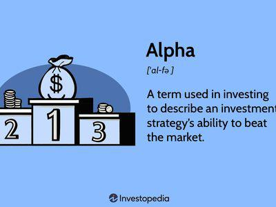

Alpha and beta are essential metrics in the field of investing and algorithmic trading, playing a crucial role in evaluating the performance and risk associated with investments. These concepts help investors comprehend the dynamics of the market, guiding them in making informed investment decisions.

Alpha represents the excess return on an investment relative to a benchmark index, such as the S&P 500. It signifies the value that a portfolio manager adds to or subtracts from a fund's return. A positive alpha indicates that the investment has outperformed the market by a certain percentage, showcasing effective asset selection and management. Conversely, a negative alpha suggests underperformance relative to the benchmark.



Beta, on the other hand, quantifies the volatility or risk associated with a particular asset in comparison to the market as a whole. It measures the asset's sensitivity to market movements, providing insight into its risk profile. A beta of 1 implies that the asset's price moves in line with the market. A beta greater than 1 reflects higher volatility than the market, while a beta less than 1 indicates lower volatility.

Algorithmic trading, often referred to as algo trading, utilizes automated systems to execute a variety of trading strategies. By programming computers to follow specific sets of instructions for placing trades, financial institutions and traders can systematically exploit market conditions. Understanding alpha and beta allows traders to assess asset performance more accurately, informing strategic decisions to maximize returns while managing associated risks.

This article aims to provide a comprehensive understanding of alpha and beta, elaborating on their significance in traditional investing as well as their application in the increasingly sophisticated world of algorithmic trading. Recognizing these metrics can empower investors and traders to enhance their strategies, aligning them effectively with broader market trends and individual risk tolerances.

## Table of Contents

## The Basics of Alpha in Investing

Alpha is a critical metric in the investment world, measuring the excess return of an investment compared to a benchmark index, typically representative of the market. It is defined as α = R_i - (R_f + β(R_m - R_f)), where $R_i$ is the return of the investment, $R_f$ is the risk-free rate, $β$ is the beta of the investment, and $R_m$ is the return of the market or benchmark index. This formula highlights that alpha is essentially the return on an investment that is not explained by its exposure to market risk (captured by beta).

A positive alpha indicates that an investment has outperformed its benchmark after adjusting for market risk, suggesting that the investment manager has added value through skillful stock [picking](/wiki/asset-class-picking) or timing. Conversely, a negative alpha implies underperformance relative to the benchmark, possibly indicating poor investment choices or strategies that do not compensate for the level of risk taken.

Fund managers and investors frequently pursue investments with high alpha to demonstrate their expertise and judgment in selecting securities that provide superior returns above what the market dynamics dictate. For example, if a mutual fund portfolio has historically achieved a return of 8% while the S&P 500 index (the chosen benchmark) has returned 6% over the same period, and accounts for the portfolio's market risk exposure, the investment manager can claim to have generated an alpha of 2%.

A practical approach to understanding alpha involves assessing an investment's return relative to a familiar benchmark like the S&P 500, which represents the overall U.S. equity market performance. By analyzing such comparisons, investors can obtain insights into the fund's management effectiveness and whether the return exceeds what could be expected given the investment's risk profile.

## Understanding Beta in Investing

Beta is a crucial metric in the investing landscape, serving as a measure of an asset's [volatility](/wiki/volatility-trading-strategies) relative to the overall market or a specific benchmark index. It gauges how much an asset's price is expected to change in response to market movements, providing investors with insights into the asset's risk profile.

A beta value of 1 indicates that the asset's price is expected to move in tandem with the market. For example, if the market experiences a 5% increase, an asset with a beta of 1 would also likely increase by 5%. Conversely, if the market declines by 3%, the asset is expected to decline by 3% as well. This characteristic makes a beta of 1 a benchmark for market-correlated assets.

A beta greater than 1 signifies that the asset is more volatile than the market. High beta assets are more responsive to market movements, meaning they are likely to increase more than the market during upswings and decrease more during downswings. This heightened volatility presents both an opportunity for greater returns and an increased risk of losses. Sectors such as technology often feature high-beta stocks due to their growth-oriented and speculative nature.

Conversely, low beta assets, with beta values less than 1, exhibit less volatility than the market. These assets are generally more stable, providing some protection against market fluctuations. Government bonds typically fall into this category, offering lower risk and steady income. Such characteristics make low-beta assets attractive during volatile market conditions when investors seek to preserve capital while minimizing risk exposure.

Investors utilize beta to balance their portfolios according to their risk tolerance and investment objectives. By assessing the beta of individual securities, investors can construct a portfolio with a mix of high and low beta assets to align with their strategic goals. A diversified portfolio may include both types of assets to optimize risk-adjusted returns.

In summary, beta serves as an essential tool for investors to comprehend and manage the potential risk and return dynamics of their portfolios. Understanding an asset’s beta helps investors make informed decisions to achieve their desired investment outcomes.

## Comparison: Alpha vs Beta

Alpha and beta are integral metrics in assessing investment strategies and portfolio performance. Alpha is primarily concerned with measuring an investment’s performance relative to a benchmark, taking into account the skill involved in the investment strategy. For instance, a portfolio manager might demonstrate skill by achieving an annual return of 12% when the benchmark index only generates a return of 8%. Here, alpha is represented by the 4% excess return.

$$
\text{Alpha} = \text{Portfolio Return} - \text{Benchmark Return}
$$

On the other hand, beta quantifies an asset’s volatility relative to the market as a whole. A beta of 1 implies that the asset's price moves in correlation with the market. Assets with beta higher than 1 exhibit greater volatility and potential return, whereas those with lower beta experience less risk and typically offer more stable returns. Beta can be mathematically represented as:

$$
\beta = \frac{\text{Covariance of Asset and Market Returns}}{\text{Variance of Market Returns}}
$$

While alpha showcases the effectiveness of a strategy to outperform a benchmark index, beta highlights the degree of exposure to market risk. Fund managers aim for strategies that not only generate high alpha but also maintain a controlled beta, ultimately enhancing risk-adjusted returns. This balance is crucial for optimizing portfolio performance, particularly under varying market conditions.

Understanding both metrics allows investors to make informed decisions about portfolio composition based on risk tolerance and investment objectives. Incorporating assets with high alpha and desirable beta levels can lead to optimized returns while managing exposure to market volatility. This strategic balance aids in constructing portfolios that align with an investor's goals, whether they prioritize growth, income, stability, or a combination thereof.

## The Role of Alpha and Beta in Algo Trading

Algorithmic trading, commonly known as algo trading, leverages mathematical models and statistical analyses to automate trading decisions with speed and precision. Central to this process are the metrics of alpha and beta, which guide the development and optimization of these strategies.

Alpha represents the excess return on an investment relative to a benchmark, reflecting an algorithm's ability to identify and capitalize on market inefficiencies. Systematic strategies are often employed to maximize alpha, aiming to achieve returns that surpass market averages. Algorithms enable traders to execute these strategies with an analytical approach, continuously searching for patterns and price discrepancies that indicate potential alpha-generating opportunities.

Beta, on the other hand, indicates the volatility of an asset in comparison to the overall market or a designated benchmark. In algo trading, understanding beta is crucial for moderating portfolio risk and optimizing trade volumes. Algorithms assess beta to gauge how much of a trade's risk can be attributed to market movements. A robust understanding of beta assists in adjusting trade sizes and anticipating market reactions, thereby enabling traders to harness favorable conditions while mitigating potential downsides.

Algorithmic trading strategies benefit significantly from [backtesting](/wiki/backtesting), a process involving the simulation of trades using historical data. Backtesting allows traders to measure potential alpha gains and refine strategies accordingly. By analyzing past market behaviors, algorithms can adjust for beta changes and optimize future trade executions. This process ensures that strategies remain aligned with the underlying risk-reward objectives defined by the trader or fund manager.

Consider Python as an illustrative example for backtesting needs. A simple backtesting setup might begin with importing relevant historical data, defining a trading strategy, and evaluating its performance metrics using available libraries such as `pandas` for data manipulation and `numpy` for numerical operations. Here's a basic code snippet illustrating a strategy backtest:

```python
import pandas as pd
import numpy as np

# Load historical data
data = pd.read_csv('historical_prices.csv')

# Define a simple moving average strategy
data['SMA_50'] = data['Close'].rolling(window=50).mean()
data['SMA_200'] = data['Close'].rolling(window=200).mean()

# Generate signals
data['Signal'] = np.where(data['SMA_50'] > data['SMA_200'], 1, 0)

# Compute daily returns
data['Daily_Return'] = data['Close'].pct_change()

# Calculate strategy returns
data['Strategy_Return'] = data['Signal'].shift(1) * data['Daily_Return']

# Output the cumulative return of the strategy
cumulative_return = (1 + data['Strategy_Return']).cumprod()[-1]
print(f'Cumulative Return: {cumulative_return:.2f}')
```

This code evaluates a simple moving average crossover strategy by checking whether a short-term average (50-day) surpasses a long-term average (200-day) to generate buy signals. The strategy's performance is then assessed by calculating the cumulative return, providing insights into potential alpha contributions.

In conclusion, by strategically applying alpha and beta within [algorithmic trading](/wiki/algorithmic-trading), traders can craft automated systems capable of identifying lucrative market opportunities while effectively managing risk exposure. These methods boost efficiency and scalability in trading operations, highlighting the importance of these fundamental metrics in modern finance.

## Developing Algorithmic Trading Strategies

Successful algorithmic trading strategies typically utilize a combination of trend-following, [arbitrage](/wiki/arbitrage), and mean reversion techniques. These strategies rely on mathematical models and computational tools to identify profitable trading opportunities and execute trades with precision. Algorithms are constructed based on clearly defined rules that consider historical data, price movements, and market patterns. This systematic approach enables traders to automate decision-making processes and operate efficiently in various market conditions.

Trend-following strategies focus on capitalizing on the persistence of market trends. By analyzing past price data, algorithms can identify directional patterns and generate trading signals aligned with dominant market trends. Such strategies often employ technical indicators like moving averages, [momentum](/wiki/momentum) oscillators, or Bollinger Bands to determine entry and [exit](/wiki/exit-strategy) points. Here's a basic Python example of a moving average crossover strategy:

```python
def moving_average(prices, window_size):
    return [sum(prices[i:i+window_size]) / window_size for i in range(len(prices) - window_size + 1)]

def generate_signals(prices, short_window, long_window):
    short_ma = moving_average(prices, short_window)
    long_ma = moving_average(prices, long_window)
    signals = []
    for i in range(1, len(short_ma)):
        if short_ma[i] > long_ma[i] and short_ma[i-1] <= long_ma[i-1]:
            signals.append(('BUY', i + long_window - 1))
        elif short_ma[i] < long_ma[i] and short_ma[i-1] >= long_ma[i-1]:
            signals.append(('SELL', i + long_window - 1))
    return signals
```

Arbitrage strategies exploit price discrepancies across different markets or instruments. These strategies involve simultaneous buying and selling of an asset to profit from price differentials. For instance, [statistical arbitrage](/wiki/statistical-arbitrage) strategies use mean reversion principles to identify pairs of securities whose historical price relationship deviates from the norm, aiming to predict the return to equilibrium.

Mean reversion strategies assume that prices will eventually move back to their historical averages. Algorithms based on mean reversion track price deviations and generate signals to buy or sell when prices are considered overbought or oversold. Key indicators for mean reversion strategies might include the Relative Strength Index (RSI) and Bollinger Bands.

Quantitative models play a pivotal role in algorithmic trading by employing alpha and beta analysis to optimize buy/sell signals and portfolio rebalancing. By calculating an asset's alpha, traders assess its ability to generate excess returns over a benchmark, while beta analysis aids in understanding the asset's volatility relative to the market. These metrics are integral in constructing robust trading algorithms capable of identifying undervalued assets and appropriately adjusting exposure to market risk.

For effective algorithmic trading, substantial technological infrastructure, access to real-time and historical market data, and proficient programming capabilities are essential. The combination of powerful computing systems and advanced software tools enables the processing of large datasets and execution of high-frequency trades with minimal latency. Moreover, robust backtesting frameworks are crucial for validating the efficacy of trading strategies by simulating their performance on past market data, allowing traders to refine their algorithms and enhance their predictive accuracy.

## Challenges and Considerations in Algo Trading

Algorithmic trading, while offering significant advantages in speed and precision, presents several challenges that traders and developers must address to ensure efficient and successful operations. One primary concern is latency, which refers to the time delay between the initiation of a trading action and its execution. In fast-moving markets, even microseconds can be crucial, potentially affecting the profitability of trades. Traders must, therefore, invest in high-speed infrastructures and cutting-edge technologies to minimize delays.

The dependency on sophisticated technologies is another hurdle. Algorithmic trading systems rely heavily on advanced software and hardware platforms, necessitating substantial investment in technology and expertise. Furthermore, unforeseen market events, such as sudden spikes in volatility or large trades by institutional players, can disrupt algorithmic models. These factors necessitate continuous monitoring and adjustments to the algorithms to adapt to changing market conditions effectively.

Regulatory considerations are also paramount, as algorithmic traders must comply with financial regulations designed to maintain fair and transparent markets. Failure to adhere to these rules can lead to legal repercussions and financial penalties. Additionally, the impact of large algorithmic trades on the market must be managed to avoid unintended disturbances in market prices, which can trigger regulatory scrutiny and potentially harm market integrity.

Given the complexity of trading algorithms, rigorous backtesting and validation processes are essential to ensure that algorithms perform as expected under various market scenarios. Backtesting involves running the algorithm against historical market data to evaluate its effectiveness and profitability. A robust validation process increases confidence in the algorithm’s ability to perform under live trading conditions.

Risks such as system failures and execution delays also pose significant challenges. A malfunction in the trading platform or a delay in order execution can lead to substantial financial losses. Therefore, it is crucial for traders to implement robust risk management protocols, including redundancy systems and real-time monitoring, to mitigate these risks.

In conclusion, while algorithmic trading provides powerful tools for executing trades with precision and speed, understanding and addressing the associated challenges is critical. By focusing on latency reduction, technological resilience, regulatory compliance, backtesting rigor, and risk management, traders can enhance the effectiveness and reliability of their algorithmic trading strategies.

## Conclusion

Alpha and beta are pivotal for investors and algorithmic traders aiming to enhance asset performance and effectively manage risk. Alpha, representing the excess return on an investment relative to a benchmark, captures an investor’s ability to generate returns beyond market expectations. In contrast, beta measures the volatility of an asset concerning the overall market, thus quantifying the risk exposure. 

Understanding these metrics allows traders to devise effective strategies by leveraging market trends and behavioral insights. This involves using alpha to seek superior stock selection and employing beta to assess market risk and dynamic portfolio adjustments. For instance, a skilled trader might aim to construct a portfolio that maximizes alpha while maintaining a controlled beta to balance risk and reward.

The essence of successful investment strategies lies in achieving a harmonious balance between alpha and beta, thereby securing high returns while mitigating unintended risks. This is particularly crucial in algorithmic trading, where high-frequency and automated systems depend on precise measurement and adjustment of these metrics to adapt to market conditions and exploit inefficiencies.

With the continual evolution of algorithmic trading, mastering these metrics remains essential for informed and strategic investment decisions. Algorithmic systems can continuously backtest and review strategies, adjusting for variations in alpha and beta values to optimize performance in real-time. This dynamic approach ensures that traders remain competitive in ever-changing market environments, capitalizing on opportunities while managing exposure to volatilities and uncertainties inherent in financial markets.

## References & Further Reading

[1]: ["Advances in Financial Machine Learning"](https://www.amazon.com/Advances-Financial-Machine-Learning-Marcos/dp/1119482089) by Marcos Lopez de Prado

[2]: ["Machine Learning for Algorithmic Trading"](https://github.com/stefan-jansen/machine-learning-for-trading) by Stefan Jansen

[3]: ["Quantitative Trading: How to Build Your Own Algorithmic Trading Business"](https://www.amazon.com/Quantitative-Trading-Build-Algorithmic-Business/dp/1119800064) by Ernest P. Chan

[4]: ["Evidence-Based Technical Analysis: Applying the Scientific Method and Statistical Inference to Trading Signals"](https://www.amazon.com/Evidence-Based-Technical-Analysis-Scientific-Statistical/dp/0470008741) by David Aronson

[5]: Bergstra, J., Bardenet, R., Bengio, Y., & Kégl, B. (2011). ["Algorithms for Hyper-Parameter Optimization."](https://proceedings.neurips.cc/paper/2011/file/86e8f7ab32cfd12577bc2619bc635690-Paper.pdf) Advances in Neural Information Processing Systems 24.