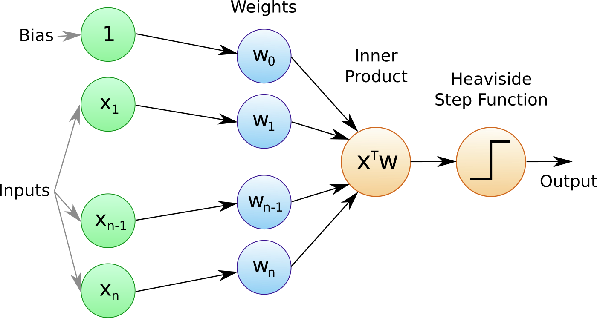

Algorithmic trading has revolutionized modern financial markets by automating complex trading strategies, thereby enhancing efficiency and precision. This method involves the use of computer algorithms to make trading decisions at speeds and frequencies that are unimaginable to human traders. The significance of algorithmic trading lies in its ability to process vast amounts of market data, identify patterns, and execute trades based on pre-defined criteria, frequently leading to cost savings, improved accuracy, and reduced human error.

Central to these algorithmic strategies is the decision-making mechanism, which is primarily driven by mathematical models and computational algorithms. Key components include data collection, signal generation, risk management, and order execution. These systems typically rely on historical and real-time data to forecast market movements and make informed trading decisions. The core of this decision-making process often lies in machine learning models, which learn and adapt based on data inputs.

Among various machine learning models, perceptrons serve as a fundamental building block. Introduced by Frank Rosenblatt in 1958, a perceptron is a type of artificial neuron used in supervised learning. It mimics the decision-making process of a binary classifier that maps input features to a binary output. Perceptrons consist of input nodes, weights, a bias, and an output function that determines the decision outcome. The simplicity of perceptrons enables them to handle linearly separable data effectively, making them suitable for many classification tasks essential in algorithmic trading.

Activation functions play a pivotal role in augmenting the decision-making capability of perceptrons by introducing non-linearity into the model. Without these functions, perceptrons would be limited to solving only linearly separable problems. Activation functions such as sigmoid, hyperbolic tangent (tanh), and rectified linear unit (ReLU) enable perceptrons to form complex decision boundaries, vastly improving their performance and flexibility in trading algorithms.

The purpose of this article is to explore the importance and application of perceptron activation functions in algorithmic trading. By examining how these components integrate into financial models, this discussion will highlight their relevance in crafting sophisticated trading strategies that adapt to dynamic market environments.

## Table of Contents

## Understanding Perceptrons

Perceptrons represent the foundational building blocks of neural network models, pivotal in advancing machine learning applications. Originally conceptualized by Frank Rosenblatt in 1958, the perceptron was developed as a single-layer neural network intended for binary classification tasks. It was a pioneering step in making computers capable of learning from data and adapting to new information.

At its core, a perceptron consists of several input nodes, each representing a feature of the input data. These inputs are associated with weights, numerical values that signify their importance in the decision-making process. The perceptron aggregates the weighted inputs and produces an output through a linear combination, mathematically expressed as: 

$$
z = \sum_{i=1}^{n} w_i x_i + b
$$

where $w_i$ denotes the weights, $x_i$ represents the input features, and $b$ is the bias term. The output $z$ is then passed through an activation function to produce a final decision. If the output surpasses a certain threshold, the perceptron activates, signifying the presence of a particular class.

Perceptrons are particularly significant in classification tasks, such as identifying patterns in trading strategies. In [algorithmic trading](/wiki/algorithmic-trading), they can be utilized to classify market conditions, predict price movements, or signal buy/sell decisions. Their ability to learn and adapt makes them invaluable in constructing model-driven trading systems.

However, basic perceptrons have limitations, primarily their inability to solve non-linear problems. Linear separability is a fundamental constraint, meaning that they can only distinguish data that is linearly separable. The classic example of their limitation is the XOR problem, where the data points cannot be separated with a single linear boundary.

To address these limitations, more sophisticated [neural network](/wiki/neural-network) architectures, such as multi-layer perceptrons (MLPs), were developed. By incorporating additional layers and neurons, these models are capable of learning complex patterns and relationships in data. The introduction of non-linear activation functions in these networks enables them to capture intricate trading dynamics that basic perceptrons cannot manage.

In summary, while perceptrons form the basis of neural network models, their simplicity limits their application in solving complex trading scenarios. Sophisticated models are required to address the demands of modern trading strategies, which often involve non-linear and multi-dimensional data inputs.

## Role of Activation Functions

Activation functions are mathematical functions used within perceptrons to determine the output of a neural network model. These functions play a pivotal role in processing inputs by introducing non-linearity into the model, allowing it to learn from and adapt to complex data patterns. The ability to introduce non-linearity is critical, as it enables perceptrons to construct more intricate decision boundaries. Without activation functions, a perceptron would merely produce a linear combination of inputs, limiting its capacity to solve complex classification tasks. 

By applying an activation function, the perceptron can map inputs to a wider range of outputs, thereby facilitating the modeling of more complex relationships within the data. This non-linear transformation is vital for perceptrons to solve non-linear classification problems, essential in many trading scenarios where market data relationships are inherently complex and non-linear.

Several activation functions are commonly used due to their unique characteristics and benefits. The sigmoid function, expressed as $\sigma(x) = \frac{1}{1 + e^{-x}}$, squashes input values to a range between 0 and 1. This property makes it suitable for binary classification tasks, presenting probabilities as outputs. Another prevalent activation function is the hyperbolic tangent (tanh) function, defined as $\tanh(x) = \frac{e^x - e^{-x}}{e^x + e^{-x}}$. Unlike the sigmoid, it maps values to a range between -1 and 1, often leading to faster convergence by zero-centering the data. 

The Rectified Linear Unit (ReLU), defined as $\text{ReLU}(x) = \max(0, x)$, has gained popularity due to its simplicity and efficiency. ReLU addresses the vanishing gradient problem associated with sigmoid and tanh, facilitating faster learning in deeper networks by maintaining a non-zero gradient for positive values.

Selecting the appropriate activation function can significantly impact a perceptron's performance and flexibility, particularly in algorithmic trading. Different functions suit different data characteristics and trading objectives. For instance, using ReLU can accelerate training and improve the responsiveness of a trading algorithm to new data, while functions like sigmoid or tanh might be preferred in contexts requiring specific output ranges or handling of values around zero.

The activation function choice becomes crucial in trading algorithms, as it directly influences the model's ability to adapt to market conditions and predict future trends. As financial markets exhibit non-linear and dynamic characteristics, using sophisticated activation functions can enhance the predictive accuracy and efficiency of trading signals. Therefore, understanding the properties and implications of each activation function is essential in aligning the algorithm's capabilities with the desired trading outcomes.

## Application in Algorithmic Trading

Perceptrons and activation functions have become integral to the development of sophisticated algorithmic trading models. These models are designed to process financial data, predict market trends, and execute trades with enhanced precision and speed. At their core, perceptrons function as building blocks for more complex neural networks, which analyze input from various financial indicators and output trading decisions. Activation functions, by introducing non-linearity, allow these models to create more complex decision boundaries, essential for navigating the intricate variations present in financial markets.

One notable example of algorithmic strategy using perceptrons and activation functions is the [momentum](/wiki/momentum) trading strategy. Here, a neural network model incorporates historical price data and technical indicators, such as moving averages, to predict the future momentum of a stock. Activation functions like the Rectified Linear Unit (ReLU) assist in capturing the nonlinear relationships between these inputs, helping the perceptron model identify when a stock's price will continue to rise or fall.

Case studies have demonstrated the advantages of employing sophisticated activation functions to adapt to varying market conditions. For instance, in a bearish market, activation functions such as the hyperbolic tangent (tanh) can be used to scale inputs between -1 and 1, making it easier for the model to identify oversold conditions and potential recovery points. By applying these advanced functions, algorithmic traders can adjust their strategies dynamically, enhancing returns over time.

The use of activation functions is crucial in improving predictive accuracy and efficiency in trading signals. By transforming linear input data into non-linear outputs, activation functions aid in developing refined trading signals that account for complex market behaviors. For example, a neural network with sigmoid activation functions may generate buy or sell signals based on the probabilistic outcomes derived from historical data patterns, thereby optimizing trade execution.

Recent research has highlighted significant advancements in the application of perceptron-based neural networks within financial markets. Studies have explored the integration of [deep learning](/wiki/deep-learning) techniques, where multi-layer perceptrons enhanced by diverse activation functions improve decision-making capabilities. Researchers have developed models that not only predict stock prices but also gauge market [volatility](/wiki/volatility-trading-strategies) and sentiment using natural language processing techniques applied to news articles and social media.

In summary, the integration of perceptrons and activation functions into trading models has become crucial for the development of advanced algorithmic strategies. By leveraging the predictive power of these neural network components, traders can achieve greater accuracy and adaptability in their trading systems, offering a competitive edge in today's rapidly evolving financial markets.

## Challenges and Considerations

Implementing perceptron activation functions in algorithmic trading presents several challenges. Among the most significant is the risk of overfitting, where a model learns the training data too well, capturing noise as if it were true patterns. This can lead to poor performance on new, unseen data. Overfitting is particularly problematic in finance, where markets are dynamic and historical data may not reliably predict future behavior. Regularization techniques, such as L1 or L2 regularization, can be employed to mitigate overfitting by penalizing excessive complexity in the model.

Another challenge is the computational demand associated with sophisticated activation functions, particularly in real-time trading environments. Activation functions like the rectified linear unit (ReLU) or hyperbolic tangent (tanh) can increase computational load, impacting the speed of decision-making. Efficient coding practices and leveraging hardware acceleration, such as graphics processing units (GPUs), may help in optimizing computation.

Balancing speed and accuracy in trading decisions is crucial. While complex models with non-linear activation functions can potentially yield more accurate predictions, they often require more time to compute. This trade-off can be managed by optimizing algorithms for performance without compromising the model's accuracy. Performing grid searches or Bayesian optimization to fine-tune hyperparameters may enhance both speed and decision accuracy.

The rise of [machine learning](/wiki/machine-learning)-driven automated trading introduces regulatory and ethical challenges. The use of opaque algorithms makes it difficult to explain decisions post hoc, which can be problematic for compliance with regulations such as the EU's General Data Protection Regulation (GDPR). Ensuring that algorithmic decisions are auditable and transparent is critical to meeting regulatory demands and maintaining market integrity.

As market dynamics evolve, optimizing activation functions becomes a moving target. Research is ongoing into customized activation functions tailored to specific trading scenarios. Adaptive models that can switch activation functions based on changing market conditions offer exciting possibilities. Moreover, there is growing interest in hybrid systems that combine rule-based and machine-learning approaches to capitalize on both domain knowledge and data-driven insights.

In conclusion, the challenges involved in leveraging perceptron activation functions in algorithmic trading—from mitigating overfitting to managing computational complexity—highlight the need for robust strategies and continuous optimization. As technology and markets continue to evolve, the potential for advanced neural networks to revolutionize trading strategies remains substantial.

## Conclusion

In this article, we explored the significant role of perceptron activation functions within algorithmic trading. These functions are vital in transforming linear computations into non-linear decision-making processes, enhancing the ability of trading algorithms to make sophisticated investment decisions. By incorporating various activation functions such as sigmoid, hyperbolic tangent, and ReLU, trading strategies acquire the adaptability and precision needed to respond dynamically to financial market changes.

As trading strategies continue to evolve through technological advancements, the integration of AI-driven models like neural networks becomes increasingly crucial. These models empower traders and financial institutions to improve predictive accuracy and efficiency, offering a competitive advantage in financial markets characterized by volatility and complexity. The adaptation and continued development of activation functions underscore the growing reliance on machine learning to improve algorithmic trading outcomes.

Looking forward, machine learning stands at the forefront of shaping financial markets by enabling more predictive and adaptive trading mechanisms. The future potential of these technologies holds promising implications for financial innovation, pointing toward increasingly autonomous trading models capable of optimizing performance in diverse market conditions.

To fully realize the capabilities of neural networks in financial applications, further research and experimentation with advanced network configurations are essential. Researchers and practitioners are encouraged to explore novel activation functions, considering their potential impact on algorithm robustness and performance efficacy. This exploration promises to pave the way for more sophisticated and resilient trading models, supporting the ongoing transformation of the financial landscape.

## References & Further Reading

[1]: Bengio, Y., Simard, P., & Frasconi, P. (1994). ["Learning long-term dependencies with gradient descent is difficult."](https://ieeexplore.ieee.org/document/279181) IEEE Transactions on Neural Networks, 5(2), 157-166.

[2]: Goodfellow, I., Bengio, Y., & Courville, A. (2016). ["Deep Learning"](https://link.springer.com/article/10.1007/s10710-017-9314-z) MIT Press.

[3]: Lopez de Prado, M. (2018). ["Advances in Financial Machine Learning"](https://www.amazon.com/Advances-Financial-Machine-Learning-Marcos/dp/1119482089) Wiley.

[4]: Nielsen, M. A. (2015). ["Neural Networks and Deep Learning"](https://books.google.com/books/about/Neural_Networks_and_Deep_Learning.html?id=STDBswEACAAJ). Determination Press.

[5]: Stewart, C. A., Gerber, A., & Yu, E. (2018). ["Quantitative Momentum: A Practitioner's Guide to Building a Momentum-Based Stock Selection System"](https://www.taylorfrancis.com/books/mono/10.4324/9781315163727/public-administration-research-methods-warren-eller-brian-gerber-scott-robinson) Wiley.