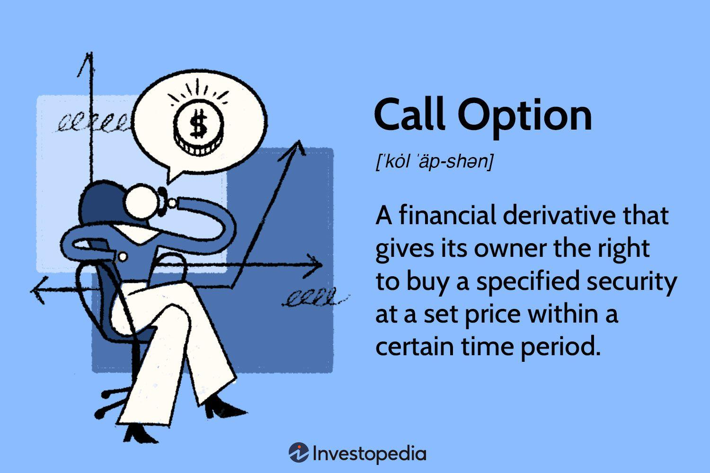

## Table of Contents

## What is a call option and how does it work?

A call option is a financial contract that gives you the right, but not the obligation, to buy a specific stock at a certain price within a set time period. Imagine you think a stock's price will go up. You can buy a call option for that stock, which lets you buy it later at today's price, even if the market price goes up. The price you agree to buy the stock at is called the "strike price," and the time until you can buy it is the "expiration date."

When you buy a call option, you pay a fee called the "premium." This is the cost of having the right to buy the stock later. If the stock's price goes above the strike price before the expiration date, you can use your option to buy the stock at the lower strike price and then sell it at the higher market price, making a profit. But if the stock price doesn't go up, you don't have to buy it, and you only lose the premium you paid for the option. This way, call options can be a way to bet on a stock's price going up, without having to buy the stock itself right away.

## What are the basic components of a call option?

A call option has three main parts: the strike price, the expiration date, and the premium. The strike price is the amount you agree to pay for the stock if you decide to buy it. It's like a target price that you set when you buy the option. The expiration date is when the option stops being valid. You have to decide whether to use your option to buy the stock before this date. The premium is the price you pay to get the call option. It's like a fee for the chance to buy the stock later at the strike price.

When you buy a call option, you're hoping the stock's price will go up above the strike price before the expiration date. If it does, you can buy the stock at the lower strike price and then sell it at the higher market price, making a profit. But if the stock's price stays the same or goes down, you don't have to buy it. You just lose the premium you paid for the option. This makes call options a way to bet on a stock's price going up without having to buy the stock right away.

## How does one buy a call option?

To buy a call option, you need to use a brokerage account. First, you pick the stock you think will go up in price. Then, you look at the options available for that stock. You'll see different strike prices and expiration dates. Choose the one that fits your guess about where the stock's price will go and when it will happen. Once you've made your choice, you place an order through your brokerage account, just like buying a stock, but you're buying the right to buy the stock later.

When you place the order, you'll pay a premium, which is the price of the call option. This is the most you can lose if the stock's price doesn't go up as you hoped. If the stock's price goes above the strike price before the expiration date, you can use your call option to buy the stock at the lower strike price and then sell it at the higher market price, making a profit. If the stock's price doesn't go up, you don't have to buy it, and you only lose the premium you paid.

## What are the potential benefits of buying call options?

Buying call options can be a smart way to make money if you think a stock's price will go up. They let you bet on a stock without having to buy it right away. This means you can control a lot of stock for a small amount of money, the premium. If the stock's price goes up a lot, you can make more money than if you had just bought the stock. Plus, your risk is limited to the premium you paid, so you know the most you can lose from the start.

Call options also give you flexibility. You can choose when you want to buy the stock, based on the expiration date, and at what price, based on the strike price. This lets you make a plan that fits your guess about the stock's future. If things don't go as planned, you don't have to buy the stock and can just walk away, losing only the premium. This makes call options a useful tool for trying to make money from stocks without a big upfront cost.

## What are the risks associated with buying call options?

Buying call options can be risky. The biggest risk is that you might lose the money you paid for the option, called the premium, if the stock's price doesn't go up as you hoped. If the stock stays the same or goes down, your option becomes worthless, and you lose what you paid for it. This can happen fast, especially if the expiration date is soon, because you have less time for the stock's price to move in your favor.

Another risk is that options can be hard to understand and use. They have a lot of details like strike prices and expiration dates that you need to get right. If you make a mistake, like choosing the wrong strike price or expiration date, you might miss out on making money even if the stock's price goes up. Also, options can be affected by other things like the stock's volatility and overall market conditions, which can make them even trickier to predict and use successfully.

## How do you determine the right strike price for a call option?

Picking the right strike price for a call option is important and depends on what you think will happen to the stock's price. If you think the stock's price will go up a lot, you might choose a higher strike price. This means you'll pay less for the option because it's less likely to be worth a lot, but if the stock's price goes way up, you could make a big profit. On the other hand, if you think the stock's price will go up just a little, you might choose a lower strike price. This will cost you more, but it's more likely to make you money if the stock's price only goes up a bit.

Another thing to think about is how much risk you want to take. A higher strike price means less risk because you pay less for the option, but it also means less chance of making money. A lower strike price means more risk because you pay more, but it also gives you a better chance of making a profit. So, the right strike price for you depends on how much you think the stock's price will go up and how much risk you're willing to take.

## What factors should be considered when choosing an expiration date for a call option?

When choosing an expiration date for a call option, think about how long you believe it will take for the stock's price to go up. If you think the price will go up soon, you might pick a shorter expiration date. This can be cheaper because the option has less time to be worth a lot, but you need to be right about the timing. If you think it will take longer for the stock's price to go up, you might choose a longer expiration date. This will cost more because the option has more time to become valuable, but it gives you more time to be right.

Another thing to think about is how much risk you want to take. A shorter expiration date means less time for things to go wrong, but if the stock's price doesn't go up in time, you lose the money you paid for the option. A longer expiration date gives you more time for the stock's price to go up, but it also costs more, so you're taking a bigger risk if the stock's price doesn't move. So, the right expiration date for you depends on when you think the stock's price will go up and how much risk you're willing to take.

## How does the time value and intrinsic value affect the price of a call option?

The price of a call option is made up of two parts: the intrinsic value and the time value. The intrinsic value is how much the option is worth right now if you used it to buy the stock. It's the difference between the stock's current price and the strike price, but only if the stock's price is higher than the strike price. If the stock's price is $50 and the strike price is $45, the intrinsic value is $5. But if the stock's price is below the strike price, the intrinsic value is $0 because the option wouldn't be worth anything if you used it right now.

The time value is the other part of the option's price. It's what you're paying for the chance that the stock's price will go up before the expiration date. The more time there is until the option expires, the more time value it has because there's more time for the stock's price to move in your favor. Time value also depends on how much the stock's price might change, called volatility. If the stock's price could go up a lot, the time value will be higher because there's a bigger chance the option will become valuable. As the expiration date gets closer, the time value goes down because there's less time for the stock's price to change.

## What are some advanced strategies for buying call options?

One advanced strategy for buying call options is called a "long call spread," or "bull call spread." In this strategy, you buy a call option with a lower strike price and sell another call option with a higher strike price, both with the same expiration date. This can help you save money because the premium you get from selling the higher strike price call option can offset the cost of buying the lower strike price call option. The goal is to make money if the stock's price goes up, but not as much as it would with just a simple call option. This strategy limits your risk and potential profit, but it can be a good way to make money if you think the stock's price will go up a little but not a lot.

Another strategy is called "covered call writing." In this strategy, you own the stock and sell call options against it. You get the premium from selling the call option, which can give you some extra money. If the stock's price stays below the strike price, you keep the premium and the stock. But if the stock's price goes above the strike price, the person who bought the call option from you can buy your stock at the strike price, so you have to sell it. This can limit how much money you make if the stock's price goes up a lot, but it can also give you some extra income and help you manage risk.

## How can one use technical analysis to improve call option buying decisions?

Technical analysis can help you make better decisions when buying call options by looking at charts and patterns to guess where a stock's price might go next. You can use tools like moving averages, which smooth out price changes over time, to see if a stock's price is going up or down. If a stock's price is above its moving average, it might keep going up, which could be a good time to buy a call option. You can also look at support and resistance levels, which are prices where the stock tends to stop going down or up. If a stock's price breaks through a resistance level, it might keep going up, making it a good time to buy a call option.

Another way technical analysis can help is by looking at chart patterns like head and shoulders or triangles. These patterns can show you when a stock's price might be about to change direction. For example, if you see a "head and shoulders" pattern and the stock's price breaks down from it, it might be a sign that the price will go down, so you might not want to buy a call option. But if you see a "triangle" pattern and the stock's price breaks out of it to the upside, it could be a good time to buy a call option because the price might keep going up. By using these tools and patterns, you can make smarter choices about when to buy call options based on what the stock's price is doing.

## What are the tax implications of buying and selling call options?

When you buy and sell call options, you need to think about taxes. If you make money from your call options, you have to pay taxes on that money. The tax rate depends on how long you held the option before selling it or letting it expire. If you held the option for less than a year, any profit you make is considered a short-term capital gain, and you pay your regular income tax rate on it. If you held the option for more than a year, the profit is a long-term capital gain, and you pay a lower tax rate, usually between 0% and 20%, depending on your income.

If you lose money on your call options, you can use those losses to lower your taxes. You can subtract those losses from any gains you made from other investments, like stocks or other options. If your losses are more than your gains, you can use up to $3,000 of those losses to lower your regular income tax. If you still have more losses after that, you can [carry](/wiki/carry-trading) them over to the next year and use them to lower your taxes then. It's a good idea to talk to a tax professional to make sure you're doing everything right with your taxes on call options.

## How do market conditions influence the strategy for buying call options?

Market conditions can really change how you should buy call options. If the market is going up, or bullish, you might want to buy call options because you think stock prices will keep going up. This can be a good time to try to make money from stocks going up without spending a lot of money upfront. But if the market is going down, or bearish, you might not want to buy call options because stock prices might keep going down. In a bearish market, other strategies like buying put options or short selling might be better.

Volatility, or how much stock prices move up and down, also matters a lot. If the market is very volatile, call options can be more expensive because there's a bigger chance the stock's price will move a lot. But this can also mean bigger profits if you guess right about where the stock's price will go. In a less volatile market, call options might be cheaper, but there's less chance of making a big profit because the stock's price won't move as much. So, you need to think about the market's direction and how much prices are moving when you decide to buy call options.

## What are Call Options in Trading Strategies?

Call options are a versatile instrument within trading strategies, providing distinct opportunities to leverage market movements to maximize profit and manage risk. These derivatives give the holder the right, but not the obligation, to purchase an underlying asset at a predetermined strike price, typically within a specific duration. This flexibility allows investors to adopt various strategic approaches, both offensive and defensive, depending on their market outlook and risk tolerance.

### Buying Calls as a Bullish Strategy

Purchasing call options is fundamentally a bullish strategy, ideal for investors anticipating an upward movement in the price of an asset. The premise is straightforward: if the market price of the underlying asset exceeds the strike price before the option's expiration date, the option holder can execute the option to buy at the strike price, subsequently selling the asset at the higher market price to realize a profit. The potential for profit is theoretically unlimited because, as the asset price continues to rise, so does the potential for gains from holding the option. However, the risk is limited to the premium paid for the call option.

The payoff from a call option can be mathematically represented by:

$$
\text{Payoff} = \max(0, S_T - K) - C
$$

Here, $S_T$ denotes the asset's price at expiration, $K$ is the strike price, and $C$ represents the cost or premium of the call option. This equation illustrates that if the market price $S_T$ is less than or equal to the strike price $K$, the payoff is negative and is limited to the initial premium, which is the maximum loss.

### Protective Strategies with Call Options

While calls are often utilized to speculate on asset price increases, they can also play a critical role in protective strategies, commonly referred to as hedging. For investors who already hold a long position in an underlying asset, call options can provide a safeguard against adverse price movements while still allowing for participation in potential gains.

For instance, an investor might purchase a call option as insurance to lock in gains from a long position. This is essentially a synthetic long call strategy, which involves holding the asset while simultaneously buying a call option. If the asset price declines, the loss incurred from the declining asset value can be offset partially by gains on the call option. Conversely, if the asset price surges, the investor can still benefit from the appreciation, minus the cost of the premium.

Incorporating call options into a broader investment strategy provides significant flexibility: enhancing returns during price appreciations and mitigating losses or securing gains on existing investments. These strategies require careful selection of strike prices and expiration dates to align with the investor's market forecasts and risk tolerance, demanding a nuanced understanding of both market dynamics and option pricing mechanisms.

 to Algorithmic Trading

Algorithmic trading involves the use of computer algorithms to execute trades according to pre-defined criteria, allowing for systematic and rapid execution of orders. These algorithms can analyze various market conditions, utilize historical data, and execute trades with minimal human intervention, which enhances efficiency and accuracy significantly. This strategy is increasingly popular due to its ability to process vast amounts of data and execute trades at speeds unattainable by human traders.

Algorithms are designed to identify trading opportunities by leveraging sophisticated mathematical models and statistical analyses. They are programmed using a set of rules that might include price, timing, and market [volume](/wiki/volume-trading-strategy), among other factors. For instance, a simple [algorithmic trading](/wiki/algorithmic-trading) strategy might be to buy a stock when its 50-day moving average crosses above its 200-day moving average, known as a "golden cross," and sell when the opposite—called a "death cross"—occurs.

Python is a frequently used language in this domain due to its robust libraries for data analysis and [machine learning](/wiki/machine-learning). Tools like pandas, NumPy, and scikit-learn are commonly used to process data and create predictive models. Furthermore, Python's framework for building trading algorithms, such as QuantConnect and Zipline, provide accessible platforms for developing and [backtesting](/wiki/backtesting) trading strategies.

Algorithms can not only assess vast datasets to find profitable opportunities but can also execute trades across multiple markets and time zones simultaneously. High-frequency trading ([HFT](/wiki/high-frequency-trading-strategies)) is a notable example where algorithms make a large number of trades at extremely high speeds, exploiting minute price discrepancies that are generally imperceptible in manual trading.

Automation in algorithmic trading extends beyond stock markets to include options and other securities. For options trading, algorithms can optimize strategies by quickly adapting to market changes, such as [volatility](/wiki/volatility-trading-strategies) shifts, which are crucial variables in options pricing. An algorithm might be programmed to automatically execute a call option trade if certain conditions, like a sudden increase in market volatility or a particular news event, are met.

In conclusion, algorithmic trading is a crucial advancement in the world of finance, offering traders the ability to execute trades with precision and at unprecedented speeds. Its ability to integrate complex datasets and execute trades efficiently makes it a powerful tool for modern trading strategies.

## References & Further Reading

[1]: Black, F., & Scholes, M. (1973). ["The Pricing of Options and Corporate Liabilities."](https://www.cs.princeton.edu/courses/archive/fall09/cos323/papers/black_scholes73.pdf) Journal of Political Economy, 81(3), 637-654.

[2]: Hull, J. C. (2009). ["Options, Futures, and Other Derivatives."](https://www.semanticscholar.org/paper/Options%2C-Futures%2C-and-Other-Derivatives-Hull/89bdee500c8623864fc9eb7a471546aa713acc44) Pearson Education.

[3]: Lopez de Prado, M. (2018). ["Advances in Financial Machine Learning."](https://books.google.com/books/about/Advances_in_Financial_Machine_Learning.html?id=oU9KDwAAQBAJ) Wiley.

[4]: Chan, E. P. (2009). ["Quantitative Trading: How to Build Your Own Algorithmic Trading Business."](https://github.com/ftvision/quant_trading_echan_book) Wiley.

[5]: Jansen, S. (2020). ["Machine Learning for Algorithmic Trading."](https://github.com/stefan-jansen/machine-learning-for-trading) Packt Publishing.

[6]: Aronson, D. R. (2006). ["Evidence-Based Technical Analysis: Applying the Scientific Method and Statistical Inference to Trading Signals."](https://www.amazon.com/Evidence-Based-Technical-Analysis-Scientific-Statistical/dp/0470008741) Wiley.

[7]: CBOE. ["Understanding Options."](https://www.cboe.com/education/) Chicago Board Options Exchange.