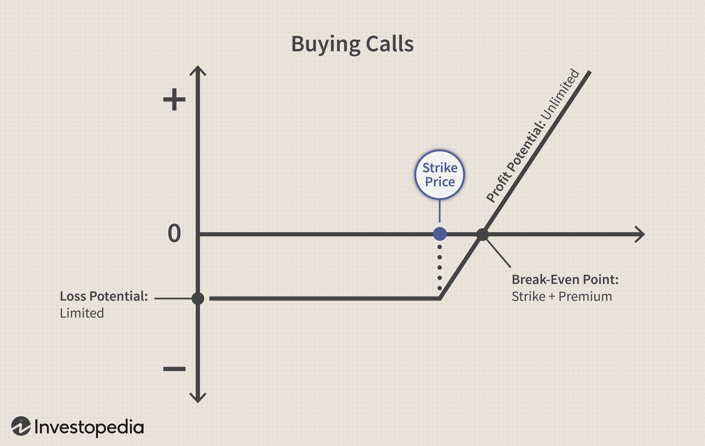

Options trading has become an increasingly popular financial strategy, providing investors with a unique level of flexibility and potential for profit that extends beyond traditional investment methods. At the core of options trading is the concept of call options, which serve as one of the primary instruments used in this investment technique.

A call option grants the investor the right, but not the obligation, to purchase an underlying asset at a predetermined price within a specific time frame. This can offer strategic advantages, allowing investors to leverage their positions while managing risk. Unlike purchasing stocks outright, call options enable investors to benefit from price movements without committing the full capital required to own the shares.



Algorithmic trading, which relies on sophisticated computer programs to execute trades automatically based on established criteria, has also gained significant traction in the financial markets. With its capability to process extensive data sets quickly and execute trades with precision, algorithmic trading intersects notably with call options, creating enhanced opportunities for strategic trading. By integrating these automated processes with options trading, investors can potentially improve their decision-making and responsiveness to market changes.

This article aims to provide beginners with a comprehensive guide to understanding call options, their mechanics, and applications within both options and algorithmic trading contexts. It will also cover the fundamental principles of algorithmic trading and its integration with call options to strengthen trading strategies. Through exploring these concepts, investors can gain insights into effectively utilizing call options and algorithmic trading in pursuit of more informed and dynamic investment decisions.

## Table of Contents

## Understanding Call Options

Call options are financial contracts that give the holder the right, but not the obligation, to purchase an underlying asset at a predetermined price, known as the strike price, within a specific timeframe before the option expires. This flexibility allows investors to benefit from favorable movements in asset prices without committing to the full purchase until they choose.

Call options confer several advantages that make them attractive to investors. They provide leverage, meaning that for a relatively small upfront payment called the option premium, investors can control a larger amount of the underlying asset. This leverage amplifies potential profits if the asset's price increases significantly. Conversely, the maximum loss is limited to the option premium paid if the asset's price does not move favorably, which offers a level of risk management and hedging against potential losses.

Several key terms are crucial for understanding call options:

1. **Strike Price**: The fixed price at which the call option holder can purchase the underlying asset. It is agreed upon when the option contract is written.

2. **Expiration Date**: The date by which the option must be exercised or it expires worthless. This time constraint can pressure the decision-making process, especially as the expiration date approaches and time decay accelerates.

3. **Option Premium**: The price paid by the option buyer to the seller (or writer) for the rights conferred by the option. This premium reflects various factors, including the current price of the underlying asset, the strike price, time remaining until expiration, and market volatility.

To illustrate the mechanics of buying a call option, let us consider an example:

Suppose an investor anticipates an increase in the stock price of Company XYZ, currently trading at $100 per share. The investor decides to purchase a call option with a strike price of $105, expiring in two months, at a premium of $3 per share. This contract gives the investor the right to buy 100 shares of Company XYZ at $105 each.

If the stock price rises to $120 before the expiration date, the investor can exercise the option and purchase shares at the strike price of $105, then sell them in the market for $120, realizing a profit. The profit per share will be the difference between the market price at exercise and the strike price, minus the premium paid, i.e., $(120 - 105) - 3 = 12$. For 100 shares, the total profit would be $1,200.

Conversely, if the stock price does not exceed $105, the call option expires worthless, and the loss incurred is limited to the $300 premium paid. Hence, call options allow investors to participate in potential stock price increases while managing downside risk and minimizing capital commitment.

Overall, call options are a vital component of sophisticated trading strategies, offering unique opportunities to leverage capital and adjust investment portfolios dynamically in response to market conditions.

## Call Options in Trading Strategies

Call options are a versatile instrument within trading strategies, providing distinct opportunities to leverage market movements to maximize profit and manage risk. These derivatives give the holder the right, but not the obligation, to purchase an underlying asset at a predetermined strike price, typically within a specific duration. This flexibility allows investors to adopt various strategic approaches, both offensive and defensive, depending on their market outlook and risk tolerance.

### Buying Calls as a Bullish Strategy

Purchasing call options is fundamentally a bullish strategy, ideal for investors anticipating an upward movement in the price of an asset. The premise is straightforward: if the market price of the underlying asset exceeds the strike price before the option's expiration date, the option holder can execute the option to buy at the strike price, subsequently selling the asset at the higher market price to realize a profit. The potential for profit is theoretically unlimited because, as the asset price continues to rise, so does the potential for gains from holding the option. However, the risk is limited to the premium paid for the call option.

The payoff from a call option can be mathematically represented by:

$$
\text{Payoff} = \max(0, S_T - K) - C
$$

Here, $S_T$ denotes the asset's price at expiration, $K$ is the strike price, and $C$ represents the cost or premium of the call option. This equation illustrates that if the market price $S_T$ is less than or equal to the strike price $K$, the payoff is negative and is limited to the initial premium, which is the maximum loss.

### Protective Strategies with Call Options

While calls are often utilized to speculate on asset price increases, they can also play a critical role in protective strategies, commonly referred to as hedging. For investors who already hold a long position in an underlying asset, call options can provide a safeguard against adverse price movements while still allowing for participation in potential gains.

For instance, an investor might purchase a call option as insurance to lock in gains from a long position. This is essentially a synthetic long call strategy, which involves holding the asset while simultaneously buying a call option. If the asset price declines, the loss incurred from the declining asset value can be offset partially by gains on the call option. Conversely, if the asset price surges, the investor can still benefit from the appreciation, minus the cost of the premium.

Incorporating call options into a broader investment strategy provides significant flexibility: enhancing returns during price appreciations and mitigating losses or securing gains on existing investments. These strategies require careful selection of strike prices and expiration dates to align with the investor's market forecasts and risk tolerance, demanding a nuanced understanding of both market dynamics and option pricing mechanisms.

 to Algorithmic Trading

Algorithmic trading involves the use of computer algorithms to execute trades according to pre-defined criteria, allowing for systematic and rapid execution of orders. These algorithms can analyze various market conditions, utilize historical data, and execute trades with minimal human intervention, which enhances efficiency and accuracy significantly. This strategy is increasingly popular due to its ability to process vast amounts of data and execute trades at speeds unattainable by human traders.

Algorithms are designed to identify trading opportunities by leveraging sophisticated mathematical models and statistical analyses. They are programmed using a set of rules that might include price, timing, and market [volume](/wiki/volume-trading-strategy), among other factors. For instance, a simple [algorithmic trading](/wiki/algorithmic-trading) strategy might be to buy a stock when its 50-day moving average crosses above its 200-day moving average, known as a "golden cross," and sell when the opposite—called a "death cross"—occurs.

Python is a frequently used language in this domain due to its robust libraries for data analysis and [machine learning](/wiki/machine-learning). Tools like pandas, NumPy, and scikit-learn are commonly used to process data and create predictive models. Furthermore, Python's framework for building trading algorithms, such as QuantConnect and Zipline, provide accessible platforms for developing and [backtesting](/wiki/backtesting) trading strategies.

Algorithms can not only assess vast datasets to find profitable opportunities but can also execute trades across multiple markets and time zones simultaneously. High-frequency trading ([HFT](/wiki/high-frequency-trading-strategies)) is a notable example where algorithms make a large number of trades at extremely high speeds, exploiting minute price discrepancies that are generally imperceptible in manual trading.

Automation in algorithmic trading extends beyond stock markets to include options and other securities. For options trading, algorithms can optimize strategies by quickly adapting to market changes, such as [volatility](/wiki/volatility-trading-strategies) shifts, which are crucial variables in options pricing. An algorithm might be programmed to automatically execute a call option trade if certain conditions, like a sudden increase in market volatility or a particular news event, are met.

In conclusion, algorithmic trading is a crucial advancement in the world of finance, offering traders the ability to execute trades with precision and at unprecedented speeds. Its ability to integrate complex datasets and execute trades efficiently makes it a powerful tool for modern trading strategies.

## Combining Call Options with Algorithmic Trading

Algorithmic trading, with its precise and systematic approach, plays a crucial role in the execution of call option trades. Through the use of computer algorithms, traders can efficiently analyze and react to market conditions, optimizing their call option strategies effectively.

First, algorithms can be programmed to monitor real-time data, identifying patterns and trends indicative of favorable market conditions for call options. For instance, algorithms can incorporate technical indicators such as moving averages, Bollinger Bands, or the Relative Strength Index (RSI) to predict potential price movements. By setting predefined criteria, algorithms can automatically trigger call option trades when certain conditions are met, eliminating the need for direct human intervention and minimizing emotional biases in trading decisions.

Moreover, these algorithms can be backtested against historical data to assess their potential effectiveness. Backtesting involves simulating the algorithm's trades over past market conditions to evaluate its performance. This process can help refine the algorithm’s parameters, ensuring that it adheres to an optimal trading strategy. For example, a strategy that buys call options when a stock breaches its 50-day moving average might be tested across different time frames and market environments to ensure robustness.

A practical example of an algorithmic strategy for call options is the implementation of a [momentum](/wiki/momentum)-based model. In Python, such a model might involve the use of libraries like Pandas for data manipulation and NumPy for numerical calculations. An example code snippet may look like this:

```python
import pandas as pd
import numpy as np

# Sample data of stock prices
data = pd.read_csv('stock_data.csv')

# Calculating moving averages
data['50_MA'] = data['Close'].rolling(window=50).mean()
data['200_MA'] = data['Close'].rolling(window=200).mean()

# Define buy signal when 50-day MA crosses above 200-day MA
data['Signal'] = np.where(data['50_MA'] > data['200_MA'], 1, 0)

# Implement the strategy 
data['Strategy'] = data['Signal'].shift(1) * (data['Close'].pct_change())

# Calculate cumulative returns
data['Returns'] = (1 + data['Strategy']).cumprod()

print(data[['Close', '50_MA', '200_MA', 'Signal', 'Returns']].tail())
```

The use of algorithms also enables traders to implement complex strategies that involve not just individual call options but portfolios of options. These advanced strategies can include techniques like delta-neutral trading, where algorithms adjust the portfolio's delta to zero, minimizing exposure to small price movements in the underlying asset. Algorithms can continuously adjust the delta using additional call or put options as hedge positions, maintaining the desired risk profile.

Overall, algorithmic trading offers significant opportunities to optimize call option trading. By efficiently managing and executing trades, traders can potentially enhance profitability and reduce risks associated with market volatility and human error. As technology continues to evolve, the integration of advanced algorithms in trading strategies is likely to become even more sophisticated and integral to the options trading landscape.

## Risks and Opportunities in Call Options and Algo Trading

Trading call options presents a range of risks and opportunities for investors. One of the primary risks involved is market volatility. Call options are particularly sensitive to fluctuations in the underlying asset's price, which can lead to increased unpredictability in the option's value. This sensitivity is often measured by a parameter known as "vega," which indicates the change in an option's price for a 1% change in the volatility of the underlying asset. High market volatility can lead to significant price swings, affecting the profitability of call options.

Another major risk is time decay, represented by the Greek letter "theta." Call options lose value as they approach their expiration date, primarily due to the depreciation of the time value component. This decay can impact the option's worth negatively if the underlying asset does not move favorably before expiration. For instance, if an investor holds a call option and the asset price doesn't increase as anticipated, the option may expire worthless, resulting in a total loss of the premium paid.

Algorithmic trading can mitigate some of these risks by providing precision and speed in executing trades. Algorithms can monitor market conditions in real-time, allowing traders to respond swiftly to changes. This capability helps in minimizing losses that may arise from market volatility. Moreover, algorithms can be designed to incorporate risk management strategies such as stop-loss orders and trailing stops, which can automatically trigger trades to limit potential losses.

Python, for instance, can be used to develop algorithms that respond to market conditions. A simple algorithm could look like this:

```python
import numpy as np

def calculate_option_price(underlying_price, strike_price, time_to_expiration, volatility, risk_free_rate, option_type='call'):
    # Black-Scholes formula for option pricing
    d1 = (np.log(underlying_price / strike_price) + (risk_free_rate + volatility**2 / 2) * time_to_expiration) / (volatility * np.sqrt(time_to_expiration))
    d2 = d1 - volatility * np.sqrt(time_to_expiration)

    if option_type == 'call':
        option_price = (underlying_price * norm.cdf(d1) - strike_price * np.exp(-risk_free_rate * time_to_expiration) * norm.cdf(d2))
    else:
        option_price = (strike_price * np.exp(-risk_free_rate * time_to_expiration) * norm.cdf(-d2) - underlying_price * norm.cdf(-d1))

    return option_price

# Example usage
call_price = calculate_option_price(underlying_price=100, strike_price=100, time_to_expiration=1, volatility=0.2, risk_free_rate=0.05)
```

Opportunities arise when combining call options with algorithmic strategies to enhance trading outcomes. Algorithms can be programmed to capitalize on momentary price inefficiencies, employing high-frequency strategies to enter and [exit](/wiki/exit-strategy) positions quickly and capitalize on small price differences. Additionally, algorithms can manage large datasets to identify patterns and trends that may not be evident to human traders. By leveraging advanced data analytics, traders can predict potential price movements of the underlying asset and strategically position call options to maximize gains.

Moreover, the integration of machine learning techniques within algorithmic trading can enhance predictive models for market trends, contributing to more informed decision-making processes. As the algorithm continuously learns from new data inputs, it refines its trading strategies, potentially increasing profitability.

Overall, while call option trading presents inherent risks associated with market volatility and time decay, combining these strategies with algorithmic trading offers enhanced precision, efficiency, and opportunities for optimizing trading strategies.

## Choosing the Right Broker for Options Trading

Choosing the right broker for options trading is crucial, particularly when utilizing algorithmic strategies to execute transactions efficiently. A reputable broker significantly impacts the success of trading activities by providing reliable platforms, competitive fee structures, and comprehensive educational resources. Here, we explore the essential features to consider when selecting a broker and highlight examples of popular brokers renowned for their offerings in options trading.

### Importance of a Reputable Broker

A reputable broker ensures that the trading environment is robust and secure, offering traders peace of mind that their investments and personal data are protected. With algorithmic trading, the reliability of a broker's technology is paramount as it directly influences the performance and accuracy of trade executions. Brokers that support high-frequency trading and complex algorithms must guarantee minimal downtime and optimal infrastructure to handle the demands of automated trades.

### Key Features to Look for in Brokers

1. **Robust Trading Platforms**: The trading platform is a critical component, acting as the interface between the trader and the market. Advanced platforms offer real-time data feeds, analytic tools, customizable interfaces, and the ability to backtest algorithms effectively. Platforms like thinkorswim by TD Ameritrade and Interactive Brokers' Trader Workstation are examples of comprehensive platforms that cater to algorithmic traders.

2. **Low Fees**: Trading fees can significantly impact returns, especially in strategies involving frequent trades. Brokers offering competitive pricing models, such as discounted commissions per trade or flat-rate trading plans, can help minimize these costs. For example, brokers like Robinhood have gained popularity for their commission-free trading structures, appealing to cost-sensitive traders.

3. **Educational Resources**: For traders at all levels, access to educational materials is invaluable. Leading brokers provide an array of resources, including webinars, tutorials, market analysis, and community forums to help traders refine their skills and stay informed about market trends. Supporting continuous learning, platforms like E*TRADE offer extensive educational content tailored to options trading.

### Popular Options Trading Brokers

- **Interactive Brokers**: Known for its sophisticated trading technology, Interactive Brokers offers a wide range of financial products, competitive fees, and powerful trading tools suitable for both individual and institutional investors. Their platform supports a variety of algorithms and provides robust execution services.

- **TD Ameritrade**: With the thinkorswim platform, TD Ameritrade provides advanced trading tools, including real-time data and technical indicators, which are conducive for algorithmic trading. Their comprehensive educational resources and responsive customer support are additional benefits for traders.

- **Charles Schwab**: Offering a blend of low-cost options trading and educational support, Charles Schwab stands out for its integration of fundamental data and robust trading tools. Their acquisition of TD Ameritrade is set to enhance their technological offerings further.

When choosing a broker, traders should assess these features relative to their individual requirements and trading strategies. A broker that aligns with a trader's technical needs and financial goals can substantially enhance the efficiency and effectiveness of options trading. As the landscape of trading technology evolves, staying informed about broker offerings and advancements remains an essential aspect of maintaining a competitive edge in the markets.

## Conclusion

Trading call options, combined with the use of algorithmic trading, offers significant advantages for investors seeking flexibility, leverage, and enhanced trading efficiency. Call options empower traders by giving them the right to purchase an asset at a predetermined price, which allows for strategic positioning to potentially capitalize on stock price movements. This form of trading facilitates leverage, which can amplify returns when exercised with precise strategies.

Algorithmic trading stands out as a sophisticated method that automates trade executions based on pre-set rules, giving traders the ability to process substantial data volumes with remarkable speed and accuracy. By integrating algorithmic trading with call options, traders can systematically manage trades, reduce emotional biases, and exploit market opportunities as they present themselves. Algorithms can be tailored to capture optimum entry and exit points, minimizing risk exposure while maximizing potential gains.

However, the dynamic nature of both options and the markets necessitates a continuous learning approach. Traders are encouraged to expand their analytical skills, understand emerging technologies, and adapt their strategies to ever-changing market conditions. Experimentation remains an integral aspect of developing a sustainable trading strategy.

Looking forward, the future of algorithmic trading in options is poised for expansion as technological advancements continue to revolutionize financial markets. Developments in [artificial intelligence](/wiki/ai-artificial-intelligence) and machine learning will likely lead to more sophisticated trading algorithms that can further enhance decision-making processes. As regulatory frameworks evolve and data-driven insights become more prevalent, algorithmic trading's role in the options market is anticipated to grow, offering traders new avenues to refine their strategies and achieve greater financial outcomes.

## References & Further Reading

[1]: Black, F., & Scholes, M. (1973). ["The Pricing of Options and Corporate Liabilities."](https://www.cs.princeton.edu/courses/archive/fall09/cos323/papers/black_scholes73.pdf) Journal of Political Economy, 81(3), 637-654.

[2]: Hull, J. C. (2009). ["Options, Futures, and Other Derivatives."](https://www.semanticscholar.org/paper/Options%2C-Futures%2C-and-Other-Derivatives-Hull/89bdee500c8623864fc9eb7a471546aa713acc44) Pearson Education.

[3]: Lopez de Prado, M. (2018). ["Advances in Financial Machine Learning."](https://books.google.com/books/about/Advances_in_Financial_Machine_Learning.html?id=oU9KDwAAQBAJ) Wiley.

[4]: Chan, E. P. (2009). ["Quantitative Trading: How to Build Your Own Algorithmic Trading Business."](https://github.com/ftvision/quant_trading_echan_book) Wiley.

[5]: Jansen, S. (2020). ["Machine Learning for Algorithmic Trading."](https://github.com/stefan-jansen/machine-learning-for-trading) Packt Publishing.

[6]: Aronson, D. R. (2006). ["Evidence-Based Technical Analysis: Applying the Scientific Method and Statistical Inference to Trading Signals."](https://www.amazon.com/Evidence-Based-Technical-Analysis-Scientific-Statistical/dp/0470008741) Wiley.

[7]: CBOE. ["Understanding Options."](https://www.cboe.com/education/) Chicago Board Options Exchange.