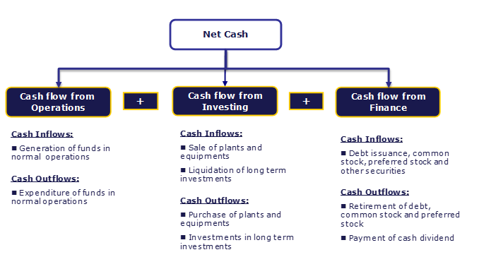

In today's globally connected and data-driven world, the interconnectedness of business finance, cash flow financial analysis, and algorithmic trading is becoming increasingly prominent. These areas are not isolated; rather, they complement one another, creating a framework for sophisticated financial management that is crucial for business success.

Cash flow analysis plays a vital role in assessing a company's financial health, influencing decisions that can lead to sustainable growth and profitability. It provides insight into the liquidity and operational efficiency of a business, ensuring that firms can meet their obligations and invest in future opportunities. Understanding these cash movements allows businesses to make informed strategic choices, supporting both short-term operations and long-term investment planning.



Parallel to these developments in cash flow management is the rise of algorithmic trading, which has revolutionized financial markets. By leveraging advanced financial analysis, algorithmic trading systems utilize data to create refined trading strategies. These systems capitalize on mathematical models and computational algorithms to automate trading, enabling rapid execution of trades and minimizing human errors.

Technological advancements play a crucial role in bridging these two domains, transforming traditional financial practices into modern, efficient processes. The integration of data analytics and technological tools in finance has demystified complex financial concepts, allowing for more transparent and strategic decision-making. As businesses embrace these technological innovations, they gain a competitive advantage by adapting swiftly to market changes and optimizing their financial strategies.

This article will explore these dynamics, examining how cash flow analysis informs financial decisions and how algorithmic trading, grounded in robust financial analysis, ushers in new opportunities for market engagement. Through this exploration, we aim to illuminate the sophisticated interplay of finance and technology in today's economic landscape.

## Table of Contents

## Understanding Cash Flow in Business Finance

Cash flow is essential in understanding a business's financial wellbeing, as it tracks the real-time movement of money entering and leaving a company. Effective cash flow management is crucial for maintaining business operations, as it ensures that a company has the necessary liquidity to meet its immediate obligations and fund future growth.

There are three primary types of cash flow: operational, investing, and financing. Each provides insights into different aspects of a company's financial activities:

1. **Operational Cash Flow**: This reflects the cash generated from a company’s primary business activities, such as sales of goods or services. It's a vital indicator of operational efficiency and profitability. For instance, a company consistently generating positive operational cash flow is likely running a profitable core business.

2. **Investing Cash Flow**: It represents the cash used for or generated from investments in long-term assets. This includes the purchase or sale of equipment, property, or investment securities. An example is a business investing in new technology to improve production efficiency. While a negative investing cash flow might indicate heavy spending on expansion, it could also suggest growth potential.

3. **Financing Cash Flow**: This involves cash activities related to debt, equity, and dividends. For instance, issuing new shares or repaying loans affects financing cash flow. It provides insight into a company’s financial strategy regarding capital structure and shareholder returns.

Proper cash flow analysis is crucial for assessing a company’s financial health and [liquidity](/wiki/liquidity-risk-premium). By analyzing cash flow statements, businesses can identify trends, anticipate funding needs, and make informed strategic decisions. For example, if a company identifies irregularities in operational cash flow, it might scrutinize its accounts receivable processes to ensure timely payments.

To further illustrate, consider a company planning significant capital expenditure. Through cash flow analysis, the company can project future cash flows to determine whether it can self-fund the investment or if external financing will be necessary. This strategic planning ensures that businesses do not overextend themselves financially, thus safeguarding their liquidity and long-term sustainability.

In summary, understanding cash flow types and their analyses helps businesses maintain operational stability, support strategic investments, and optimize financial strategies, leading to better-informed business decisions and enhanced financial performance.

## The Role of Financial Analysis in Decision-Making

Financial analysis is a critical component in business finance, providing insights into a company's performance and guiding strategic decision-making. At its core, financial analysis involves examining various financial statements, with a focus on cash flow, to assess an organization’s health and potential growth opportunities.

Cash flow analysis is pivotal in this process, as it provides a real-time view of the cash inflows and outflows within a business. Key financial indicators and ratios derived from cash flow analysis include free cash flow (FCF), operating cash flow (OCF), and comprehensive free cash flow coverage.

Free cash flow represents the cash a company generates after accounting for capital expenditures, serving as an essential indicator of financial flexibility. It can be calculated using the formula:

$$

\text{Free Cash Flow (FCF)} = \text{Operating Cash Flow} - \text{Capital Expenditures} 
$$

Operating cash flow, on the other hand, measures the cash generated from regular business operations and reflects a company's ability to maintain and grow its operations. Comprehensive free cash flow coverage examines the sufficiency of cash flows to cover all expenses and investments, offering a more holistic view of a company's financial situation.

Assessing a company's financial stability involves analyzing these cash flow metrics alongside other performance indicators like liquidity ratios and profitability ratios. Liquidity ratios, such as the current ratio and quick ratio, indicate the company's ability to meet short-term obligations, while profitability ratios, like the return on equity (ROE) and net profit margin, provide insights into financial performance and efficiency.

Techniques employed in financial analysis to predict growth and sustainability include trend analysis, comparative analysis, and financial modeling. These methodologies help identify patterns, compare industry benchmarks, and forecast future financial scenarios.

Consistent positive cash flow is highly attractive to investors, as it demonstrates not only the company’s operational efficiency but also its potential for sustainable growth. Investors are often enticed by businesses with robust cash flow statements, as they suggest the capability for reinvestment, dividend distributions, and debt reduction, ultimately indicating long-term profitability and stability.

Thus, financial analysis not only illuminates the current financial standing of a business but also shapes strategic decisions that align with the organization's growth objectives and market positioning. By focusing on cash flow and utilizing various analytical techniques, companies can make informed decisions that drive financial success and attract stakeholder confidence.

## Algorithmic Trading: A New Frontier

Algorithmic trading is revolutionizing financial markets by integrating cutting-edge technology and detailed financial analysis. It encompasses the use of computer programs to execute trading strategies at speeds and efficiencies that human traders cannot achieve. These algorithms rely heavily on accurate financial data and sophisticated analytical techniques to make split-second trading decisions.

A cornerstone of [algorithmic trading](/wiki/algorithmic-trading) is the utilization of specific Python libraries designed to handle and analyze large financial datasets. Pandas, for instance, offers data structures and operations for manipulating numerical tables and time series, making it indispensable for managing financial data. NumPy provides support for large multidimensional arrays and matrices, along with a collection of mathematical functions to perform operations on these data structures efficiently. Backtrader, another crucial library, facilitates the development of trading strategies by providing tools for [backtesting](/wiki/backtesting) and implementing custom indicators and analyzers.

Algorithms automate trading strategies by executing pre-defined instructions for variables such as timing, price, and order quantity. This automation is achieved through a variety of approaches, including statistical [arbitrage](/wiki/arbitrage), [market making](/wiki/market-making), and [trend following](/wiki/trend-following). For instance, a moving average crossover strategy, a common algorithmic trading strategy, involves buying or selling based on the crossing of different moving averages. The strategy can be expressed through a simple Python algorithm:

```python
def moving_average_crossover(data, short_window=40, long_window=100):
    # Calculate the short and long moving averages
    signals = pd.DataFrame(index=data.index)
    signals['short_mavg'] = data['price'].rolling(window=short_window, min_periods=1, center=False).mean()
    signals['long_mavg'] = data['price'].rolling(window=long_window, min_periods=1, center=False).mean()

    # Generate signals
    signals['signal'] = 0.0
    signals['signal'][short_window:] = np.where(signals['short_mavg'][short_window:] > signals['long_mavg'][short_window:], 1.0, 0.0)

    # Create trading orders
    signals['positions'] = signals['signal'].diff()
    return signals
```

Despite its potential for massive gains, algorithmic trading comes with its own set of challenges and complexities. Ensuring high-quality, reliable financial data is crucial, as errors or lag in data can lead to significant financial losses. There's also the challenge of market [volatility](/wiki/volatility-trading-strategies), which can disrupt even the most well-planned algorithms. Furthermore, the increasingly competitive nature of the financial markets requires consistent optimization and testing of algorithms to maintain an edge.

As algorithmic trading evolves, it faces potential regulatory challenges and a need for transparency to mitigate risks associated with rapid and high-frequency trading activities. Nonetheless, it remains a fascinating and dynamic frontier, continually reshaping how financial markets operate through innovation and efficiency.

## Connecting Cash Flow Analysis to Algorithmic Trading

The relationship between cash flow analysis and algorithmic trading is based on the strategic use of financial data to inform and refine trading strategies. Cash flow data, capturing the liquidity and economic activity of a company, can serve as a key input in developing algorithmic trading strategies. By incorporating this data, traders can identify trends and patterns that suggest the financial health of companies, affecting stock prices and other trading assets.

A primary strategy employing cash flow data is the moving average crossover, which helps identify potential entry and [exit](/wiki/exit-strategy) points in trading. In this strategy, moving averages of different durations are calculated to understand market direction. For instance, when a short-term moving average crosses above a long-term moving average, it signals a potential buying opportunity, whereas the opposite suggests a selling point. This aligns with cash flow indicators, as a consistent positive cash flow might add confidence to a bullish signal created by a crossover (Harris, 2003).

The practical application of these methods necessitates robust backtesting to validate the efficacy of trading strategies. Backtesting involves applying the trading strategy to historical data to assess performance. By leveraging historical cash flow data in backtesting, traders can adjust their algorithms to optimize returns while managing risks. This process ensures that strategies are not only theoretically sound but also practically viable, responding well to real-world data.

Python's ecosystem provides valuable tools for this endeavor. Libraries such as Pandas for data manipulation, NumPy for numerical calculations, and Backtrader for backtesting allow algorithmic traders to effectively integrate and test cash flow-based strategies. Here's an example of a simple moving average crossover strategy using Python:

```python
import pandas as pd
import numpy as np
import matplotlib.pyplot as plt

# Example data loading: company cash flow data
cash_flow_data = pd.read_csv('cash_flow.csv')
cash_flow_data['Short_MA'] = cash_flow_data['Cash Flow'].rolling(window=40).mean()
cash_flow_data['Long_MA'] = cash_flow_data['Cash Flow'].rolling(window=100).mean()

# Generate trading signals based on moving average crossover
cash_flow_data['Signal'] = 0
cash_flow_data['Signal'][40:] = np.where(cash_flow_data['Short_MA'][40:] > cash_flow_data['Long_MA'][40:], 1, -1)

# Plotting the results
plt.figure(figsize=(14, 7))
plt.plot(cash_flow_data['Cash Flow'], color='grey', label='Cash Flow')
plt.plot(cash_flow_data['Short_MA'], color='blue', label='40-day MA')
plt.plot(cash_flow_data['Long_MA'], color='red', label='100-day MA')
plt.plot(cash_flow_data.loc[cash_flow_data['Signal'] == 1].index,
         cash_flow_data['Short_MA'][cash_flow_data['Signal'] == 1],
         '^', color='green', markersize=10, label='Buy Signal')
plt.plot(cash_flow_data.loc[cash_flow_data['Signal'] == -1].index,
         cash_flow_data['Short_MA'][cash_flow_data['Signal'] == -1],
         'v', color='red', markersize=10, label='Sell Signal')
plt.title('Moving Average Crossover Strategy Based on Cash Flow')
plt.legend()
plt.show()
```

This code processes historical cash flow data to generate trading signals based on the crossover of short-term and long-term moving averages. Buy and sell signals are visualized on the cash flow graph, enabling traders to understand past performance and potential future trends.

By exploiting the technological capabilities provided by advanced trading platforms and data analytics tools, traders can transform detailed cash flow analysis into actionable insights. This synergistic approach underscores the benefits of data-driven decision-making in financial markets, providing traders with a sophisticated method to enhance their trading effectiveness. This integration of financial analysis with technology-driven trading processes is redefining the capabilities and performance aspirations of modern trading strategies (Chan, 2006).

## Challenges and Future Trends

In the interconnected world of business finance and algorithmic trading, the evolving landscape brings with it a myriad of challenges and future trends. Key among these challenges are data quality and market volatility. Accurate data is crucial for cash flow analysis and the development of reliable algorithmic trading strategies. Poor data quality can lead to erroneous analysis and unpredictable trading outcomes. Market volatility further complicates this, as unexpected market movements can dramatically impact financial forecasts and trading algorithm performance.

Emerging trends in financial technology are reshaping cash flow management and trading. Notably, [artificial intelligence](/wiki/ai-artificial-intelligence) (AI) and [machine learning](/wiki/machine-learning) (ML) are gaining significant traction. These technologies have the potential to enhance financial strategies by offering predictive analytics, which can identify patterns from large datasets that might be overlooked by conventional methods. AI models can be trained to recognize subtle trends in cash flow data or market movements, providing businesses with advanced tools for financial planning and risk management.

As these technologies evolve, the regulatory environment is becoming increasingly stringent. The integration of AI and complex algorithms in trading introduces unique regulatory challenges. Organizations must navigate financial regulations that demand transparency and accountability in algorithmic decision-making. Furthermore, data privacy concerns are mounting as financial systems handle sensitive information at an unprecedented scale. Firms must ensure compliance with data protection laws while deploying robust security measures to safeguard against breaches.

Looking ahead, the integration of various financial analysis tools and trading systems is expected to continue. Companies that can effectively harness the synergy between cash flow analysis and algorithmic trading are likely to achieve a significant competitive advantage. This integration will facilitate more informed and rapid decision-making, thereby enhancing business agility. It is anticipated that future financial systems will increasingly rely on automation and real-time data processing, ushering in a new era where technology and finance are seamlessly intertwined to drive innovation and efficiency.

## Conclusion

The integration of cash flow financial analysis and algorithmic trading is revolutionizing financial management, ushering in a new era where data-driven insights and automation play pivotal roles. Businesses that successfully utilize these tools not only enhance their financial health but also achieve greater market agility. By effectively managing cash flow and integrating sophisticated algorithmic trading strategies, companies can secure a competitive advantage in an increasingly complex financial landscape.

Understanding and managing cash flow is fundamental to financial stability, as it provides critical insights into a company's liquidity and operational efficiency. When coupled with algorithmic trading, which leverages precise financial analysis and data processing, businesses can optimize their investment strategies and respond swiftly to market changes. The synergy between these two elements empowers organizations to make informed decisions based on real-time financial data, thus enhancing their strategic planning capabilities.

The role of technology in this integration cannot be overstated. With advances in computing and data analytics, traditional methods of financial analysis and trading are being transformed. Technologies like machine learning and artificial intelligence contribute to the creation of more predictive and adaptive trading models, while tools like Python facilitate the development and backtesting of these models. This technological evolution drives both innovation and efficiency in financial decision-making processes.

This article has aimed to provide an insightful overview of how modern business finance can be navigated through the convergence of cash flow analysis and algorithmic trading. By embracing this integrated approach, businesses stand to benefit from improved performance, enhanced decision-making, and a sustainable competitive edge in the dynamically evolving financial markets.

## References & Further Reading

[1]: ["Advances in Financial Machine Learning"](https://www.amazon.com/Advances-Financial-Machine-Learning-Marcos/dp/1119482089) by Marcos Lopez de Prado  

[2]: ["Evidence-Based Technical Analysis: Applying the Scientific Method and Statistical Inference to Trading Signals"](https://www.amazon.com/Evidence-Based-Technical-Analysis-Scientific-Statistical/dp/0470008741) by David Aronson  

[3]: ["Machine Learning for Algorithmic Trading"](https://github.com/PacktPublishing/Machine-Learning-for-Algorithmic-Trading-Second-Edition) by Stefan Jansen  

[4]: ["Quantitative Trading: How to Build Your Own Algorithmic Trading Business"](https://www.amazon.com/Quantitative-Trading-Build-Algorithmic-Business/dp/1119800064) by Ernest P. Chan  

[5]: ["High-Frequency Trading: A Practical Guide to Algorithmic Strategies and Trading Systems"](https://www.wiley.com/en-us/High+Frequency+Trading%3A+A+Practical+Guide+to+Algorithmic+Strategies+and+Trading+Systems%2C+2nd+Edition-p-9781118343500) by Irene Aldridge  

[6]: Harris, L. (2003). ["Trading and Exchanges: Market Microstructure for Practitioners"](https://www.amazon.com/Trading-Exchanges-Market-Microstructure-Practitioners/dp/0195144708)  

[7]: Chan, E. P. (2006). ["Algorithmic Trading: Winning Strategies and Their Rationale"](https://github.com/ftvision/quant_trading_echan_book)  