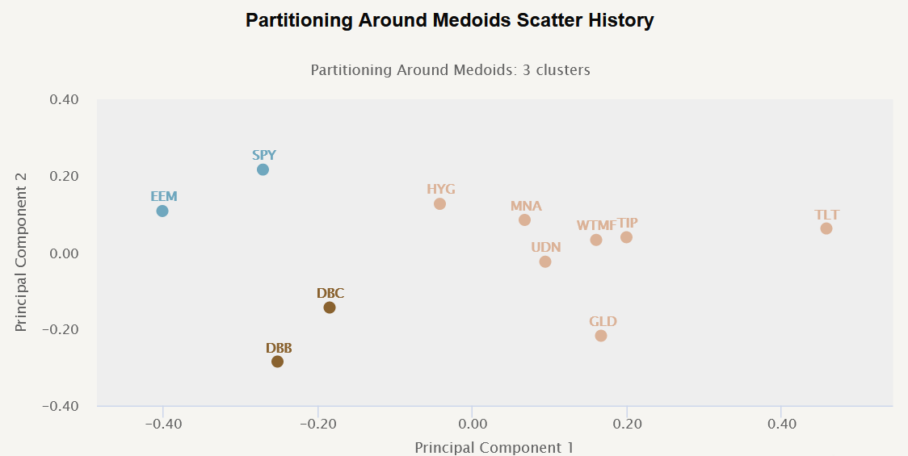

This article represents the third and final part of our series on clustering methods in portfolio management, focusing on their application in algorithmic trading. Clustering methods, vital in many data-driven fields, serve the purpose of grouping assets into clusters with similar characteristics. This classification facilitates optimized portfolio management by reducing complexity and enhancing trading strategies through systematic analysis of asset behaviors and their interactions. 

In portfolio management, clustering helps in identifying homogeneous groups of assets, enabling more informed decision-making about investments, diversification, and risk management. Algorithmic trading strategies benefit significantly from such analyses by adapting more dynamically to market conditions and improving risk management capabilities.



This section of the series examines trading strategies developed using the clustering methods discussed in previous articles and introduces the concept of clustered risk parity strategies. Clustered risk parity involves balancing the contribution to portfolio risk by different clusters rather than individual assets, thereby potentially offering a new avenue for risk management.

Quantpedia Pro clients will soon have access to a comprehensive Portfolio Clustering report that encapsulates these insights and methodologies. The report aims to provide a detailed resource for financial professionals seeking to leverage clustering techniques in enhancing their portfolio strategies.

To provide a coherent understanding of the topic, it is crucial to revisit the definitions, objectives, and importance of clustering within the context of portfolio management. Clustering essentially aims to exploit the inherent structures within complex datasets, enabling the categorization of assets based on their statistical similarities or historical performance patterns. This plays a crucial role in trading strategies by allowing the identification of relationships and correlations that might not be apparent through traditional analysis.

In conclusion, while clustering offers significant potential benefits in aligning risk management with the unique characteristics of asset classes, it is essential to recognize its limitations. Clustering should not be seen as a standalone solution but rather a complementary tool that, when coupled with predictive analytics, can contribute to a more robust and versatile approach to portfolio management and trading strategy development.

## Table of Contents

## Cluster Risk Parity Strategies

Risk Parity Asset Allocation, a strategy aiming for risk balanced distribution across a portfolio, can achieve further refinement through clustering techniques that consider asset classes and quantities. The integration of clustering in risk parity strategies aims to better manage diversification and [volatility](/wiki/volatility-trading-strategies) by recognizing inherent linkages within asset groups.

In this context, six distinct strategies are constructed using clustering on eight ETFs that encompass equities, alternatives, and bonds. This approach leverages clustering to optimize asset distribution more effectively than traditional methods. The three clustering techniques employed are Partitioning Around Medoids (PAM), Agglomerative Nesting (AGNES), and Gaussian Mixture Models (GMM)—each providing unique data-driven insights into asset grouping.

The strategies are assessed on two key fronts: equal weighting and risk-adjusted weighting, both critical in managing portfolio volatility and enhancing optimization. By applying these methods, the strategies strive to achieve balanced risk distribution tailored to each cluster's characteristics, thus potentially mitigating exposure to inherent asset risks.

PAM clustering offers a medoid-focused segmentation approach, which could identify a central asset within each cluster, offering a representative and stable investment choice. AGNES uses a hierarchical method, progressively merging assets to form clusters, which is useful for identifying nested asset group relationships. Conversely, the GMM technique assumes a probabilistic model to account for data variability within clusters, potentially capturing complex distribution patterns among [ETF](/wiki/etf-trading-strategies) returns.

The effectiveness of these strategies is commonly evaluated by their ability to manage volatility while optimizing returns, a fundamental objective in portfolio management. The risk-adjusted assessments often involve calculating performance metrics such as the Sharpe Ratio, which adjusts returns based on portfolio risk, calculated as:

$$
\text{Sharpe Ratio} = \frac{E[R_p - R_f]}{\sigma_p}
$$

where $E[R_p]$ is the expected portfolio return, $R_f$ is the risk-free rate, and $\sigma_p$ represents the portfolio standard deviation. 

Implementing these clustering strategies in the optimization framework provides an innovative pathway to address volatility. This makes them valuable for developing risk parity strategies that both account for asset classes and the dynamic nature of financial markets.

## Methodology

The methodology in the study of clustering methods for [algorithmic trading](/wiki/algorithmic-trading) involves a systematic approach to organizing assets into distinct clusters based on their historical performance. Specifically, this process utilizes weekly sorting of assets into clusters by analyzing their past one-year weekly returns to capture dynamic market behavior and asset correlations.

To achieve this clustering, three methods are employed: Partitioning Around Medoids (PAM), Agglomerative Hierarchical Clustering (AGNES), and Gaussian Mixture Models (GMM). Each technique offers a unique approach to grouping assets:

1. **Partitioning Around Medoids (PAM)**: This method partitions the data set into `k` clusters by selecting representative objects or medoids. It minimizes the sum of dissimilarities between points and their nearest medoid.

2. **Agglomerative Hierarchical Clustering (AGNES)**: This bottom-up method starts with individual elements as separate clusters and merges them into larger clusters using a linkage criterion, such as single, complete, or average linkage.

3. **Gaussian Mixture Models (GMM)**: GMM assumes that the data is generated from a mixture of several Gaussian distributions, each with its own mean and variance. It estimates the parameters using the Expectation-Maximization (EM) algorithm.

The optimal number of clusters for each method is dynamically determined using the silhouette method. The silhouette value measures how similar an asset is to its own cluster compared to other clusters, with values close to +1 indicating that the asset is well clustered.

For the empirical analysis, data from May 2014 to May 2021 is employed. This period provides ample data for evaluating how clustering methods categorize assets over differing market conditions. The data includes eight ETFs representing a mix of asset classes, providing a broad view of market behavior.

The clustering process involves periodically re-evaluating and reorganizing assets to account for changes in their weekly returns, allowing the formation and nature of clusters to adapt over time. This dynamic approach aids in capturing shifts in market dynamics and volatility, which are critical for optimizing portfolio management strategies. By analyzing clusters' formation at various time points, traders and analysts can enhance their understanding of asset behavior and interdependencies, ultimately improving trading strategy development and risk management.

## Results

The application of the silhouette method in determining the number of clusters within portfolio management provides a dynamic approach to asset grouping. The method effectively measures how similar an asset is to its own cluster compared to other clusters. Its formula is given by:

$$
S(i) = \frac{b(i) - a(i)}{\max(a(i), b(i))}
$$

where $a(i)$ represents the average distance between an asset and all other points in its cluster, and $b(i)$ is the average distance from the asset to the points in the nearest cluster. The resulting silhouette score ranges from -1 to 1, where a high score indicates well-defined clusters and a lower score signifies clustering ambiguity.

In our analysis, the silhouette method was crucial in identifying distinct clustering structures for PAM (Partitioning Around Medoids), AGNES (Agglomerative Nesting), and GMM (Gaussian Mixture Model). Each of these methods organizes data under unique assumptions, which became evident through the clustering effectiveness as reflected in the silhouette score results.

Throughout the evaluated period from May 2014 to May 2021, the PAM method showcased consistent silhouette scores, indicating firm and stable asset clusters. This stability suggests PAM's efficacy in identifying robust asset relationships using medoids, which are more resistant to noise than centroids traditionally used in methods like k-means clustering.

By contrast, AGNES, which depends on hierarchical clustering, displayed varying silhouette scores, reflecting its sensitivity to data volatility and the challenges in determining optimal clusters over time. The hierarchical approach aggregates clusters stepwise and can sometimes lead to ill-defined groups, impacting its performance.

On the other hand, GMM's probabilistic framework provided flexibility in accommodating overlapping asset clusters. This was noted through moderate silhouette scores, signaling its competence in capturing and modeling the inherent ambiguity in financial markets. However, it tends to be computationally intensive and may require substantial data to perform adequately.

The results were further depicted visually through charts that presented the temporal progression of asset sorting across these clustering methods. Such visualizations aid in comprehending the clustering evolution, showcasing periods of market instability and their impacts on cluster fidelity.

Critical performance indicators were extracted from these clustering exercises, including cluster size changes and returns comparison with traditional risk models. PAM's stability translated into superior risk-adjusted returns, aligning assets efficiently across diverse market conditions. Meanwhile, AGNES lagged behind, often producing suboptimal clusters due to its deterministic nature. GMM offered a balancing perspective, where its moderate performance could be beneficial in scenarios requiring flexible model assumptions.

These results underscore the importance of method selection in clustering for portfolio management. Each clustering method's unique strengths and limitations must be carefully evaluated concerning the specific financial context and investment strategy objectives. The ability to dynamically adapt to market changes, as supported by PAM, can be particularly advantageous in managing volatility and enhancing portfolio stability.

## Clustering Strategies

Six clustering-based strategies were developed to explore enhanced portfolio diversification and risk management. Each strategy aligns with the overall objective of achieving optimal performance and is assessed against two conventional benchmarks: a standard equal weight portfolio and a Naïve Risk Parity portfolio composed of eight Exchange-Traded Funds (ETFs).

### Strategy Formation

The six strategies are categorized into two types:

1. **Equal Weight Strategies**: 
   - These strategies assign equal proportions of investment to each cluster. The rationale is to maintain simplicity and avoid overemphasis on any particular cluster, thereby minimizing exposure to specific asset risks.

2. **Risk-Based Weight Strategies**:
   - In these strategies, clusters are weighted based on their risk attributes. This involves calculating the risk contribution of each cluster to align with specified risk-adjusted returns, enhancing portfolio resilience to market volatility.

The strategies leverage three clustering methods: Partitioning Around Medoids (PAM), Agglomerative Nesting (AGNES), and Gaussian Mixture Models (GMM). Each method contributes to forming distinct clusters characterized by unique asset groupings and risk-return profiles.

### Performance Benchmarks

The strategies are rigorously benchmarked against an equal weight portfolio, where each ETF receives an identical allocation, and a Naïve Risk Parity portfolio, where assets are weighted to equalize risk contribution across the portfolio.

**Key Metrics for Evaluation:**

- **Total Return**: Overall growth of the portfolio over the analysis period.
- **Volatility**: Standard deviation of portfolio returns, indicating risk.
- **Sharpe Ratio**: Measures risk-adjusted return, calculated as:
$$
  \text{Sharpe Ratio} = \frac{E[R] - R_f}{\sigma}

$$
  Where $E[R]$ is the expected return, $R_f$ is the risk-free rate, and $\sigma$ is the standard deviation of the portfolio's return.

### Strategy Comparison

By comparing the clustering strategies with standard benchmarks, insights are garnered into the efficacy of clustering in enhancing diversification and managing portfolio risk.

- **Diversification**: Clustering allows for a broader spread of asset classes within the portfolio, thus reducing unsystematic risk relative to traditional schemes.
- **Risk Management**: The concentration of risk in specific clusters is evaluated and adjusted in risk-based strategies to better respond to market fluctuations and optimize returns.

This analytical framework facilitates understanding the strengths and limitations of clustering techniques within portfolio management, offering a sophisticated approach to balancing diversification and risk adjustment.

## Equal Cluster Weights Strategy

The equal cluster weights strategy examines the performance of portfolio strategies using clustering methods by assigning equal weights to the clusters formed. This approach focuses on three clustering techniques: Partitioning Around Medoids (PAM), Agglomerative Nesting (AGNES), and Gaussian Mixture Models (GMM). Each method provides a distinct perspective on asset grouping and influences the overall portfolio's risk-return profile.

The primary goal of equal cluster weights is to distribute assets evenly among the identified clusters, ensuring no single cluster dominates the portfolio in terms of exposure. This strategy attempts to harness diversification benefits inherent in each clustering method by mitigating risks associated with individual asset classes and promoting a balanced asset allocation.

1. **PAM-Based Strategy**:
   The strategy derived using PAM realized notably optimal risk-adjusted returns. PAM's robustness in handling noise and outliers results in clusters that are more consistent, offering a stable risk-reward balance. This clustering method segments the asset universe into clusters that are homogeneous in terms of market behavior trends, thus enhancing return consistency.

2. **AGNES-Based Strategy**:
   In contrast, hierarchical clustering through AGNES, while useful for understanding asset hierarchies, often showed underperformance compared to PAM. The underperformance could be attributed to the hierarchical method’s sensitivity to distance metrics and initial data configurations, which can lead to unequal cluster sizes and, consequently, misaligned risk weights when uniformly applied.

3. **GMM-Based Strategy**:
   Gaussian Mixture Models provide a probabilistic approach, allowing for overlapping clusters, which can be beneficial in scenarios where asset behaviors overlap across market conditions. GMM offers flexibility in handling complexities within the data, but its effectiveness compared to PAM is subject to further comparative study.

**Graphical Analysis**:
Visual representations, such as cumulative return charts and risk-return scatterplots, provide a clear narrative of how each strategy evolves over time. These visuals depict the performance trajectory under each clustering method, highlighting PAM's superior ability to smooth out volatility while achieving steady growth.

**Tabular Comparison**:
Risk-return characteristics, tabulated across different strategies, deliver quantitative insights into each method's efficacy. Common metrics such as the Sharpe ratio, maximum drawdown, and annualized volatility are instrumental in evaluating the practicality of each clustering approach in realizing portfolio objectives.

The efficacy of the equal cluster weights strategy underscores the importance of selecting the appropriate clustering technique in portfolio construction. While PAM emerges as a reliable choice, continual assessment and adaptation remain vital to accommodating market dynamics and asset behavior shifts.

## Cluster Risk Parity Strategy

In developing a cluster risk parity strategy, the primary objective is to achieve a balanced contribution to risk from each identified cluster within the portfolio, incorporating both the diverse nature of asset classes and their corresponding volatility profiles.

**Equitable Risk Contribution:**

A cluster risk parity strategy focuses on adjusting the weights of clusters and assets to ensure each cluster contributes equally to the portfolio's risk. This approach requires calculating the risk contribution of each cluster, typically defined as:

$$
\text{Risk Contribution} = \text{Weight} \times \text{Volatility} \times \text{Correlation with the Portfolio}\]

Here, the objective is to modify weights such that each cluster's risk contribution aligns with the desired parity, maintaining a stable risk structure across different market conditions.

**Performance of PAM Clustering:**

The application of Partitioning Around Medoids (PAM) clustering demonstrated superior risk-adjusted performance compared to hierarchical clustering techniques. The PAM method effectively identifies medoids that represent central points within clusters and allocates asset weights accordingly. This precision leads to an impressive alignment of risk contributions, enhancing the overall risk-reward profile of the portfolio.

Moreover, PAM's adaptability to fluctuations in asset returns allows it to remain effective even when market dynamics shift. This adaptability is crucial for maintaining optimal risk parity because it minimizes the likelihood of over- or under-representing any asset class within the portfolio.

**Challenges of Hierarchical Strategies:**

Hierarchical clustering methods tend to underperform in this context due to their less granular approach to weight allocation. When asset classes within clusters exhibit significant disparity in volatility, hierarchical strategies may struggle to allocate appropriate risk weightings, leading to suboptimal risk-adjusted returns. In such cases, clusters may inadvertently skew towards asset classes with lower volatility, which could hinder the balanced risk contribution goal.

**Strategic Adjustments in Response to Volatility:**

In response to unexpected shifts in market volatility, strategic weight adjustments are necessary to preserve the integrity of the cluster risk parity strategy. The application of dynamic risk models provides the framework to recalibrate weights efficiently. For instance, in Python, one might implement a volatility-adjusted weight recalibration as follows:

```python
import numpy as np

def adjust_weights(weights, volatilities, target_volatility):
    adjusted_weights = weights * (target_volatility / volatilities)
    normalized_weights = adjusted_weights / np.sum(adjusted_weights)
    return normalized_weights

# Example weights and volatilities of clusters
weights = np.array([0.2, 0.3, 0.5])
volatilities = np.array([0.1, 0.15, 0.2])
target_volatility = 0.15

new_weights = adjust_weights(weights, volatilities, target_volatility)
```

This kind of strategic recalibration can prove instrumental in maintaining an equitably distributed risk structure, thereby securing the portfolio against asymmetric market movements.

In summary, a cluster risk parity strategy that effectively leverages techniques like PAM can significantly enhance portfolio resilience by ensuring that risk contributions remain balanced, even amid shifting market conditions. However, careful consideration of clustering methodology is crucial to avoid potential pitfalls associated with hierarchical weight allocations.

## Conclusion

Clustering techniques, when integrated with risk parity strategies, significantly enhance portfolio management by aligning risk adjustments to reflect the underlying characteristics of the assets involved. This alignment fosters a more nuanced risk management approach, enabling strategies that can better absorb and adapt to market fluctuations. However, it is crucial to recognize the limitations inherent in these methods. Notably, clustering is not universally beneficial; in specific market conditions or with particular asset configurations, it may inadvertently escalate risk levels rather than mitigate them.

Furthermore, while clustering is adept at structuring risk, it does not inherently optimize returns. Its primary function is to aid in the architecture of risk management frameworks, thus necessitating its use alongside robust performance predictors to maximize portfolio performance. The successful implementation of clustering strategies often depends on balancing risk management processes with predictive tools, such as [machine learning](/wiki/machine-learning) algorithms or statistical models, to achieve optimal outcomes.

Key takeaways from the integration of clustering and risk parity include the importance of a balanced approach that combines risk management with predictive analytics. This combination facilitates not only enhanced risk structuring but also improved decision-making processes within portfolio management. Future developments in this area may also focus on hybrid strategies that incorporate clustering with advanced data-driven insights to further refine strategy effectiveness and resilience in diverse market environments.

## References & Further Reading

[1]: Hastie, T., Tibshirani, R., & Friedman, J. (2009). ["The Elements of Statistical Learning: Data Mining, Inference, and Prediction."](https://link.springer.com/book/10.1007/978-0-387-84858-7) Springer.

[2]: Lopez de Prado, M. (2018). ["Advances in Financial Machine Learning."](https://www.amazon.com/Advances-Financial-Machine-Learning-Marcos/dp/1119482089) Wiley.

[3]: Tibshirani, R., Walther, G., & Hastie, T. (2001). ["Estimating the number of clusters in a data set via the gap statistic."](https://rss.onlinelibrary.wiley.com/doi/10.1111/1467-9868.00293) Journal of the Royal Statistical Society: Series B (Statistical Methodology), 63(2), 411-423.

[4]: Jansen, S. (2020). ["Machine Learning for Algorithmic Trading."](https://github.com/stefan-jansen/machine-learning-for-trading) Packt Publishing.

[5]: Kaufman, L., & Rousseeuw, P.J. (2008). ["Finding Groups in Data: An Introduction to Cluster Analysis."](https://onlinelibrary.wiley.com/doi/book/10.1002/9780470316801) Wiley.