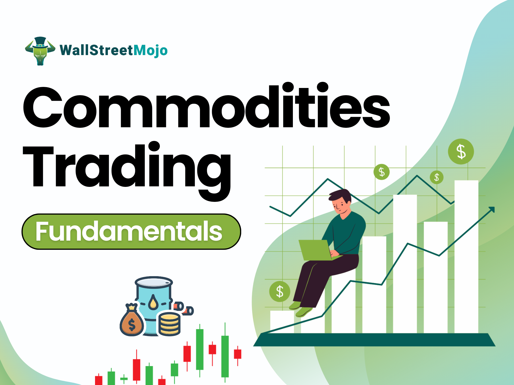

In financial markets, investors continually seek innovative paths to maximize returns while effectively managing risks. Commodity funds and algorithmic trading represent two pivotal components that are increasingly shaping modern investment strategies. 

Commodity funds provide investors with exposure to various physical goods, including precious metals like gold, energy resources such as oil, and agricultural products. Their allure lies in the diversification opportunities they offer, as these funds typically maintain a low correlation with traditional equity markets. This characteristic makes them a valuable tool for risk management and portfolio diversification.

In contrast, algorithmic trading employs sophisticated computer programs to execute trades based on pre-set criteria. This approach to trading is celebrated for its speed and accuracy, allowing traders to swiftly capitalize on market inefficiencies that may be fleeting. Algorithmic trading also mitigates common issues associated with human trading, such as emotional biases and errors, thereby enhancing precision.

Together, commodity funds and algorithmic trading form the backbone of contemporary investment strategies. These elements enable investors to navigate the complexities of today's financial markets and exploit opportunities that arise from market fluctuations. Understanding the interaction between these components is crucial for investors aiming to craft portfolios that not only withstand market volatility but also seize potential gains. 

The integration of these strategies reflects the ongoing evolution of financial markets, prompting a need for informed decision-making that leverages technological advancements. By combining the diversification offered by commodity funds with the precision of algorithmic trading, investors are better equipped to achieve their financial objectives amidst the ever-changing landscape of the financial world.

## Table of Contents

## Understanding Commodity Funds

Commodity funds are investment vehicles designed to provide investors with exposure to a variety of commodities, including metals like gold, energy resources such as oil, and agricultural products like wheat and soybeans. These funds aim to capitalize on the diverse nature of commodity markets, offering a range of investment opportunities for both individual and institutional investors.

There are several types of commodity funds, each differing in their approach and underlying assets. Some funds hold actual physical commodities, providing direct exposure to price movements in raw materials. Others focus on trading commodities futures, contracts which obligate the purchase or sale of a commodity at a predetermined future date and price. These futures-based funds often utilize leverage to amplify potential returns. Additionally, certain commodity funds invest in companies operating within the commodity sector, such as mining firms, energy producers, or agricultural conglomerates. This approach offers indirect exposure to commodity prices, tied with the potential financial performance of these firms.

Commodity funds employ varying management strategies which significantly affect their risk profiles and performance outcomes. Active management involves a hands-on approach where managers make real-time investment decisions based on market analysis and forecasts. This strategy seeks to outperform the market or a specific benchmark through tactical asset allocation and security selection. Conversely, passive management aims to replicate the performance of a commodity index by maintaining a consistent asset allocation, thus minimizing the costs and risks associated with frequent trading.

One of the primary attractions of commodity funds is their potential for portfolio diversification. Commodities often exhibit low correlation with traditional equity and bond markets, making them an effective hedge against market [volatility](/wiki/volatility-trading-strategies) and economic downturns. This low correlation means that the price movements of commodities do not necessarily move in tandem with stock or bond prices, thus allowing investors to reduce portfolio risk and stabilize returns over the long term.

In summary, commodity funds offer a versatile and strategic option for investors seeking exposure to diverse asset classes and the potential benefits of diversification. Their variety in structure and strategy makes them an attractive choice for those looking to mitigate risks and enhance potential returns in a balanced investment portfolio.

## The Role of Algorithmic Trading in Commodity Investment

Algorithmic trading, often referred to as algo trading, has emerged as a pivotal component in the modern trading landscape, particularly within commodity markets. This trading method employs computer programs to execute trades based on predefined strategies, offering enhanced speed and precision. The automation and computational power inherent to algo trading enable traders to efficiently analyze vast amounts of data and execute trades within fractions of a second, thus providing a significant competitive advantage.

In commodity markets, where rapid fluctuations and volatility are common, the ability to quickly capitalize on market inefficiencies is crucial. Algorithmic trading systems are adept at identifying and exploiting these inefficiencies, making them highly effective in commodities investment. For instance, algorithmic programs can detect price discrepancies across different markets or time frames and execute [arbitrage](/wiki/arbitrage) trades that profit from these differences.

Moreover, algo trading helps to minimize one of the most common challenges faced in manual trading—emotional biases and human errors. By relying on predefined algorithms and strategies, traders can eliminate the subjectivity and psychological pressures that often lead to suboptimal decisions. This objectivity is particularly beneficial in the volatile environment of commodity trading, where emotions can run high due to rapid price movements.

Several algorithmic strategies are commonly applied to commodities, optimizing trading decisions and enhancing profitability. Trend-following strategies, for example, are designed to capture gains by analyzing commodity price trends and following prevailing market directions. These strategies employ statistical and mathematical tools to predict future price movements based on historical data.

Statistical arbitrage is another widely used algorithmic strategy in commodity trading. This involves leveraging mathematical models to identify relationships and correlations between different commodity instruments. By doing so, traders can execute trades that exploit temporary divergences in these relationships, thereby profiting from mean reversion once prices re-align with their statistical norms.

The integration of [algorithmic trading](/wiki/algorithmic-trading) in commodity investment not only offers speed and accuracy but also empowers traders with a systematic approach to decision-making. Through the use of sophisticated algorithms and data analysis, algo trading enhances the ability to navigate the complexities and inherent volatility of commodity markets efficiently.

## Benefits and Drawbacks of Investing in Commodity Funds

Investing in commodity funds offers a strategic avenue for diversification and acts as a hedge against inflation, taking advantage of the inherent volatility of commodity markets. These funds expose investors to a variety of commodities, such as gold, oil, and agricultural products, each with unique supply and demand dynamics. This diversification helps in mitigating risks associated with traditional equity markets, which often display higher correlations among themselves.

One of the main benefits of investing in commodity funds is the potential for significant upside due to fluctuations in supply and demand. For instance, geopolitical events, natural disasters, or changes in government policies can drastically affect commodity prices. Investors can benefit from the price movements if they are aligned favorably. However, this same volatility poses a substantial risk. Commodity prices can be unpredictable, leading to potential losses if market movements go against an investor’s position.

Understanding the composition and strategies of commodity funds is crucial for investors. These funds can vary widely in their investment approaches. Some funds may hold physical commodities, while others may engage in futures contracts or invest in commodity-related companies. Each approach comes with its own set of risks and rewards. Therefore, aligning the choice of a commodity fund with one's investment goals and risk tolerance is essential. For example, a fund focusing on futures contracts may react differently to market changes compared to one that holds physical assets.

While commodities offer enticing rewards, they require careful analysis to navigate associated risks effectively. Investors should be aware of factors such as global supply chains, currency fluctuations, and broader economic trends that can impact commodity prices. Additionally, ongoing monitoring and evaluation of the fund’s performance and its alignment with personal financial goals are necessary.

In conclusion, commodity funds present a viable option for diversification and inflation hedging. However, their volatile nature demands a thorough understanding and cautious approach to effectively benefit while minimizing potential downsides.

## Challenges and Opportunities in Algo Trading

Algorithmic trading, often referred to as algo trading, has become increasingly prevalent in the financial markets, offering a range of opportunities and challenges. It leverages computer algorithms to analyze market data and execute trades with speed and precision, surpassing human capabilities in terms of speed and [volume](/wiki/volume-trading-strategy) of trades. However, alongside these benefits, algo trading introduces specific challenges that traders must navigate to maximize its potential.

One of the primary advantages of algorithmic trading is the enhancement of market analysis and the speed of trade execution. Algorithms can process vast amounts of market data in real time, identifying patterns and executing trades within milliseconds. This speed advantage allows traders to capitalize on fleeting market opportunities that might be missed with manual trading methods. Nonetheless, this rapid execution capability can also lead to significant market impacts, particularly in terms of [liquidity](/wiki/liquidity-risk-premium) and volatility. In volatile markets, algorithmic trades may exacerbate price swings, especially when large volumes are traded within short timeframes.

Overfitting represents another significant concern in algorithmic trading. Developing trading algorithms involves finding patterns in historical data, but these patterns may not necessarily repeat in future market conditions. An overfitted model is one that has been tailored too closely to past data, resulting in poor performance in live markets when conditions change. Traders must ensure that their algorithms are robust and adaptable, with strategies in place to manage the risk of overfitting. Cross-validation techniques and robustness checks are critical tools to evaluate the performance of trading algorithms across different market scenarios.

Infrastructure costs and the requirement for advanced technology can be substantial in algorithmic trading. Setting up a trading system involves expenses for acquiring high-speed internet connections, powerful computer hardware, and sophisticated software for data analysis and trade execution. These costs can be prohibitive for individual traders or smaller firms. However, institutional traders often have the resources to build comprehensive infrastructure, allowing for the implementation of complex algorithms and strategies at a large scale. Despite the initial investment, the long-term benefits, such as increased trading efficiency and market reach, can outweigh the costs.

Despite the challenges, the potential efficiency and scalability offered by algorithmic trading make it an integral part of modern financial markets. Algorithms can manage vast trading volumes efficiently, allowing firms to scale operations without proportional increases in human resources. Moreover, automation through algorithmic trading reduces the emotional biases and human errors that can occur in manual trading, leading to more consistent performance over time.

In conclusion, while algorithmic trading presents several challenges, it also offers unmatched opportunities for those who can navigate its complexities. By addressing issues such as strategy overfitting, infrastructure costs, and market impact, traders can harness the power of algo trading to achieve significant competitive advantages in the market. As technology continues to evolve, algorithmic trading is poised to remain a cornerstone of effective trading strategies.

## Conclusion

As financial markets evolve, the integration of commodity funds and algorithmic trading is redefining investment strategies. Understanding these components is crucial for investors who aim to construct portfolios resilient to market fluctuations while capitalizing on potential opportunities. Commodity funds provide unique diversification benefits through exposure to physical commodities, commodity futures, and equity investments in commodity-related companies. Their typically low correlation with traditional equities can bolster portfolio stability, particularly during periods of equity market volatility.

Simultaneously, algorithmic trading offers technological advantages, facilitating precision and speed in executing trades. By harnessing algorithms, investors can exploit market inefficiencies and reduce emotional biases inherent in manual trading. The ability of algorithmic trading to apply strategies like trend-following or [statistical arbitrage](/wiki/statistical-arbitrage) can further enhance trading decisions, allowing for tactical adjustments in real-time.

The combination of commodity fund diversification and algorithmic trading's efficiency represents a promising strategy for achieving investment objectives. However, potential risks persist, such as the volatility of commodity prices and the technical challenges inherent in algorithmic systems. Thus, informed decision-making—rooted in a deep understanding of market dynamics and technological capabilities—remains essential. Leveraging these advancements with strategic insight can equip investors to navigate the complexities of financial markets, effectively balancing risk and reward.

## References & Further Reading

[1]: Fabozzi, F. J., Fuss, R., & Kaiser, D. (2008). ["The Handbook of Commodity Investing."](https://onlinelibrary.wiley.com/doi/book/10.1002/9781118267004) Wiley.

[2]: Geman, H. (2005). ["Commodities and Commodity Derivatives: Modelling and Pricing for Agriculturals, Metals and Energy."](https://download.e-bookshelf.de/download/0000/5675/90/L-G-0000567590-0015270354.pdf) Wiley.

[3]: Aldridge, I. (2013). ["High-Frequency Trading: A Practical Guide to Algorithmic Strategies and Trading Systems."](https://onlinelibrary.wiley.com/doi/pdf/10.1002/9781119203803.fmatter) Wiley.

[4]: Zhang, M. Y., Russell, J. R., & Tsay, R. S. (2008). ["Trading volume in commodity futures markets."](https://www.lib.uchicago.edu/research/help/bibliographies/busfac/russell/) Journal of Econometrics, 147(1), 129-151.

[5]: Chincarini, L. B., & Kim, D. (2006). ["Quantitative Equity Portfolio Management: An Active Approach to Portfolio Construction and Management."](https://archive.org/details/quantitativeequi0000chin_c9d6) McGraw-Hill Education.