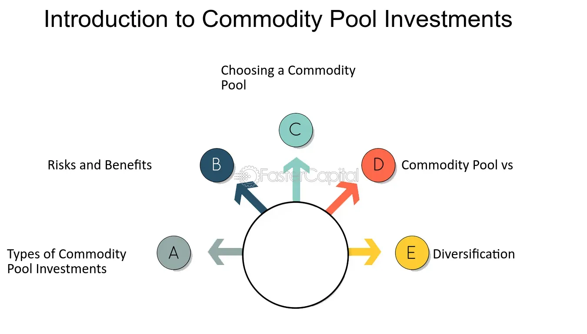

## Table of Contents

## What are commodity funds?

Commodity funds are investment funds that focus on commodities, which are basic goods like oil, gold, and agricultural products. These funds allow investors to gain exposure to the price movements of these commodities without having to buy and store the physical goods themselves. Instead, commodity funds often invest in futures contracts, which are agreements to buy or sell a commodity at a future date, or in stocks of companies involved in the production and sale of commodities.

Investing in commodity funds can be a way to diversify an investment portfolio because commodities often behave differently from stocks and bonds. For example, when the stock market goes down, commodity prices might go up, providing a cushion against losses. However, commodity funds can also be riskier and more volatile than other types of investments. The prices of commodities can be affected by many factors, such as weather, political events, and changes in supply and demand, which can lead to big swings in the value of the fund.

## How do commodity funds differ from other types of investment funds?

Commodity funds are different from other types of investment funds because they focus on commodities like oil, gold, and farm products. Most other funds, like stock funds or bond funds, invest in company shares or loans. Commodity funds usually buy futures contracts, which are deals to buy or sell commodities later, instead of the actual goods. This is different from stock funds that buy company shares or bond funds that buy company or government loans.

Another way commodity funds differ is in how they can help spread out risk in an investment plan. Commodities often move in different ways than stocks and bonds. When the stock market goes down, commodity prices might go up. This can help protect against losses. But, commodity funds can also be riskier. The prices of commodities can change a lot because of things like weather, politics, or changes in how much people want or can get the commodity. This makes commodity funds more unpredictable than other types of funds.

## What types of commodities are typically included in commodity funds?

Commodity funds usually include a mix of different types of commodities. The most common ones are energy products like oil and natural gas, precious metals like gold and silver, and farm products like corn, wheat, and soybeans. These are the big groups that people often think of when they talk about commodities.

Sometimes, commodity funds also include other things like industrial metals, such as copper and aluminum, and even things like livestock, like cattle and hogs. The mix of commodities in a fund can change based on what the people running the fund think will do well in the future. This way, they try to make the most money for the people who invest in the fund.

## What are the benefits of investing in commodity funds?

Investing in commodity funds can help you spread out your money in different ways. Commodities often move differently than stocks and bonds. This means when the stock market goes down, commodity prices might go up. This can help protect your money from big losses. By adding commodity funds to your investment plan, you can make it stronger and less likely to be hurt by bad times in just one part of the market.

Another benefit is that commodity funds let you invest in things like oil, gold, and farm products without having to buy and store them yourself. This makes it easier and cheaper for you to get into the commodity market. Commodity funds usually invest in futures contracts, which are deals to buy or sell commodities later. This way, you can take part in the price changes of these goods without dealing with the hassle of owning them directly.

## What are the risks associated with commodity funds?

Commodity funds can be riskier than other types of investments. The prices of commodities like oil, gold, and farm products can go up and down a lot. This is because many things can affect commodity prices, like the weather, politics, or changes in how much people want or can get the commodity. If the price of a commodity goes down a lot, the value of the commodity fund can drop too. This means you could lose money if you invest in these funds.

Another risk is that commodity funds often use futures contracts. These are deals to buy or sell commodities at a later date. Futures can be tricky because they are bets on what the price will be in the future. If the price goes the wrong way, the fund can lose money. Also, futures contracts need to be rolled over, which means replacing old contracts with new ones. This can cost money and might not always work out well for the fund.

## How can commodity funds be used to diversify an investment portfolio?

Commodity funds can help spread out your investment money by adding something different to your portfolio. Commodities like oil, gold, and farm products often move in different ways than stocks and bonds. When the stock market goes down, commodity prices might go up. This can help protect your money from big losses. By putting some of your money into commodity funds, you can make your overall investment plan stronger and less likely to be hurt by bad times in just one part of the market.

Adding commodity funds to your portfolio is also easy because you don't have to buy and store the actual commodities yourself. Commodity funds usually invest in futures contracts, which are deals to buy or sell commodities later. This way, you can take part in the price changes of these goods without dealing with the hassle of owning them directly. This makes it simpler and cheaper for you to get into the commodity market and diversify your investments.

## What are the different ways to gain exposure to commodities through funds?

There are several ways to gain exposure to commodities through funds. One common way is through commodity index funds. These funds follow the performance of a commodity index, which is a basket of different commodities like oil, gold, and farm products. By investing in these funds, you can get a broad exposure to the commodity market without having to pick individual commodities yourself. Another way is through commodity exchange-traded funds (ETFs). ETFs are like index funds but trade on stock exchanges like individual stocks. This makes it easy to buy and sell them throughout the day.

Another option is commodity mutual funds. These funds are managed by professionals who pick and choose which commodities or commodity-related stocks to invest in. This can be good if you want someone else to make the investment decisions for you. Some commodity funds also focus on specific commodities, like a gold fund or an oil fund. These can be useful if you have a strong belief that a particular commodity will do well in the future. Each of these types of funds offers a different way to get into the commodity market and can fit different investment goals and levels of risk you're willing to take.

## How do commodity funds manage and track their underlying assets?

Commodity funds manage and track their underlying assets mainly through futures contracts. These are deals to buy or sell commodities at a future date. Instead of buying the actual oil, gold, or farm products, the fund buys these contracts. This way, the fund can follow the price changes of the commodities without having to store them. The people who run the fund keep an eye on the futures market and decide when to buy or sell these contracts to try to make money for the investors.

To track the performance of their assets, commodity funds often use a commodity index. This is a list of different commodities that the fund tries to match. For example, if the index goes up by 5%, the fund tries to go up by about the same amount. The fund managers keep adjusting their futures contracts to stay in line with the index. This can be tricky because they have to keep buying new contracts as the old ones get close to their due date. This process is called rolling over the contracts, and it's an important part of how commodity funds work.

## What are the tax implications of investing in commodity funds?

Investing in commodity funds can have different tax rules than other types of funds. When you make money from commodity funds, you might have to pay taxes on it. The tax you pay depends on how the fund makes its money. If the fund makes money from futures contracts, it might be taxed as a 60/40 split. This means 60% of your profits are taxed at the long-term capital gains rate, and 40% are taxed at the short-term capital gains rate, no matter how long you held the investment. This can be different from other investments, where the tax rate depends on how long you owned them.

Also, if the commodity fund you invest in is set up as a partnership, you might get a special tax form called a K-1. This form shows your share of the fund's income, and you have to report it on your tax return. This can make your taxes a bit more complicated because you might need to wait for the K-1 form before you can finish your taxes. It's a good idea to talk to a tax advisor to understand how investing in commodity funds will affect your taxes.

## How do global economic factors influence the performance of commodity funds?

Global economic factors can have a big impact on how well commodity funds do. Things like how strong different countries' economies are, what's happening with interest rates, and how much money is being spent around the world can all change the prices of commodities like oil, gold, and farm products. For example, if the world economy is doing well, people might use more oil and buy more gold, which can make the prices of these commodities go up. On the other hand, if the economy is not doing well, people might use less oil and buy less gold, which can make the prices go down.

Another important [factor](/wiki/factor-investing) is what's happening with the value of different countries' money. If the U.S. dollar gets stronger, it can make commodities that are priced in dollars more expensive for people in other countries. This can make them buy less, which can lower the prices of commodities. Also, things like political problems, wars, or natural disasters in countries that produce a lot of commodities can mess up the supply and make prices go up or down a lot. All these global economic factors can make commodity funds more risky but also give chances to make money if you understand how they work.

## What are some strategies for selecting the right commodity fund?

When [picking](/wiki/asset-class-picking) a commodity fund, it's good to think about what you want to get out of it. Do you want to spread out your investments, or are you betting on certain commodities doing well? Some funds follow a broad index of commodities, which can help you spread out your risk. Others focus on just one commodity, like gold or oil, which can be riskier but might make more money if that commodity does well. Look at the fund's past performance, but remember that past results don't promise future success. Also, check the fees the fund charges because high fees can eat into your profits.

Another thing to consider is how the fund is managed. Some funds are run by people who pick and choose which commodities to invest in, while others just follow an index. If you like the idea of someone else making the investment decisions, a managed fund might be right for you. But if you want to keep costs low and don't mind following the market, an index fund could be better. It's also smart to look at the fund's risk level and see if it fits with how much risk you're willing to take. Talking to a financial advisor can help you figure out which commodity fund is the best fit for your goals and how much risk you can handle.

## How have commodity funds performed historically compared to other asset classes?

Commodity funds have had ups and downs compared to other types of investments like stocks and bonds. Over the long term, they haven't always done as well as stocks. For example, the stock market usually grows over time, but commodity prices can go up and down a lot because of things like the weather, politics, and changes in how much people want or can get certain goods. This means that if you invest in commodity funds, you might not see the same steady growth you'd see with stocks.

However, commodity funds can be really helpful during certain times. When the stock market is doing badly, commodity prices might go up. This can help protect your money from big losses. For example, during times of high inflation, commodities like gold and oil often do better than stocks and bonds. So, while commodity funds might not always beat other investments over the long term, they can be a good way to spread out your risk and protect your money during tough times.

## References & Further Reading

[1]: Fabozzi, F. J., Fuss, R., & Kaiser, D. (2008). ["The Handbook of Commodity Investing."](https://onlinelibrary.wiley.com/doi/book/10.1002/9781118267004) Wiley.

[2]: Geman, H. (2005). ["Commodities and Commodity Derivatives: Modelling and Pricing for Agriculturals, Metals and Energy."](https://download.e-bookshelf.de/download/0000/5675/90/L-G-0000567590-0015270354.pdf) Wiley.

[3]: Aldridge, I. (2013). ["High-Frequency Trading: A Practical Guide to Algorithmic Strategies and Trading Systems."](https://onlinelibrary.wiley.com/doi/pdf/10.1002/9781119203803.fmatter) Wiley.

[4]: Zhang, M. Y., Russell, J. R., & Tsay, R. S. (2008). ["Trading volume in commodity futures markets."](https://www.lib.uchicago.edu/research/help/bibliographies/busfac/russell/) Journal of Econometrics, 147(1), 129-151.

[5]: Chincarini, L. B., & Kim, D. (2006). ["Quantitative Equity Portfolio Management: An Active Approach to Portfolio Construction and Management."](https://archive.org/details/quantitativeequi0000chin_c9d6) McGraw-Hill Education.