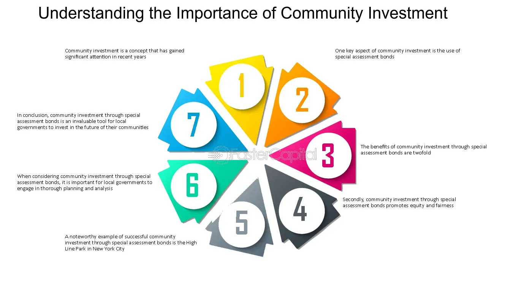

## Table of Contents

## What is community investing?

Community investing is when people put their money into projects or businesses that help their local area. Instead of just saving money or investing in big companies, people choose to support things like local shops, community centers, or housing projects. This type of investing helps make the community stronger and can create jobs and better living conditions for people in the area.

By investing in their community, people can see direct benefits. For example, if someone invests in a new community garden, they might be able to enjoy fresh vegetables and a nice place to relax. Community investing also helps bring people together, as everyone works towards making their neighborhood a better place. It's a way to use money to make a positive difference right where you live.

## Why is community investing important?

Community investing is important because it helps make neighborhoods better places to live. When people put their money into local projects, like a new playground or a small business, it can create jobs and improve the area. This means more people can have work and everyone can enjoy nicer places to spend time. It's like helping your own backyard grow and flourish.

It also brings people together. When everyone in the community works on a project, they get to know each other better and feel more connected. This can make the neighborhood feel friendlier and safer. Plus, when people see their money making a real difference right where they live, they feel good about it. It's a way to use money to help others and make the community stronger.

## How does community investing differ from traditional investing?

Community investing is different from traditional investing because it focuses on helping local areas grow and improve. When people do traditional investing, they usually put their money into big companies or the stock market, hoping to make more money. The goal is often just to increase their own wealth. But with community investing, people choose to support local projects like community centers, small businesses, or affordable housing. The aim is to make the neighborhood better and help the people who live there.

Another difference is that community investing can bring people together and make them feel more connected to their community. Traditional investing is more about numbers and profits, and it might not have a direct impact on the investor's daily life. But when someone invests in a local project, they can see and feel the changes happening around them. It could be a new park where kids can play or a local shop that creates jobs. This makes community investing feel more personal and rewarding because it's about improving the place where you live.

## What are the benefits of community investing for local areas?

Community investing helps local areas in many ways. When people put their money into local projects, it can create jobs. For example, if someone invests in a new local shop, that shop will need workers. This means more people in the community can find work close to home. Also, community investing can make the neighborhood nicer. If money goes into building a new park or fixing up old buildings, everyone gets to enjoy better places to spend time.

Another benefit is that community investing brings people together. When everyone works on a project, like a community garden, they get to know each other better. This can make the neighborhood feel friendlier and safer. People feel more connected to their area when they see their money making a real difference. It's like everyone is working together to make their home a better place to live.

Overall, community investing helps local areas grow and improve. It creates jobs, makes the neighborhood nicer, and brings people together. By choosing to invest in their community, people can see direct benefits and feel good about making a positive change where they live.

## Who can participate in community investing?

Anyone can participate in community investing. You don't need to be rich or have a lot of money. Even small amounts can help. People of all ages, from young adults to seniors, can get involved. You can be a local resident, a business owner, or someone who just wants to help the community grow.

Community investing is open to everyone because it's about making the neighborhood better. You can invest by buying shares in a local business, donating to a community project, or even volunteering your time. It's a way for everyone to have a say in how their area improves and grows. By joining in, you can help create jobs, build new places to enjoy, and make your community stronger.

## What types of projects typically receive community investment?

Community investing often goes into projects that help the neighborhood grow and improve. One common type of project is affordable housing. When people invest in this, it helps build homes that people with lower incomes can afford. This means more families can live in the area and feel safe and comfortable. Another popular project is small businesses. Investing in a local shop or restaurant can create jobs and make the neighborhood more lively. People enjoy having places to shop and eat close to home.

Another type of project that often gets community investment is community centers. These are places where people can come together for activities, classes, or just to hang out. They help bring the community closer and give everyone a place to meet. Parks and playgrounds are also common. When people invest in these, it means kids have safe places to play and families can enjoy time outside. These projects make the neighborhood nicer and more fun for everyone.

Lastly, community investing can support projects like community gardens or local schools. A community garden gives people a place to grow their own food and learn about gardening. It can also bring neighbors together to work on something they all enjoy. Investing in schools can help improve education and give kids better opportunities. All these projects show how community investing can make a big difference in the neighborhood.

## How can someone start investing in their community?

To start investing in your community, first, find out what projects are happening around you. You can do this by talking to neighbors, joining local groups, or checking community websites and social media. Look for projects that you care about, like a new playground, a community garden, or a small business that needs help. Once you find a project you like, see how you can help. Sometimes, you can invest money by buying shares or donating. Other times, you can help by volunteering your time or skills.

After you decide on a project, figure out how much you can invest. It doesn't have to be a lot of money. Even small amounts can make a difference. If you choose to invest money, make sure you understand where it's going and how it will help. If you're volunteering, find out what the project needs and how you can help. By getting involved, you'll see your community grow and improve, and you'll feel good knowing you helped make it happen.

## What are the risks associated with community investing?

Community investing can have some risks. One risk is that the project you invest in might not do well. If a local business you invest in doesn't make enough money, you might lose the money you put in. Another risk is that the project might take longer than expected or cost more money. This can be frustrating and might mean you don't see the benefits as quickly as you hoped.

Another thing to think about is that community investing might not give you as much money back as other types of investing. If you put your money into a big company or the stock market, you might make more money. But with community investing, the goal is often to help the community, not just to make money. So, you need to be okay with the idea that you might not get a big return on your investment.

## How can the impact of community investments be measured?

The impact of community investments can be measured by looking at how the community changes. For example, if people invest in a new park, you can count how many more people are using it and see if the neighborhood feels nicer. You can also ask people if they like the new park and if it makes them happier. Another way to measure impact is to see if more jobs are created. If someone invests in a local shop and it hires new workers, that's a good sign that the investment is helping the community.

Another way to measure the impact is by looking at numbers and data. For example, if the investment is in affordable housing, you can track how many new homes are built and how many families are now living in them. You can also look at things like crime rates or how many people are moving into the area. If these numbers get better after the investment, it shows that the community is improving. By using both people's opinions and hard data, you can get a clear picture of how community investments are making a difference.

## What role do community development financial institutions (CDFIs) play in community investing?

Community Development Financial Institutions (CDFIs) are really important for community investing. They help bring money into local areas by giving loans and investments to projects that might not get help from big banks. CDFIs focus on helping people and businesses that need it most, like small businesses, affordable housing projects, and community centers. They make it easier for people to invest in their neighborhoods because they understand the local needs and can find the best projects to support.

CDFIs also help make sure that the money people invest is used in the right way. They keep track of how the projects are doing and make sure they are helping the community. This means that when you invest through a CDFI, you can feel good knowing your money is making a real difference. CDFIs are like bridges that connect people who want to help their community with the projects that need that help.

## How can technology enhance community investing efforts?

Technology can make community investing easier and more effective. With online platforms and apps, people can find out about local projects that need help. They can see what the projects are about, how much money is needed, and even invest directly from their phones or computers. This makes it simple for anyone to get involved, no matter where they are. Technology also helps spread the word about community investing, so more people can learn about it and join in.

Another way technology helps is by tracking the impact of investments. With special software and data tools, people can see how their money is making a difference in the community. They can get updates on projects, see photos, and read stories about how the neighborhood is improving. This keeps everyone connected and excited about the work they're doing together. By using technology, community investing becomes more open, easier to do, and more rewarding for everyone involved.

## What are some successful case studies of community investing?

In Detroit, Michigan, a group of people started a project called the Detroit Community Loan Fund. They wanted to help fix up old buildings and make the city a nicer place to live. People from the community put money into the fund, and it was used to turn empty buildings into homes, shops, and places for people to meet. This project created jobs and made the neighborhood better. Now, more people are moving back to Detroit, and the city is growing again. It shows how community investing can help a whole city come back to life.

Another example is in Asheville, North Carolina, where a group called Mountain BizWorks helps small businesses get started. People invest in Mountain BizWorks, and it gives loans to local shops and restaurants. This has helped many new businesses open up, which means more jobs for people in the area. The businesses also make the neighborhood more fun and lively. By investing in Mountain BizWorks, the community is helping itself grow and stay strong. It's a great way to see how community investing can make a big difference in a small town.

## References & Further Reading

[1]: "Social Finance and Community Investing: A Guide to Socially Responsible Investments" by Joshua Humphreys et al.

[2]: "Community Development Banking and Finance: Global Perspectives and Practices" edited by Janet Ford and Richard E. Harris

[3]: Lopez de Prado, M. (2018). ["Advances in Financial Machine Learning"](https://www.amazon.com/Advances-Financial-Machine-Learning-Marcos/dp/1119482089)

[4]: Financial Conduct Authority (FCA). ["Algorithmic Trading Compliance in Financial Markets"](https://www.fca.org.uk/publications/multi-firm-reviews/algorithmic-trading-compliance-wholesale-markets)

[5]: Global Sustainable Investment Alliance (GSIA). ["Global Sustainable Investment Review 2020"](http://www.gsi-alliance.org/wp-content/uploads/2021/08/GSIR-20201.pdf)