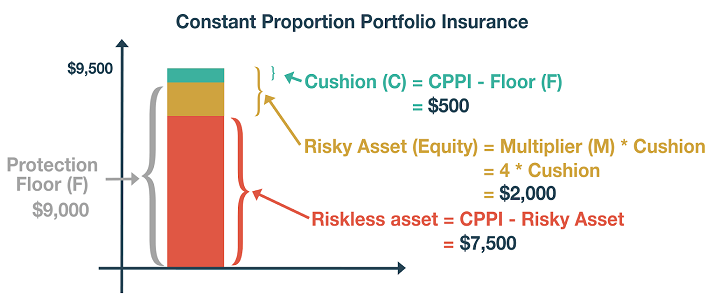

## Table of Contents

## What is CPPI methodology and why is it important?

CPPI, or Constant Proportion Portfolio Insurance, is a strategy used by investors to manage their money in a way that balances growth and safety. It works by setting a floor, which is the minimum amount of money an investor wants to keep safe. The rest of the money is then invested in riskier assets like stocks, hoping to grow the portfolio. The key idea is to adjust the amount invested in these riskier assets based on how the portfolio is doing. If the portfolio grows, more money can be put into stocks, but if it starts to shrink, the strategy pulls back to protect the floor.

This method is important because it helps investors achieve growth while limiting their risk. By having a safety net, or floor, investors feel more secure knowing they won't lose more than they're comfortable with. At the same time, they can still take advantage of the potential higher returns from stocks. This balance is crucial for people who want to grow their money but are worried about big losses. CPPI is especially useful for those who need to protect a certain amount of money, like retirees who rely on their savings.

## How does CPPI differ from other investment strategies?

CPPI is different from other investment strategies because it focuses on protecting a certain amount of money, called the floor, while still trying to grow the portfolio. Many other strategies, like buy-and-hold or dollar-cost averaging, don't have this built-in safety net. With buy-and-hold, you buy investments and keep them for a long time, hoping they go up in value. Dollar-cost averaging involves investing a fixed amount of money at regular intervals, which can help reduce the risk of investing all your money at a bad time. But neither of these strategies automatically adjust to protect a minimum amount of money like CPPI does.

Another key difference is how CPPI adjusts the amount of money in risky assets based on how the portfolio is doing. For example, if the portfolio grows, CPPI will put more money into stocks to try and keep growing. But if the portfolio starts to shrink, CPPI will move money out of stocks and into safer investments to protect the floor. This dynamic adjustment is not common in other strategies. For instance, a strategy like asset allocation might set a fixed mix of stocks and bonds and stick with it, regardless of how the market is doing. CPPI's ability to change its risk exposure makes it unique and helps it balance growth and safety in a way that other strategies don't.

## What are the key components of the CPPI strategy?

The CPPI strategy has three main parts that work together to help manage an investor's money. The first part is the floor, which is the minimum amount of money the investor wants to keep safe. This floor acts like a safety net, making sure the investor doesn't lose more than they're comfortable with. The second part is the cushion, which is the amount of money above the floor that can be used to invest in riskier assets like stocks. The cushion is what the strategy uses to try and grow the portfolio. The third part is the multiplier, which is a number that helps decide how much of the cushion to put into risky assets. A higher multiplier means more money goes into stocks, while a lower one means less risk.

These three parts work together to keep the portfolio balanced between growth and safety. The strategy constantly checks how the portfolio is doing and adjusts the amount of money in stocks based on the cushion and the multiplier. If the portfolio grows, the cushion gets bigger, so more money can be put into stocks. But if the portfolio starts to shrink, the cushion gets smaller, and the strategy pulls money out of stocks to protect the floor. This way, CPPI helps investors feel secure knowing they have a safety net, while still trying to make their money grow.

## Can you explain the concept of the 'cushion' in CPPI?

The cushion in CPPI is the money that's above the floor. Think of the floor as the minimum amount you want to keep safe. The cushion is what's left after you set aside that safe amount. This extra money is what you use to try and grow your portfolio by investing in riskier things like stocks.

The cushion is important because it decides how much risk you can take. If your portfolio grows and the cushion gets bigger, you can put more money into stocks to try and keep growing. But if your portfolio starts to shrink and the cushion gets smaller, you need to pull money out of stocks to protect the floor. So, the cushion helps you balance trying to make more money with keeping your investments safe.

## How is the multiplier calculated in CPPI, and what does it represent?

The multiplier in CPPI is a number that decides how much of the cushion you should put into risky investments like stocks. To calculate it, you start with a number that you feel comfortable with, usually between 0 and 1. For example, if you choose a multiplier of 0.5, it means you'll put half of your cushion into stocks. The idea is that the multiplier helps you decide how much risk to take, based on how much extra money you have above your safe floor.

The multiplier represents your willingness to take risks. A higher multiplier means you're willing to put more of your cushion into stocks, hoping for bigger returns but also taking on more risk. A lower multiplier means you're more cautious and will put less into stocks, keeping more of your money safe. By adjusting the multiplier, you can control how aggressive or conservative your investment strategy is, helping you balance the potential for growth with the need to protect your floor.

## What are the typical asset classes used in the CPPI strategy?

In the CPPI strategy, the main types of investments used are divided into two groups: risky assets and safe assets. The risky assets are usually stocks or stock funds. These are the investments that the strategy uses to try and grow the portfolio. The idea is to put more money into stocks when the cushion is big, hoping to make more money as the stocks go up in value.

On the other hand, the safe assets are things like bonds or cash. These are used to protect the floor, which is the minimum amount of money the investor wants to keep safe. When the portfolio starts to shrink and the cushion gets smaller, the strategy moves money from stocks into these safer investments to make sure the floor stays protected. This way, the CPPI strategy balances trying to grow the portfolio with keeping it safe.

## How does the rebalancing process work in CPPI?

In the CPPI strategy, rebalancing means adjusting how much money is in stocks and how much is in safe investments like bonds or cash. It happens regularly to make sure the portfolio stays in line with the strategy's goals. The key is to check the cushion, which is the money above the floor. If the cushion grows because the stocks did well, more money gets put into stocks to try and keep growing. But if the cushion shrinks because the stocks didn't do well, money gets moved out of stocks and into safer investments to protect the floor.

This rebalancing keeps the balance between trying to grow the portfolio and keeping it safe. The strategy uses a multiplier to decide how much of the cushion should be in stocks. If the multiplier is 0.5, half of the cushion goes into stocks. The rebalancing process makes sure that the amount in stocks stays at this level, no matter how the market is doing. By doing this regularly, the CPPI strategy helps investors feel secure knowing they have a safety net, while still trying to make their money grow.

## What are the potential risks and limitations of using CPPI?

Using CPPI can be risky because it depends a lot on how well the stocks do. If the stocks go down a lot, the cushion can shrink fast, and the strategy might not be able to protect the floor like it's supposed to. This is called a "gap risk," where there's a big drop in the market before the strategy can move money to safer investments. Also, if the market goes down slowly over time, the cushion might not be big enough to keep putting money into stocks, which can make it hard to grow the portfolio.

Another limitation of CPPI is that it needs a lot of checking and adjusting. This can be hard to do right, especially if the market is moving a lot. If the rebalancing isn't done often enough, the strategy might not work as well. Plus, the multiplier that decides how much to put into stocks is a guess, and if it's too high or too low, it can make the strategy less effective. So, while CPPI can help balance growth and safety, it's not perfect and needs careful watching to work well.

## How can CPPI be adapted for different market conditions?

CPPI can be changed to fit different market situations by adjusting the multiplier and how often the portfolio is rebalanced. If the market is doing well and going up, you might want to use a higher multiplier to put more money into stocks and try to grow your portfolio faster. But if the market is shaky or going down, you might want to use a lower multiplier to keep more money safe and protect your floor. Also, in a fast-moving market, you might need to check and adjust your portfolio more often to keep up with the changes.

Another way to adapt CPPI is by changing the types of investments you use. In a strong market, you might choose riskier stocks that could grow a lot. But in a weak market, you might pick safer stocks or even bonds to keep your money more secure. By being flexible with the multiplier, how often you rebalance, and what you invest in, CPPI can work better in different market conditions. This helps you balance trying to make your money grow with keeping it safe, no matter what the market is doing.

## What are some real-world examples of CPPI implementation?

One real-world example of CPPI being used is by big insurance companies. They have to keep a certain amount of money safe to pay out claims, which is like the floor in CPPI. They use CPPI to invest the extra money they have, called the cushion, in stocks to try and make more money. This way, they can grow their funds while making sure they have enough to cover their insurance promises. If the stock market goes up, they put more money into stocks. But if the market goes down, they move money back to safer investments to protect their floor.

Another example is how some retirement funds use CPPI. People saving for retirement want to make sure they have enough money when they stop working, so they set a floor to keep their savings safe. They use CPPI to invest the money above this floor in stocks to try and grow their retirement funds. If the market does well, they can put more into stocks to increase their savings. But if the market drops, they shift money to safer investments like bonds to protect their retirement money. This helps them balance the need for growth with the need for security as they get closer to retiring.

## How does CPPI performance compare to traditional buy-and-hold strategies?

CPPI and buy-and-hold strategies work differently, so their performance can be quite different depending on the market. CPPI tries to protect a certain amount of money, called the floor, while still trying to grow the portfolio. It does this by moving money between stocks and safer investments like bonds, based on how the market is doing. If the market goes up, CPPI puts more money into stocks to try and grow the portfolio. But if the market goes down, it quickly moves money to safer investments to protect the floor. This can be good in a choppy market where there are ups and downs, because CPPI can limit losses while still trying to make gains.

On the other hand, a buy-and-hold strategy means you buy investments and keep them for a long time, no matter what the market does. This can be good when the market is going up steadily, because you get to enjoy all the growth without changing your investments. But if the market goes down, a buy-and-hold strategy can lose a lot of money because it doesn't move money to safer places like CPPI does. So, in a stable, growing market, buy-and-hold might do better than CPPI. But in a volatile market with big swings, CPPI might do better by protecting against big losses while still trying to grow.

## What advanced techniques can be used to optimize CPPI strategies?

To make CPPI work better, you can use something called "dynamic multipliers." This means changing the multiplier, which decides how much of your extra money goes into stocks, based on how the market is doing. If the market is going up fast, you might use a higher multiplier to put more money into stocks and try to grow your portfolio more. But if the market is shaky or going down, you can use a lower multiplier to keep your money safer. This way, you can adjust to the market and try to get the best results.

Another way to improve CPPI is by using different kinds of investments, not just stocks and bonds. You can use things like real estate, commodities, or even different types of stocks, like tech or healthcare stocks. By spreading your money across different types of investments, you can lower your risk and maybe even make more money. Also, you can use fancy math to figure out the best times to move money around. This can help you make better choices about when to put more money into stocks or when to move it to safer places, making your CPPI strategy work better overall.

## What are the Mechanics of CPPI?

Constant Proportion Portfolio Insurance (CPPI) is a systematic investment strategy designed to balance risk and safety by dynamically adjusting asset allocation between two types of assets: safe and risky. Safe assets, often bonds or cash equivalents, are characterized by their predictable and steady returns, whereas risky assets, like equities or derivatives, promise higher return potential albeit with greater [volatility](/wiki/volatility-trading-strategies). 

A central concept in CPPI is the 'cushion,' which is calculated as the difference between the current portfolio value and a predefined minimum value or 'floor.' The formula for the cushion is:

$$
\text{Cushion} = \text{Portfolio Value} - \text{Floor}
$$

The proportion of the portfolio invested in risky assets is determined by scaling the cushion using a multiplier, commonly denoted as $m$. The investment in risky assets can therefore be formulated as:

$$
\text{Investment in Risky Assets} = m \times \text{Cushion}
$$

As market conditions change, this exposure to risky assets is adjusted. For instance, if market values decline, reducing the cushion, the allocation to risky assets decreases automatically, thus safeguarding the portfolio against further losses. Conversely, when market conditions are favorable and the cushion increases, the allocation to risky assets expands, allowing for potential gains.

This approach is designed to ensure that the portfolio value does not fall below the specified floor. When the cushion becomes zero or negative, indicating that the portfolio value has reached or is nearing the floor, CPPI shifts the entire allocation to safe assets, thereby securing the minimum value specified by the investor.

Despite its intuitive nature, the efficacy of CPMM is contingent upon adequately setting the multiplier $m$. An overly aggressive multiplier amplifies risk exposure, potentially leading to significant drawdowns during adverse market conditions. Conversely, a conservative multiplier may limit exposure to upside potential, potentially sacrificing returns.

Moreover, the CPPI strategy is not without its challenges. Transaction costs can erode gains, particularly in volatile markets where frequent rebalancing is necessary. Additionally, there is a risk of market gaps—sudden and drastic market movements that may occur before repositioning can take place—that can undermine the protective mechanism of CPPI. Careful calibration of the multiplier and consideration of these risks are crucial in applying CPPI effectively.

## What are the extensions and variations?

CPPI strategies can be enhanced by incorporating extensions like Maximum Drawdown and Cap Extensions, providing more flexibility in risk management. The Maximum Drawdown extension aims to dynamically adjust the protection level by modifying the floor based on a percentage loss from the portfolio's highest historical value. This approach helps mitigate substantial losses by ensuring the floor adapts to rising markets, thereby preserving gains. The formula for adjusting the floor with Maximum Drawdown can be expressed as:

$$
\text{New Floor} = \max(\text{Current Floor}, (1 - \text{Drawdown\%}) \times \text{Max Portfolio Value})
$$

This ensures that the floor not only protects against significant declines but also locks in gains as the portfolio value increases.

Cap Extension introduces an upper boundary to the strategy, effectively placing both minimum and maximum constraints on the portfolio's value. By setting a cap, investors can restrict the potential upside, which can help manage overly optimistic expectations and restrict excessive risk-taking. This mechanism allows portfolio managers to maintain a target range for the assets, keeping the risk exposure well within pre-defined boundaries.

Together, Maximum Drawdown and Cap Extensions optimize the risk-return profile by dynamically managing both floors and ceilings. These modifications offer investors better control over their portfolios by providing systematic and automatic adjustments based on market performance, allowing for customized protection levels and potential ceiling constraints. The ability to fine-tune the balance between risk and potential returns enhances the strategic robustness of CPPI, aligning with various investor goals and market conditions.

## References & Further Reading

[1]: Black, F., & Perold, A. F. (1992). ["Theory of Constant Proportion Portfolio Insurance."](https://www.sciencedirect.com/science/article/pii/016518899290043E) Journal of Economic Dynamics and Control, 16(3-4), 403-426.

[2]: Grossman, S. J., & Zhou, Z. (1993). ["Optimal Investment Strategies for Controlling Drawdowns."](https://onlinelibrary.wiley.com/doi/abs/10.1111/j.1467-9965.1993.tb00044.x) Management Science, 39(8), 990-1305.

[3]: [CPPI Performance in Different Market Conditions](https://www.quantifiedstrategies.com/constant-proportion-portfolio-insurance-cppi-position-sizing/) - CFA Institute Publications

[4]: Bertrand, P., & Prigent, J. L. (2005). ["Portfolio Insurance: The Extreme Value Approach to the Dynamic CPPI."](https://www.researchgate.net/profile/Jean-Luc-Prigent/publication/228226446_Portfolio_Insurance_The_Extreme_Value_Theory_of_the_Cppi_Method/links/00b49516c60f0a0fcf000000/Portfolio-Insurance-The-Extreme-Value-Theory-of-the-Cppi-Method.pdf) The Journal of Asset Management, 6(1), 42-40.

[5]: Balder, S., Brandl, M., & Mahayni, A. (2009). ["Dynamic Strategies for Portfolio Insurance: the Case of CPPI](https://www.fbv.kit.edu/symposium/10th/papers/Balder_Brandl_Mahayni%20-%20Effectiveness%20of%20CPPI%20Strategies%20under%20Discrete-Time%20Trading.pdf) Annals of Operations Research, 165, 1-21.

[6]: Estep, Tony, & Kritzman, Mark. (1988). ["CPPI: The Strategy, the Model, the Evidence."](https://www.semanticscholar.org/paper/TIPP%3A-Insurance-without-complexity-Estep-Kritzman/e853b7082a5288709bc01a9a312b2d7f487ab771) Review of Financial Economics, 15(1), 31-82.

[7]: Hamidi, B. A., Maillet, B., & Tokpavi, S. (2009). ["A True or False Floor as a Conditional Value at Risk: Application to Portfolio Insurance."](https://papers.ssrn.com/sol3/papers.cfm?abstract_id=1289265) Journal of Banking & Finance, 33(8), 1517-1528.