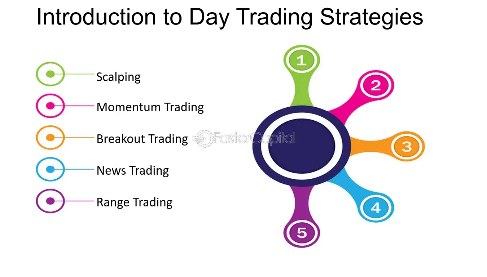

## Table of Contents

## What is day trading and how does it differ from other types of trading?

Day trading is when people buy and sell stocks or other financial things within the same day. They try to make money from small changes in the prices. Day traders usually do not keep their investments overnight. They watch the market closely all day and make quick decisions.

Day trading is different from other types of trading because it focuses on short-term gains. In contrast, other types of trading, like swing trading or long-term investing, involve holding onto investments for longer periods, like days, weeks, or even years. These other methods aim to benefit from bigger price changes over time, rather than the small, quick changes that day traders look for.

## What are the basic requirements to start day trading?

To start day trading, you need a few basic things. First, you need a computer or a smartphone with a good internet connection. This is important because you need to watch the market closely and make quick decisions. You also need to open a brokerage account. A brokerage account is like a special bank account where you can buy and sell stocks. Some brokerages are better for day trading because they have lower fees and faster trading tools.

Next, you need to have some money to trade with. Many brokerages have a minimum amount of money you need to start trading, often called the "minimum account balance." It's also a good idea to learn about the stock market and how trading works. There are many free resources online, like videos and articles, that can help you understand the basics. Finally, it's important to have a plan. Decide what stocks you want to trade, how much money you are willing to risk, and when you will buy and sell. A good plan can help you make better trading decisions.

## What are the key strategies beginners should know for day trading?

For beginners, one key strategy is to use the "[momentum](/wiki/momentum) trading" approach. This means watching for stocks that are moving a lot in price and trying to trade in the same direction as the price movement. If a stock's price is going up quickly, a momentum trader would buy it, hoping to sell it at a higher price later in the day. If the price is going down fast, they might sell it short, which means they borrow the stock to sell it and then buy it back at a lower price to return it. This strategy works well when the market is moving a lot, but it can be risky because the price can change direction suddenly.

Another important strategy is "[scalping](/wiki/gamma-scalping)." Scalping is about making lots of small trades to earn a little bit of money from each one. Scalpers look for small price changes and try to buy and sell quickly to take advantage of them. For example, if a stock's price goes up by a few cents, a scalper might buy it and then sell it right away to make a small profit. This strategy requires a lot of focus and quick decision-making because you need to watch the market closely all day. It can be less risky than momentum trading because you're aiming for smaller gains, but it still needs careful planning and discipline.

## How can one identify the best times of day to trade?

The best times to trade during the day are usually when the market is most active. In the United States, this often happens right after the market opens at 9:30 AM Eastern Time and just before it closes at 4:00 PM Eastern Time. During these times, more people are buying and selling, which can lead to bigger price changes. This is good for day traders because they can make more money from these changes. Also, the first hour of trading, called the "opening hour," is often very busy because new information and news from overnight can affect stock prices.

Another good time to trade is during the lunch hour, from around 12:00 PM to 2:00 PM Eastern Time. Some traders take a break during this time, but others see it as a chance to trade because there can still be a lot of activity. It's also important to watch for times when big economic reports or news come out. These can happen at any time during the trading day and can cause big price swings. By paying attention to when the market is most active and when important news is released, you can find the best times to trade and increase your chances of making money.

## What are the most common mistakes beginners make in day trading?

One common mistake beginners make in [day trading](/wiki/day-trading-spy) is not having a clear plan. They might jump into trades without knowing when to buy or sell, which can lead to big losses. A good plan helps you decide what to do before you start trading. It tells you which stocks to watch, how much money you can risk, and when to get out of a trade. Without a plan, it's easy to make emotional decisions, like holding onto a losing trade hoping it will come back, which usually makes things worse.

Another mistake is not managing risk well. Beginners often put too much money into one trade, thinking they will make a big profit. But if the trade goes the wrong way, they can lose a lot. It's important to use stop-loss orders, which automatically sell a stock if it drops to a certain price. This can help limit how much money you lose on a bad trade. Also, beginners might not use enough money to start trading. Some brokerages have rules about how much money you need to day trade, and if you don't have enough, you might not be able to trade as much as you want.

Lastly, beginners often don't do enough research. They might trade based on tips from friends or what they see on social media, without checking if the information is true. It's important to learn about the companies you're trading and understand why their stock prices are moving. This can help you make better decisions and avoid getting caught in bad trades.

## How important is a trading plan and what should it include?

A trading plan is very important for day trading. It is like a roadmap that helps you know what to do before you start trading. Without a plan, you might make decisions based on feelings instead of facts, which can lead to big losses. A good plan keeps you disciplined and helps you stay focused on your goals. It makes sure you know why you are trading, how much money you can risk, and what you will do if things don't go as planned.

A trading plan should include a few key things. First, it should have clear goals, like how much money you want to make and how long it will take. Second, it should list the stocks or other things you want to trade and why you chose them. Third, it should explain how you will manage risk, like using stop-loss orders to limit losses. Fourth, it should tell you when to buy and sell, based on certain rules or signs in the market. Finally, it should have a way to keep track of your trades and learn from them, so you can get better over time.

## What role do technical analysis and chart patterns play in day trading?

Technical analysis and chart patterns are very important tools for day traders. They help traders understand how stock prices are moving and make better decisions about when to buy and sell. Technical analysis looks at past price data and trading volumes to find patterns that might predict future price movements. By studying these patterns, day traders can spot good times to enter or [exit](/wiki/exit-strategy) trades. For example, if a stock price breaks out of a certain range, it might be a sign that the price will keep going up, and a trader might decide to buy.

Chart patterns are specific shapes or formations on a stock's price chart that traders use to predict future price movements. Some common chart patterns include head and shoulders, triangles, and flags. These patterns can show if a stock is likely to go up or down. For instance, a "head and shoulders" pattern might mean that a stock's price is about to fall, so a trader might decide to sell before the price drops. By understanding these patterns, day traders can make more informed decisions and increase their chances of making money.

## How can one manage risk effectively while day trading?

Managing risk is very important when you are day trading. One way to do this is by using stop-loss orders. A stop-loss order is like a safety net that automatically sells a stock if its price drops to a certain level. This helps you limit how much money you can lose on a trade. Another way to manage risk is by not putting all your money into one trade. Instead, spread your money across different trades. This way, if one trade goes bad, you won't lose everything.

It's also important to only risk money you can afford to lose. Day trading can be risky, and you might lose money, so make sure you're not using money you need for other things. Another good idea is to set a daily loss limit. This means deciding ahead of time how much money you're willing to lose in a day, and if you hit that limit, you stop trading. This helps you avoid making big losses in one day. By using these strategies, you can manage risk better and protect your money while day trading.

## What are advanced trading techniques that experienced traders use?

Experienced traders often use a technique called "scalping" to make many small trades throughout the day. They aim to make tiny profits from each trade, which can add up over time. Scalpers need to be very focused and quick because they are looking for small price changes. They might use special tools and charts to help them spot these small movements. This method can be less risky than trying to make big gains from one trade, but it requires a lot of practice and attention.

Another advanced technique is "[algorithmic trading](/wiki/algorithmic-trading)," where traders use computer programs to buy and sell stocks automatically. These programs follow a set of rules that the trader has programmed in. For example, the program might buy a stock when its price reaches a certain level and sell it when it goes up by a small amount. This can help traders make decisions faster and without letting emotions get in the way. Algorithmic trading can be very powerful, but it also needs a lot of technical knowledge to set up and manage the programs correctly.

## How does one use leverage in day trading and what are the risks involved?

Leverage in day trading means borrowing money from your broker to buy more stocks than you could with just your own money. It's like using a credit card to buy something you can't afford right now. For example, if you have $1,000 and use 2:1 leverage, you can trade with $2,000. This can help you make more money if the stock price goes up because you can buy more shares. But it's a double-edged sword because if the stock price goes down, you can lose more money than you started with.

The risks of using leverage are big. If the stock price moves against you, you could lose more than your initial investment. This is because you have to pay back the money you borrowed, plus any interest. If your losses are too big, you might get a "margin call," where your broker asks you to add more money to your account or sell some of your stocks to cover the losses. If you can't do this, the broker might sell your stocks at a bad time, making your losses even worse. So, while leverage can help you make more money, it can also lead to bigger losses if you're not careful.

## What psychological factors affect day traders and how can they be managed?

Day trading can be really hard on your mind. One big problem is feeling too excited or too scared. When you see a stock price going up fast, you might feel excited and want to buy more, even if it's not a good idea. On the other hand, if the price starts to drop, you might get scared and sell too soon, missing out on a chance to make money. Another problem is called "revenge trading." This happens when you lose money on a trade and then try to make it back quickly by making more trades, which can lead to even bigger losses. It's important to stay calm and stick to your trading plan, no matter what the market is doing.

To manage these feelings, you can try a few things. First, take breaks during the day to clear your mind. It's easy to get tired and make bad decisions if you're trading all day without a break. Second, set clear rules for yourself and follow them. Decide ahead of time when you will buy and sell, and stick to those rules even if you feel excited or scared. Finally, it can help to talk to other traders or a mentor. They can give you advice and help you stay on track. By managing your feelings, you can make better trading decisions and avoid big losses.

## How can one evaluate their day trading performance and continuously improve?

To evaluate your day trading performance, you need to keep track of your trades. Write down when you buy and sell, how much money you make or lose, and why you made those decisions. This helps you see what's working and what's not. Look at things like how often you win, how much money you make on average when you win, and how much you lose when you don't win. This can show you if you're making good choices or if you need to change your plan. It's also important to compare your performance over time to see if you're getting better.

To keep improving, you should learn from your mistakes. If you see that you're losing money on certain types of trades, try to figure out why and change your approach. It can also help to read [books](/wiki/algo-trading-books), watch videos, or talk to other traders to learn new strategies. Don't be afraid to try new things, but always test them first with small amounts of money to see if they work for you. Remember, day trading is a skill that takes time to get good at, so be patient and keep learning.

## References & Further Reading

[1]: Bergstra, J., Bardenet, R., Bengio, Y., & Kégl, B. (2011). ["Algorithms for Hyper-Parameter Optimization."](https://papers.nips.cc/paper/4443-algorithms-for-hyper-parameter-optimization) Advances in Neural Information Processing Systems 24.

[2]: ["Advances in Financial Machine Learning"](https://www.amazon.com/Advances-Financial-Machine-Learning-Marcos/dp/1119482089) by Marcos Lopez de Prado

[3]: ["Evidence-Based Technical Analysis: Applying the Scientific Method and Statistical Inference to Trading Signals"](https://www.amazon.com/Evidence-Based-Technical-Analysis-Scientific-Statistical/dp/0470008741) by David Aronson

[4]: ["Machine Learning for Algorithmic Trading"](https://github.com/PacktPublishing/Machine-Learning-for-Algorithmic-Trading-Second-Edition) by Stefan Jansen

[5]: ["Quantitative Trading: How to Build Your Own Algorithmic Trading Business"](https://books.google.com/books/about/Quantitative_Trading.html?id=j70yEAAAQBAJ) by Ernest P. Chan