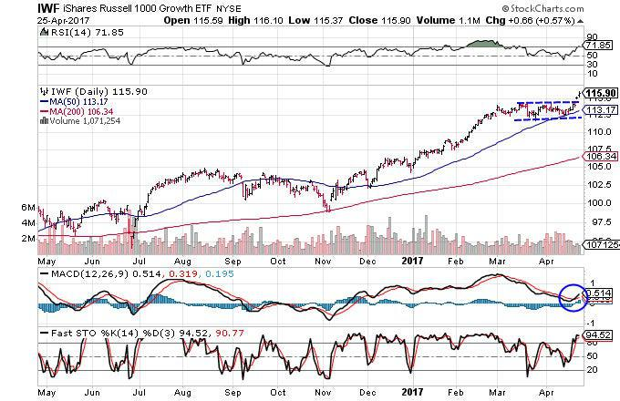

Trading represents a dynamic and intricate financial activity where individuals or institutions buy and sell various financial instruments—such as stocks, bonds, commodities, or currencies. The primary objective is to profit from the fluctuations in their prices. These transactions occur across diverse markets and settings, driven by factors ranging from economic indicators to geopolitical events and investor sentiment.

This article is designed to guide you through the fundamental concepts of trading, with a focus on day trading and algorithmic trading, often referred to as algo trading. Each of these trading types has distinguishing features, strategies, risks, and opportunities that are vital for any aspiring trader to understand. 

Day trading consists of executing multiple trades within a single trading day. This methodology seeks to capitalize on short-term market volatility and price movements, requiring traders to possess acute decision-making skills and a profound understanding of market operations. In contrast, algorithmic trading leverages algorithms—predefined sets of rules and instructions—to automate trading strategies. This approach enables the execution of trades at speeds and frequencies beyond human capability, often exploiting small price discrepancies that might otherwise go unnoticed.

Our goal is to equip you with foundational knowledge that may prove instrumental on your journey to becoming a successful trader. This encompasses understanding how trades are executed, the various strategies employed, and the inherent risks involved. By building a robust knowledge base, you can set realistic expectations and develop a well-informed approach toward trading.

Whether you are at the beginning stages of your trading journey or seeking to refine your current methods, a deep understanding of these essential aspects is crucial. The knowledge you will gain serves not only as a stepping stone towards more advanced trading concepts but also as a means of personal empowerment, allowing you to make informed decisions in an unpredictable market landscape. By mastering these basics, you stand better equipped to achieve success in the competitive and ever-evolving world of trading.

## Table of Contents

## Trading Basics

Trading involves the buying and selling of financial assets across various markets with the goal of profiting from changes in asset prices. Key elements of trading include entry strategies, risk management, and market analysis, which can be either technical or fundamental. 

Entry strategies are crucial for timing trades and positioning oneself in the market. They are often based on analysis methods that help predict future price movements. An effective entry strategy not only relies on entry signals but also on identifying [exit](/wiki/exit-strategy) points to maximize gains and minimize losses.

Market analysis is typically categorized into technical and [fundamental analysis](/wiki/fundamental-analysis). Technical analysis focuses on historical price patterns, charts, and technical indicators to predict future market movements. Indicators such as moving averages, relative strength index (RSI), or Bollinger Bands are commonly used tools for technical analysis. This form of analysis rests on the belief that historical price trends often repeat themselves, allowing traders to forecast future price action.

Fundamental analysis, on the other hand, examines economic and financial factors that influence the price of an asset. It involves evaluating a company’s financial statements, industry position, economic conditions, and analyzing related news events. For instance, evaluating the earnings reports of a company or changes in political environments are elements considered in fundamental analysis.

Before engaging in trading, it is imperative for traders to become well-versed in trading terminology. Key terms include:

- **Bid and Ask**: The bid price represents the maximum price a buyer is willing to pay for a security, while the ask price is the minimum price a seller is willing to accept.
- **Spread**: This refers to the difference between the bid and ask prices. A narrower spread usually indicates a more liquid market.
- **Leverage**: It is the use of borrowed funds to increase potential return on investment. While leverage can amplify gains, it also increases the risk of substantial losses.
- **Stop-loss orders**: A stop-loss order specifies a price at which a trade is automatically closed to prevent further losses.

Formulating a robust trading plan and a comprehensive risk assessment strategy are essential for managing potential losses effectively. A trading plan outlines an individual’s trading approach, including the markets to be traded, the capital allocation per trade, and the criteria for exiting a trade. 

Risk management involves setting parameters such as position sizing, risk/reward ratios, and utilizing stop-loss orders. By clearly defining these elements, traders can better control their exposure to market [volatility](/wiki/volatility-trading-strategies) and reduce the likelihood of significant financial setbacks.

By understanding these basic components and methodologies, traders can create a structured approach that increases their chances of success in the competitive landscape of financial markets.

## Getting Started with Day Trading

Day trading entails executing trades within a single trading day to capitalize on short-term fluctuations in asset prices. This strategy requires individuals to harness both technical analysis and efficient decision-making skills to navigate the fast-paced environment effectively. A profound comprehension of market operations and the ability to interpret market data in real time is essential for success.

To embark on [day trading](/wiki/day-trading-spy), the first step involves selecting a user-friendly and reliable trading platform. Platforms such as E*TRADE, TD Ameritrade, or [Interactive Brokers](/wiki/interactive-brokers-api) are popular among traders due to their robust features and comprehensive market access. A critical recommendation for beginners is to start with a demo account. This feature allows prospective traders to engage with the market using virtual funds, minimizing financial risk while gaining practical experience.

Tracking performance is a fundamental practice for anyone wishing to improve as a day trader. Maintaining a detailed trading journal aids in this pursuit by recording each trade's specifics, such as entry and exit points, used strategies, and the outcome. Over time, this journal serves as a valuable resource for identifying strengths and weaknesses, prompting strategy refinement and decision-making improvement.

Understanding trading regulations is just as important as technical preparation. In the United States, such regulations include the Pattern Day Trader (PDT) rule. Enforced by the Financial Industry Regulatory Authority (FINRA), this rule necessitates maintaining a minimum account balance of $25,000 for individuals making frequent day trades. This regulation aims to ensure traders have sufficient capital to absorb the risks associated with frequent trading activities.

Overall, mastering day trading demands meticulous planning, continuous practice, and adherence to regulatory requirements. As with any trading strategy, the ability to analyze and respond to market movements promptly can significantly influence profitability.

## Algorithmic Trading

Algorithmic trading (algo trading) refers to the use of pre-programmed instructions to automatically execute trades in financial markets. These algorithms are designed to make decisions based on a variety of parameters such as timing, price, or [volume](/wiki/volume-trading-strategy), enabling them to execute trades rapidly, more efficiently, and often at a lower cost than manual trading.

One of the key advantages of [algorithmic trading](/wiki/algorithmic-trading) is its ability to analyze massive datasets and execute trades faster than human traders. This speed allows algorithms to exploit even the smallest price movements, which can result in substantial profits over time. The efficiency and speed of algorithms make them particularly suitable for high-frequency trading, where trades are executed in milliseconds or even microseconds.

Traders looking to engage in algorithmic trading should have proficiency in programming languages, such as Python, C++, or Java. A solid understanding of algorithmic structures and database management is also essential for developing and optimizing trading strategies. Using libraries like NumPy or Pandas in Python, traders can manage financial data and perform complex calculations to support their trading strategies.

Common strategies in algorithmic trading include:

- **Arbitrage**: Exploiting price differences of the same asset in different markets or forms.

- **Market Making**: Providing liquidity to markets by simultaneously offering buy and sell quotes, profiting from the spread between the buy and sell prices.

- **Trend Following**: Leveraging statistical data to identify and capitalize on emerging trends in market prices over particular durations.

- **Statistical Arbitrage**: Utilizing statistical models to identify trading opportunities based on historical data and market inefficiencies.

Despite its benefits, algorithmic trading is not without risks. Technical failures, such as software bugs or network issues, can lead to significant losses. Algorithmic errors, such as executing trades at the wrong price or time due to incorrect coding, also pose a threat. Thus, robust testing and risk management protocols are imperative. Rigorous [backtesting](/wiki/backtesting) allows traders to evaluate the perfomance of their algorithms using historical data, reducing the potential for errors when deployed in live markets.

Managing these risks requires implementing strategies such as fail-safes, regular audits, and employing strategies for disaster recovery and cybersecurity. For example, codes can be structured to have conditional checks that halt trading operations if unexpected anomalies are detected.

In conclusion, algorithmic trading provides unparalleled speed and efficiency in the trading landscape, with various strategies available to suit different market conditions. Mastery of programming and a strong grasp of market dynamics are essential for deploying successful algorithmic trading strategies, ensuring traders can navigate technical challenges while optimizing for profitability.

## Risks and Rewards

Both day trading and algorithmic trading hold the promise of high rewards, yet they are accompanied by notable risks. For individuals engaging in these trading practices, a disciplined approach is fundamental to mitigating potential downsides. This involves continuous learning, rigorous practicing, and the refinement of trading strategies. 

A key element in managing trading risk is the recognition and control of psychological factors. Traders must be adept at handling stress and maintaining an objective perspective even during volatile market conditions. Emotional responses, such as fear and greed, can lead to impulsive decisions that often result in financial losses. Practicing mindfulness and setting clear, unemotional trading rules can help alleviate such pressures.

Diversification is another essential strategy highlighted by successful traders. By spreading investments across various financial instruments or market sectors, traders reduce the risk of significant loss attributed to the poor performance of a single asset. Diversification acts as a buffer, cushioning the trader against unpredictable market volatility.

Understanding market psychology is also critical. Various economic indicators—such as interest rates, inflation rates, and employment data—can significantly influence market movements. A trader who maintains a keen awareness of these indicators and their potential impact on markets can anticipate market trends more accurately. Analyzing these indicators involves studying reports and market data to predict potential shifts in market direction.

Incorporating these practices requires a dedicated and systematic approach. When structured appropriately, both day trading and algorithmic trading can become avenues not only for potential financial growth but also for a deeper engagement with financial markets. While trading is fraught with challenges, careful strategy, preparation, and emotional resilience can help traders navigate these effectively.

## Conclusion

Embarking on a trading career requires a solid educational foundation and a commitment to patience and adaptability. Successful trading is not solely about making profits; it involves understanding market dynamics, risk management, and continuous learning. Whether you choose to focus on day trading or algorithmic trading, building a robust understanding of trading principles is crucial for long-term success. 

Leveraging modern resources can significantly enhance your trading skills and knowledge. Tools like trading simulators allow you to practice strategies in a risk-free environment, while webinars and online courses offer insights from experienced traders and industry experts. These resources are invaluable for honing your techniques and staying updated with market trends and technologies.

Approach each trade with thorough research and analysis. This disciplined approach ensures that decision-making is grounded in data and market understanding, reducing the influence of emotional biases. Every trading experience—profitable or not—serves as an educational opportunity to refine strategies and improve future performance.

Trading does [carry](/wiki/carry-trading) inherent risks, but with diligent preparation and careful strategy execution, it can be a rewarding endeavor. By embracing a mindset of continuous learning and adjustment, traders can navigate the complexities of financial markets and achieve sustainable success.

## References & Further Reading

[1]: Bergstra, J., Bardenet, R., Bengio, Y., & Kégl, B. (2011). ["Algorithms for Hyper-Parameter Optimization."](https://papers.nips.cc/paper/4443-algorithms-for-hyper-parameter-optimization) Advances in Neural Information Processing Systems 24.

[2]: ["Advances in Financial Machine Learning"](https://www.amazon.com/Advances-Financial-Machine-Learning-Marcos/dp/1119482089) by Marcos Lopez de Prado

[3]: ["Evidence-Based Technical Analysis: Applying the Scientific Method and Statistical Inference to Trading Signals"](https://www.amazon.com/Evidence-Based-Technical-Analysis-Scientific-Statistical/dp/0470008741) by David Aronson

[4]: ["Machine Learning for Algorithmic Trading"](https://github.com/PacktPublishing/Machine-Learning-for-Algorithmic-Trading-Second-Edition) by Stefan Jansen

[5]: ["Quantitative Trading: How to Build Your Own Algorithmic Trading Business"](https://books.google.com/books/about/Quantitative_Trading.html?id=j70yEAAAQBAJ) by Ernest P. Chan