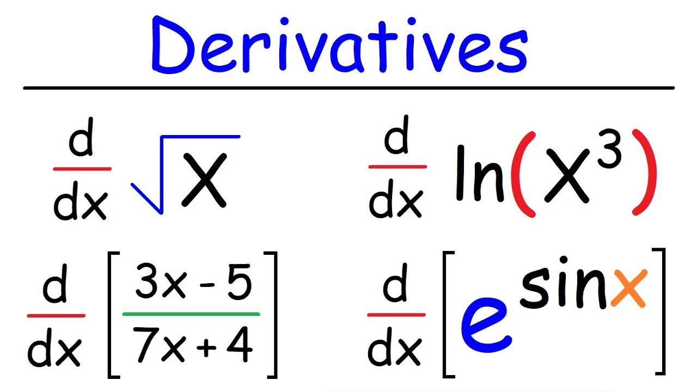

## Table of Contents

## What is a derivative in finance?

A derivative in finance is a contract between two or more parties that gets its value from something else, like stocks, bonds, commodities, or even interest rates. This "something else" is called the underlying asset. Derivatives are used for many reasons, like managing risk, speculating on price movements, or getting access to assets or markets that might be hard to reach otherwise.

One common type of derivative is a futures contract, where people agree to buy or sell an asset at a set price on a future date. Another type is an option, which gives the buyer the right, but not the obligation, to buy or sell an asset at a set price before a certain date. These financial tools can be very helpful, but they can also be risky if not used carefully, because their value can change a lot based on the movements of the underlying asset.

## How do derivatives work?

Derivatives are like bets on what will happen to the price of something else, called the underlying asset. This could be anything from a stock or a barrel of oil to an interest rate. When you buy a derivative, you're not buying the actual thing, but you're making a deal that depends on how the price of that thing changes. For example, if you think the price of gold will go up, you might buy a derivative that will pay you more if the price of gold does indeed rise.

There are different kinds of derivatives, but they all work on this basic idea. One popular type is a futures contract, where you agree to buy or sell the underlying asset at a set price on a future date. If the price goes up and you agreed to buy at a lower price, you make money. Another type is an option, which gives you the right, but not the obligation, to buy or sell the asset at a set price before a certain date. If the price moves in your favor, you can use the option to make a profit, but if it doesn't, you can just walk away without losing more than what you paid for the option.

Derivatives can be useful for managing risk or making money from price changes without actually owning the asset. But they can also be risky because their value can swing wildly based on what happens to the underlying asset. It's important to understand these risks and use derivatives carefully.

## What are the main types of derivatives?

The main types of derivatives are futures, options, swaps, and forwards. Futures are contracts where you agree to buy or sell something at a set price on a future date. They're often used by farmers to lock in prices for their crops or by investors who want to bet on the future price of commodities like oil or gold. Options give you the right, but not the obligation, to buy or sell something at a set price before a certain date. They're popular for investors who want to make money from price changes without having to actually own the asset.

Swaps are agreements to exchange cash flows or other financial instruments. The most common type is an [interest rate](/wiki/interest-rate-trading-strategies) swap, where two parties agree to exchange interest payments, one based on a fixed rate and the other on a variable rate. This can help businesses manage their debt costs. Forwards are similar to futures, but they are private agreements between two parties and are not traded on an exchange. They're often used by companies to manage currency risk when doing business in different countries.

These derivatives can be useful for managing risk or making money from price changes, but they can also be risky because their value can change a lot based on what happens to the underlying asset. It's important to understand these risks and use derivatives carefully.

## What is the purpose of using derivatives?

People use derivatives for a few main reasons. One big reason is to manage risk. For example, a farmer might use a futures contract to lock in a price for their crops before they're even harvested. This way, they know how much money they'll get, even if the price of crops goes down later. Companies also use derivatives to protect themselves from changes in interest rates or currency values. By using derivatives, they can make sure their costs stay more predictable.

Another reason people use derivatives is to make money from price changes without actually owning the asset. For example, if you think the price of gold will go up, you can buy a derivative that will pay you more if the price of gold does indeed rise. This way, you can make money from the price change without having to buy and store gold yourself. But using derivatives to make money can be risky, because if the price moves the wrong way, you could lose money.

Overall, derivatives are powerful tools that can help manage risk and make money, but they need to be used carefully. Their value can change a lot based on what happens to the underlying asset, so it's important to understand these risks before using them.

## How can derivatives be used for hedging?

Derivatives can be used for hedging to protect against price changes. Imagine you're a farmer who grows wheat. You want to make sure you get a good price for your wheat, even if the market price drops before you sell it. You can use a futures contract to lock in a price today for your wheat that you'll sell in the future. This way, no matter what happens to the wheat price, you know exactly how much money you'll get. It's like an insurance policy for your income.

Companies also use derivatives to hedge against other kinds of risks, like changes in interest rates or currency values. For example, if a company has a loan with a variable interest rate, they might use an interest rate swap to exchange their variable rate payments for fixed rate payments. This helps them keep their costs predictable, even if interest rates go up. Similarly, a company that does business in different countries might use currency forwards to lock in exchange rates, so they know how much their foreign earnings will be worth in their home currency. By using derivatives to hedge, businesses can focus on their main activities without worrying as much about financial ups and downs.

## What are the risks associated with derivatives?

Derivatives can be risky because their value depends a lot on what happens to the price of the thing they're based on, called the underlying asset. If the price of the underlying asset moves in a way you didn't expect, you could lose money. For example, if you buy a futures contract expecting the price of oil to go up, but it goes down instead, you'll lose money on the contract. This kind of risk is called market risk, and it's a big reason why people need to be careful when using derivatives.

Another risk is called counterparty risk. This happens when the other person in the derivative deal can't or won't keep their end of the bargain. If you have a contract with someone and they go bankrupt, you might not get the money you were expecting. This can be a big problem, especially with over-the-counter derivatives, which are private deals not traded on an exchange. Also, derivatives can be complicated, and if you don't understand them well, you might make bad decisions. This is called operational risk, and it's another reason why it's important to be careful and learn about derivatives before using them.

## What is the difference between a futures contract and an options contract?

A futures contract is like a promise between two people to buy or sell something at a certain price on a future date. For example, a farmer might agree to sell their wheat at a set price in three months. Both the buyer and the seller have to follow through with the deal, no matter what happens to the price of wheat. Futures are often used to lock in prices and manage risk, because they give you certainty about what you'll pay or get paid.

An options contract is different because it gives you a choice, not a promise. When you buy an option, you get the right, but not the obligation, to buy or sell something at a set price before a certain date. For example, if you think the price of gold will go up, you can buy an option to buy gold at today's price later on. If the price does go up, you can use your option to make money. But if the price goes down, you can just walk away, and the most you'll lose is what you paid for the option. Options are often used to bet on price changes without having to own the actual asset.

## How are derivatives priced?

Derivatives are priced based on what people think the underlying asset will do in the future. The main thing that affects the price of a derivative is the current price of the underlying asset. For example, if you're buying a futures contract for oil, the price of that contract will be closely tied to the current price of oil. But other things matter too, like how much time is left until the contract ends, how much the price of the underlying asset might change, and what interest rates are doing. All these things together help decide what the derivative is worth.

For options, there are a few more things to think about. Besides the current price of the underlying asset, options pricing also depends on something called "[volatility](/wiki/volatility-trading-strategies)," which is a measure of how much the price of the underlying asset might swing around. The more the price might change, the more valuable the option can be, because there's a bigger chance it will end up being worth something. Also, the price of an option can change based on how far away the option's set price (called the "strike price") is from the current price of the underlying asset. If the strike price is far away from the current price, the option might be cheaper because it's less likely to be used.

## What role do derivatives play in financial markets?

Derivatives are really important in financial markets because they help people manage risk and make money from price changes. Imagine you're a farmer who grows wheat. You can use a derivative called a futures contract to lock in a price for your wheat before you even harvest it. This way, you know how much money you'll get, even if the price of wheat goes down later. Companies also use derivatives to protect themselves from changes in interest rates or currency values. By using derivatives, they can make sure their costs stay more predictable.

Derivatives also let people make money from price changes without actually owning the thing they're betting on. For example, if you think the price of gold will go up, you can buy a derivative that will pay you more if the price of gold does indeed rise. This way, you can make money from the price change without having to buy and store gold yourself. But using derivatives to make money can be risky, because if the price moves the wrong way, you could lose money. Overall, derivatives are powerful tools that can help manage risk and make money, but they need to be used carefully.

## What are some common strategies for trading derivatives?

One common strategy for trading derivatives is called hedging. Imagine you own a bunch of stocks, but you're worried their price might go down. You can buy a derivative, like an option, that will make you money if the stock price does fall. This way, even if your stocks lose value, the money you make from the derivative can help make up for it. It's like buying insurance for your stocks. Lots of people and businesses use this strategy to protect themselves from price changes they can't control.

Another strategy is called speculation. This is when you buy derivatives because you think the price of something will go up or down. For example, if you think the price of oil will go up, you might buy a futures contract for oil. If the price does go up, you can sell the contract for more money than you paid for it, making a profit. But this strategy is risky because if the price moves the wrong way, you could lose money. People who like to take risks and think they can predict market movements often use this strategy.

A third strategy is called [arbitrage](/wiki/arbitrage). This is when you find a way to make money from the difference in prices of the same thing in different places or forms. For example, if a stock is trading for a lower price on one exchange than another, you could buy it on the cheaper exchange and sell it on the more expensive one, making a profit from the difference. With derivatives, you might find a way to buy a derivative and the underlying asset at the same time in a way that guarantees you a profit, no matter what happens to the price. This strategy needs a lot of knowledge and quick action, but it can be a way to make money with less risk.

## How do regulations affect the derivatives market?

Regulations play a big role in keeping the derivatives market safe and fair. Governments and financial watchdogs make rules to stop bad things from happening, like fraud or too much risk-taking. For example, after the 2008 financial crisis, new rules were made to make sure that big banks and other players in the derivatives market are more open about what they're doing. They have to report their trades and keep more money on hand in case things go wrong. This helps everyone see what's going on and makes the market more stable.

These rules also affect how people can use derivatives. Some types of derivatives, like over-the-counter ones, have to be traded through special places called clearinghouses. This adds an extra layer of safety because the clearinghouse steps in if one side of the deal can't pay up. Also, rules might limit who can trade certain kinds of derivatives or how much they can trade. This can make it harder for some people to use derivatives, but it's meant to protect everyone by keeping the market from getting too wild or risky.

## What advanced techniques can be used in derivatives trading?

One advanced technique in derivatives trading is called delta hedging. This is when you use options to balance out the risk of owning the actual thing, like stocks. Imagine you own some stocks and you're worried their price might go down. You can buy options that will make you money if the stock price does fall. By carefully choosing how many options to buy, you can make sure that any loss in your stocks is covered by the money you make from the options. This way, you can keep your investment safe no matter what happens to the stock price. It's a bit tricky to get right, but it can be a powerful way to manage risk.

Another technique is called gamma [scalping](/wiki/gamma-scalping). This is a bit more complicated and is used by people who trade options a lot. When you buy an option, its value changes based on the price of the underlying asset, but it also changes based on how fast the price is changing. This is called gamma. With gamma scalping, you keep buying and selling the underlying asset to take advantage of these changes in the option's value. It's like trying to make money from the ups and downs of the market, but it needs a lot of quick thinking and action. It's not for everyone, but for those who know what they're doing, it can be a way to make money from the market's movements.

## References & Further Reading

[1]: Hull, J. C. (2017). ["Options, Futures, and Other Derivatives."](https://www.semanticscholar.org/paper/Options%2C-Futures%2C-and-Other-Derivatives-Hull/89bdee500c8623864fc9eb7a471546aa713acc44) Pearson.

[2]: Lopez de Prado, M. (2018). ["Advances in Financial Machine Learning."](https://www.amazon.com/Advances-Financial-Machine-Learning-Marcos/dp/1119482089) Wiley.

[3]: Chan, E. P. (2013). ["Algorithmic Trading: Winning Strategies and Their Rationale."](https://github.com/ftvision/quant_trading_echan_book) Wiley.

[4]: Black, F., & Scholes, M. (1973). ["The Pricing of Options and Corporate Liabilities."](https://www.cs.princeton.edu/courses/archive/fall09/cos323/papers/black_scholes73.pdf) Journal of Political Economy, 81(3), 637-654.

[5]: Jansen, S. (2020). ["Machine Learning for Algorithmic Trading."](https://github.com/stefan-jansen/machine-learning-for-trading) Packt Publishing.

[6]: Glasserman, P. (2003). ["Monte Carlo Methods in Financial Engineering."](https://link.springer.com/book/10.1007/978-0-387-21617-1) Springer.