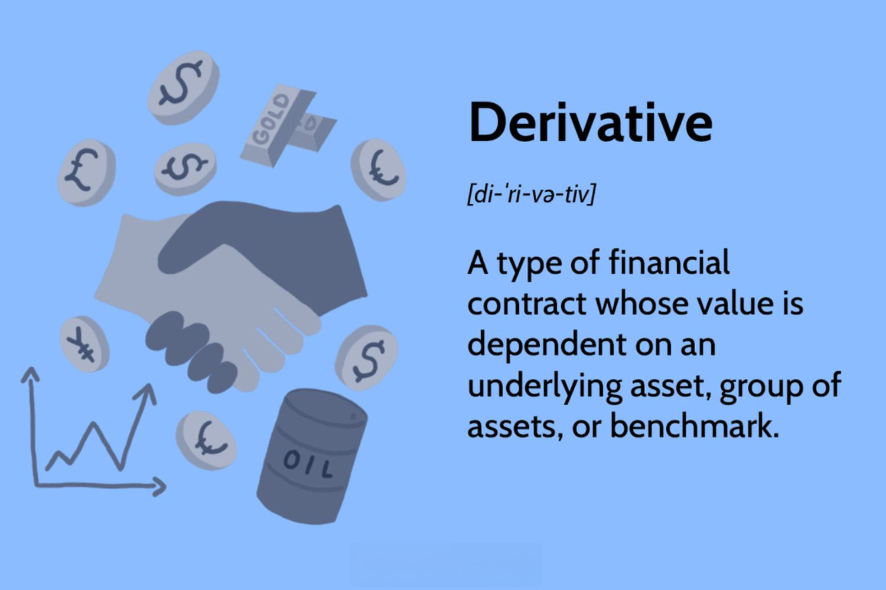

 to Financial Instruments

Financial instruments are essential components in the world of finance, representing a broad range of investments that can be exchanged in financial markets. They function as the vehicles through which capital is arranged, allocated, and utilized within the economy. At their core, financial instruments serve as a means for transferring risk, generating returns, and accessing capital.



The spectrum of financial instruments includes simple assets like stocks and bonds, as well as complex securities like derivatives. Stocks represent ownership in a company, granting shareholders a claim on part of the corporation's assets and earnings. Bonds, conversely, are debt instruments wherein the bondholder is essentially lending money to the issuer in exchange for periodic interest payments plus the return of the bond's face value when it matures.

For individuals venturing into the finance sector, a solid grasp of these instruments is fundamental, particularly when it comes to derivatives and algorithmic trading. Derivatives are sophisticated financial contracts whose valuation is reliant on the performance of an underlying asset, such as stocks, commodities, or interest rates. They are extensively used for hedging, speculation, and arbitrage. Algorithmic trading, or algo-trading, further complicates the landscape by utilizing computer algorithms to execute trades at speeds and frequencies unattainable by human traders, typically following predefined criteria for timing, price, and volume.

This article aims to guide beginners through some of the most intricate financial instruments, focusing on derivatives and their strategic application in algorithmic trading. By exploring these areas, one can appreciate the profound impact such instruments have on modern financial markets and investment strategies. Understanding these complex tools is pivotal for anyone looking to enhance their investment portfolio or engage systematically with current financial technologies.

## Table of Contents

## Understanding Derivatives

Derivatives are financial contracts that derive their value from an underlying asset, index, or rate. This underlying entity can be a diverse range of assets, including stocks, bonds, commodities, currencies, interest rates, and market indexes. The primary function of derivatives is to manage financial risk by allowing parties to transfer or assume risks associated with changing prices. Additionally, derivatives can be used for speculative purposes to gain financial outcomes from fluctuations in the underlying asset value or to access markets or assets otherwise difficult to reach.

Derivatives perform several vital roles in finance:

1. **Hedging Risk**: By using derivatives, an investor can protect against price movements in an underlying asset that could result in potential losses. For instance, a wheat farmer might use a futures contract to lock in a price for their crop in advance, thus safeguarding against price drops at harvest time.

2. **Speculation**: Investors may use derivatives to speculate on the future direction of market prices, aiming to profit from changes in the value of the underlying asset. For example, an investor can buy options contracts predicting that a stock will rise, hoping to buy the stock at a set price in the future and sell it at a higher market price.

3. **Accessing Markets or Assets**: Derivatives can provide exposure to assets or markets that might be difficult to invest in directly. This can be particularly useful for investors seeking to gain a foothold in international markets or assets with high barriers to entry.

The most common types of derivatives include:

- **Options**: These provide the holder with the right, but not the obligation, to buy (call option) or sell (put option) an asset at a predetermined price before a set expiration date. Options are versatile instruments used in various strategies to hedge risk or speculate on price movements.

- **Swaps**: Financial agreements in which two parties exchange cash flows or financial instruments. A typical example is an interest rate swap, where one party exchanges a stream of fixed-rate interest payments for floating-rate payments from another party. Swaps help manage interest rate risk and currency fluctuations.

- **Futures Contracts**: These standardize agreements to buy or sell an asset at a predetermined price at a specific future date. Futures contracts are commonly used for hedging price risk in commodities markets. Unlike options, the holder must fulfill the terms of the contract at expiration.

Derivatives have become integral to modern financial practices. However, they [carry](/wiki/carry-trading) significant risks, including leverage risk, valuation complexities, and counterparty risk. Proper understanding and management of these risks are critical for effectively utilizing derivatives.

## Types of Derivatives

Derivatives are financial contracts whose value is derived from an underlying asset. These instruments are significant in the financial markets due to their versatility and varied applications. The primary types of derivatives include options, futures, forward contracts and swaps, each serving unique purposes and having distinct characteristics.

Options are derivatives that confer the holder the right, but not the obligation, to buy (call option) or sell (put option) an asset at a predetermined price (strike price) within a specific time frame. The flexibility of options allows investors to tailor their risk exposure and leverage potential gains. For example, a call option might be used by an investor to capitalize on anticipated upward movement in a stock’s price, without the need to purchase the stock outright.

Futures and forward contracts are agreements to buy or sell an asset at a predetermined price at a specified time in the future. Futures are standardized contracts traded on exchanges, which offer high [liquidity](/wiki/liquidity-risk-premium) and minimal counterparty risk. In contrast, forwards are customized contracts traded over-the-counter (OTC), presenting more counterparty risk but also offering greater flexibility in terms and conditions. Both instruments are widely used for hedging and speculation. A farmer, for example, may use a futures contract to lock in the price of his crop at harvest, thereby hedging against price fluctuations.

Swaps involve two parties exchanging cash flows or financial instruments. The most common type is the [interest rate](/wiki/interest-rate-trading-strategies) swap, where parties exchange cash flows based on a notional principal amount to hedge against interest rate risk. For instance, a company with floating-rate debt might enter into a swap to exchange its variable interest payments for fixed payments, providing more predictable financial planning.

These derivatives are fundamental tools in risk management and can allow market participants to transfer specific risks to those better equipped or willing to bear them. However, their complexity and leverage can also increase risk exposure, emphasizing the necessity for comprehensive understanding and prudent use.

## Risks and Benefits of Trading Derivatives

Derivatives, while providing opportunities for enhanced returns, present several risks that need careful management. Among the prominent risks are market risk, liquidity risk, and leverage risk. Understanding these risks is pivotal for anyone engaging in trading derivatives effectively.

**Market Risk:** This is the risk of losses due to changes in market prices. Derivatives derive their value from underlying assets, which means fluctuations in the underlying asset's price can significantly impact the value of the derivative. For instance, an unexpected downturn in the market can lead to substantial losses. Strategies such as delta hedging are often employed to mitigate market risk. Delta hedging involves adjusting the positions of derivatives to achieve a net delta position of zero, thereby neutralizing the effect of price movements in the underlying asset.

**Liquidity Risk:** Refers to the risk that a trader may not be able to buy or sell a derivative at or near its market price due to a lack of liquidity. This can occur in thinly traded markets or during periods of market stress, making it challenging to find counterparties willing to transact. High liquidity is essential for the smooth functioning of derivative markets, enabling traders to enter and exit positions without significant price impacts.

**Leverage Risk:** Derivatives often allow traders to gain exposure to assets using leverage, meaning they can control a large position with a relatively small amount of capital. While leverage can amplify profits, it also magnifies losses, making it a double-edged sword. Calculating leverage ratios and maintaining appropriate margin levels are critical to managing leverage risk. For example, if a trader's leverage ratio is too high, even small adverse price movements can lead to margin calls or forced liquidation of positions.

To illustrate the management of these risks, consider a Python code snippet that calculates the delta of a European call option using the Black-Scholes formula:

```python
from scipy.stats import norm
import numpy as np

def black_scholes_delta(S, K, T, r, sigma):
    """
    Calculate the delta of a European call option using the Black-Scholes formula.
    :param S: Current stock price
    :param K: Strike price
    :param T: Time to expiration in years
    :param r: Risk-free interest rate
    :param sigma: Volatility of the stock
    :return: Delta of the call option
    """
    d1 = (np.log(S / K) + (r + 0.5 * sigma ** 2) * T) / (sigma * np.sqrt(T))
    delta = norm.cdf(d1)
    return delta

# Example parameters
S = 100  # Current stock price
K = 100  # Strike price
T = 1    # Time to expiration (1 year)
r = 0.05 # Risk-free interest rate (5%)
sigma = 0.2  # Volatility (20%)

call_delta = black_scholes_delta(S, K, T, r, sigma)
print(f"Delta of the call option: {call_delta}")
```

This code calculates the delta, which is crucial for risk management in option trading, as it provides an estimate of how much the option's price will move relative to a change in the underlying asset's price.

In conclusion, while derivatives offer the potential for increased returns, the associated risks necessitate a well-rounded understanding and effective risk management strategies to ensure they serve as beneficial tools in a trader's portfolio.

 to Algorithmic Trading

Algorithmic trading, commonly known as 'algo-trading,' leverages computer algorithms to execute trading decisions at speeds and frequencies that surpass human capabilities. The essence of [algorithmic trading](/wiki/algorithmic-trading) lies in its ability to process large volumes of financial data instantaneously, making buy or sell decisions based on pre-defined criteria without human intervention. This approach capitalizes on the computational speed and precision of algorithms, which can significantly enhance trading efficiency.

One of the primary advantages of algorithmic trading is its capacity to eliminate emotional influences from trading strategies. Human emotions such as fear and greed can often compromise decision-making, leading to suboptimal trading outcomes. By contrast, algorithms execute trades based solely on quantifiable and logical parameters, ensuring a more disciplined and consistent trading process.

Algorithmic trading systems operate through a series of instructions that include variables such as timing, price, and quantity. These instructions are typically based on a variety of advanced mathematical models and [statistics](/wiki/bayesian-statistics) that identify trading opportunities. For instance, algorithms can be programmed to detect specific market trends, price discrepancies, or volumes that trigger trade executions. 

Additionally, algorithmic trading can exploit microsecond-level price fluctuations that are not perceivable to human traders, offering opportunities for [arbitrage](/wiki/arbitrage) and other rapid trading strategies. The resultant trades are also executed at high speeds, minimizing the potential for negative price movements before order completion.

In summary, algorithmic trading represents a significant advancement in modern trading methodologies by combining speed, precision, and the removal of human emotion from trading activities, thereby offering a systematic and highly reliable approach to managing trading portfolios.

## Mechanics of Algorithmic Trading

Algorithmic trading employs pre-defined sets of instructions, known as algorithms, to execute trades based on parameters such as timing, price, and quantity. These instructions determine the exact conditions under which trades should be made, optimizing the trading process by removing human intervention and emotion.

A fundamental component of algorithmic trading is the use of diverse strategies, tailored to exploit market opportunities. Among these strategies, trend-following stands out for its simplicity and effectiveness. Trend-following strategies analyze historical price data to identify patterns and trends, executing trades in the direction of the established trend. This strategy often employs moving averages and [momentum](/wiki/momentum) indicators to generate trading signals. 

Another popular approach is arbitrage, which seeks to capitalize on price discrepancies of a financial instrument across different markets. An algorithm identifies and exploits these inefficiencies by buying the undervalued instrument in one market and simultaneously selling it at a higher price in another, thus locking in risk-free profits. Arbitrage requires high-frequency trading algorithms to quickly recognize and act on fleeting opportunities.

Mean reversion is another widely used strategy, based on the principle that asset prices tend to revert to their long-term mean or average. An algorithm will identify assets that have deviated significantly from their historical average and will execute trades to capitalize on the predicted movement back towards this mean. This could involve buying undervalued securities or selling overvalued ones, anticipating a return to the average price.

The success of algorithmic trading hinges on the accurate interpretation of market data and the execution of well-defined strategies with precision and speed. Algorithms continually scan market conditions and execute trades when predefined criteria are met. This precision not only improves the efficiency of trade execution but also minimizes the possibility of manual errors, contributing to more consistent trading results.

For example, a basic trend-following algorithm in Python might include the use of moving averages:

```python
import pandas as pd

# Load historical price data
data = pd.read_csv('historical_prices.csv')

# Calculate moving averages
data['Short_MA'] = data['Close'].rolling(window=20).mean()
data['Long_MA'] = data['Close'].rolling(window=50).mean()

# Define trading signals based on moving averages
data['Signal'] = 0
data['Signal'][20:] = np.where(data['Short_MA'][20:] > data['Long_MA'][20:], 1, 0)

# Generate the trading orders
data['Position'] = data['Signal'].diff()
```

In this example, a short-term and a long-term moving average are calculated. A buy signal is generated when the short-term moving average crosses above the long-term moving average, indicating an upward trend, while a sell signal is generated when the opposite occurs. This simple approach exemplifies how algorithmic trading leverages computational techniques to make systematic decisions, underscoring the mechanical and data-driven nature of algorithmic trading strategies.

## Benefits and Downsides of Algorithmic Trading

Algorithmic trading offers significant advantages in terms of efficiency and accuracy in trade execution. By employing pre-defined algorithms, it facilitates the swift execution of high-frequency trades, thereby reducing the time lag between decision-making and trade placement. This speed is critical in exploiting minor price differentials and in capitalizing on market opportunities that are only available for short periods. Furthermore, the automation inherent in algo-trading reduces transaction costs through economies of scale and minimizes human errors that could result from manual trading processes.

A vital benefit of algorithmic trading is its ability to remove human emotions from the trading equation, resulting in more disciplined and systematic trading. Emotion-driven decisions can often lead to sub-optimal trading outcomes, such as panic selling during market downturns or over-enthusiastic buying during bullish phases. By relying on algorithms, traders can adhere strictly to their pre-configured strategies, thus avoiding the pitfalls of emotional decision-making.

However, algorithmic trading is not without its drawbacks. The heavy reliance on technology introduces vulnerabilities, such as system failures or bugs in the algorithms, which can disrupt trading operations. Additionally, during periods of high market [volatility](/wiki/volatility-trading-strategies), the rapid execution of algorithmic trades can exacerbate price fluctuations, contributing to market instability. This phenomenon was highlighted during the Flash Crash of 2010, when the U.S. stock market experienced an unprecedented and rapid fall due to algorithmic trading anomalies.

Moreover, the competitive edge in algorithmic trading requires constant updates and optimizations of trading algorithms. As markets evolve, algorithms must be continually refined to account for new data and changing market conditions. This requires substantial expertise in both financial markets and programming, often necessitating a collaborative effort between financial analysts and software developers. 

In summary, while algorithmic trading offers distinct advantages in terms of efficiency, cost reduction, and accuracy, it also poses challenges related to technological reliability and market stability. Successful implementation of algorithmic trading strategies demands a careful balance of these factors, along with rigorous risk management and continuous algorithm refinement.

## Building Your Own Trading Algorithm

To embark on algorithmic trading, it is essential to acquire a blend of financial acumen, programming proficiency, and access to an efficient trading platform. These core components form the backbone of developing a successful trading algorithm that can operate in dynamic financial markets.

Financial knowledge is the foundational element, enabling the trader to understand market mechanics, asset valuation, and economic indicators that could influence trading decisions. A grasp of statistical methods and quantitative analysis is also crucial, as these are frequently employed in developing and refining trading strategies.

Programming skills, especially in Python, are invaluable as most algorithmic trading strategies are implemented programmatically. Python is favored due to its extensive libraries such as NumPy, pandas, and matplotlib, which streamline numerical computations and data visualization tasks. The ability to script complex trading strategies using logical operators, data structures, and algorithms is fundamental. Below is a simple example of a moving average crossover strategy coded in Python:

```python
import pandas as pd
import numpy as np

# Sample data loading
data = pd.read_csv('historical_data.csv')
data['SMA_short'] = data['Close'].rolling(window=50).mean()
data['SMA_long'] = data['Close'].rolling(window=200).mean()

# Define signals
data['Signal'] = 0
data['Signal'][50:] = np.where(data['SMA_short'][50:] > data['SMA_long'][50:], 1, 0)
data['Position'] = data['Signal'].diff()

# Display signals
print(data[['Close', 'SMA_short', 'SMA_long', 'Signal', 'Position']])
```

A robust trading platform is crucial as it provides market data feeds, order execution capabilities, and often includes facilities for [backtesting](/wiki/backtesting). Platforms like MetaTrader, [Interactive Brokers](/wiki/interactive-brokers-api), or proprietary APIs offered by brokers facilitate these functions.

Backtesting is an imperative step in developing an algorithm. It involves applying the trading rules to historical data to evaluate the effectiveness of a strategy. This helps in identifying potential pitfalls and optimizing the strategy before live deployment. Tools such as the `[backtrader](/wiki/backtrader)` library in Python can be used to simulate the performance of trading strategies against historical data.

The backtesting process involves several phases:

1. **Data Integration**: Secure historical price data and format it suitably for the algorithm.
2. **Strategy Implementation**: Code the trading logic and rules, specifying conditions for entering and exiting trades.
3. **Performance Analysis**: Examine key metrics like the Sharpe ratio, maximum drawdown, and total returns to gauge strategy effectiveness.

Refinement of algorithms is a continuous process. As market conditions evolve, tweaking parameters or incorporating new data inputs may be necessary to maintain a trading algorithm's robustness. This cycle of backtesting and refinement ensures that the deployed algorithm remains competitive and aligned with the trader's financial objectives.

## Conclusion

Understanding the complexities of derivatives and the intricacies of algorithmic trading can greatly enhance an investor's ability to navigate modern financial markets. Derivatives allow investors to hedge risks, speculate, and gain access to additional markets, which can significantly broaden their investment strategies. By using options, futures, and swaps, investors can tailor their risk exposure to align with their financial goals.

Algorithmic trading, on the other hand, provides a technological edge by utilizing algorithms to execute trades at speeds beyond human capabilities. This approach not only increases efficiency but also reduces costs and manual errors, making the trading process more systematic. It involves implementing strategies such as trend-following, arbitrage, and mean reversion based on pre-defined rules to achieve the best possible execution.

Despite their advantages, both derivatives and algorithmic trading introduce various risks. Derivatives can amplify losses due to market volatility, liquidity issues, and leverage. Similarly, algo-trading relies heavily on technology; system failures or market disruptions can pose significant risks, especially during periods of high volatility.

Therefore, a careful strategy and robust risk management framework are essential when incorporating these instruments into an investment portfolio. This includes understanding the underlying assets, market conditions, and the specific risks associated with each financial instrument. Backtesting algorithms with historical data to ensure that they can weather various market scenarios is imperative before actual deployment.

In sum, with a strategic approach and prudent risk management, derivatives and algorithmic trading can serve as powerful tools in advancing an investor's portfolio and contribute to achieving a diversified and balanced investment strategy.

## References & Further Reading

[1]: Hull, J. C. (2017). ["Options, Futures, and Other Derivatives."](https://www.semanticscholar.org/paper/Options%2C-Futures%2C-and-Other-Derivatives-Hull/89bdee500c8623864fc9eb7a471546aa713acc44) Pearson.

[2]: Lopez de Prado, M. (2018). ["Advances in Financial Machine Learning."](https://www.amazon.com/Advances-Financial-Machine-Learning-Marcos/dp/1119482089) Wiley.

[3]: Chan, E. P. (2013). ["Algorithmic Trading: Winning Strategies and Their Rationale."](https://github.com/ftvision/quant_trading_echan_book) Wiley.

[4]: Black, F., & Scholes, M. (1973). ["The Pricing of Options and Corporate Liabilities."](https://www.cs.princeton.edu/courses/archive/fall09/cos323/papers/black_scholes73.pdf) Journal of Political Economy, 81(3), 637-654.

[5]: Jansen, S. (2020). ["Machine Learning for Algorithmic Trading."](https://github.com/stefan-jansen/machine-learning-for-trading) Packt Publishing.

[6]: Glasserman, P. (2003). ["Monte Carlo Methods in Financial Engineering."](https://link.springer.com/book/10.1007/978-0-387-21617-1) Springer.