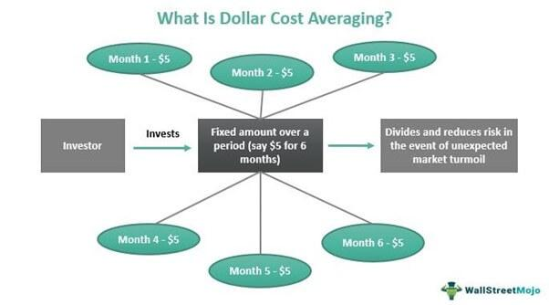

Dollar-cost averaging (DCA) is a widely recognized investment strategy that involves investing a fixed amount of money into a particular asset or portfolio at regular intervals, regardless of the asset's price. This strategy is designed to reduce the impact of market volatility by smoothing out the purchase price over time. In this article, we explore the application of DCA within the context of algorithmic trading, where algorithms automate the execution of trades based on pre-defined instructions. By combining DCA with algorithmic trading, investors can maintain discipline and consistency, minimizing the influence of emotions and human error in decision-making.

Algorithmic trading enhances the traditional DCA approach by utilizing automated systems to execute trades at defined intervals, ensuring that the strategy is strictly adhered to. This method allows for a systematic and disciplined investment process, which can be particularly advantageous in volatile markets, eliminating impulsive investment decisions often driven by market fluctuations. However, while DCA offers benefits such as reduced risk associated with market timing and emotional decision-making, it also presents certain drawbacks. These include potentially lower returns in steadily rising markets and increased transaction costs due to frequent trades.



In the following sections, we will examine how DCA can be effectively implemented in algorithmic trading, discussing its strengths and limitations. We will also explore variations of the DCA strategy and how they can be integrated with other investment techniques to cater to different market conditions and risk preferences.

## Table of Contents

## What is Dollar-Cost Averaging?

Dollar-cost averaging (DCA) is a systematic investment technique where an investor allocates a fixed sum of money to purchase a particular asset at regular intervals, regardless of the asset's price. This method ensures that more units of an asset are purchased when prices are low and fewer units when prices are high, thus averaging the cost of acquisitions over time. By adhering to a consistent investment schedule, DCA aims to mitigate the impacts of market [volatility](/wiki/volatility-trading-strategies), smoothing out the effects of short-term price fluctuations on the overall investment portfolio.

This strategy operates on the principle of reducing emotional decision-making in the investment process. Emotional reactions to market volatility, such as panic selling during downturns or exuberant buying during peaks, can significantly impact portfolio performance. DCA, by promoting a disciplined and consistent investment approach, helps investors avoid reacting impulsively to market movements, thus minimizing the risks associated with market timing.

Mathematically, the average cost per unit in a DCA strategy can be expressed as:

$$
\text{Average Cost per Unit} = \frac{\text{Total Amount Invested}}{\text{Total Units Purchased}}
$$

For example, if an investor commits $100 monthly to purchase shares of a stock, and the stock prices over three months are $10, $8, and $12, they would acquire 10, 12.5, and 8.33 shares respectively. The total investment of $300 results in roughly 30.83 shares, making the average cost per share approximately $9.73.

Implementing DCA does not necessitate complex financial acumen, making it accessible to novice investors. Its straightforward nature and emphasis on regular investment intervals provide a structured framework that can be particularly beneficial in uncertain and volatile market conditions. As a result, DCA assists investors in building their portfolios progressively while reducing the emotional pressure often associated with market speculation and fluctuations.

## Advantages of Dollar-Cost Averaging

Dollar-cost averaging (DCA) stands as a formidable strategy in investment, primarily for its capacity to mitigate the risks inherent to market timing—a [factor](/wiki/factor-investing) that can significantly affect lump sum investments. Unlike strategies that seek to capitalize on predicting price movements, DCA involves investing a fixed amount of money at regular intervals, regardless of the asset’s price. This regular investment approach inherently reduces the likelihood of making ill-timed entries into volatile markets, thereby smoothing out the effects of market fluctuations. As a result, DCA can lead to a more stable accumulation of assets over time.

A critical advantage of DCA lies in its psychological benefits to investors. By adhering to a pre-determined investment plan, DCA reduces the pressure of market speculation and the emotional biases that often lead to suboptimal decisions. This systematic approach simplifies decision-making processes by eliminating the need to constantly analyze and predict market behavior. The simplicity and predictability of DCA can significantly reduce the cognitive load on investors, allowing them to focus on long-term investment goals without the distraction of short-term market noise.

Moreover, DCA provides diversification over time, which can be a strategic advantage in volatile markets. By spreading out investments, DCA allows investors to purchase more shares when prices are low and fewer shares when prices are high, potentially lowering the average cost per share. Over extended periods, this can lead to more favorable buying conditions and, thus, the possibility of enhanced returns. Mathematically, if $P_t$ represents the price at time $t$, and $x$ is the fixed amount invested periodically, the number of shares acquired at each interval is $\frac{x}{P_t}$. Over $n$ periods, the average cost can be calculated as:

$$
\bar{C} = \frac{\sum_{t=1}^{n} x}{\sum_{t=1}^{n} \frac{x}{P_t}}
$$

The above formula highlights how DCA’s routine investment can potentially lower average costs compared to a single lump sum investment made at an inopportune time. This temporal spread inherently accommodates the ups and downs of market prices, positioning DCA as a risk-averse strategy suitable for many investors, especially those inclined towards long-term financial commitment.

Overall, DCA's ability to mitigate market timing risks, its psychological simplicity, and its potential to reduce average investment costs by leveraging time diversification make it a compelling choice for investors keen on systematic wealth accumulation.

## Disadvantages of Dollar-Cost Averaging

Dollar-cost averaging (DCA) is a strategic investment approach characterized by its methodical nature, but like any investment strategy, it has its disadvantages. One significant drawback is its potential to yield lower total returns in markets experiencing consistent upward trends. In such scenarios, an investor employing DCA might frequently purchase assets at gradually increasing prices, as the strategy doesn't capitalize on the immediate profitability that lump sum investments might achieve.

Another concern associated with DCA is the cumulative impact of transaction costs. Since DCA involves regular investments, it inherently requires more frequent trades compared to a one-time, lump sum investment. Each transaction can incur fees, which over time, might erode the overall returns of the investment. For example, if transaction fees are a fixed rate per trade, the increased frequency of trades in a DCA strategy would lead to proportionally higher total fees.

Moreover, DCA's regimented schedule can occasionally result in missed opportunities to maximize profits. During periods of market downturns or corrections, sticking rigidly to predefined intervals may cause investors to miss the chance to increase their stake in the market when prices are particularly low. A more flexible approach might capitalize on such downturns more effectively by adjusting the amount or timing of investments based on market conditions, but this deviates from the core principle of DCA, which is maintaining consistency irrespective of market fluctuations.

These factors highlight that while DCA is advantageous for spreading risk and promoting disciplined investing, it is not without limitations, particularly in contexts where transaction costs are high or market conditions favor a more aggressive or opportunistic investment approach.

## Different Strategies of Dollar-Cost Averaging

Dollar-cost averaging (DCA) is a versatile investment strategy characterized by its adaptability to varying market conditions through different variations. Traditional DCA involves committing a fixed amount of money to investment at regular intervals, a method that permits investors to acquire more units when prices are low and fewer units when prices are high, thereby potentially reducing the average cost per unit over time.

An alternative to this traditional approach is value averaging. Unlike DCA, which maintains a constant monetary investment, value averaging adjusts the investment amount to target a predetermined portfolio growth trajectory. In essence, if the portfolio exceeds the target growth, the investor would invest less in the following period, and conversely, if the portfolio underperforms, the investor would increase their investment to meet the target. This strategy tends to buy more shares when prices are low and fewer when prices are high, aligning with the buy-low-sell-high principle.

Another dimension to DCA involves combining it with other investment strategies, such as market timing or volatility targeting, to achieve varied risk-return profiles. Blending DCA with market timing attempts to enhance returns by allocating larger investments during anticipated favorable market conditions and reducing them when conditions may not favor good returns. However, this combination requires investors to accurately predict market movements, which can be challenging.

Volatility targeting combines DCA with adjustments based on the volatility of the underlying asset. In periods of high volatility, the investor might reduce the amount invested to mitigate risk, while in periods of lower volatility, the investment amount might be increased. This approach aims to stabilize returns by avoiding excess investment during turbulent market periods.

These strategies are not mutually exclusive and can be tailored according to the investor's risk tolerance and market outlook. By adopting various DCA strategies, investors can navigate different market environments, helping to manage risk and aim for more stable returns.

## DCA in Algorithmic Trading

Algorithmic trading systems have revolutionized the implementation of Dollar-Cost Averaging (DCA) by automating the process of systematically placing trades. This automation provides the distinct advantage of maintaining consistency and discipline in executing DCA strategies. A primary benefit of using algorithms in trading is the reduction of human error, which can often skew investment outcomes when decisions are influenced by emotions rather than data.

In algorithmic DCA, the investment process can be structured to execute trades at predetermined intervals, adhering strictly to a set strategy without deviation. This can be particularly effective in adhering to a DCA strategy, which relies on regular investments at fixed amounts regardless of market conditions. By doing so, an investor ensures a disciplined approach to averaging down the price of an asset over time, potentially mitigating the effects of market volatility.

For instance, consider implementing DCA via an algorithm that purchases a fixed dollar amount of an asset at the beginning of each month. The automation would execute these trades automatically, ensuring consistency without the need for manual intervention. The following Python snippet demonstrates a simplified version of this approach:

```python
import schedule
import time

def execute_trade():
    amount_to_invest = 100  # fixed dollar amount
    asset_price = get_current_asset_price()  # hypothetical function
    quantity = amount_to_invest / asset_price
    place_trade(quantity)  # hypothetical function to place a trade

# Schedule the trade to execute on the first day of each month
schedule.every().month.at("09:00").do(execute_trade)

while True:
    schedule.run_pending()
    time.sleep(60)  # wait one minute
```

This level of automation helps in minimizing the emotional biases that often hinder investors. For example, during market downturns, manual investors might hesitate or refrain from making purchases due to fear or uncertainty. An algorithm, conversely, will execute trades as per its programming, thereby adhering to the principles of DCA without wavering. Moreover, the consistency achieved through [algorithmic trading](/wiki/algorithmic-trading) can contribute to better statistical outcomes over time, as the investment strategy remains unaffected by subjective human judgments.

Additionally, algorithms can easily incorporate other trading strategies with DCA to enhance returns or reduce risks, such as volatility targeting. By establishing pre-set criteria or thresholds, algorithms can dynamically adjust the size of each trade in response to current volatility conditions, further optimizing the investment process. Ultimately, blending DCA with algorithmic trading not only strengthens adherence to investment principles but also equips investors with the tools to efficiently handle market complexities.

## Conclusion

Dollar-cost averaging (DCA) in algorithmic trading offers an innovative and balanced approach to investing by automating investment decisions and minimizing emotional biases typical of human traders. This balanced strategy allows investors to navigate volatile market conditions by spreading investments over time, potentially reducing the risk associated with market timing.

Market scenarios significantly influence the outcome of DCA strategies. In volatile environments, DCA can effectively mitigate risks by allowing the investor to purchase more assets when prices are low and fewer when prices are high, optimizing the average purchase cost over time. However, in consistently upward-trending markets, DCA may underperform compared to lump-sum investing because the strategy can inadvertently lead to higher average costs as prices rise.

Integrating DCA with other investment strategies can enhance its effectiveness, catering to varying risk appetites and market conditions. For example, combining DCA with strategies like [momentum](/wiki/momentum) investing or volatility-based adjustments can provide a more dynamic approach that responds to changing market signals. This synthetic strategy can help investors balance potential returns with acceptable risk levels, adapting to both bullish and bearish scenarios.

In conclusion, DCA in algorithmic trading offers a robust framework for investors seeking to balance risk and reward through disciplined investments across time. By adapting DCA to incorporate additional strategies, investors can tailor their approach to suit individual goals and market dynamics, thereby enhancing the potential for long-term success.

## References & Further Reading

[1]: Benjamin Graham. (1949). ["The Intelligent Investor"](https://www.amazon.com/Intelligent-Investor-Definitive-Investing-Essentials/dp/0060555661). Harper & Brothers.

[2]: Mammatha Modur, et al. (2021). ["An Analysis On Dollar-Cost Averaging As A Risk Mitigation Strategy."](https://www.nature.com/articles/s41558-021-01206-3) IEEE.

[3]: Malkiel, B. G. (2019). ["A Random Walk Down Wall Street: The Time-Tested Strategy for Successful Investing."](https://www.amazon.com/Random-Walk-Down-Wall-Street/dp/1324002182) W. W. Norton & Company.

[4]: Larsson, M. (2019). ["Algorithmic Trading: A Comprehensive Beginner's Guide to Learn and Master Algorithmic Trading."](https://www.researchgate.net/publication/378548435_Algorithmic_Trading_and_AI_A_Review_of_Strategies_and_Market_Impact) Independently Published.

[5]: Markowitz, H. (1952). ["Portfolio Selection."](https://onlinelibrary.wiley.com/doi/abs/10.1111/j.1540-6261.1952.tb01525.x) The Journal of Finance, 7(1), 77-91.