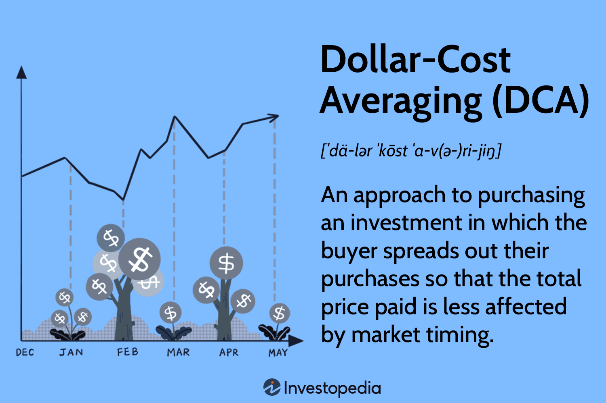

## Table of Contents

## What is dollar-cost averaging?

Dollar-cost averaging is a way to invest money over time, instead of all at once. You take a certain amount of money and invest it regularly, like every month. By doing this, you buy more shares when prices are low and fewer shares when prices are high. This can help reduce the risk of investing all your money at a time when the price is high.

This method is good for people who want to invest but are worried about the ups and downs of the market. It helps you avoid trying to guess the best time to buy. Instead, you keep investing the same amount regularly. Over time, this can lead to a lower average cost per share and can help build your investment steadily.

## How does dollar-cost averaging work?

Dollar-cost averaging means you invest a fixed amount of money into a stock or fund at regular times, like every month. Instead of putting all your money in at once, you spread it out. This way, when the price is low, your fixed amount buys more shares. When the price is high, the same amount buys fewer shares. Over time, this can help you pay less on average for each share.

This method takes away the stress of trying to pick the perfect time to invest. You don't need to worry about whether the market is going up or down right now. By investing the same amount regularly, you smooth out the ups and downs of the market. It's a simple way to build your investment slowly and steadily, without needing to guess when to buy.

## What are the benefits of using dollar-cost averaging?

Dollar-cost averaging helps you avoid the stress of trying to guess the best time to invest. Instead of putting all your money in at once, you invest a fixed amount regularly, like every month. This way, you don't need to worry about whether the market is going up or down right now. It takes away the pressure of trying to time the market perfectly, which can be hard and risky.

Another benefit is that it can lower the average cost of your investments. When the price is low, your fixed amount buys more shares. When the price is high, the same amount buys fewer shares. Over time, this can help you pay less on average for each share. It's a simple way to build your investment slowly and steadily, without needing to guess when to buy.

Overall, dollar-cost averaging is a good strategy for people who want to invest but are worried about the ups and downs of the market. It helps you stay disciplined and keep investing regularly, which can lead to better long-term results. By spreading out your investments, you can reduce the risk of putting all your money in at a bad time.

## Can you provide a simple example of dollar-cost averaging?

Imagine you have $1,200 to invest in a stock. Instead of putting all the money in at once, you decide to use dollar-cost averaging. You choose to invest $100 every month for a year. In January, the stock price is $10 per share, so your $100 buys you 10 shares. In February, the price drops to $8 per share, and your $100 buys you 12.5 shares. By March, the price goes up to $12 per share, and your $100 buys you 8.33 shares. You keep doing this every month.

Over the year, the price of the stock goes up and down, but you keep investing the same $100 each time. At the end of the year, you've invested the whole $1,200, but you've bought more shares when the price was low and fewer when it was high. This means your average cost per share is lower than if you had bought all the shares at once at any single point in the year. Dollar-cost averaging helped you spread out your investment and reduce the risk of buying at a bad time.

## How does dollar-cost averaging help in reducing investment risk?

Dollar-cost averaging helps reduce investment risk by spreading out your investments over time. Instead of putting all your money into a stock or fund at once, you invest a fixed amount regularly, like every month. This means you don't have to worry about the market's ups and downs at any one moment. If the price is high when you invest, you buy fewer shares. If the price is low, you buy more shares. This way, you avoid the risk of investing all your money at a time when the price is very high.

Over time, this strategy can lead to a lower average cost per share. Because you're buying more shares when prices are low and fewer when prices are high, your overall cost averages out. This helps protect you from the risk of buying all your shares at a peak price. By investing the same amount regularly, you smooth out the market's fluctuations and build your investment steadily, reducing the risk of making a big mistake by trying to time the market perfectly.

## What are the potential drawbacks of dollar-cost averaging?

Dollar-cost averaging might mean you miss out on some gains. If the market goes up a lot right after you start investing, you could have made more money by putting all your money in at the start. By spreading out your investments, you might not get to enjoy big jumps in the market as much as someone who invested everything at once at the right time.

It also takes more work and discipline to keep investing regularly. You need to remember to put money in every month or set up automatic payments. This can be annoying, and if you forget or don't have the money one month, it can mess up your plan. Plus, there might be some small fees each time you invest, which can add up over time.

## How often should one invest using a dollar-cost averaging strategy?

When using dollar-cost averaging, how often you invest depends on what works best for you. Many people choose to invest every month because it's easy to remember and fits well with their budget. Investing monthly helps spread out your money over time and smooths out the ups and downs of the market. But you can also choose to invest every two weeks or even weekly if that fits better with your pay schedule or if you want to spread out your investments even more.

The key is to pick a schedule that you can stick to. If you find it hard to remember to invest, you might want to set up automatic payments from your bank account. This way, the money goes into your investment without you having to do anything each time. Whether you choose to invest weekly, bi-weekly, or monthly, the most important thing is to keep investing regularly to make the most of dollar-cost averaging.

## Is dollar-cost averaging suitable for all types of investments?

Dollar-cost averaging can work well for many types of investments, like stocks, mutual funds, and exchange-traded funds (ETFs). It's especially good for investments that go up and down a lot over time. By spreading out your money, you can buy more when prices are low and less when they're high. This helps you pay less on average for each share and can make your investment grow steadily over time. It's a good way to invest without worrying about the best time to buy.

However, dollar-cost averaging might not be the best choice for every investment. For example, if you're investing in something that doesn't change in price much, like a savings account or a bond with a fixed interest rate, you won't see the same benefits. Also, if you believe a certain investment will go up a lot very soon, you might miss out on big gains by spreading out your money over time. So, while dollar-cost averaging can be a great strategy for many investments, it's important to think about what you're investing in and whether this method makes sense for that particular investment.

## How does dollar-cost averaging compare to lump-sum investing?

Dollar-cost averaging means you put money into an investment a little bit at a time, like every month. This way, you don't have to guess when the market will be at its best. If the price is high when you invest, you buy fewer shares. If it's low, you buy more. Over time, this can help you pay less on average for each share. It's a good way to invest if you're worried about the market going up and down a lot.

Lump-sum investing is when you put all your money into an investment at once. This can be good if the market goes up right after you invest. You could make more money than if you spread out your investment over time. But it's also riskier because if the market goes down right after you invest, you could lose a lot. It's like betting that the market will go up soon, which can be hard to predict.

In the end, dollar-cost averaging helps you avoid the stress of trying to guess the best time to invest. It's safer and can help you build your investment slowly. Lump-sum investing might give you bigger gains if you get the timing right, but it's also riskier. Which one is better depends on how much risk you're okay with and what you think the market will do next.

## What psychological benefits does dollar-cost averaging offer to investors?

Dollar-cost averaging helps investors feel less worried about the ups and downs of the market. Instead of putting all their money in at once and hoping the market goes up right away, they can invest a little bit every month. This way, they don't have to stress about picking the perfect time to buy. If the market goes down, they know they'll buy more shares next time, which can make them feel better about their investment.

It also helps investors stay disciplined and keep investing regularly. When you know you're putting money in every month, it's easier to stick to your plan. This can make you feel more in control and less likely to make quick decisions based on fear or excitement. Over time, this steady approach can help you build your investment without the stress of trying to time the market perfectly.

## Can dollar-cost averaging be automated, and if so, how?

Yes, dollar-cost averaging can be automated, which makes it easier and less stressful. You can set up automatic payments from your bank account to go into your investment account every month. This way, you don't have to remember to invest each time. Your money goes into your investment without you having to do anything.

To set this up, you'll need to talk to your bank or the company where you're investing. They can help you arrange for a fixed amount of money to be moved from your account to your investment on a regular schedule, like every month. Once it's set up, you can just let it run and watch your investment grow over time.

## What advanced strategies can be combined with dollar-cost averaging to optimize returns?

One way to make dollar-cost averaging even better is to use it with something called asset allocation. This means you spread your money across different types of investments, like stocks, bonds, and real estate. By doing this, you can lower your risk because if one type of investment goes down, the others might go up. You can set up your dollar-cost averaging to put money into these different investments every month. This way, you're not only spreading out your investments over time but also across different kinds of assets, which can help you get better returns while keeping things safer.

Another strategy is to use dollar-cost averaging with rebalancing. Rebalancing means you check your investments every so often and make sure they're still in the right mix. If one part of your investment has grown a lot, you might sell some of it and buy more of the other parts to keep things balanced. You can do this while still using dollar-cost averaging. Every month, you add more money to your investments, and then every few months, you rebalance to make sure your money is spread out the way you want. This can help you keep your investment on track and maybe even get better returns over time.

## What is Dollar-Cost Averaging?

Dollar-cost averaging (DCA) is a systematic investment technique where an investor allocates a fixed sum of money to purchase a particular asset at regular intervals, regardless of the asset's price. This method ensures that more units of an asset are purchased when prices are low and fewer units when prices are high, thus averaging the cost of acquisitions over time. By adhering to a consistent investment schedule, DCA aims to mitigate the impacts of market [volatility](/wiki/volatility-trading-strategies), smoothing out the effects of short-term price fluctuations on the overall investment portfolio.

This strategy operates on the principle of reducing emotional decision-making in the investment process. Emotional reactions to market volatility, such as panic selling during downturns or exuberant buying during peaks, can significantly impact portfolio performance. DCA, by promoting a disciplined and consistent investment approach, helps investors avoid reacting impulsively to market movements, thus minimizing the risks associated with market timing.

Mathematically, the average cost per unit in a DCA strategy can be expressed as:

$$
\text{Average Cost per Unit} = \frac{\text{Total Amount Invested}}{\text{Total Units Purchased}}
$$

For example, if an investor commits $100 monthly to purchase shares of a stock, and the stock prices over three months are $10, $8, and $12, they would acquire 10, 12.5, and 8.33 shares respectively. The total investment of $300 results in roughly 30.83 shares, making the average cost per share approximately $9.73.

Implementing DCA does not necessitate complex financial acumen, making it accessible to novice investors. Its straightforward nature and emphasis on regular investment intervals provide a structured framework that can be particularly beneficial in uncertain and volatile market conditions. As a result, DCA assists investors in building their portfolios progressively while reducing the emotional pressure often associated with market speculation and fluctuations.

## What are the advantages of dollar-cost averaging?

Dollar-cost averaging (DCA) stands as a formidable strategy in investment, primarily for its capacity to mitigate the risks inherent to market timing—a [factor](/wiki/factor-investing) that can significantly affect lump sum investments. Unlike strategies that seek to capitalize on predicting price movements, DCA involves investing a fixed amount of money at regular intervals, regardless of the asset’s price. This regular investment approach inherently reduces the likelihood of making ill-timed entries into volatile markets, thereby smoothing out the effects of market fluctuations. As a result, DCA can lead to a more stable accumulation of assets over time.

A critical advantage of DCA lies in its psychological benefits to investors. By adhering to a pre-determined investment plan, DCA reduces the pressure of market speculation and the emotional biases that often lead to suboptimal decisions. This systematic approach simplifies decision-making processes by eliminating the need to constantly analyze and predict market behavior. The simplicity and predictability of DCA can significantly reduce the cognitive load on investors, allowing them to focus on long-term investment goals without the distraction of short-term market noise.

Moreover, DCA provides diversification over time, which can be a strategic advantage in volatile markets. By spreading out investments, DCA allows investors to purchase more shares when prices are low and fewer shares when prices are high, potentially lowering the average cost per share. Over extended periods, this can lead to more favorable buying conditions and, thus, the possibility of enhanced returns. Mathematically, if $P_t$ represents the price at time $t$, and $x$ is the fixed amount invested periodically, the number of shares acquired at each interval is $\frac{x}{P_t}$. Over $n$ periods, the average cost can be calculated as:

$$
\bar{C} = \frac{\sum_{t=1}^{n} x}{\sum_{t=1}^{n} \frac{x}{P_t}}
$$

The above formula highlights how DCA’s routine investment can potentially lower average costs compared to a single lump sum investment made at an inopportune time. This temporal spread inherently accommodates the ups and downs of market prices, positioning DCA as a risk-averse strategy suitable for many investors, especially those inclined towards long-term financial commitment.

Overall, DCA's ability to mitigate market timing risks, its psychological simplicity, and its potential to reduce average investment costs by leveraging time diversification make it a compelling choice for investors keen on systematic wealth accumulation.

## References & Further Reading

[1]: Benjamin Graham. (1949). ["The Intelligent Investor"](https://www.amazon.com/Intelligent-Investor-Definitive-Investing-Essentials/dp/0060555661). Harper & Brothers.

[2]: Mammatha Modur, et al. (2021). ["An Analysis On Dollar-Cost Averaging As A Risk Mitigation Strategy."](https://www.nature.com/articles/s41558-021-01206-3) IEEE.

[3]: Malkiel, B. G. (2019). ["A Random Walk Down Wall Street: The Time-Tested Strategy for Successful Investing."](https://www.amazon.com/Random-Walk-Down-Wall-Street/dp/1324002182) W. W. Norton & Company.

[4]: Larsson, M. (2019). ["Algorithmic Trading: A Comprehensive Beginner's Guide to Learn and Master Algorithmic Trading."](https://www.researchgate.net/publication/378548435_Algorithmic_Trading_and_AI_A_Review_of_Strategies_and_Market_Impact) Independently Published.

[5]: Markowitz, H. (1952). ["Portfolio Selection."](https://onlinelibrary.wiley.com/doi/abs/10.1111/j.1540-6261.1952.tb01525.x) The Journal of Finance, 7(1), 77-91.