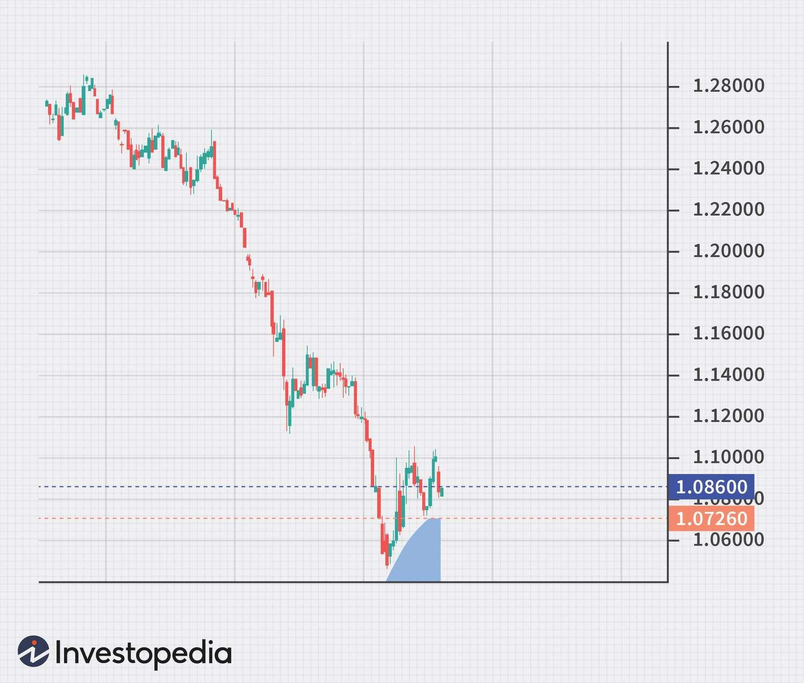

Futures trading in the currency markets, commonly referred to as forex futures trading, has garnered substantial attention due to the massive liquidity and immense trading volume characteristic of the foreign exchange market. Forex futures are intricate financial derivatives that offer traders the capability to hedge against, or speculate on, the potential future price movements of currency pairs. These instruments are crucial for managing foreign exchange risk and are standardized contracts that obligate the exchange of a particular currency amount at a predetermined future date and price. 

In recent years, the deployment of algorithmic trading, or algo trading, has been transforming the methodologies employed in futures trading. Algorithmic trading employs advanced computer algorithms to automate trading processes, consequently enhancing efficiency and largely eradicating the probability of human errors. This technological advancement not only accelerates the execution speed of trades but also optimizes decision-making processes by leveraging complex data analysis and market insights. 

The aim of this article is to investigate the convergence of futures trading in forex markets with the innovative strategies facilitated by algorithmic trading. By leveraging automation and algorithmic systems, traders can unlock new potentials, optimizing their trading strategies and ultimately striving for better risk management and profitability outcomes in the forex futures trading landscape.

## Table of Contents

## Understanding Forex Futures

Forex futures are standardized contracts that facilitate the trading of currencies at a predetermined price on a set future date. Distinct from currency forward contracts, which are private agreements between two parties, forex futures are publicly traded on exchanges. This standardization ensures that all contracts have the same specifications, promoting transparency and fairness. One of the key features of forex futures is the mark-to-market process, where profits and losses are settled daily. This practice helps in reducing the risk of counterparty default and is supported by a clearinghouse that serves as an intermediary, effectively mitigating credit risk for traders.

Forex futures are mainly traded on major exchanges, with the Chicago Mercantile Exchange (CME) being one of the most prominent platforms. The CME and similar exchanges provide a regulated environment that enhances the safety and reliability of trading activities. By offering a structured and secure marketplace, these exchanges attract a broad spectrum of market participants, from individual traders to institutional investors.

The primary motivations for engaging in forex futures trading are hedging and speculation. For businesses and investors involved in international operations, forex futures provide a mechanism to hedge against adverse currency movements, thereby protecting profits and reducing uncertainty. For example, if a U.S. company expects to receive payment in euros in three months, it might use forex futures to lock in the current exchange rate, thus safeguarding against potential depreciation in the euro.

Speculators, on the other hand, seek to profit from fluctuations in currency prices by forecasting market trends. They rely on various analytical tools and market insights to anticipate price movements. For instance, if a trader believes that the euro will strengthen against the dollar, they may purchase a euro futures contract, aiming to sell it at a higher price as the market value rises.

Forex futures offer an efficient and accessible way to engage with the currency markets, providing strategic benefits to a diverse range of participants. Their standardized nature, reliability, and widespread acceptance make them a popular choice for managing currency risk and capitalizing on market opportunities.

## Margins, Exchanges, and Contract Specifications

Forex futures trading requires participants to make an initial margin payment, which serves as a good faith deposit. This margin ensures that traders fulfill their contractual obligations. The initial margin amount is a fraction of the total contract value and acts as a security buffer to protect against potential losses. 

Maintaining this margin is crucial, as market fluctuations can deplete its value. If a trader's account balance falls below the required maintenance margin level, a margin call is issued. This margin call necessitates either adding more funds or closing positions to bring the account balance back to the acceptable level. This ensures that the risk of default is minimized, maintaining the stability and integrity of the trading environment.

Exchanges where [forex](/wiki/forex-system) futures are traded, such as the Chicago Mercantile Exchange (CME), can have different contract specifications. These variations include tick size—the minimum price movement of a trading instrument—and contract size, which represents the amount of the underlying asset covered by the futures contract. For example, a contract for the Euro may have a different tick size than one for the Japanese Yen. 

These differences in contract specifications can significantly influence trading strategies. A smaller tick size allows traders to fine-tune their entry and [exit](/wiki/exit-strategy) points, while a larger contract size might require more considerable capital or risk tolerance. Traders must tailor their strategies to accommodate these factors, carefully assessing the exchange’s specific contract features to optimize their trading approach.

## Algorithmic Trading in the Forex Market

Algorithmic or automated trading has become a pivotal element in the modern forex market, utilizing sophisticated computer programs to enact trades according to pre-defined criteria. By leveraging technologies such as [machine learning](/wiki/machine-learning) and [artificial intelligence](/wiki/ai-artificial-intelligence), these algorithmic systems can process and analyze vast quantities of market data swiftly—a critical advantage in a forex market characterized by its high [volatility](/wiki/volatility-trading-strategies) and continuous trading hours.

One of the primary benefits of [algorithmic trading](/wiki/algorithmic-trading) is its capacity for enhanced speed. Algorithms can execute trades within milliseconds, far surpassing human capabilities. This speed advantage allows traders to capitalize on even the smallest price movements, which is crucial in the forex market, where currency prices fluctuate rapidly.

In addition to speed, reduced operational costs represent another significant advantage of algorithmic trading. Automation mitigates the need for constant human oversight, thereby lowering labor costs. Furthermore, automated systems optimize the use of computational resources, which can further reduce expenses related to trading activities.

A distinctive feature of algorithmic trading is the removal of human emotions from the decision-making process. Emotional biases, such as fear and greed, often lead to suboptimal trading decisions. By adhering strictly to pre-set parameters, algorithms ensure a disciplined approach, executing trades purely based on quantitative analysis and logic, leading to more consistent performance.

The forex market operates 24 hours a day, encompassing various time zones. Algorithmic systems are particularly beneficial in this context, as they can function uninterrupted, scanning multiple markets simultaneously and executing trades at any time, thereby seizing opportunities as they arise.

Overall, the integration of algorithmic systems into forex trading has revolutionized the industry. These systems not only enhance precision and efficiency but also navigate the inherently complex and fast-paced nature of currency trading with greater ease. As the forex market continues to evolve, algorithmic trading remains at the forefront, offering traders the tools needed to optimize their strategies and maintain a competitive edge.

## Benefits and Challenges of Algo Trading in Forex

Algorithmic trading, often referred to as algo trading, has become a cornerstone in the forex futures market due to its ability to provide consistency and efficiency in trade execution. One significant advantage of algo trading is its capacity to manage large trading volumes with minimal errors. This capability proves particularly beneficial in the forex market, known for its high [liquidity](/wiki/liquidity-risk-premium) and demand for quick decision-making processes. By utilizing pre-defined algorithms, algo trading minimizes the impact of human emotions, such as fear or greed, which traditionally influence trading decisions. The result is a disciplined approach to trading that adheres strictly to specified strategies, leading to a more efficient and precise execution of trades.

Despite these benefits, developing and testing trading algorithms pose substantial challenges. Creating an effective algorithm requires a deep understanding of both programming and market dynamics. Traders must possess expertise in coding languages—Python being one of the most popular choices—and a comprehensive knowledge of technical indicators and financial models. The process of [backtesting](/wiki/backtesting), which evaluates the performance of a strategy against historical data, is essential, yet it demands meticulous attention to detail and a clear grasp of statistical analysis.

However, the risks associated with algo trading should not be underestimated. Technical failures, such as glitches in the software or connectivity issues, can lead to significant financial losses or missed trading opportunities. Furthermore, market anomalies—unexpected events that disrupt normal market behavior—can adversely affect the performance of trading algorithms. These anomalies can lead to erroneous trades if the algorithms are not adequately equipped to handle such deviations from expected patterns.

In conclusion, while algo trading enhances the execution efficiency and scalability of trading operations in the forex futures market, it requires a sophisticated blend of technical proficiency and market acumen to navigate its inherent challenges and risks.

## Tools and Strategies for Forex Algo Trading

Technical indicators play a crucial role in developing robust algorithmic trading strategies for forex futures. Moving averages, for instance, are often utilized to smooth price data, providing traders with a clearer picture of the prevailing trend. A commonly used variant is the Simple Moving Average (SMA), calculated as:

$$
\text{SMA}_n = \frac{1}{n} \sum_{i=0}^{n-1} P_i
$$

where $P_i$ represents the price at the $i$-th time period, and $n$ is the number of periods.

Another popular indicator is the Moving Average Convergence Divergence (MACD), which is useful for identifying [momentum](/wiki/momentum) changes in currency pairs. It is typically derived from the difference between a 26-day and a 12-day exponential moving average (EMA), and is often used with a signal line (a 9-day EMA of the MACD) to generate buy or sell signals.

Fibonacci retracements, based on the mathematical sequence, are utilized to predict potential support and resistance levels in currency price movements. Traders often look for retracement levels at 23.6%, 38.2%, 50%, 61.8%, and 100%, applying these to their algorithms to anticipate price corrections and continuations.

Backtesting forms the cornerstone of evaluating a trading strategy's effectiveness on historical data. It involves running the algorithm against historical market data to assess how it would have performed in past conditions. A critical component of backtesting is ensuring data integrity and accounting for transaction costs to produce realistic results. Python is a dominant language for backtesting, offering libraries like `Backtrader` and `Zipline`, which facilitate backtesting with comprehensive data handling and strategy evaluation capabilities.

Platforms such as MetaTrader and TradingView provide sophisticated environments for developing and deploying trading algorithms. MetaTrader, for example, supports MQL (MetaQuotes Language), enabling the creation of automated trading robots known as Expert Advisors. Its extensive library of technical indicators and robust testing environment make it a popular choice among forex traders. TradingView, on the other hand, offers an easy-to-use interface with a social trading component, allowing traders to share and discuss strategies. Its scripting language, Pine Script, is well-suited for constructing custom technical indicators and strategies.

These tools and strategies empower traders to construct and optimize algorithmic trading systems, accommodating the specific dynamics of the forex futures market. As algorithmic trading continues to mature, integrating these components remains vital for achieving consistent success and managing risk effectively.

## Conclusion

The fusion of futures trading in the forex markets with algorithmic trading strategies represents a significant advancement in modern finance. This integration allows traders to leverage technology to optimize trading strategies, reduce risk, and enhance profitability. Algorithmic trading systems can process vast amounts of data at high speeds, enabling traders to identify trends and execute trades with precision. The automated nature of these systems eliminates human emotion, leading to more consistent and disciplined trading approaches.

Traders can capitalize on these technological innovations by incorporating advanced algorithms that utilize technical indicators and statistical models to predict market movements. For instance, algorithms might use machine learning models to adapt to changing market conditions, potentially increasing the accuracy of predictions over time. Additionally, backtesting strategies on historical data enable traders to refine their approaches and assess potential outcomes before deploying them in live markets.

As technology continues to evolve, so does the potential for further innovation in algorithmic trading. Emerging technologies like artificial intelligence and machine learning offer new opportunities for developing more sophisticated algorithms capable of handling complex trading scenarios. However, these advancements also bring challenges, such as the need for technical expertise and the risk of over-reliance on automated systems. Technical failures or market anomalies can disrupt algorithm performance, necessitating robust risk management strategies.

Ultimately, the continued development of algorithmic trading tools and platforms is poised to drive future advancements in forex futures trading. Traders who effectively harness these innovations are likely to gain a competitive edge, but they must remain vigilant to the inherent risks and challenges that accompany these technological advancements.

## References & Further Reading

[1]: Bergstra, J., Bardenet, R., Bengio, Y., & Kégl, B. (2011). ["Algorithms for Hyper-Parameter Optimization."](https://papers.nips.cc/paper/4443-algorithms-for-hyper-parameter-optimization) Advances in Neural Information Processing Systems 24.

[2]: ["Advances in Financial Machine Learning"](https://www.amazon.com/Advances-Financial-Machine-Learning-Marcos/dp/1119482089) by Marcos Lopez de Prado

[3]: ["Evidence-Based Technical Analysis: Applying the Scientific Method and Statistical Inference to Trading Signals"](https://www.amazon.com/Evidence-Based-Technical-Analysis-Scientific-Statistical/dp/0470008741) by David Aronson

[4]: ["Machine Learning for Algorithmic Trading"](https://github.com/stefan-jansen/machine-learning-for-trading) by Stefan Jansen

[5]: ["Quantitative Trading: How to Build Your Own Algorithmic Trading Business"](https://www.amazon.com/Quantitative-Trading-Build-Algorithmic-Business/dp/1119800064) by Ernest P. Chan