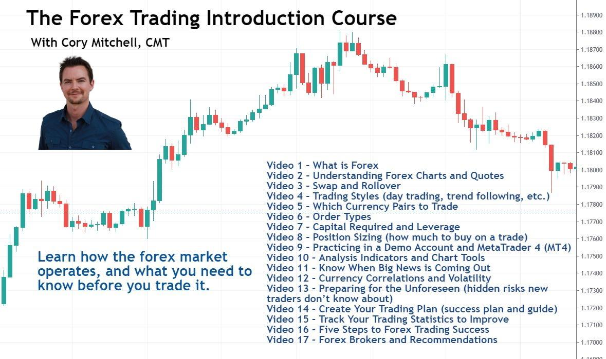

The financial markets offer a plethora of opportunities for individuals looking to invest and trade. Among the various segments of these markets, the currency market, commonly known as the forex market, stands out due to its unmatched size and liquidity. With a daily trading volume surpassing $5 trillion, the forex market operates 24 hours a day, five days a week, providing extensive trading opportunities for investors and traders worldwide.

For beginners venturing into this vast landscape, starting with foundational courses is a prudent decision. These courses provide a structured introduction to the world of forex trading, ensuring that newcomers understand the fundamental concepts essential for navigating the currency market effectively. From understanding basic trading terminology to grasping the intricacies of currency pair movements, these preliminary courses lay the groundwork necessary for a successful trading journey.



This article aims to guide beginners through the basics of currency market education, encompassing the essentials of forex trading and the emerging trend of algorithmic or algo trading. Algo trading utilizes computer programs to automatically trade currencies based on pre-established criteria, and its growing accessibility makes it a significant area of interest for modern traders. We will explore the core components of each domain, illustrating how structured courses can benefit novices by equipping them with the necessary skills and knowledge.

By the end of this guide, aspiring traders will have a clearer path forward, equipped with the confidence to start their forex trading journey. Structured courses not only impart essential academic knowledge but also provide practical insights through hands-on experience, fostering a comprehensive understanding of the forex market. This preparation is crucial for those who aim to navigate the complexities of currency trading successfully and profitably.

## Table of Contents

## Understanding the Currency Market

The currency market, commonly known as the forex market, stands as the largest financial market globally, with a staggering daily trading volume that often exceeds $5 trillion. This immense size is largely due to the market's decentralized nature, providing opportunities for trading 24 hours a day, five days a week, across various time zones. Such a framework allows traders from different parts of the world to engage in extensive trading activities without interruption.

For beginners entering this expansive market, understanding the foundational principles of currency trading is crucial. Currencies are traded in pairs, meaning the value of one currency is quoted against another. For instance, in the EUR/USD pair, the euro is the base currency, while the US dollar is the quote currency. Aspiring traders need to comprehend how global events, economic indicators, and geopolitical developments can influence currency values. Economic reports, interest rates, and political stability are among the primary factors impacting exchange rates.

Familiarity with key [forex](/wiki/forex-system) terminology forms the backbone of a solid trading foundation. A 'pip' (percentage in point) is the smallest movement in a currency pair's price quote and is typically equivalent to 0.0001 for most pairs. 'Lot size' refers to the [volume](/wiki/volume-trading-strategy) or amount of currency units being traded. A 'standard lot' is 100,000 units of the base currency, though traders can also engage in 'mini lots' of 10,000 or 'micro lots' of 1,000. 'Leverage' enables traders to control a larger market position with a relatively small amount of capital, but it also amplifies potential losses, making understanding the risks associated with leverage critical. The 'spread' is the difference between the bid (buy) and ask (sell) prices, often serving as the broker's profit on the trade.

Introductory courses designed for beginners typically provide a thorough exploration of these elements. They equip new entrants with a comprehensive grasp of market dynamics and ensure that they are adequately prepared to make informed trading decisions. By learning these fundamental concepts, novice traders can develop a robust understanding of how to navigate the forex landscape effectively.

 to Forex Trading

Forex trading involves speculating on the price movements of currency pairs, where each pair represents the exchange rate between two different currencies. Understanding forex trading begins with the ability to interpret forex quotes, which are crucial for making informed trading decisions. A typical forex quote consists of a currency pair, for example, EUR/USD, indicating how much of the quote currency (USD) is needed to purchase one unit of the base currency (EUR).

The bid price represents the maximum price a buyer is willing to pay for a currency, while the ask price is the minimum price a seller is willing to accept. The difference between these two prices is known as the spread, which constitutes a transaction cost for traders. This cost demands careful consideration, especially in highly volatile markets.

Risk management plays a vital role in safeguarding investments against potential losses. It involves strategies such as setting stop-loss orders, which automatically close a position once it reaches a certain loss threshold, thereby limiting financial exposure. Position sizing, or the amount of capital allocated to each trade, also helps manage risk by preventing significant losses from a single trade.

Basic technical analysis forms the backbone of many forex trading strategies. By utilizing charts to study past price behaviors, traders can identify patterns and trends that may predict future movements. Tools such as moving averages and trend lines assist traders in visualizing these trends and make educated predictions.

To help beginners hone these skills, forex courses often incorporate hands-on experience through simulations and demo trading platforms. These tools enable newcomers to practice trading with virtual funds, thus eliminating financial risk while providing a practical understanding of market operations. This experiential learning is invaluable, as it allows novice traders to develop competence and confidence before engaging with live markets.

## Exploring Algo Trading in Forex

Algorithmic trading, commonly known as algo trading, involves the use of computer programs to execute trades automatically in the forex market based on predefined criteria. As technological advancements progress, algo trading has become increasingly accessible and popular among forex traders, offering a number of benefits such as speed, precision, and the ability to analyze vast quantities of data.

Beginner courses in algo trading are designed to introduce students to the development of simple trading algorithms and the underlying principles that govern them. Key components of these courses include an understanding of market mechanics, the generation of trading signals, and the execution of trades. 

One crucial aspect of these courses is [backtesting](/wiki/backtesting) trading strategies. Backtesting involves using historical data to evaluate the performance of a trading strategy before it is deployed in live markets. This process helps identify the potential profitability and risks associated with a strategy. The implementation of a backtesting algorithm generally requires the following basic Python code structure:

```python
def backtest_strategy(data, strategy):
    portfolio_value = []

    for index, row in data.iterrows():
        signal = strategy(row)
        execute_trade(signal, row)
        portfolio_value.append(current_portfolio_value())

    return portfolio_value

def strategy(row):
    # Define your strategy here
    return signal

def execute_trade(signal, row):
    # Execute trade based on signal
    pass

def current_portfolio_value():
    # Calculate current portfolio value
    return value
```

In addition to backtesting, these courses emphasize optimizing algorithm performance to improve trading outcomes. Optimization involves refining the parameters of a trading algorithm to maximize its efficiency and profitability while minimizing risk. 

Managing execution risks is another critical topic. Execution risks can arise from slippage, latency, and technical errors during trading. Proper risk management strategies help mitigate these risks, ensuring the reliability and stability of trading systems.

The programming aspect of algo trading courses typically focuses on languages such as Python, which is widely used in the finance sector due to its powerful libraries and ease of use. Students are introduced to basic programming skills, including data manipulation, statistical analysis, and the use of financial libraries such as pandas, numpy, and matplotlib to interpret financial data.

Overall, beginner courses in algo trading equip aspiring traders with the foundational skills to develop and manage automated trading systems, fostering a deeper understanding of both the technical and practical aspects of forex trading. As they gain experience, traders can evolve their strategies, incorporate [machine learning](/wiki/machine-learning) techniques, or explore more sophisticated trading algorithms, potentially leading to more successful and profitable trading endeavors.

## Benefits of Structured Learning for Beginners

Structured learning offers numerous advantages for beginners entering the forex market. One primary benefit is the provision of a comprehensive curriculum that is specifically tailored to fit the learner's pace and understanding, ensuring that foundational concepts are thoroughly grasped before moving onto more complex topics. This personalized pace allows students to absorb and apply knowledge effectively, minimizing the risk of information overload.

Access to experienced mentors is another critical feature of structured courses. Mentors can provide invaluable guidance and support, answering questions and offering insights based on their own trading experiences. This mentorship can help learners navigate challenges and avoid common pitfalls, accelerating their development as competent traders.

Moreover, structured courses often foster collaborative learning environments that encourage community building. These settings allow learners to share experiences, insights, and strategies, creating a network of support and encouragement. Engaging with peers can enhance understanding and provide diverse perspectives on trading techniques and market analysis.

Course certifications serve as additional incentives, enhancing a trader's credibility and making them more attractive to potential employers or clients. These certifications signal a certain level of competence and commitment to learning, which can be particularly beneficial in competitive job markets or when seeking to manage clients' portfolios.

Overall, enrolling in structured courses can significantly reduce the learning curve, equipping beginners with essential skills and knowledge required for successful forex trading. By providing a disciplined approach to education, these courses set a solid groundwork for traders, enabling them to navigate the complexities of the forex market with increased confidence and proficiency.

## Conclusion

The currency market offers substantial opportunities for individuals eager to understand and participate in trading activities. Engaging in beginner courses focused on currency market education, forex trading, and [algorithmic trading](/wiki/algorithmic-trading) equips newcomers with a robust foundation essential for their trading careers. These educational programs provide the crucial skills, knowledge, and confidence necessary to effectively navigate the complexities associated with the forex market.

Participation in these courses allows traders to gradually gain more experience, enabling them to explore advanced topics and refine their strategies to achieve better trading outcomes. Structured learning environments support this growth by ensuring that learners progress at their own pace while receiving guidance from experienced mentors. Through simulated trading scenarios, beginners can practice and improve their skills without financial risk, further bolstering their confidence.

Moreover, structured courses often offer certification, which can enhance the credibility of traders and make them more appealing to potential employers or clients. As traders become more proficient, the insights and techniques acquired through these courses can lead to successful and profitable trading endeavors. Ultimately, the educational journey undertaken in these beginner courses can be a catalyst for achieving sustained success in the forex market.

## References & Further Reading

[1]: Bergstra, J., Bardenet, R., Bengio, Y., & Kégl, B. (2011). ["Algorithms for Hyper-Parameter Optimization."](https://dl.acm.org/doi/10.5555/2986459.2986743) Advances in Neural Information Processing Systems 24.

[2]: ["Advances in Financial Machine Learning"](https://www.amazon.com/Advances-Financial-Machine-Learning-Marcos/dp/1119482089) by Marcos Lopez de Prado

[3]: ["Evidence-Based Technical Analysis: Applying the Scientific Method and Statistical Inference to Trading Signals"](https://www.amazon.com/Evidence-Based-Technical-Analysis-Scientific-Statistical/dp/0470008741) by David Aronson

[4]: ["Machine Learning for Algorithmic Trading"](https://github.com/stefan-jansen/machine-learning-for-trading) by Stefan Jansen

[5]: ["Quantitative Trading: How to Build Your Own Algorithmic Trading Business"](https://www.amazon.com/Quantitative-Trading-Build-Algorithmic-Business/dp/1119800064) by Ernest P. Chan