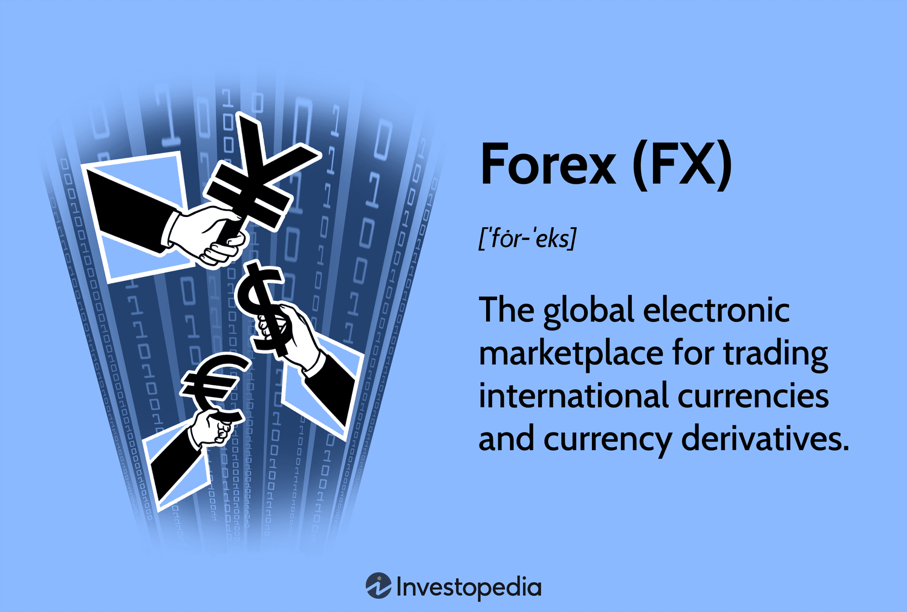

## Table of Contents

## What is Forex trading and why is it important?

Forex trading, short for foreign exchange trading, is the act of buying and selling currencies from different countries. It's like a big marketplace where people trade money from one country for money from another. For example, you might trade US dollars for Euros. This trading happens all the time, every day, because the value of currencies keeps changing. People, banks, and big companies do Forex trading to make money or to help with their business needs.

Forex trading is important for a few reasons. First, it helps the world's economy run smoothly. When people and businesses trade currencies, it makes it easier for them to buy things from other countries. This helps countries trade with each other and grow their economies. Second, Forex trading can be a way for people to make money. If someone is good at guessing how the value of currencies will change, they can buy and sell currencies to make a profit. This is why many people are interested in Forex trading.

## How does the Forex market work?

The Forex market works like a big, global marketplace where people trade currencies. It's open 24 hours a day, from Monday to Friday, because it spans across different time zones around the world. When you trade in the Forex market, you're basically exchanging one currency for another. For example, if you think the Euro will get stronger compared to the US dollar, you might buy Euros with your dollars. If the Euro does get stronger, you can then trade your Euros back to dollars and make a profit. The price at which you buy and sell currencies is called the exchange rate, and it changes all the time based on what's happening in the world.

The Forex market is huge and involves many different players, like banks, governments, companies, and regular people. Banks are the biggest players because they handle a lot of currency trades for their customers and for themselves. Governments also play a big role because they can affect currency values with their policies. Companies use the Forex market to pay for things they need from other countries, like raw materials or finished goods. And regular people, like you and me, can trade currencies too, either to make money or to prepare for a trip abroad. All these different players coming together make the Forex market very active and dynamic.

## What are the major currency pairs in Forex trading?

In Forex trading, the major currency pairs are the ones that are traded the most. These pairs involve the world's biggest economies and are very liquid, which means they are easy to buy and sell. The most important major currency pair is the EUR/USD, which is the Euro against the US dollar. This pair is watched closely because the Eurozone and the US are big players in the world economy. Another important pair is the USD/JPY, which is the US dollar against the Japanese yen. Japan is a major economy, so this pair is also very popular.

Other major currency pairs include the GBP/USD, which is the British pound against the US dollar, and the USD/CHF, which is the US dollar against the Swiss franc. The British pound and the Swiss franc are important because the UK and Switzerland have strong economies. The last major pair is the AUD/USD, which is the Australian dollar against the US dollar. Australia's economy is also significant, especially because of its natural resources. These five pairs, along with EUR/USD and USD/JPY, make up the major currency pairs in Forex trading.

## What are the basic terms every Forex trader should know?

When you start trading in the Forex market, there are some basic terms you should know. First, there's the "pip," which is the smallest change in the value of a currency pair. If the EUR/USD moves from 1.1000 to 1.1001, that's a one pip change. Pips are important because they help you figure out how much money you're making or losing. Another key term is "leverage," which lets you trade with more money than you actually have. It's like borrowing money to make bigger trades, but it can be risky because you can lose more money too.

Then there's the "spread," which is the difference between the buying price and the selling price of a currency pair. The spread is what brokers charge for their services, so it's something you need to think about when you're trading. "Margin" is the money you need to have in your account to open and keep a trade going. It's like a deposit that makes sure you can cover any losses. Finally, "lot" is the standard size of a trade in Forex. A standard lot is usually 100,000 units of the base currency, but you can also trade smaller sizes called mini lots or micro lots. Knowing these terms will help you understand what's happening in the Forex market and make better trading decisions.

## How can someone start trading Forex?

To start trading Forex, the first thing you need to do is choose a reliable Forex broker. A broker is a company that helps you buy and sell currencies. You should look for a broker that is regulated by a government agency, because that means they have to follow rules to keep your money safe. Once you pick a broker, you'll need to open an account with them. This usually involves filling out some forms and giving them some personal information. After your account is set up, you'll need to put some money into it. This is called making a deposit, and it's the money you'll use to start trading.

Once your account is funded, you can start trading. Most brokers have a trading platform, which is a special software that lets you see the prices of different currencies and make trades. You'll need to learn how to use this platform, but most brokers have tutorials to help you. Before you start trading with real money, it's a good idea to practice first. Many brokers let you use a demo account, where you can trade with pretend money to get the hang of things. When you feel ready, you can switch to trading with real money. Remember, Forex trading can be risky, so it's important to start small and learn as you go.

## What are the different types of Forex trading strategies?

Forex trading strategies are the different ways people try to make money by trading currencies. One common strategy is called day trading. Day traders buy and sell currencies within the same day, trying to make small profits from the ups and downs of the market. They use charts and other tools to guess where the prices will go next. Another strategy is called swing trading. Swing traders hold onto their trades for a few days or even weeks, hoping to catch bigger price moves. They look at trends over longer periods of time and try to find good times to buy and sell.

There are also strategies like scalping and position trading. Scalping is when traders make lots of quick trades, trying to make small profits from tiny changes in the market. It can be stressful because you have to watch the market all the time. Position trading is the opposite; these traders hold onto their trades for months or even years, betting on big changes in the market. They don't need to watch the market as closely but need to be patient. Each strategy has its own risks and rewards, so it's important to pick one that fits your goals and how much time you can spend trading.

## What are the risks involved in Forex trading and how can they be managed?

Forex trading can be risky because the market moves a lot and it's hard to predict what will happen next. One big risk is losing money. If the currency you buy goes down in value, you'll lose money when you sell it. Another risk is using leverage, which is like borrowing money to trade. It can help you make more money, but if things go wrong, you can lose more than you started with. There's also the risk of not knowing enough about the market. If you don't understand how things work, you might make bad trades and lose money.

To manage these risks, it's important to start small. Don't put all your money into trading at once. Instead, start with a little bit and learn as you go. It's also a good idea to use a demo account to practice before you trade with real money. This way, you can try out different strategies without losing anything. Another way to manage risk is to use something called a stop-loss order. This is a tool that automatically closes your trade if the price goes down too much, so you don't lose too much money. Finally, keep learning about the market and stay updated on what's happening in the world, because these things can affect currency prices.

## How does leverage work in Forex trading?

Leverage in Forex trading is like borrowing money from your broker to make bigger trades. Imagine you have $1,000 in your account. With leverage, you can trade with much more than that, like $100,000 or even more. This is possible because the broker lets you use a small amount of your own money, called margin, to control a much larger position. For example, if you use 100:1 leverage, you can control $100,000 with just $1,000 of your own money. This can help you make bigger profits if the market moves in your favor.

But leverage can also be risky. If the market moves against you, your losses can be much bigger than what you started with. Using the same example, if you're using 100:1 leverage and the market goes the wrong way, you could lose your entire $1,000 very quickly. That's why it's important to use leverage carefully and understand how much you can afford to lose. Many traders use stop-loss orders to limit their losses, which can help manage the risks that come with using leverage.

## What are the key economic indicators that affect Forex markets?

Economic indicators are like reports that tell us how well a country's economy is doing. These reports can affect the Forex market because they help people guess what might happen to a country's currency. Some important economic indicators include things like the Gross Domestic Product (GDP), which tells us how much a country's economy grew. If a country's GDP goes up, its currency might get stronger because people think the economy is doing well. Another big indicator is the unemployment rate. If a lot of people have jobs, it's good for the economy, and the currency might go up in value. But if many people are out of work, it can make the currency weaker.

Interest rates set by a country's central bank are also very important. If a central bank raises interest rates, it can make the country's currency stronger because it's more attractive for people to invest there. On the other hand, if interest rates go down, the currency might get weaker. Inflation is another key indicator. If prices in a country are going up a lot, it can make the currency less valuable. Traders watch these indicators closely because they can help them decide when to buy or sell a currency. By understanding these reports, traders can make better guesses about where the Forex market might be headed.

## How can technical analysis be used in Forex trading?

Technical analysis is a way of looking at charts and numbers to guess where the Forex market might go next. Traders use it to find patterns in how currency prices have moved in the past. They look at things like lines on a chart that show where the price has been, and they try to see if the price is going up or down in a certain way. They also use tools called indicators, like moving averages, to help them see trends more clearly. By studying these patterns and indicators, traders can make guesses about when to buy or sell a currency.

One common way to use technical analysis is to look for support and resistance levels. Support is a price where the currency often stops going down and starts going back up. Resistance is a price where the currency often stops going up and starts going back down. If a trader sees that a currency is getting close to a support level, they might decide to buy it, hoping it will go back up. If it's close to a resistance level, they might sell it, hoping it will go back down. By using these levels and other technical tools, traders can make better decisions about their trades and try to make more money in the Forex market.

## What is the role of fundamental analysis in Forex trading?

Fundamental analysis in Forex trading is about looking at the big picture of a country's economy to guess what might happen to its currency. Traders use this method to understand things like how fast the economy is growing, how many people have jobs, and what the government is doing with interest rates. By studying these things, traders can figure out if a country's currency might get stronger or weaker. For example, if a country's economy is doing well and more people are working, its currency might go up in value because people will want to invest there.

This kind of analysis helps traders make long-term guesses about the Forex market. They look at reports and news to see what's happening in the world and how it might affect currencies. For instance, if a country's central bank raises interest rates, it can make the currency more attractive to investors, so its value might go up. By keeping an eye on these big economic factors, traders can decide when to buy or sell a currency based on what they think will happen in the future.

## How do expert traders use advanced Forex trading techniques?

Expert traders use advanced Forex trading techniques to make smarter trades and manage their risks better. One technique they use is called "carry trading." This is when they borrow money in a currency with low interest rates and use it to buy a currency with higher interest rates. They make money from the difference in interest rates, but it's risky because the value of the currencies can change. Another advanced technique is "hedging," which is like buying insurance for their trades. If they think a trade might go bad, they can make another trade to protect themselves from losing too much money. Hedging helps them keep their losses small while still trying to make profits.

Another way expert traders use advanced techniques is by using "algorithmic trading." This means they use computer programs to make trades automatically based on certain rules. These programs can analyze a lot of data very quickly and make trades faster than a person could. This can help them take advantage of small changes in the market and make more money. Expert traders also use "sentiment analysis" to understand what other people in the market are thinking. They look at news, social media, and other sources to see if people are feeling positive or negative about a currency. By understanding the mood of the market, they can make better guesses about where the market might go next.

## What are the basics of Forex trading?

Forex trading is the practice of buying and selling currencies to generate profit through capitalizing on price movements. At its core, it involves the exchange of one currency for another, represented in currency pairs. Common pairs include EUR/USD, USD/JPY, and GBP/USD, providing various opportunities influenced by their inherent [volatility](/wiki/volatility-trading-strategies) and [liquidity](/wiki/liquidity-risk-premium).

The process of forex trading is primarily conducted through leverage, enabling traders to control large positions with relatively small amounts of capital. Leveraging allows for potentially greater profits, but it also poses increased risk, as losses can exceed the original investment. Thus, understanding and managing leverage is crucial for successful forex trading.

Traders employ two main analytical approaches to predict currency price movements: technical analysis and [fundamental analysis](/wiki/fundamental-analysis). Technical analysis focuses on the study of price charts and patterns, utilizing tools such as moving averages, trend lines, and various oscillators like the Relative Strength Index (RSI) or Moving Average Convergence Divergence (MACD). These indicators help traders identify potential buy or sell signals based on historical price data and market trends.

For instance, a simple moving average (SMA) is calculated using the equation:

$$
SMA = \frac{1}{N} \sum_{i=1}^{N} P_i
$$

where $P_i$ represents the price at period $i$, and $N$ is the number of periods considered.

Conversely, fundamental analysis involves evaluating economic indicators, geopolitical events, and financial news that impact currency valuations. Factors such as employment reports, inflation rates, and central bank policies hold significant sway over currency prices. For example, an increase in the interest rate by a country’s central bank often leads to an appreciation of its currency, as higher rates attract foreign capital seeking higher returns. 

Effective forex trading requires a balanced approach that incorporates both technical and fundamental analyses, enabling traders to make informed decisions based on a comprehensive understanding of market dynamics. This dual approach helps traders anticipate potential market movements, identify trading opportunities, and manage the risks associated with currency trading.

## References & Further Reading

[1]: Bank for International Settlements (2019). ["Triennial Central Bank Survey of Foreign Exchange and Over-the-counter (OTC) Derivatives Markets in 2019."](https://www.bis.org/statistics/rpfx19.htm)

[2]: Lopez de Prado, M. (2018). ["Advances in Financial Machine Learning."](https://www.amazon.com/Advances-Financial-Machine-Learning-Marcos/dp/1119482089) Wiley.

[3]: Aronson, D. R. (2007). ["Evidence-Based Technical Analysis: Applying the Scientific Method and Statistical Inference to Trading Signals."](https://www.amazon.com/Evidence-Based-Technical-Analysis-Scientific-Statistical/dp/0470008741) Wiley.

[4]: Jansen, S. (2020). ["Machine Learning for Algorithmic Trading: Predictive Models to Extract Signals from Market and Alternative Data for Systematic Trading Strategies with Python."](https://github.com/stefan-jansen/machine-learning-for-trading) Packt Publishing.

[5]: Chan, E. P. (2009). ["Quantitative Trading: How to Build Your Own Algorithmic Trading Business."](https://github.com/ftvision/quant_trading_echan_book) Wiley.