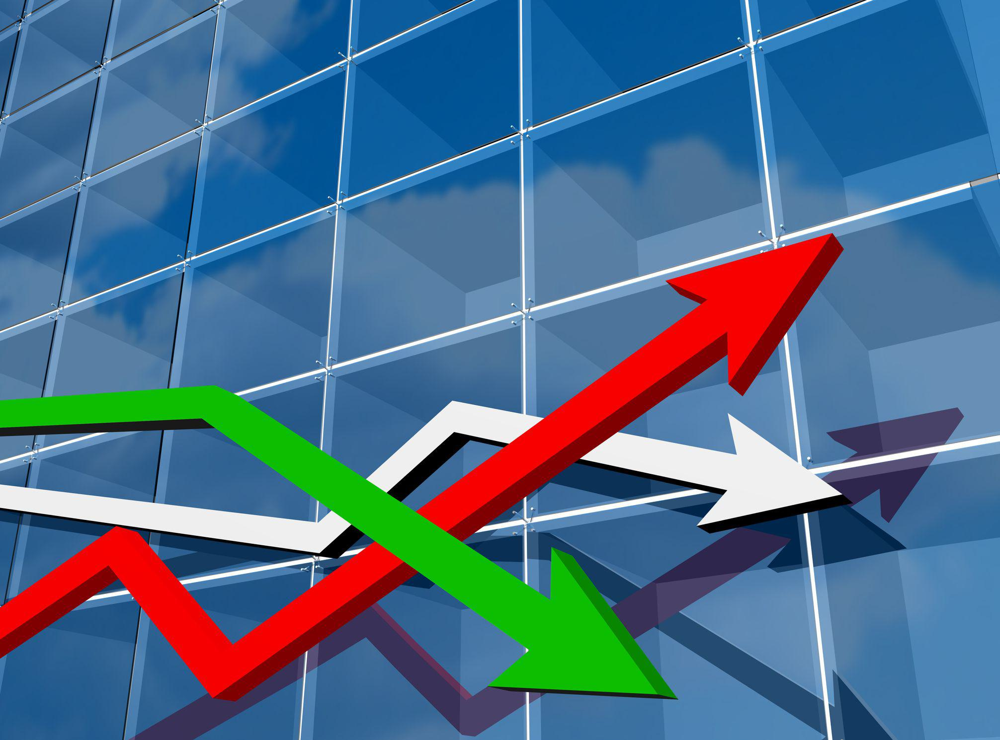

## Table of Contents

## What is hedging in finance?

Hedging in finance is like buying insurance for your investments. It's a way to protect against losses by making another investment that will gain value if your main investment loses value. For example, if you own a stock that you think might go down in price, you can hedge by buying an option that will increase in value if the stock price drops. This way, any losses on the stock might be offset by gains on the option.

Hedging can be useful but it's not perfect. It often comes with costs, like the price of the option you buy to hedge. These costs can eat into your profits. Also, hedging doesn't always work out as planned. Sometimes, the hedge might not fully protect you from losses, or it might even lose money itself. Despite these drawbacks, many investors use hedging as a way to manage risk and feel more secure about their investments.

## Why is hedging important for investors and companies?

Hedging is important for investors and companies because it helps them manage risk. Imagine you're playing a game and you want to make sure you don't lose too much. Hedging is like having a backup plan. For investors, if they own a stock that might go down in value, they can use hedging to protect their money. For companies, if they depend on certain materials that might become more expensive, they can hedge to keep their costs steady. This way, both investors and companies can feel safer about their financial future.

Even though hedging can be helpful, it's not a perfect solution. It costs money to set up a hedge, kind of like paying for insurance. Sometimes, the hedge might not work as expected, and you could still lose money. But many people think it's worth it because it gives them peace of mind. By using hedging, investors and companies can focus on growing their business or investments without worrying too much about sudden losses.

## What are the basic types of hedging instruments?

Hedging instruments are tools that people use to protect their investments or businesses from losing too much money. The most common types are options, futures, and swaps. Options give you the right, but not the obligation, to buy or sell something at a set price in the future. If you think the price of something might go down, you can buy an option to sell it at today's price, which could save you money if the price does drop. Futures are agreements to buy or sell something at a set price on a specific date. They're often used by companies to lock in prices for things they need, like oil or wheat. Swaps are agreements to exchange cash flows or other financial instruments. They're often used to manage [interest rate](/wiki/interest-rate-trading-strategies) risk or currency risk.

Each of these hedging instruments has its own way of working and its own costs. Options can be expensive to buy, but they give you flexibility because you don't have to use them if you don't want to. Futures are usually cheaper, but they come with the obligation to follow through on the deal, which can be risky if the market moves against you. Swaps can be complex, but they're useful for managing ongoing risks, like changes in interest rates or currency values. By choosing the right hedging instrument, investors and companies can protect themselves from financial surprises and focus on their main goals.

## How does hedging help in managing financial risk?

Hedging helps in managing financial risk by acting like a safety net for your money. Imagine you have a stock that you think might lose value. You can use hedging to protect yourself from that loss. For example, you could buy an option that will gain value if the stock price goes down. This way, if the stock does drop, the money you lose on the stock might be made up by the money you gain from the option. It's like having insurance for your investments, helping you feel more secure about your financial future.

Even though hedging can be really helpful, it's not a perfect solution. It costs money to set up a hedge, kind of like paying for insurance. Sometimes, the hedge might not work as expected, and you could still lose money. But many people think it's worth it because it gives them peace of mind. By using hedging, investors and companies can focus on growing their business or investments without worrying too much about sudden losses. It's a way to manage risk and keep your financial plans on track, even when the market is unpredictable.

## Can you explain the concept of a hedge ratio?

A hedge ratio is like a recipe that tells you how much of one thing you need to balance out another thing. In finance, it's the amount of a hedging instrument, like an option or a future, that you need to use to protect your investment from losing too much money. For example, if you own 100 shares of a stock and want to hedge against a price drop, the hedge ratio will tell you how many options or futures you should buy to offset the potential loss on those shares.

Calculating the right hedge ratio can be tricky because it depends on how closely the price of your investment moves with the price of the hedging instrument. If they move exactly the same way, the hedge ratio might be 1:1, meaning you need one hedging instrument for every share of stock. But if they move differently, you might need more or fewer hedging instruments. Getting the hedge ratio right is important because it helps you balance the cost of the hedge with the amount of protection it gives you, making sure you're not spending too much money on protection that you don't need.

## What are some common hedging strategies used by beginners?

Beginners often start with simple hedging strategies that are easy to understand and set up. One common strategy is buying put options. If you own a stock and you're worried it might go down in value, you can buy a put option. This gives you the right to sell the stock at a certain price, even if the market price drops lower. It's like buying insurance for your stock. If the stock price does fall, the put option will gain value, helping to offset the loss on your stock.

Another strategy beginners might use is investing in inverse ETFs. These are exchange-traded funds that move in the opposite direction of a specific market or index. If you think the market might go down, you can buy an inverse [ETF](/wiki/etf-trading-strategies) that will go up when the market falls. This can help protect your other investments from losing too much value. Both of these strategies are straightforward and can be a good starting point for someone new to hedging.

## How do futures and options play a role in hedging?

Futures and options are important tools for hedging because they help people protect their money from unexpected changes in prices. Futures are like a promise to buy or sell something at a set price on a specific date in the future. For example, if a farmer wants to make sure they get a good price for their wheat, they can sell a futures contract. This locks in today's price, so even if the price of wheat goes down later, the farmer is protected. Companies also use futures to lock in prices for things they need, like oil or raw materials, so they know their costs will stay the same even if the market changes.

Options give you more flexibility than futures because they give you the right, but not the obligation, to buy or sell something at a set price in the future. If you own a stock and you're worried it might go down in value, you can buy a put option. This option lets you sell the stock at today's price, even if it drops lower later. It's like buying insurance for your stock. If the stock price does fall, the put option will gain value, helping to offset the loss on your stock. Both futures and options are powerful tools that help investors and companies manage risk and feel more secure about their financial future.

## What is the difference between a perfect hedge and a cross hedge?

A perfect hedge is like a dream come true in the world of finance. It's when you find a way to completely protect your investment from losing money. Imagine you own a stock and you're worried it might go down. If you can find an option or another investment that moves exactly the opposite way, you can use it to cancel out any losses on your stock. It's like having a perfect shield that keeps all the bad stuff away. But perfect hedges are rare because it's hard to find something that moves exactly the opposite way of your investment all the time.

A cross hedge is different because it's not perfect, but it can still be helpful. It's when you use something that's related to your investment, but not exactly the same, to protect yourself. For example, if you're worried about the price of oil going up, but you can't find a perfect hedge, you might use an option on a different energy product, like natural gas. It won't protect you completely, but it can still help reduce your risk. Cross hedges are more common because it's easier to find something that's related to your investment, even if it's not a perfect match.

## How can currency hedging protect against foreign exchange risk?

Currency hedging is like a safety net for businesses and investors who deal with money from different countries. Imagine you're a company that sells things in Europe but gets paid in dollars. If the euro gets weaker compared to the dollar, you could lose money when you convert your earnings back to dollars. By using currency hedging, you can lock in today's exchange rate, so you know exactly how many dollars you'll get for your euros, no matter what happens to the exchange rate later. It's like buying insurance that protects you from sudden changes in currency values.

There are different ways to do currency hedging, but one common method is using forward contracts. A forward contract is an agreement to exchange one currency for another at a set rate on a future date. If you think the euro might get weaker, you can use a forward contract to sell your euros at today's rate, even if you'll get the dollars later. This way, you protect yourself from losing money if the exchange rate changes. Currency hedging helps businesses and investors feel more secure about their money, even when the world of foreign exchange can be unpredictable.

## What are the costs associated with hedging and how do they impact profitability?

Hedging can help protect your money, but it's not free. There are costs involved, like paying for options or futures contracts. These costs can eat into your profits. For example, if you buy a put option to protect your stock, you have to pay for that option. If the stock price doesn't drop, you lose the money you spent on the option. Even if the stock price does drop and the option helps you, the money you spent on the option means you won't make as much profit as you would have without hedging.

The costs of hedging can impact your profitability in different ways. Sometimes, the costs might be small compared to the protection they offer, and it's worth it. Other times, the costs might be high, and they could eat up a big part of your profits. It's important to think about whether the protection you get from hedging is worth the money you have to spend on it. If you hedge too much, you might end up spending more on protection than you need to, which can hurt your overall profitability.

## Can you discuss advanced hedging techniques like delta hedging?

Delta hedging is a fancy way to protect your money that's often used by people who trade options. It's like playing a balancing game. Imagine you own an option that goes up or down based on the price of a stock. The "delta" tells you how much the option's price will change for every dollar the stock's price moves. If you want to protect yourself from losing money on the option, you can buy or sell the stock in just the right amount to balance out the option's movements. It's like using a seesaw: if one side goes up, you adjust the other side to keep it level.

The tricky part about delta hedging is that the delta keeps changing as the stock price moves. So, you have to keep adjusting your hedge to stay balanced. It's a bit like trying to keep a boat steady in choppy water. You might need to buy or sell more of the stock to keep the hedge working. While delta hedging can be really effective at protecting your money, it can also be expensive because you're always buying and selling. But for people who know what they're doing, it's a powerful way to manage risk and keep their investments safe.

## How do regulatory requirements influence hedging strategies in financial institutions?

Regulatory requirements can really change how financial institutions use hedging strategies. Imagine you're playing a game, but there are rules you have to follow. These rules, or regulations, are made by governments to make sure banks and other financial places are safe and fair. For example, banks might have to keep a certain amount of money on hand, called capital requirements. To meet these rules, banks might use hedging to protect their money and make sure they have enough capital. If the rules change, banks might need to change their hedging strategies to stay in line with the new rules.

Sometimes, regulations can make hedging more complicated. For instance, there might be rules about what kinds of hedging instruments banks can use or how much risk they can take. These rules can make it harder for banks to find the best way to protect their money. But even with these challenges, regulations are important because they help keep the financial system stable. Banks have to find a balance between following the rules and using hedging to manage their risks effectively.

## What are the strategies in algorithmic trading?

Algorithmic trading strategies have significantly transformed financial markets by leveraging speed, precision, and automation in trade execution. Among the most popular strategies are trend-following, [arbitrage](/wiki/arbitrage) opportunities, and index fund rebalancing. These strategies rely on complex mathematical models and rules-based systems to optimize trades for profitability while effectively managing risks.

Trend-following is a strategy that capitalizes on [momentum](/wiki/momentum) by executing trades according to the direction of prevailing market trends. This approach involves identifying potential trends through technical indicators such as moving averages, breakouts, or price channels. For instance, a simple moving average crossover strategy might generate buy or sell signals when a short-term moving average crosses above or below a long-term moving average, respectively.

Arbitrage opportunities exploit price discrepancies across different markets or instruments. An algorithmic trader may, for example, purchase an asset in one market where the price is lower and simultaneously sell it in another market where the price is higher, thus securing a risk-free profit. This requires swift, accurate execution facilitated by algorithms designed to detect and act upon these fleeting opportunities within milliseconds.

Index fund rebalancing involves adjusting the composition of an index fund to align with a benchmark index. This can involve buying or selling stocks to maintain an intended asset allocation. Algorithmic trading can optimize this process through the use of rebalancing strategies that minimize tracking error and execution costs, often employing strategies like the Volume Weighted Average Price (VWAP) and Time Weighted Average Price (TWAP).

VWAP and TWAP are execution algorithms used to execute trades intelligently over a given time frame. VWAP calculates an average price weighted by [volume](/wiki/volume-trading-strategy), aimed at ensuring that a trade is executed at prices close to or better than the average market price during the specified time period. The VWAP formula is mathematically represented as:

$$

\text{VWAP} = \frac{\sum(\text{Price}_i \times \text{Volume}_i)}{\sum \text{Volume}_i} 
$$

Similarly, TWAP calculates the average price over a specific time period without regard for volume, ideal for reducing market impact:

$$

\text{TWAP} = \frac{\sum \text{Price}_i}{n} 
$$

where $n$ is the number of discrete periods over which the average is calculated.

These algorithmic strategies enable precise, emotionless trading that strictly follows predefined rules. This precision is achieved through rigorous [backtesting](/wiki/backtesting), allowing traders to refine their models based on historical data and optimize performance in real market conditions. Backtesting involves simulating a trading strategy using historical data to assess its potential effectiveness and identify areas for improvement.

Overall, [algorithmic trading](/wiki/algorithmic-trading) strategies enhance the capabilities of traders to exploit market inefficiencies, maximize returns, and manage risks systematically. As the technology underlying these algorithms continues to advance, the potential for even more innovative and effective trading strategies grows.

## References & Further Reading

[1]: Black, F., & Scholes, M. (1973). ["The Pricing of Options and Corporate Liabilities."](https://www.cs.princeton.edu/courses/archive/fall09/cos323/papers/black_scholes73.pdf) Journal of Political Economy, 81(3), 637-654.

[2]: Hull, J. C. (2018). ["Options, Futures, and Other Derivatives"](https://www.semanticscholar.org/paper/Options%2C-Futures%2C-and-Other-Derivatives-Hull/89bdee500c8623864fc9eb7a471546aa713acc44). Pearson Education.

[3]: Hasbrouck, J. (2007). ["Empirical Market Microstructure: The Institutions, Economics, and Econometrics of Securities Trading."](https://academic.oup.com/book/52241) Oxford University Press.

[4]: Aldridge, I. (2013). ["High-Frequency Trading: A Practical Guide to Algorithmic Strategies and Trading Systems,"](https://www.amazon.com/High-Frequency-Trading-Practical-Algorithmic-Strategies/dp/1118343506) 2nd Edition. Wiley.

[5]: Cartea, Á., Jaimungal, S., & Penalva, J. (2015). ["Algorithmic and High-Frequency Trading."](https://assets.cambridge.org/97811070/91146/frontmatter/9781107091146_frontmatter.pdf) Cambridge University Press.

[6]: Narang, R. K. (2013). ["Inside the Black Box: A Simple Guide to Quantitative and High-Frequency Trading."](https://onlinelibrary.wiley.com/doi/book/10.1002/9781118662717) Wiley.