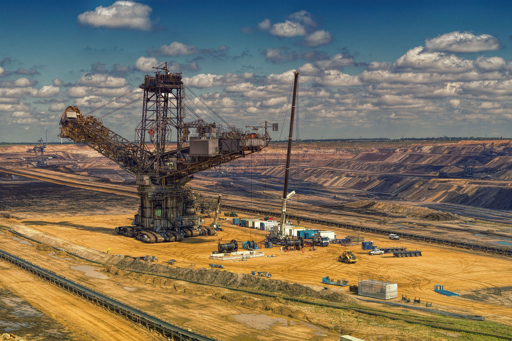

The world of investment presents a myriad of opportunities and complexities, attracting diverse participants ranging from individual investors to large financial institutions. Central to this diverse landscape are mining stocks and algorithmic trading, two distinct yet significant areas within market investment. Mining stocks offer investors entry points into the mining sector, an industry crucial for the extraction of mineral resources necessary for global economic activities. This sector encompasses a wide range of companies, from major multinational enterprises to junior exploration companies, each presenting unique investment characteristics and risk profiles.

Parallel to traditional investment avenues like mining stocks is the evolving field of algorithmic trading. This contemporary approach to trading harnesses technology and advanced computational algorithms to execute trades at unparalleled speed and precision. Algorithmic trading allows for the execution of complex trading strategies predicated on quantitative analysis, offering investors innovative tools and techniques designed to optimize market engagement and potentially enhance returns.



This article seeks to navigate these intricacies, providing insights into mining stocks and the ascending trajectory of algorithmic trading. While both represent distinct pathways within the broader spectrum of investment, they also reflect the evolving nature of market dynamics and the continuous interplay between traditional industries and cutting-edge technology solutions. By examining these areas, we aim to equip investors with the knowledge needed to make informed decisions in a multifaceted investment environment.

## Table of Contents

## Investing in the Stock Market

The stock market is a complex financial institution designed for the buying and selling of stocks, which represent ownership claims on businesses. It serves as a platform for companies to raise capital from investors in exchange for equity and offers investors the opportunity to partake in the financial growth of those companies. Key components of the stock market include stock exchanges such as the New York Stock Exchange (NYSE) and NASDAQ, which facilitate the trading of stocks within a regulated and structured environment. Prices of stocks are determined by supply and demand dynamics, reflecting the market's collective assessment of a company's future profitability.

### How to Get Started with Stock Investments

Beginning an investment journey in the stock market requires several essential steps for those unfamiliar with the process. Initially, it involves setting clear financial goals and conducting comprehensive research to develop a sound investment strategy. A primary consideration is the determination of risk tolerance, which helps in selecting securities that align with individual financial aspirations and comfort levels with potential financial loss.

Opening a brokerage account is generally the next step. Investors can choose between full-service brokers that offer personalized advice and discount brokers that provide lower fees for self-directed investing. Many modern investors also opt for online brokerage platforms that offer trading tools and resources to help analyze and execute trades with greater ease.

After establishing a brokerage account, it becomes crucial to monitor and evaluate the market, allowing investors to make informed decisions based on market trends and economic indicators. Consistent education through financial news, analyst reports, and investment seminars is advised to maintain a competitive edge in stock selection.

### Key Factors to Consider When Selecting Stocks

When selecting stocks, investors must weigh various factors to optimize their portfolios. One fundamental aspect is the analysis of a company's financial health, which involves examining financial statements such as balance sheets and income statements. Metrics like price-to-earnings (P/E) ratio, earnings growth, and dividend yield provide insights into a stock's valuation and potential profitability.

Industry trends and macroeconomic conditions are also critical elements that should influence stock selection. Companies operating in burgeoning sectors or those benefiting from favorable economic policies often present lucrative investment opportunities.

Additionally, evaluating management efficiency is crucial as it influences a company's ability to generate returns. Investors should look for management teams with a proven track record of strategic decision-making and operational excellence.

Long-term investors may prioritize companies with sustainable business models and robust competitive advantages, such as strong brand loyalty or proprietary technology, which can sustain growth over extended periods. Conversely, short-term investors might focus on market sentiment and technical analysis to determine entry and [exit](/wiki/exit-strategy) points for trades.

In summary, successful stock market investing integrates careful planning, knowledge of financial principles, and continuous evaluation of economic and corporate developments. By understanding these nuances, investors can better navigate the complexities of the market and position themselves for financial success.

## Understanding Mining Stocks

Mining stocks represent shares in companies engaged in the extraction and processing of minerals, metals, and resources like gold, silver, copper, coal, and other essential commodities. The mining sector is pivotal for economies worldwide, as it supplies raw materials for numerous industries, including construction, technology, and manufacturing.

### Overview of the Mining Sector

The mining sector is divided into two primary types of companies: major mining companies and junior mining companies. Major mining companies are well-established firms with extensive operations, significant production capacity, and substantial financial resources. They often operate on a global scale and have diversified portfolios that include various minerals and geographical locations. Examples of major mining companies include BHP Billiton, Rio Tinto, and Glencore.

Junior mining companies, however, typically focus on exploration and initial stages of mining projects. These companies are smaller and often concentrate on discovering new mineral deposits. They [carry](/wiki/carry-trading) higher risks due to their reliance on successful exploration and project development but can offer substantial returns if a new deposit is found or developed into a profitable mine.

### Differentiating Between Major and Junior Mining Companies

The primary difference between major and junior mining companies lies in their operations and financial stability. Major companies have completed successful mine development and continue to generate revenue from their ongoing operations. They provide stability and often pay dividends to their shareholders. Conversely, juniors are in the exploration phase without guaranteed production outcomes, meaning they rely heavily on raising capital from investors, typically through issuing shares.

Investors often weigh the risk and reward when choosing between major and junior mining stocks. Major mining stocks are generally more stable investment options and suitable for conservative investors seeking steady growth and dividends. Junior stocks can be attractive to risk-tolerant investors willing to face higher [volatility](/wiki/volatility-trading-strategies) for the chance of exponential gains.

### Risks and Rewards Linked to Investing in Mining Stocks

Investing in mining stocks comes with inherent risks and rewards, reflecting the volatile nature of commodity prices, geopolitical factors, and environmental concerns. A significant risk involves fluctuating commodity prices, which can dramatically affect the profitability and stock value of mining companies. Political risks, including changes in mining regulations and government stability in countries where mines operate, can affect stock performance.

Environmental and social governance ([ESG](/wiki/esg-investing)) issues are increasingly prominent, as mining operations can have substantial environmental impacts, leading to public scrutiny, regulatory challenges, and potential market penalties.

Despite these risks, the rewards can be significant. The potential for substantial capital appreciation exists, especially in juniors discovering new deposits or majors efficiently ramping up production in high-demand areas. Additionally, diversification in mining stocks can support hedging against inflation since commodity prices often rise when inflation increases.

Investors in mining stocks need to conduct thorough research, consider current market conditions, and assess individual company fundamentals. Understanding the nuances between major and junior companies, along with the dynamic nature of the sector, is crucial for making informed investment decisions.

## Investing in Mining Companies: Majors vs Juniors

### Investing in Mining Companies: Majors vs Juniors

Major mining companies are large, well-established firms with extensive operations spanning multiple countries. These companies often mine a diverse range of minerals, providing them with a stable revenue stream and reducing their reliance on any single commodity. Their size and market capitalization allow them to access capital markets more easily and secure better financing terms. Majors typically have lower risk profiles, as their projects have already reached the production stage, ensuring cash flow. Notable examples include companies like BHP Group and Rio Tinto, which are involved in mining operations that cover a broad spectrum of metals and minerals.

Junior mining companies, on the other hand, are smaller, often newly established firms focusing primarily on exploration rather than production. These companies are typically involved in locating and proving new mineral deposits. Juniors carry higher risk because they often lack significant revenue streams and depend on raising capital to fund their exploration activities. However, this risk is countered by the potential for high returns. If juniors discover viable mineral deposits, their stock prices can increase substantially, rewarding early investors with significant gains.

Balancing a portfolio with both major and junior mining stocks can be beneficial for investors seeking to optimize their risk-reward ratio. A potential approach to achieving this balance is to apply modern portfolio theory (MPT) principles, which aim to maximize expected return for a given level of risk by carefully selecting the proportions of various assets. Investors might allocate a portion of their capital to major mining companies to provide stability and regular dividends, while dedicating a smaller percentage to juniors in anticipation of high returns.

To model and balance a portfolio containing both majors and juniors, an investor could employ financial software or scripting languages like Python. By using the `numpy` and `pandas` libraries along with optimization techniques from `scipy`, investors can simulate different allocation scenarios to determine an optimal mix.

```python
import numpy as np
import pandas as pd
from scipy.optimize import minimize

# Simulate expected returns and covariance matrix for majors and juniors
expected_returns = np.array([0.07, 0.15])  # 7% for majors, 15% for juniors
cov_matrix = np.array([[0.0025, 0.0012], [0.0012, 0.04]])

# Portfolio optimization function
def portfolio_variance(weights, cov_matrix):
    return weights.T @ cov_matrix @ weights

# Constraints: sum(weights) = 1 (i.e., 100% allocation)
constraints = ({'type': 'eq', 'fun': lambda weights: np.sum(weights) - 1})

# Initial guess for weights
initial_weights = np.array([0.5, 0.5])

# Minimize portfolio variance
result = minimize(portfolio_variance, initial_weights, args=(cov_matrix,), constraints=constraints, bounds=((0,1), (0,1)))

optimal_weights = result.x
print(f"Optimal Allocation: Majors: {optimal_weights[0]*100:.2f}%, Juniors: {optimal_weights[1]*100:.2f}%")
```

This simple Python script demonstrates a foundational method for optimizing a two-asset portfolio. By customizing the expected returns and covariance values based on real market data, investors can gain insights into the best allocation strategy for their specific risk tolerance and investment goals. 

In conclusion, investing in major and junior mining stocks offers a strategic avenue for investors seeking diversification and growth potential. By understanding the characteristics and risks associated with each category, investors can make informed decisions that align with their financial objectives.

## Algorithmic Trading Explained

Algorithmic trading, often referred to as algo trading, is the use of computer programs and algorithms to execute trades in financial markets automatically. This method leverages complex mathematical models and high-speed computations to make trading decisions, ideally faster and at a greater scale than a human trader could achieve. The primary aim is to optimize trading decisions by determining the timing, pricing, and quantity of trades.

At its core, [algorithmic trading](/wiki/algorithmic-trading) relies on pre-defined instructions or rules, such as timing, price, [volume](/wiki/volume-trading-strategy), and liquidation. For instance, a simple algorithm could be set to buy a stock when its 50-day moving average surpasses its 200-day moving average, reflecting a potential upward trend. Here's a simplified example of how such an algorithm could be implemented in Python using the pandas library:

```python
import pandas as pd

# Assuming df is a DataFrame with 'close' prices of a stock
df['50_MA'] = df['close'].rolling(window=50).mean()
df['200_MA'] = df['close'].rolling(window=200).mean()

# Buy signal when 50_MA crosses above 200_MA
df['Signal'] = 0  # Default to no position
df['Signal'][50:] = np.where(df['50_MA'][50:] > df['200_MA'][50:], 1, 0)

# Generate trade orders
df['Position'] = df['Signal'].diff()
```

### The Technology and Strategies behind Algorithmic Trading

Algorithmic trading utilizes various technologies, including [artificial intelligence](/wiki/ai-artificial-intelligence), [machine learning](/wiki/machine-learning), and high-frequency trading ([HFT](/wiki/high-frequency-trading-strategies)) systems. These technologies facilitate rapid decision-making and execution. Machine learning, in particular, supports the development of adaptive algorithms that improve over time by learning from historical data and identifying patterns that may not be immediately obvious to human traders.

Common strategies in algorithmic trading encompass several approaches:

1. **Trend Following**: Algorithms identify and capitalize on trends in the market, such as moving average, channel breakouts, and related technical indicators.

2. **Arbitrage**: Algorithms discover price differences between markets or related instruments that can be exploited for risk-free profit, such as the classic "buy low, sell high" strategy executed simultaneously across different exchanges.

3. **Mean Reversion**: Based on the assumption that prices will revert to their historical average, these algorithms buy or sell when the price deviates significantly from its median value.

4. **Statistical Arbitrage**: Involves complex models that balance the statistical probabilities of different scenarios, allowing for pairs trading or basket trading.

### How Algorithmic Trading Can Benefit Investors

For investors, algorithmic trading offers significant advantages, notably in terms of speed, accuracy, and efficiency. Algorithms can execute orders in fractions of a second, accommodating high-frequency trading strategies that take advantage of small price movements. This speed can capture opportunities that are only available for brief moments in time.

Accuracy is another benefit; algorithms reduce human error associated with manual trading. Once a strategy is encoded into a computer program, it consistently follows the rules, thereby maintaining discipline and avoiding emotional decision-making biases that often plague human traders.

The efficiency of algorithmic trading is also noteworthy. It can analyze vast sets of historical and real-time data to make informed decisions swiftly. This capability is enhanced by [backtesting](/wiki/backtesting) strategies against historical data, allowing traders to evaluate and refine their strategies before applying them in live markets. As a result, algo trading can process large volumes of trades with lower transaction costs due to optimized order execution and reduced market impact.

In summary, algorithmic trading empowers investors to leverage technology for systematic and emotionless trading, potentially improving returns and managing risks more effectively than traditional trading methods.

## Advantages and Disadvantages of Algorithmic Trading

Algorithmic trading, often referred to as algo trading, employs computer programs to execute trades based on pre-set instructions. This approach has transformed modern markets, offering both advantages and disadvantages.

**Pros: Speed, Accuracy, and Efficiency of Trades**

Algorithmic trading significantly enhances the speed of executing orders. Computers can assess multiple indicators, respond to market conditions, and place orders within milliseconds. This rapid execution minimizes the likelihood of significant market shifts before order fulfillment, offering a competitive edge. The accuracy provided by algorithmic trading reduces the risk of human error. Algorithms precisely execute trades according to predefined criteria, ensuring consistent adherence to the established strategy. Moreover, efficiency is a hallmark of algorithmic trading, as it enables simultaneous handling of large volumes of trades without the exhaustion or errors associated with human traders.

**Cons: Risks Related to System Failures and Market Volatility**

Despite its advantages, algorithmic trading is not without challenges. System failures can pose significant risks; technical glitches can prevent trade execution or lead to erroneous orders, potentially causing financial losses. Algorithms also may not adapt swiftly to unforeseen market changes, where excessive volatility can lead to inappropriate responses, amplifying losses. Additionally, market dynamics influenced by concurrent algorithmic activities might lead to 'flash crashes', where sudden, severe market declines occur within very short periods.

**Considerations for Individual Traders and Institutional Investors**

For individual traders, algorithmic trading provides access to sophisticated strategies that were once the domain of large institutions. However, it requires a robust understanding of both market dynamics and programming capabilities. Individuals must ensure their strategies are well-tested across historical data to mitigate the risk of unforeseen market circumstances.

Institutional investors, on the other hand, often employ advanced algorithmic systems integrated with high-frequency trading (HFT) strategies. They possess the resources to continually refine algorithms and maintain infrastructure capable of handling high-speed transactions. Nevertheless, institutions must grapple with the regulatory environment associated with algorithmic trading, ensuring compliance while optimizing strategy performance.

In summary, while algorithmic trading offers speed, precision, and scalable trade execution, both individual and institutional participants must remain vigilant of its inherent risks and maintain diligent system oversight to harness its full potential.

## Algorithmic Trading Strategies

Algorithmic trading employs computerized systems to execute trades at speeds and frequencies that far surpass traditional manual trading methods. Several strategies are popular among practitioners of algorithmic trading, each with distinct methodologies and objectives.

One of the most prevalent strategies is trend-following, which capitalizes on the assumption that prices will continue in their current direction, whether upward or downward. Traders using this strategy often utilize technical indicators such as moving averages to identify entry and exit points. For example, a simple moving average (SMA) crossover strategy might involve buying a stock when a short-term SMA crosses above a long-term SMA, indicating a potential upward trend.

Another commonly used strategy is [arbitrage](/wiki/arbitrage), which exploits price discrepancies between different markets or related securities. Arbitrage can be risk-free or contain minimal risk when executed correctly. Traders often look for price inefficiencies across exchanges or between derivative products to capitalize on temporary mispricings. An algorithm can quickly identify and act on these discrepancies before the market corrects itself.

Mean reversion strategies assume that prices and returns eventually move back towards their historical averages. This approach involves identifying securities that have deviated significantly from their mean and placing trades expecting them to revert to their historical levels. For example, if a stock is trading significantly lower than its mean price based on historical data, a mean reversion strategy might involve buying that stock in anticipation of a price increase.

Backtesting is an essential component of algorithmic trading strategies. It involves applying a strategy to historical data to evaluate its viability and profitability. By simulating how a strategy would have performed in the past, traders can assess its potential effectiveness, adjust parameters, and refine their algorithms to better align with current market conditions. Ensuring a strategy's robustness through backtesting helps mitigate risks associated with real-time trading.

Adapting and improving strategies is a continual process in algorithmic trading. Markets are dynamic, and conditions that favored a particular strategy can quickly change. Regular analysis and modifications are crucial to maintaining a strategy's profitability. As such, traders often employ machine learning techniques and other advanced analytics to enhance their algorithms, allowing them to adapt to evolving market trends and anomalies.

## The Intersection of Mining Stocks and Algorithmic Trading

Algorithmic trading has revolutionized the way investors approach various sectors of the stock market, including the mining industry. By utilizing complex algorithms and vast data sets, algorithmic trading systems enable investors to make swift and informed decisions when trading mining stocks. These systems analyze multiple market variables, such as price movements, trading volumes, and news reports, to identify trends and execute trades accordingly.

One of the primary advantages of applying algorithmic trading to mining stocks is the ability to capitalize on sector-specific fluctuations. The mining industry is often subject to rapid changes due to various factors, including geopolitical events, regulatory changes, and shifts in commodity prices. Algorithmic models can quickly process these developments, allowing investors to adjust their trading strategies in real-time. Such agility is crucial for capturing short-term gains and minimizing potential losses, especially in a volatile market environment.

For instance, automated trading systems can leverage patterns in historical price data to predict future trends. By using techniques such as mean reversion and trend-following strategies, algorithms can determine optimal buy and sell points for mining stocks. In a mean reversion strategy, the system assumes a stock's price will revert to its average over time, identifying opportunities to buy undervalued stocks or sell overvalued ones. A Python code snippet for a simple mean reversion strategy could look like this:

```python
import numpy as np

def mean_reversion(prices, window=20):
    rolling_mean = prices.rolling(window=window).mean()
    signals = np.where(prices < rolling_mean, 'buy', 'sell')
    return signals

# Assuming 'price_data' is a pandas Series of mining stock prices
signals = mean_reversion(price_data)
```

Several successful case studies highlight the integration of algorithmic trading in mineral investments. For instance, hedge funds specializing in commodities have extensively used algorithms to gain an edge in the mining sector. These funds deploy systems capable of analyzing massive datasets, such as satellite imagery for ore production forecasts and real-time news feeds for geopolitical risk assessment, to make more nuanced investment decisions.

Moreover, quantitative analysts develop sophisticated models that consider mining-specific variables like production costs, ore grade, and reserve estimates, improving the accuracy of their predictions. By continuously backtesting and refining these models, traders ensure they remain effective amidst changing market conditions.

In conclusion, algorithmic trading offers significant potential for enhancing investment strategies in mining stocks by leveraging data-driven approaches to navigate the sector's inherent volatility. As technology evolves, the integration of algorithmic systems in mining investments is likely to deepen, offering even greater opportunities for optimized trading performance.

## Getting Started with Investment in Mining and Algorithmic Trading

Starting investments in mining stocks and algorithmic trading requires careful planning and research, given the complexities and unique characteristics of each. Below are steps and resources to help aspiring investors get started:

### Steps to Start Investing in Mining Stocks

1. **Education and Research**: Begin by educating yourself on the mining sector. Understand the different minerals, the factors affecting mining processes, and the history of mining companies. Key areas to explore include geopolitics, market demand, and technological advancements in mining methods.

2. **Identify Suitable Mining Companies**: Research both major and junior mining companies. Major companies often provide stability and consistent returns, while juniors may offer higher risk but also higher potential rewards if they make a significant discovery. Look into companies' financials, management teams, and past performance.

3. **Assess Market Conditions**: Mining stocks can be heavily influenced by market conditions such as commodity prices, regulatory changes, and economic cycles. Staying informed about macroeconomic indicators and industry-specific news is crucial.

4. **Select a Brokerage**: Choose a brokerage platform that offers access to the stock exchanges where mining companies are listed. Some popular platforms include E*TRADE, Charles Schwab, and TD Ameritrade. Ensure these platforms provide good analytical tools and low transaction fees.

5. **Portfolio Diversification**: Hedge against risks by diversifying your mining stock investments across different commodities and geographies. This strategy helps mitigate risks associated with specific regions or minerals.

### Resources and Platforms for Algorithmic Trading Beginners

1. **Learning Resources**: Start with online courses and books. Websites like Coursera and edX offer courses on algorithmic trading, often in collaboration with top universities. Reading materials such as "Algorithmic Trading" by Ernie Chan can provide deep insights into the strategies and principles behind automated trading.

2. **Algorithmic Trading Platforms**: Platforms like MetaTrader, QuantConnect, and TradingView offer environments conducive to developing and testing trading algorithms. These platforms often provide access to historical data, integrated development environments (IDE), backtesting capabilities, and programming language support like Python or C++.

3. **Paper Trading**: Before deploying actual funds, use paper trading accounts available on most platforms to simulate trades and refine strategies without financial risk. This practice helps in understanding the market dynamics and the challenges of executing algorithmic trades.

4. **Community and Forums**: Engaging with communities such as Stack Exchange, Quantitative Finance forums, and GitHub repositories can provide support and further learning from experienced traders and developers.

5. **Regulatory Compliance**: Ensure your trading strategies and practices are compliant with financial regulations. Familiarize yourself with the Securities and Exchange Commission (SEC) rules in the U.S. or equivalent regulatory bodies in your country.

### Balancing Traditional and Technology-Driven Investment Strategies

1. **Integration of Strategies**: Combining traditional investment strategies with algorithmic trading can offer a balanced approach. You might allocate a portion of your capital to long-term traditional holdings like stable mining stocks while using algorithmic strategies for short-term trading.

2. **Continuous Monitoring and Adjustment**: Regularly review both traditional and algorithmic investments to ensure alignment with financial goals and adapting to market changes. Algorithmic strategies require routine adjustment to respond to new data inputs and evolving market trends.

3. **Risk Management**: Employ various risk management techniques such as stop-loss orders, diversification, and hedging to protect investments. Technology-driven strategies may enhance risk prediction and agile response to market volatility.

By following these structured steps and leveraging the available resources, investors can effectively begin their journey into the worlds of mining stocks and algorithmic trading, balancing both for a robust investment portfolio.

## Conclusion

The exploration of mining stocks and algorithmic trading illustrates the changing landscape of investment opportunities. Mining stocks present a unique blend of high risk and potential rewards, challenging investors to assess various factors such as market demand, geopolitical influences, and environmental considerations. While major mining companies offer stability and established operations, junior miners entice with their prospects of significant returns despite their volatility.

Algorithmic trading, with its ability to process vast datasets and execute trades at unprecedented speeds, introduces a technological edge to investing. It enhances decision-making through strategies that include trend-following, arbitrage, and mean reversion, providing a framework for efficiency and precision.

Investors are encouraged to consider diversifying their portfolios to include both mining stocks and algorithmic trading. By doing so, they can leverage the distinct advantages of each area—capitalizing on the tangible asset base of mining and the performance optimization of algorithmic systems.

Looking ahead, the investment field is poised for transformation driven by technological advancements. The integration of artificial intelligence, machine learning, and big data analytics holds promise for more sophisticated trading systems and enhanced risk management strategies. As technology continues to evolve, so too will the opportunities for investors seeking to harness both the traditional and the technological dimensions of investing.

## References & Further Reading

[1]: Bergstra, J., Bardenet, R., Bengio, Y., & Kégl, B. (2011). ["Algorithms for Hyper-Parameter Optimization."](https://papers.nips.cc/paper/4443-algorithms-for-hyper-parameter-optimization) Advances in Neural Information Processing Systems 24.

[2]: ["Advances in Financial Machine Learning"](https://www.amazon.com/Advances-Financial-Machine-Learning-Marcos/dp/1119482089) by Marcos Lopez de Prado

[3]: ["Evidence-Based Technical Analysis: Applying the Scientific Method and Statistical Inference to Trading Signals"](https://www.amazon.com/Evidence-Based-Technical-Analysis-Scientific-Statistical/dp/0470008741) by David Aronson

[4]: ["Machine Learning for Algorithmic Trading"](https://github.com/stefan-jansen/machine-learning-for-trading) by Stefan Jansen

[5]: ["Quantitative Trading: How to Build Your Own Algorithmic Trading Business"](https://www.amazon.com/Quantitative-Trading-Build-Algorithmic-Business/dp/1119800064) by Ernest P. Chan